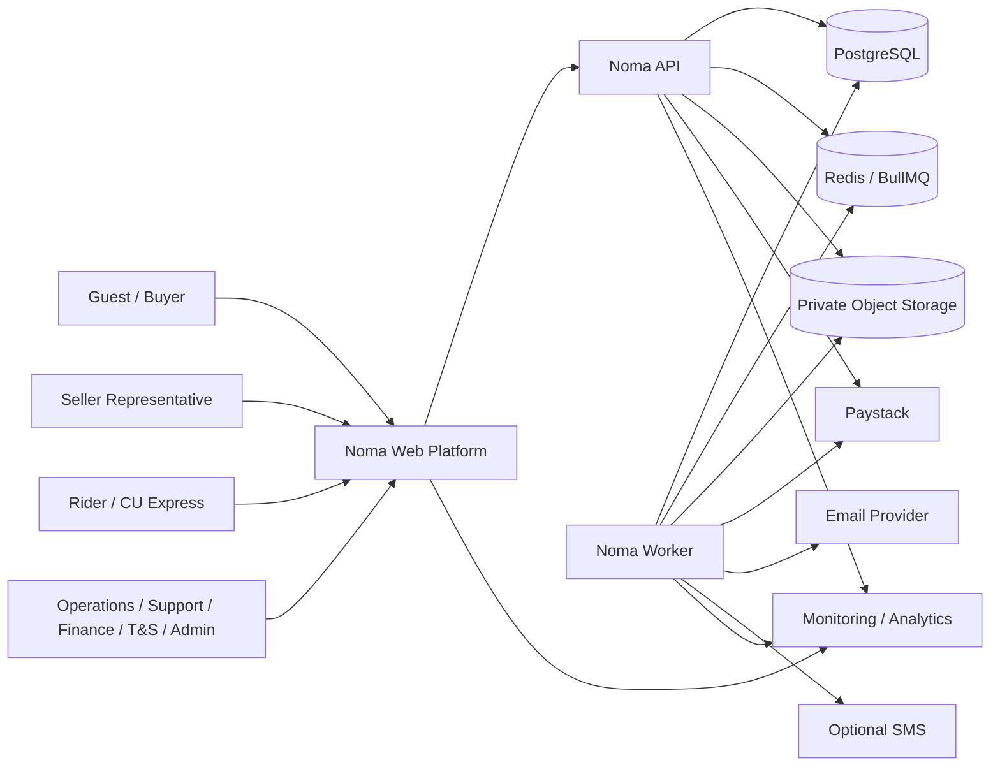
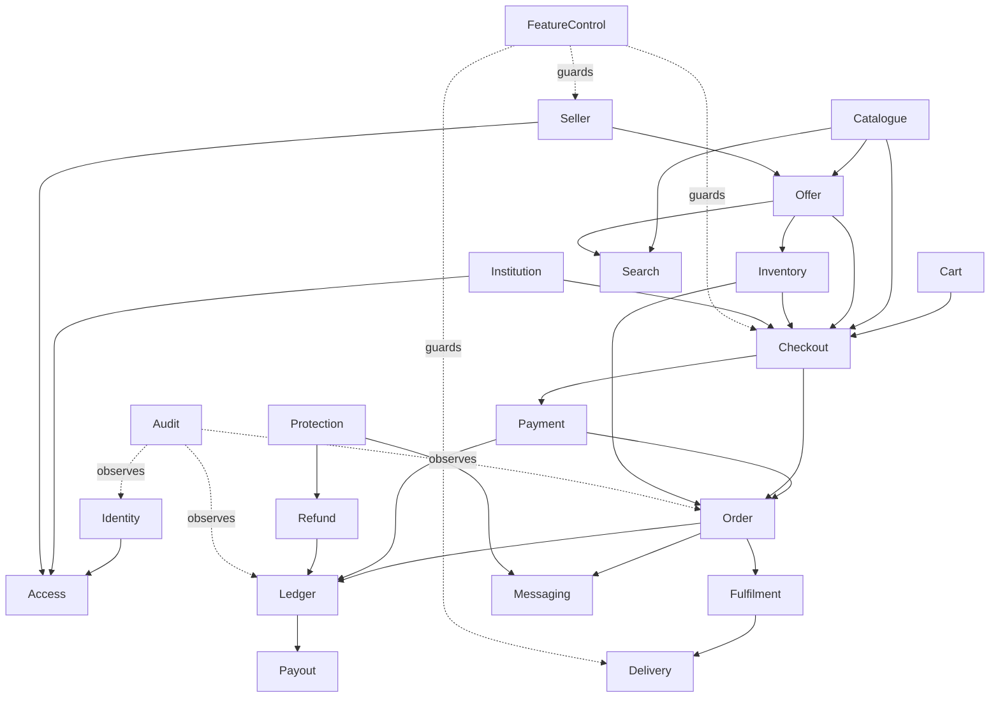
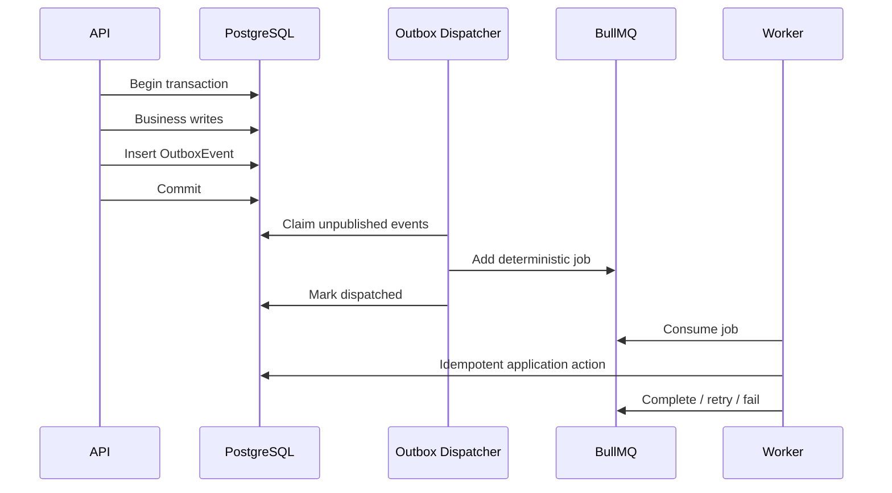
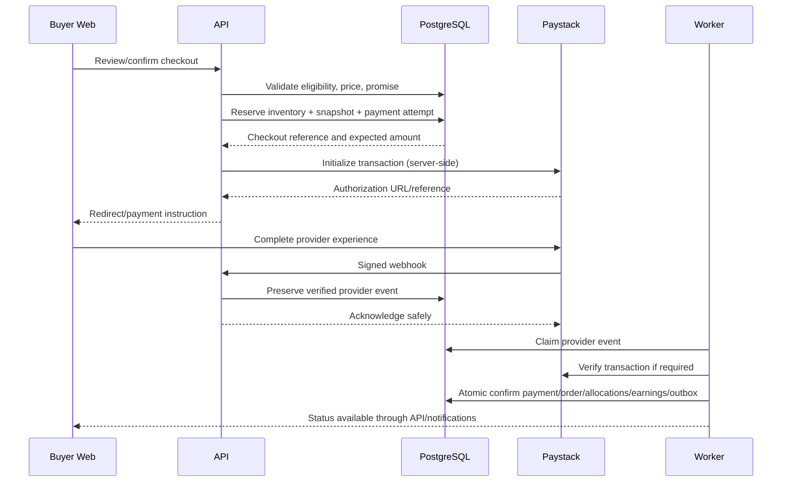
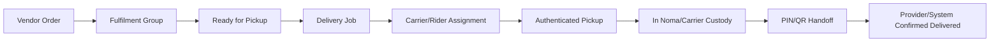
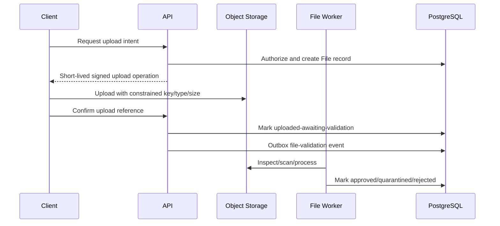
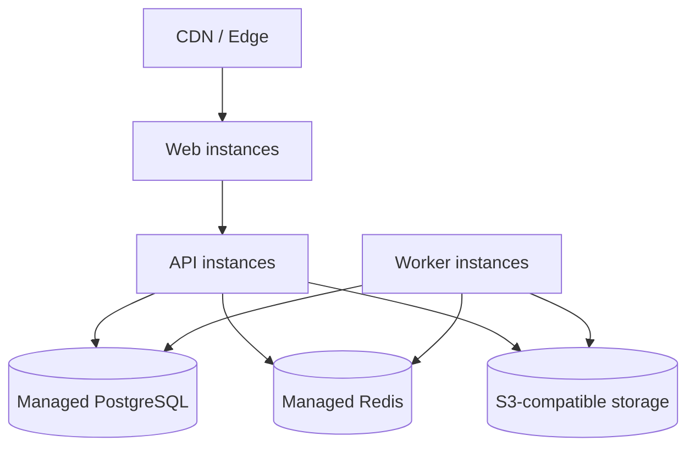

# Noma Technical Architecture

> **Repository path:** `docs/06-technical-architecture.md`  
> **Status:** Binding Covenant pilot technical-architecture contract  
> **Version:** 1.0  
> **Effective date:** 30 July 2026  
> **Applies to:** Noma's two-month Covenant University pilot build  
> **Primary audience:** Founders, Product, Engineering, Codex, Quality Assurance, DevOps, Security, Operations, Finance, Support, Trust and Safety, Data, and future contributors

---

## 1. Purpose

This document defines the system structure, module boundaries, runtime processes, data-flow rules, infrastructure, deployment model, reliability controls, and Architecture Decision Records for Noma's controlled Covenant University marketplace pilot.

It translates:

- the locked product boundary in `docs/01-mvp-scope.md`;
- the actor, capability, scope, assurance, and separation-of-duty model in `docs/02-user-roles.md`;
- the 30 required happy-path, exception, financial, custody, and operational journeys in `docs/03-user-journeys.md`;
- the Marketplace, Buyer, Seller, Rider, Operations, and Admin surface hierarchy in `docs/04-information-architecture.md`; and
- the Noma Commerce Pattern Library, responsive rules, accessibility requirements, and component contracts in `docs/05-design-system.md`

into one implementable architecture for:

- `apps/web` — the responsive Marketplace and all role-oriented web surfaces;
- `apps/api` — the authoritative HTTP API and synchronous application boundary;
- `apps/worker` — background jobs, provider events, scheduled work, notifications, indexing, reconciliation, and recovery;
- PostgreSQL — the authoritative transactional data store;
- Redis-backed queues and limited caching;
- S3-compatible object storage;
- Paystack and other provider adapters; and
- monitoring, analytics, CI, deployment, backup, and incident-response infrastructure.

The objective is to prevent Engineering, Codex, and future contributors from independently inventing:

- microservices;
- database ownership;
- cross-module writes;
- payment truth;
- queue semantics;
- cache authority;
- tenant isolation;
- file-access rules;
- provider coupling;
- deployment topology;
- environment behaviour;
- retry behaviour;
- observability conventions; or
- infrastructure that silently expands the pilot scope.

A feature is not architecturally complete because one endpoint and one page work. It is complete when its authority boundary, transaction boundary, concurrency behaviour, asynchronous work, audit events, provider uncertainty, operational visibility, failure recovery, security, and tests are defined and implemented together.

---

## 2. Authority and relationship to other Build Pack documents

The following hierarchy applies:

1. `docs/01-mvp-scope.md` controls what is active, progressive, manual, prohibited, or deferred.
2. `docs/02-user-roles.md` controls who may view, initiate, approve, execute, override, export, or receive data.
3. `docs/03-user-journeys.md` controls the required sequence, exception path, handoff, evidence, notification, and honest completion condition.
4. `docs/04-information-architecture.md` controls product surfaces, route/page responsibility, navigation, content hierarchy, and cross-linking.
5. `docs/05-design-system.md` controls design tokens, components, interaction patterns, responsive behaviour, accessibility, and truthful status presentation.
6. This document controls system structure, runtime boundaries, module ownership, data flow, infrastructure, technical integration boundaries, and architecture decisions.
7. `docs/07-domain-model.md` will lock final entities, relationships, identifiers, constraints, indexes, and persistence vocabulary.
8. `docs/08-state-machines.md` will lock final machine-readable states, transitions, guards, actors, side effects, and terminal conditions.
9. `docs/09-integrations.md` will select and configure external providers within the adapter boundaries defined here.
10. `docs/10-security-and-compliance.md` may strengthen controls but must not weaken this architecture's authorization, audit, isolation, payment, file, or recovery boundaries.
11. `docs/11-testing-strategy.md` will turn the testing obligations defined here into suites, environments, fixtures, gates, and evidence.

A framework default, generated migration, provider SDK, UI route, Codex prompt, pull request, deployment convenience, or infrastructure limitation must not:

- activate a deferred capability;
- merge payment, refund, earning, payout, order, fulfilment, delivery, custody, or case truth;
- allow a web client to become authoritative for a protected transition;
- bypass the role contract;
- make Redis, analytics, a queue, or a search index authoritative business storage;
- permit direct cross-module persistence writes without an owning application service;
- turn a provider callback into final truth without server verification;
- represent queued work as completed work;
- hide paid-but-unconfirmed or initiated-but-unresolved provider outcomes;
- expose private files through guessable or permanent public URLs; or
- convert a progressive feature flag into permission to operate without its launch gate.

Where a conflict is found, implementation MUST stop at the affected boundary, record the conflict, and use the scope-change process in `docs/01-mvp-scope.md`.

---

## 3. Source basis and new technical decisions

### 3.1 Source-locked requirements

The supplied Noma documents explicitly establish:

- a TypeScript modular monolith rather than microservices;
- one responsive Next.js application for Marketplace and role surfaces;
- a separate NestJS API and background worker;
- PostgreSQL and Prisma;
- Redis-backed queues and caching where justified;
- Paystack as the primary payment provider;
- object storage for images and evidence;
- email for verification and transactional messages;
- error monitoring and product analytics;
- GitHub Actions and version-controlled repository documentation;
- server-side payment verification, webhook signatures, idempotency, raw event preservation, amount/currency validation, and reconciliation;
- one human identity with scoped memberships and capabilities;
- one buyer payment with Parent Orders, Vendor Orders, Fulfilment Groups, allocations, and protected seller earnings;
- Noma-controlled delivery and custody evidence;
- distinct Marketplace, Buyer, Seller, Rider, Operations, and Admin surfaces;
- a Rider PWA that tolerates intermittent connectivity without inventing final custody truth;
- manual workflows that remain queued, owned, evidenced, timed, and audited;
- feature-controlled activation without schema redesign; and
- production monitoring, backups, restoration testing, CI, and incident runbooks before paid launch.

### 3.2 Technical decisions introduced and locked by this document

This document additionally locks:

- a top-level workspace monorepo with independently deployable Web, API, and Worker applications;
- a pragmatic modular-monolith package structure with strict module public APIs;
- PostgreSQL as the only authoritative transactional store;
- an internal transactional outbox for reliable asynchronous publication;
- Redis/BullMQ as a job-delivery mechanism, not a source of business truth;
- a versioned JSON HTTP API documented through OpenAPI;
- opaque server-managed browser sessions rather than long-lived browser bearer tokens;
- an explicit policy-enforcement service invoked by every protected application use case;
- S3-compatible private storage with short-lived presigned operations;
- PostgreSQL full-text search and `pg_trgm` for the pilot;
- provider adapters for payments, transfers, email, SMS, files, analytics, monitoring, maps, and later search;
- OpenTelemetry-compatible tracing and metrics boundaries;
- append-only audit and financial records;
- no external network calls inside database transactions;
- idempotency at HTTP, provider-event, queue-job, and state-transition boundaries;
- forward-only database migrations with explicit rollback/restore planning;
- managed PostgreSQL, Redis, object storage, and backup services for production; and
- no Kubernetes, Kafka, event-sourcing platform, service mesh, GraphQL federation, or multi-region active-active infrastructure during the Covenant pilot.

### 3.3 Provider decisions intentionally left open

This document does not select the final vendor for:

- web/API/worker hosting;
- managed PostgreSQL;
- managed Redis;
- S3-compatible object storage;
- transactional email;
- optional SMS;
- error monitoring;
- product analytics;
- OpenTelemetry collection/backend;
- maps or route services;
- customer-support tooling;
- domain/DNS; or
- CDN/image transformation.

`docs/09-integrations.md` MUST compare these providers against the capability, security, Nigeria/Covenant operational, pricing, data-location, support, export, and failure requirements defined here.

---

## 4. Normative language

- **MUST / MUST NOT:** mandatory for the applicable pilot stage.
- **SHOULD / SHOULD NOT:** expected unless an approved, documented reason exists.
- **MAY:** optional within the locked boundary.
- **AUTHORITATIVE STORE:** the system whose confirmed record controls business truth.
- **RUNTIME:** an independently started and deployable process.
- **MODULE:** a business capability with an explicit public application interface and owned persistence.
- **ADAPTER:** infrastructure code that implements a provider or persistence interface.
- **USE CASE:** an application operation that validates actor, scope, state, transaction, side effects, and result.
- **TRANSACTION BOUNDARY:** the database work that must commit or roll back together.
- **OUTBOX:** database records written in the same transaction as business changes and later delivered asynchronously.
- **IDEMPOTENT:** repeated execution with the same identity has no additional business effect.
- **PROVIDER TRUTH:** a verified event or retrieval from the external provider, not a browser claim.
- **DEGRADED MODE:** a controlled mode that preserves safety while a dependency is unavailable.
- **FAIL CLOSED:** deny or pause a protected operation when authority or truth cannot be established.
- **FAIL OPEN:** continue an operation despite a dependency failure; allowed only for explicitly low-risk, non-authoritative behaviour.
- **CONTROL PLANE:** feature flags, institution configuration, limits, permissions, and emergency controls.
- **DATA PLANE:** customer, seller, order, payment, delivery, and operational transactions governed by the control plane.

---

## 5. Architecture objectives

The Covenant pilot architecture MUST optimise for:

1. **correctness before scale theatre** — payment, inventory, custody, and authorization correctness matter more than premature distribution;
2. **one deployable product model** — Web, API, and Worker share contracts and domain rules without duplicating them;
3. **clear ownership** — each module owns its writes, invariants, events, and operational metrics;
4. **auditability** — material human, provider, and system actions remain traceable;
5. **resumability** — refresh, reconnect, retry, callback duplication, and worker restart must not duplicate value;
6. **operational intervention** — staff can identify and safely resolve exceptions without direct database edits;
7. **progressive activation** — Food, external vendors, FBN, pre-owned, Priority, and Saver can remain hidden or restricted independently;
8. **provider replaceability** — Noma domain logic does not depend directly on one vendor SDK;
9. **security by architecture** — authorization, minimum data, private files, secrets, and provider verification are structural;
10. **simple deployment** — a small team can understand, release, monitor, and recover the system;
11. **testability** — use cases can be tested without starting every external dependency; and
12. **future extraction without present fragmentation** — modules may later become services only when evidence justifies it.

---

## 6. Explicit architecture non-goals

The Covenant pilot MUST NOT attempt to build:

- independently owned microservices;
- distributed transactions across services;
- Kafka or another durable streaming platform;
- Kubernetes or a service mesh;
- multi-region active-active databases;
- event sourcing as the primary persistence model;
- CQRS infrastructure for every module;
- a general workflow engine;
- a general customer wallet;
- a data lake or warehouse as a launch dependency;
- Elasticsearch/OpenSearch/Algolia as a launch requirement;
- an autonomous dispatch optimiser;
- a real-time GPS tracking platform;
- a public seller API;
- native mobile backends separate from the web platform;
- cross-institution sharding;
- a custom identity provider when a maintained implementation can satisfy the requirements; or
- infrastructure whose operational burden exceeds its verified pilot value.

---

# Part A — System and runtime structure

## 7. Architecture style

Noma MUST use a **pragmatic TypeScript modular monolith**.

This means:

- the business system is developed and versioned as one product;
- modules have explicit boundaries and owned persistence;
- synchronous application operations occur in one API runtime;
- asynchronous operations occur in one Worker runtime;
- Web, API, and Worker can deploy and scale independently;
- modules communicate through typed application interfaces and internal events;
- the database remains shared physically but ownership is logical and enforced; and
- no module may treat another module's tables as its private persistence API.

A modular monolith is not permission to place all logic in controllers, one `services/` folder, one `utils/` package, or one enormous Prisma service.

A modular monolith is also not a distributed monolith. The pilot MUST NOT create multiple network services that remain tightly coupled to the same transaction and deployment.

---

## 8. System context



The browser MUST communicate with Noma's API or approved upload endpoint. It MUST NOT receive database credentials, provider secret keys, queue credentials, or unrestricted object-storage credentials.

---

## 9. Runtime topology

Noma has three first-class application runtimes.

| Runtime | Responsibility | May write PostgreSQL? | May consume queues? | Public ingress |
|---|---|---:|---:|---|
| `apps/web` | UI rendering, route layouts, safe browser interaction, PWA shell | No direct DB access | No | Public web |
| `apps/api` | Authentication, authorization, synchronous use cases, provider ingress, signed upload operations | Yes | Produces jobs only | HTTPS API/webhooks |
| `apps/worker` | Outbox dispatch, jobs, notifications, indexing, reconciliation, scheduled work | Yes through application services | Yes | No ordinary public ingress |

### 9.1 Web runtime

`apps/web` MUST:

- use Next.js App Router and TypeScript;
- implement the route/page responsibilities in `docs/04-information-architecture.md`;
- use Server Components by default where they improve initial rendering and data minimisation;
- use Client Components only for browser state, interaction, scanning, camera, connectivity, and other client requirements;
- consume approved exports from `packages/ui`;
- call `apps/api` through typed contracts;
- avoid importing Prisma or server secrets;
- preserve provider uncertainty and stale/offline states;
- keep Operations/Admin bundles out of ordinary Marketplace delivery where practical; and
- provide the Rider PWA manifest, service-worker boundary, and safe offline shell.

### 9.2 API runtime

`apps/api` MUST:

- use NestJS and TypeScript;
- expose the versioned HTTP API;
- own authentication/session validation;
- invoke centralized authorization policy checks;
- execute synchronous application use cases;
- own transaction boundaries;
- create outbox records for required asynchronous effects;
- expose provider webhook ingress with raw-body verification;
- issue short-lived object-storage operations;
- expose health/readiness endpoints without secrets;
- publish OpenAPI documentation for approved endpoints; and
- never perform long-running provider work while holding a database transaction.

### 9.3 Worker runtime

`apps/worker` MUST:

- use NestJS standalone application context and BullMQ workers;
- dispatch transactional outbox records;
- process email, notification, search, file, reconciliation, and scheduled jobs;
- process verified/preserved provider events asynchronously where appropriate;
- use the same application services and policy boundaries as the API;
- use deterministic job identities;
- retry only safe/idempotent jobs;
- route permanently failed jobs to explicit operational queues;
- expose internal health and queue metrics; and
- remain horizontally scalable without duplicate business effects.

### 9.4 Data and infrastructure runtimes

The production pilot additionally requires:

- managed PostgreSQL;
- managed Redis compatible with BullMQ requirements;
- private S3-compatible object storage;
- CDN/image delivery for public product media where selected;
- secret storage supplied by the deployment platform;
- observability collection/export;
- automated backups and restoration tooling; and
- provider sandboxes/test modes outside production.

---

## 10. Repository structure

The repository MUST use a workspace monorepo. The recommended structure is:

```text
noma/
├── apps/
│   ├── web/
│   │   ├── src/app/
│   │   ├── src/features/
│   │   ├── src/lib/
│   │   ├── public/
│   │   └── tests/
│   ├── api/
│   │   ├── src/http/
│   │   ├── src/bootstrap/
│   │   └── tests/
│   └── worker/
│       ├── src/processors/
│       ├── src/schedulers/
│       ├── src/bootstrap/
│       └── tests/
├── packages/
│   ├── platform/
│   │   └── src/modules/
│   ├── database/
│   │   ├── prisma/
│   │   ├── src/
│   │   └── migrations/
│   ├── contracts/
│   ├── ui/
│   ├── config/
│   ├── observability/
│   ├── testing/
│   ├── eslint-config/
│   └── tsconfig/
├── docs/
├── scripts/
├── .github/workflows/
├── AGENTS.md
├── README.md
├── package.json
├── pnpm-workspace.yaml
└── lockfile
```

### 10.1 Workspace tool

The pilot SHOULD use `pnpm` workspaces with a committed lockfile.

A build orchestrator MAY be added where it materially improves caching and affected-project execution, but it MUST NOT become a prerequisite for understanding or running the repository.

### 10.2 Package responsibilities

| Package | Responsibility | Must not contain |
|---|---|---|
| `packages/platform` | Domain/application modules and public interfaces | UI components, provider secrets, page routes |
| `packages/database` | Prisma schema/client, repositories, transaction helpers, migrations | Business policy in generic helpers |
| `packages/contracts` | API schemas, generated/OpenAPI types, event envelopes, error codes | Database entities as public DTOs, secrets |
| `packages/ui` | Tokens, primitives, composites, commerce patterns | Authorization or provider truth |
| `packages/config` | Typed environment/config schemas and shared constants | Environment secret values |
| `packages/observability` | logging, tracing, metrics conventions | Business-state mutation |
| `packages/testing` | fixtures, builders, test containers/helpers, authorization matrices | Production-only shortcuts |

### 10.3 Import direction

The required direction is:

```text
apps/web        → contracts, ui, config, observability-client
apps/api        → platform, database, contracts, config, observability
apps/worker     → platform, database, contracts, config, observability
platform        → contracts and declared ports
infrastructure  → platform ports
```

`packages/platform` MUST NOT import Next.js, browser code, Paystack SDKs, an email SDK, or a concrete object-storage SDK.

`apps/web` MUST NOT import `packages/database` or server-only platform internals.

---

## 11. Module anatomy

Each material business module SHOULD follow this pragmatic structure:

```text
modules/<module>/
├── domain/
│   ├── rules
│   ├── value-objects
│   └── events
├── application/
│   ├── commands
│   ├── queries
│   ├── services
│   └── ports
├── infrastructure/
│   ├── repositories
│   ├── provider-adapters
│   └── mappers
├── contracts/
└── index.ts
```

Simple modules MAY use fewer folders. The separation is behavioural, not a requirement to create empty layers.

A module's `index.ts` is its public API. Deep imports into another module's internal folders are prohibited.

### 11.1 Application command standard

A mutating use case MUST define:

- actor/service principal;
- institution/seller/resource scope;
- authentication assurance;
- input contract;
- idempotency identity where relevant;
- current-state guard;
- transaction boundary;
- owned writes;
- required cross-module calls;
- outbox/audit events;
- result contract;
- known conflict/error codes; and
- operational metrics.

### 11.2 Query standard

A query MUST:

- apply the actor's field and resource scope;
- avoid returning persistence objects directly;
- return explicit stale/provider/processing metadata where relevant;
- use pagination for unbounded collections;
- avoid N+1 access patterns;
- expose only necessary private fields; and
- remain distinct from analytics queries where business truth is required.

---

# Part B — Domain modules and ownership

## 12. Core module map

The Covenant pilot modular monolith MUST contain the following logical modules.

| Module | Owns | Key public responsibilities |
|---|---|---|
| Identity | accounts, credentials, sessions, recovery, MFA evidence | authenticate, revoke, reauthenticate |
| Access | memberships, role grants, capabilities, scopes | authorize action and field access |
| Institution | institutions, affiliations, approved domains, locations, hours | verify affiliation; resolve campus context |
| Seller | seller entities, applications, representatives, activation, standing summary | onboard, approve, activate, restrict |
| Catalogue | categories, canonical products, attributes, media links | create/moderate product truth |
| Offer | seller offers, condition, price, listing snapshot inputs | publish/withdraw seller commerce |
| Inventory | inventory units, quantities, reservations, movements | reserve, release, consume, reconcile |
| Cart | active carts and cart items | maintain intended purchase |
| Checkout | eligibility, price/promise snapshot, reservation orchestration | produce immutable checkout snapshot |
| Order | Parent Orders, Vendor Orders, order items, item allocation | confirm and coordinate buyer obligations |
| Payment | payments, attempts, provider events, verification, reconciliation | establish customer-payment truth |
| Ledger | allocations, seller earnings, holds, reserves, adjustments | preserve append-only financial truth |
| Refund | refund decisions, provider attempts, allocation reversals | return buyer money truthfully |
| Payout | payout accounts, withdrawals, batches, transfers, reconciliation | move eligible seller funds |
| Fulfilment | fulfilment groups/items, seller preparation, packing | coordinate item readiness |
| Delivery | delivery jobs, assignments, custody, handoff, failed attempts | coordinate Noma-controlled movement |
| Messaging | product/order/case conversations, messages, moderation signals | protected in-app communication |
| Notification | notification records, preferences, templates, delivery attempts | inform actors without becoming truth |
| Protection | returns, disputes, evidence, remedies, appeals | structure buyer/seller protection cases |
| Review | verified-purchase reviews and moderation | publish transaction-linked feedback |
| Trust and Safety | policy cases, enforcement, restrictions, serious incidents | protect marketplace and users |
| Search | index documents, synonyms, query analytics | relevance-first discovery |
| Merchandising | collections, campaigns, discounts, funding rules | transparent promotion |
| Files | upload intents, file metadata, visibility, scanning status | controlled media/evidence access |
| Audit | append-only security/business audit events | trace material actions |
| Feature Control | institution/seller/category/cohort flags, limits, emergency controls | activate, restrict, pause, resume |
| Operations | queue projections, assignments, intervention records | coordinate human-controlled recovery |

### 12.1 Progressive modules/extensions

The architecture MUST preserve bounded progressive modules for:

- Food;
- External Inbound;
- FBN Campus;
- Pre-Owned category extensions;
- Priority delivery;
- Saver batching; and
- future commerce-type registry entries.

These modules/extensions MUST remain feature-gated and MUST NOT create ordinary navigation or checkout eligibility until their specific activation gate passes.

### 12.2 Deferred commerce types

`SERVICE`, `RENTAL`, `DIGITAL`, and `EVENT` MAY exist only as disabled type-registry values and extension boundaries. Their complete domain modules, state machines, payment rules, and UI MUST NOT be implemented during the Covenant MVP.

---

## 13. Module ownership rules

1. A module owns writes to its tables.
2. Other modules read through the owner's query/application interface or an approved read model.
3. Cross-module foreign keys MAY enforce consistency, but they do not grant write authority.
4. A use case that coordinates modules MUST live in an explicit application orchestrator, not a controller.
5. An orchestrator MAY open one PostgreSQL transaction and invoke transaction-aware module services where atomicity is required.
6. Cross-module writes MUST preserve each module's invariants and events.
7. Modules MUST NOT import another module's repository implementation.
8. Modules MUST NOT update another module's tables through raw SQL to “save time.”
9. Shared utilities MUST remain technical and policy-neutral.
10. Circular module dependencies MUST be resolved through interfaces, events, or ownership changes.

---

## 14. Recommended dependency graph



This diagram represents logical dependency. It does not grant direct database access.

---

# Part C — Frontend and API architecture

## 15. Next.js application architecture

### 15.1 Route groups and layouts

The Web application SHOULD keep one top-level root layout and use nested layouts/route groups for distinct surfaces to avoid unnecessary full-document transitions.

Recommended organisation:

```text
src/app/
├── (marketplace)/
├── account/
├── seller/
├── rider/
├── operations/
├── admin/
├── auth/
└── api-health-proxy/   # only if explicitly required
```

Route groups organise code; they are not authorization boundaries.

### 15.2 Server and Client Components

- Pages/layouts SHOULD be Server Components by default.
- Client Components MUST be limited to interactive controls, browser APIs, local optimistic state, camera/scanner, connectivity, web push, and PWA functions.
- Protected data fetched for Server Components MUST still be authorized by the API/application boundary.
- Server rendering MUST NOT expose fields that would be hidden only after hydration.
- Client bundles MUST NOT contain provider secrets or broad internal schemas.

### 15.3 Data access

The Web application MUST use one typed API client generated or validated against `packages/contracts`/OpenAPI.

It MUST NOT:

- call PostgreSQL;
- import Prisma;
- call Paystack secret APIs;
- execute financial transitions in Server Actions without the API/application policy boundary;
- infer permission from route access;
- cache user-sensitive responses publicly; or
- treat analytics events as confirmation.

### 15.4 Rendering and cache policy

| Content | Default policy |
|---|---|
| Public catalogue/category pages | server-rendered; controlled revalidation allowed |
| Search results | dynamic or short-lived query cache; eligibility rechecked |
| Product/offer availability | short-lived display cache; checkout always revalidates |
| Buyer/Seller/Rider/Operations data | private, actor-scoped, no shared public cache |
| Payment/refund/payout status | dynamic authoritative retrieval |
| Admin/security pages | dynamic, private, no public caching |

### 15.5 Browser state

Browser state MAY hold:

- display preferences;
- unsubmitted form drafts;
- safe Rider draft evidence;
- recent searches;
- cart UI projection backed by server cart;
- pending upload progress; and
- connectivity status.

Browser state MUST NOT become final truth for:

- payment;
- refund;
- payout;
- stock reservation;
- order confirmation;
- pickup;
- handoff;
- seller earning;
- enforcement; or
- role grant.

---

## 16. HTTP API design

### 16.1 Protocol

The pilot MUST use a versioned HTTPS JSON API.

Recommended prefix:

```text
/api/v1
```

Provider webhooks MAY use a separate, stable ingress path.

### 16.2 OpenAPI

The API MUST publish an OpenAPI specification for supported routes.

The OpenAPI contract MUST cover:

- request/response schemas;
- error codes;
- authentication requirements;
- pagination;
- idempotency requirements;
- deprecation metadata; and
- webhook ingress where appropriate.

Generated clients or types MAY be produced from the approved specification. Generated code MUST NOT replace server-side validation.

### 16.3 API response envelope

Successful resource responses SHOULD be simple and resource-oriented. Errors MUST use a consistent machine-readable shape such as:

```json
{
  "error": {
    "code": "COMMERCE_TYPE_NOT_ENABLED",
    "message": "This commerce type is not available for Covenant yet.",
    "requestId": "req_...",
    "details": {}
  }
}
```

Error responses MUST NOT reveal:

- stack traces;
- secrets;
- existence of another actor's private resource;
- provider payloads containing sensitive information; or
- authorization policy internals useful for bypass.

### 16.4 Pagination

Unbounded lists MUST use cursor-based pagination where records are frequently changing. Offset pagination MAY be used for stable, low-volume administrative reference data.

### 16.5 Filtering and sorting

Filtering/sorting fields MUST be allow-listed per endpoint. Arbitrary field selection or raw query fragments are prohibited.

### 16.6 Idempotency header

Protected create/execute endpoints that can duplicate money, orders, reservations, custody, or notifications MUST accept an idempotency key.

The server MUST bind the key to:

- actor/service principal;
- endpoint/use case;
- normalized request hash;
- institution/seller scope;
- result or processing state; and
- expiry/retention policy.

Reuse with a different request MUST fail explicitly.

---

## 17. Request execution pipeline

Every protected synchronous request MUST pass through:

```mermaid
flowchart LR
    A[Request] --> B[Request ID / trace]
    B --> C[Authentication]
    C --> D[Institution & membership context]
    D --> E[Capability / scope / assurance policy]
    E --> F[Input validation]
    F --> G[Idempotency check]
    G --> H[Application use case]
    H --> I[Transaction / state guards]
    I --> J[Audit + outbox]
    J --> K[Commit]
    K --> L[Response]
```



Controllers MUST remain thin. They translate protocol concerns, invoke one application use case, and map its result/error.

---

# Part D — Identity, tenancy, and authorization architecture

## 18. One identity, scoped memberships

The data architecture MUST preserve one human `User` identity with independent:

- account status;
- verified contacts;
- institution affiliations;
- buyer eligibility;
- seller memberships;
- rider memberships;
- staff role grants;
- payout verification;
- trust/standing; and
- security assurance.

A global `role` column on `User` MUST NOT control Noma authorization.

---

## 19. Session architecture

The pilot SHOULD use opaque, server-managed sessions.

### 19.1 Browser session

- Session identifier stored in a secure, `HttpOnly`, production `Secure` cookie.
- Only a one-way hash of the session token stored server-side.
- Session record linked to user, assurance, created time, last activity, expiry, revocation, device/security metadata, and institution context.
- Session rotated after authentication, recovery, MFA elevation, material role change, or suspected compromise.
- Sensitive actions require recent authentication and, for privileged roles, MFA assurance.

### 19.2 Why not long-lived browser JWT authority

Long-lived browser bearer tokens are not selected for the pilot because immediate role revocation, compromised-session containment, assurance elevation, and staff access review are first-class requirements.

Short-lived signed tokens MAY be used internally where a provider or deployment boundary requires them, but they MUST remain revocable or tightly scoped.

### 19.3 CSRF and origin controls

Cookie-authenticated state-changing browser requests MUST use appropriate CSRF protection and origin checks. CORS MUST use an explicit allow-list rather than wildcard credentialed access.

---

## 20. Authorization policy engine

Authorization MUST evaluate:

```text
actor
+ authenticated session assurance
+ capability
+ institution scope
+ seller/resource/queue scope
+ current business state
+ feature/pilot gate
+ separation-of-duty rule
= allow or deny
```

### 20.1 Enforcement points

The same policy model MUST protect:

- API endpoints;
- Server Component data requests;
- background jobs;
- file upload/download operations;
- exports;
- WebSocket/push subscriptions if later used;
- provider-triggered transitions;
- scheduled jobs;
- emergency controls; and
- administrative configuration.

### 20.2 Field-level projection

The query/application layer MUST produce actor-specific projections. The frontend MUST NOT receive a complete record and hide sensitive fields with CSS or conditional rendering.

### 20.3 Database row-level security

Application-layer authorization and scoped repositories are authoritative for the pilot.

PostgreSQL Row-Level Security MAY be introduced selectively as defence-in-depth for high-risk tables only after connection/session semantics, migrations, tests, operational access, and Prisma behaviour are proven.

The pilot MUST NOT adopt broad RLS merely to compensate for missing application policy tests.

---

## 21. Institution isolation

Every institution-owned operational record MUST carry an `institutionId` directly or through an unambiguous parent relationship.

Repository/query APIs MUST require institution context for scoped data.

Global records, such as canonical product definitions, MUST distinguish:

- globally reusable product truth;
- institution eligibility/visibility; and
- seller/institution-specific offers and inventory.

Cross-institution access MUST be denied by default even though Covenant is the only active pilot institution.

No feature may rely on “there is currently only one institution” as its isolation control.

---

# Part E — Persistence, transactions, and consistency

## 22. PostgreSQL as authoritative store

PostgreSQL is the sole authoritative transactional store for:

- identity and memberships;
- seller state;
- catalogue/offer/inventory truth;
- cart/checkout snapshots;
- orders and fulfilments;
- payments and provider events;
- financial ledger, refunds, and payouts;
- delivery/custody;
- cases, enforcement, and appeals;
- feature activation and limits;
- notifications as obligations;
- audit events; and
- outbox processing state.

Redis, object storage, analytics, error monitoring, and search projections MUST NOT replace PostgreSQL business truth.

---

## 23. Prisma persistence boundary

Noma MUST use the current supported stable Prisma ORM release selected at repository initialization.

Early-access or preview replacement clients MUST NOT be used for the paid pilot without an explicit ADR review.

Prisma is responsible for:

- generated type-safe database access;
- migrations;
- transactions;
- ordinary relational queries; and
- parameterized raw SQL where Prisma does not expose required PostgreSQL behaviour.

### 23.1 Raw SQL

Raw SQL MAY be used for:

- row-level locking;
- `SKIP LOCKED` outbox/job claiming;
- full-text search ranking;
- `pg_trgm` similarity;
- database constraints/indexes not expressed by Prisma;
- carefully reviewed reports; and
- performance-critical operations supported by tests.

Raw SQL MUST be parameterized, scoped, reviewed, and contained in `packages/database`.

---

## 24. Database constraints

Application validation is not sufficient for core invariants.

The database SHOULD enforce, as applicable:

- primary keys;
- foreign keys;
- unique provider references;
- unique idempotency keys within scope;
- one active membership per constrained identity/resource relationship;
- non-negative or explicitly allowed negative numeric constraints;
- valid minor-unit integer storage;
- inventory uniqueness rules;
- immutable/append-only protections through application permissions and controlled database roles;
- required institution ownership;
- check constraints for mutually exclusive fields; and
- partial unique indexes for active/current records.

Final constraints belong in `docs/07-domain-model.md` and migrations.

---

## 25. Transaction policy

A database transaction MUST include only work that must succeed or fail together.

Transactions MUST be short and MUST NOT perform:

- Paystack calls;
- email/SMS calls;
- object-storage uploads;
- analytics calls;
- map calls;
- remote HTTP requests;
- long file processing; or
- unbounded loops.

### 25.1 Transaction examples

The following SHOULD be atomic:

- reserving inventory and creating a checkout snapshot;
- confirming verified payment and creating one Parent Order, Vendor Orders, allocations, pending earnings, fulfilment work, audit, and outbox records;
- cancelling an item and posting its allocation/earning reversal records;
- approving a targeted hold and creating the corresponding ledger and case events;
- approving a withdrawal and reserving the available earning amount; and
- confirming custody handoff and posting the next delivery event/outbox record.

### 25.2 Isolation and retry

High-contention use cases MUST use appropriate row locks, optimistic version checks, unique constraints, or higher transaction isolation.

Serialization/deadlock failures MUST be retried only at a bounded application boundary with jitter and idempotency.

---

## 26. Concurrency control

### 26.1 Inventory

Inventory reservation MUST prevent overselling through a database-enforced atomic operation.

Recommended pattern:

- lock or atomically update the relevant inventory record;
- verify `available >= requested`;
- create a reservation with expiry;
- increment reserved/decrement available projection atomically; and
- use a unique checkout/reservation identity.

An expired reservation release job MUST be idempotent.

### 26.2 Financial balances

Displayed seller balances are projections of append-only ledger entries. A payout approval MUST reserve specific available value atomically so it cannot be withdrawn twice.

### 26.3 State transitions

Material entities SHOULD include a version or last-transition identity. Commands MUST check the expected current state/version and return a conflict rather than silently overwriting a concurrent action.

### 26.4 Queue claiming

Outbox and internal work claiming SHOULD use transaction-safe row claiming such as `FOR UPDATE SKIP LOCKED`, allowing several workers without duplicate ownership.

---

## 27. Append-only financial architecture

Financial records MUST be append-only.

Corrections create:

- reversal entries;
- compensating entries;
- linked adjustment records; or
- explicit reconciliation outcomes.

They MUST NOT rewrite history.

All money MUST use integer minor units and an explicit ISO currency.

The architecture MUST separate:

- buyer payment;
- payment allocation;
- seller earning;
- settlement eligibility;
- hold/reserve;
- refund;
- payout/transfer;
- provider fee where recorded;
- operational liability; and
- reconciliation exception.

The `Ledger` module is authoritative for internal financial movement. Provider dashboards are evidence and reconciliation inputs, not replacements for Noma's ledger.

---

## 28. Audit architecture

Audit events MUST be append-only and distinct from ordinary application logs.

An audit event SHOULD include:

- event ID;
- time;
- actor or service principal;
- acting session/assurance;
- institution and resource scope;
- action;
- reason/policy basis;
- previous and resulting relevant state references;
- approval chain where applicable;
- request/trace correlation;
- source IP/device metadata where appropriate and lawful;
- result; and
- linked case/order/payment/delivery/payout.

Audit payloads MUST minimise sensitive data. Full secrets, OTP values, passwords, and unnecessary identity evidence are prohibited.

Ordinary administrators MUST NOT edit or delete audit events.

---

# Part F — Reliable asynchronous architecture

## 29. Transactional outbox

Noma MUST use a transactional outbox for material asynchronous effects.

### 29.1 Why

Directly committing PostgreSQL and then adding a Redis job creates a failure gap: the business change may commit while the job is never published.

The outbox closes that gap by writing the business change and event record in the same database transaction.

### 29.2 Flow



### 29.3 Outbox requirements

Outbox records MUST include:

- stable event ID;
- event type/version;
- aggregate/resource reference;
- institution scope;
- payload containing only required data;
- occurred time;
- available-after time;
- dispatch attempt count;
- dispatched time;
- processing correlation; and
- failure information.

Publishing the same outbox event more than once MUST be harmless to consumers.

---

## 30. BullMQ queue architecture

BullMQ over Redis is selected for:

- asynchronous provider-event processing;
- transactional email and optional SMS;
- search indexing;
- image/file processing and scanning orchestration;
- reservation expiry;
- notification fan-out;
- refund/payout reconciliation polling;
- scheduled release/protection checks;
- outbox dispatch support;
- analytics forwarding; and
- operational escalation timers.

### 30.1 Queue categories

Recommended queues:

```text
provider-events
payments-reconciliation
refunds-reconciliation
payouts-reconciliation
notifications
email
sms
search-index
files
reservation-expiry
protection-timers
operations-escalation
analytics-export
maintenance
```

Queues MAY be consolidated initially where processing and security requirements are compatible.

### 30.2 Job contract

Every job MUST define:

- deterministic job ID;
- schema version;
- job type;
- minimum payload;
- actor/service principal;
- institution/resource references;
- retry policy;
- timeout;
- idempotency behaviour;
- success evidence;
- permanent-failure path; and
- observability attributes.

### 30.3 Retry policy

Retry only when:

- the operation is idempotent;
- the failure is plausibly transient;
- the provider permits retry; and
- retry cannot duplicate money, custody, or communication harm.

Use bounded exponential backoff with jitter.

Validation, permission, unsupported-event, or permanent business failures MUST NOT loop indefinitely.

### 30.4 Failed jobs

Exhausted critical jobs MUST create or update an Operations/Finance/Security exception record. A Redis failed-job list alone is not an operational workflow.

### 30.5 Redis loss

Redis loss MUST NOT erase authoritative business state. Undispatched outbox records, provider events, notification obligations, and reconciliation records in PostgreSQL MUST allow recovery.

---

## 31. Scheduled work

Scheduled work MUST be represented as explicit, idempotent application jobs.

Examples:

- expire inventory reservations;
- identify overdue seller acceptance/preparation;
- release eligible seller earnings;
- review protection windows;
- poll unresolved provider outcomes;
- expire verification/evidence requests;
- retry notifications;
- create daily reconciliation checks;
- expire temporary role grants; and
- evaluate feature capacity limits.

The scheduler MUST NOT directly mutate business tables without the owning application use case.

---

# Part G — Payments, orders, inventory, and custody data flows

## 32. Checkout and payment flow



### 32.1 Payment ingress

The webhook endpoint MUST:

1. preserve the raw request body;
2. validate the Paystack HMAC signature;
3. reject unsupported or malformed events safely;
4. store the provider event with unique identity/payload hash;
5. acknowledge quickly after durable preservation; and
6. process business effects asynchronously or through a bounded idempotent handler.

The browser callback MUST display a verification/processing state and retrieve server truth.

### 32.2 Paid-but-unconfirmed recovery

If provider payment is verified but order confirmation fails:

- Payment remains successful;
- no false order success is shown;
- a critical `PAID_BUT_UNCONFIRMED` reconciliation exception is created;
- inventory/order recovery is attempted idempotently;
- Operations/Finance receives an actionable queue item; and
- the Buyer is not instructed to pay again.

---

## 33. Multi-vendor order orchestration

The `Checkout` application orchestrator MUST create or confirm:

- one Parent Order;
- independent Vendor Orders;
- Order Items;
- item/vendor payment allocations;
- delivery-charge allocations;
- immutable commercial snapshots;
- pending seller earnings;
- fulfilment candidates/groups; and
- outbox events.

The transaction MUST preserve unaffected Vendor Orders when one seller later fails.

Order confirmation MUST be exactly once per verified payment/reference.

---

## 34. Inventory flow

Inventory architecture MUST distinguish:

- physical stock quantity;
- reserved quantity;
- available quantity;
- unit-specific pre-owned inventory;
- FBN location/bin stock;
- seller-held stock;
- stock confidence/status; and
- movement history.

Every material inventory change MUST have a reason/reference.

Search and catalogue availability are projections. Checkout reservation is authoritative for purchase eligibility.

---

## 35. Fulfilment and delivery flow



Vendor Order, Fulfilment Group, Delivery Job, Assignment, and Custody Event MUST remain separate.

### 35.1 Custody truth

Pickup and delivery confirmation MUST require:

- valid assignment;
- valid parcel/order reference;
- current allowed state;
- required credential/QR/PIN or approved fallback;
- actor/rider identity;
- timestamp;
- approved location/evidence where required; and
- idempotent transition.

A Rider client may queue draft evidence offline where allowed. It MUST NOT independently create final custody truth when live validation is required.

### 35.2 Reassignment

If custody has not transferred, assignment may be safely replaced through the Delivery module.

If custody has transferred, reassignment MUST use a controlled custody-transfer operation with both previous and new responsible parties/evidence.

---

## 36. Refund and payout flow

### 36.1 Refund

- Protection/Order determines approved remedy under authorization limits.
- Refund module creates provider refund attempt after durable approval.
- Provider call occurs outside the approval transaction.
- Provider event/polling establishes processing/final truth.
- Ledger reversals/adjustments are posted through linked immutable entries.
- Buyer display differentiates approved, submitted, processing, completed, failed, and needs-attention.

### 36.2 Payout

- Seller requests withdrawal against available balance.
- Ledger atomically reserves eligible amount.
- Finance maker/checker approval applies where configured.
- Payout module creates recipient/transfer attempt outside the ledger transaction.
- Transfer initiation is `PROCESSING`.
- Verified provider success, failure, or reversal posts final linked entries.
- Uncertain transfer outcomes prohibit blind retry and create reconciliation work.

---

# Part H — Search, files, notifications, and progressive capability architecture

## 37. Search architecture

The Covenant pilot MUST use PostgreSQL full-text search plus supported `pg_trgm` similarity matching behind a `SearchProvider` application interface.

### 37.1 Search projection

The search document SHOULD combine eligible public fields from:

- Canonical Product;
- category/attributes;
- approved Seller Offers;
- condition;
- price range;
- availability projection;
- fulfilment/delivery promise projection;
- policy eligibility; and
- approved merchandising signals.

Private risk, enforcement, bank, identity, messages, and case data MUST NOT be indexed.

### 37.2 Index update

Catalogue/Offer/Inventory commits write outbox events. The Search worker updates the PostgreSQL search projection idempotently.

A stale projection MUST be revalidated at product, cart, and checkout boundaries.

### 37.3 Migration path

A future external search engine MAY implement the same `SearchProvider` contract when catalogue scale, latency, typo quality, ranking experiments, or operational evidence justifies it.

The domain MUST NOT depend on external-search document IDs as primary business identities.

---

## 38. Caching architecture

Caching is optional optimisation, never authority.

### 38.1 Allowed cache uses

Redis or framework caches MAY hold:

- public category/navigation data;
- selected product read projections;
- search autocomplete/synonyms;
- rate-limit counters;
- short-lived session assistance where compatible with revocation truth;
- feature-control snapshots with short TTL/invalidation;
- provider metadata with safe TTL; and
- expensive non-financial read projections.

### 38.2 Prohibited cache authority

Caches MUST NOT be authoritative for:

- payment success;
- refund success;
- payout success;
- seller balance;
- inventory reservation;
- order state;
- delivery/custody;
- role grant/revocation;
- active enforcement; or
- emergency pause.

### 38.3 Invalidation

Every cache MUST define:

- owner;
- key namespace;
- TTL;
- invalidation event;
- stale tolerance;
- sensitive-data classification; and
- behaviour when Redis is unavailable.

---

## 39. File and object-storage architecture

### 39.1 Storage classes

Noma MUST separate at least:

- public product media;
- private verification evidence;
- private case/dispute evidence;
- private operational/custody evidence;
- generated exports; and
- quarantined/unverified uploads.

Different classes MUST use different access, retention, and delivery policies.

### 39.2 Upload flow



### 39.3 Requirements

- Object keys MUST be generated by Noma.
- Signed URLs MUST be short-lived and action-specific.
- Upload intent MUST constrain file type, size, count, resource, and actor.
- The system MUST verify file signature/content, not only browser MIME type.
- Sensitive objects MUST remain private.
- Public product images SHOULD be served through controlled transformation/CDN delivery.
- Replacing an object MUST create a new version/reference rather than silently changing evidence.
- Evidence access MUST be authorized and audited where sensitive.
- Quarantined/rejected files MUST not be rendered to ordinary users.

---

## 40. Notification architecture

Notifications MUST be modelled as durable obligations before provider delivery.

Flow:

```text
Domain event
→ Notification record/template selection
→ recipient and preference evaluation
→ outbox/job
→ provider attempt
→ delivered/failed/suppressed state
```

Channels:

- in-app — authoritative notification centre;
- email — verification and transactional communication;
- web push — progressive opt-in;
- SMS — critical cases only after provider decision/activation.

Notification failure MUST NOT reverse the underlying business transaction.

The worker MUST receive only the minimum fields required to render the specific message.

Templates MUST be versioned and testable. Sensitive information MUST not appear unnecessarily in email subject lines, push notifications, or locked-device previews.

---

## 41. Messaging architecture

Messaging MUST remain in-app and resource-scoped.

Conversation access is determined by:

- conversation type;
- linked product/order/case;
- actor relationship;
- current order/case state;
- messaging restriction; and
- moderation need.

Messages MUST be durable and auditable. Formal order transitions MUST use application commands, not parsed chat text.

Anti-bypass detection MAY run synchronously for obvious patterns and asynchronously for review. Detection is a moderation signal, not automatic guilt.

---

## 42. Feature control architecture

Feature activation MUST be data/config driven and audited.

A decision MAY depend on:

- environment;
- institution;
- user cohort;
- seller;
- seller type;
- category;
- listing/offer;
- delivery tier;
- operating window;
- capacity limit;
- risk status; and
- pilot stage.

### 42.1 Required states

Feature controls SHOULD support:

```text
DISABLED
INTERNAL_TEST
INVITE_ONLY
LIMITED_PILOT
ACTIVE
SUSPENDED
```

### 42.2 Enforcement

Feature controls MUST be enforced:

- in navigation/page visibility;
- in API use cases;
- at checkout;
- in background jobs;
- in provider actions; and
- in Operations/Admin actions.

Hiding a route is not sufficient.

### 42.3 Emergency controls

Emergency pause controls MUST be fast, audited, scoped, tested, and independent of a code deployment.

They MUST support pausing, as applicable:

- checkout;
- Paystack initialization;
- seller activation/order acceptance;
- a seller or category;
- a delivery tier;
- a carrier;
- payouts;
- one institution; or
- a compromised privileged account.

Restart MUST require the authority defined in `docs/02-user-roles.md`.

---

## 43. Progressive module activation

### 43.1 Food

Food uses the shared catalogue, payment, order, delivery, and protection foundations, plus isolated food-specific:

- outlet hours;
- menu availability;
- preparation estimates;
- seller acceptance;
- modifiers/allergens where required;
- ready state; and
- perishable cancellation/remedy rules.

Food MUST remain disabled for ordinary buyers until selected outlets and Operations gates pass.

### 43.2 External Vendor

External vendors use first-class Seller entities but add:

- invitation-only activation;
- stronger verification;
- off-campus stock source;
- inbound shipment/leg;
- Noma inbound boundary; and
- campus last-mile fulfilment.

External inbound coordination MAY be manual but MUST remain represented, owned, and audited.

### 43.3 FBN Campus

FBN Campus adds one approved fulfilment location with:

- inbound plans;
- receiving/discrepancy;
- bin location;
- inventory movement;
- reservation;
- pick/pack;
- rider custody;
- return intake;
- quarantine; and
- cycle count.

It MUST not become a generic warehouse-management platform.

### 43.4 Pre-Owned

Pre-Owned extends Offer/Inventory/Files/Protection with:

- condition grades;
- actual-unit images;
- defect disclosures;
- ownership declaration;
- unit-specific inventory;
- serial/IMEI foundation where applicable; and
- stronger evidence.

`NOMA_VERIFIED_PRE_OWNED` MUST remain unavailable until an actual inspection system/partner exists.

---

# Part I — Provider adapter architecture

## 44. Integration ports

The platform layer MUST define provider-neutral interfaces for:

```text
PaymentGateway
TransferGateway
BankResolver
ObjectStorage
ImageProcessor
EmailSender
SmsSender
PushSender
AnalyticsSink
ErrorReporter
TelemetryExporter
MapProvider
SearchProvider
MalwareScanner
IdentityVerificationProvider
SupportToolAdapter
```

Concrete SDKs MUST remain in infrastructure adapters.

### 44.1 Provider error mapping

Provider-specific errors MUST be mapped into stable Noma error categories such as:

```text
TRANSIENT_PROVIDER_FAILURE
PROVIDER_REJECTED
PROVIDER_RATE_LIMITED
PROVIDER_AUTHENTICATION_FAILURE
PROVIDER_UNAVAILABLE
PROVIDER_OUTCOME_UNKNOWN
PROVIDER_CONFIGURATION_ERROR
```

Raw provider messages MAY be stored securely for Operations but MUST NOT leak directly to buyers/sellers.

### 44.2 Timeouts and circuit behaviour

Every provider call MUST define:

- connect/request timeout;
- safe retry behaviour;
- idempotency/reference behaviour;
- circuit/degraded response;
- metrics;
- alert threshold; and
- reconciliation strategy for uncertain outcomes.

---

## 45. Paystack adapter boundary

The Paystack adapter MUST implement:

- transaction initialization;
- server-side verification;
- webhook signature validation helper;
- refund submission/status;
- bank/account resolution as supported;
- transfer-recipient management;
- transfer initiation/status;
- provider reference normalization;
- supported event parsing/versioning; and
- safe provider-error mapping.

The Payment/Refund/Payout modules own business state. The adapter MUST NOT directly update orders, seller earnings, or payout balances.

---

# Part J — Observability and operational architecture

## 46. Observability model

Noma MUST implement three connected but distinct observability layers:

1. **technical telemetry** — requests, traces, errors, latency, queues, database, providers;
2. **business-operational monitoring** — stuck payments, orders, refunds, payouts, deliveries, reservations, cases; and
3. **security/audit monitoring** — authentication, authorization, payout changes, role grants, exports, emergency actions.

No single analytics provider replaces these layers.

---

## 47. Structured logging

Application logs MUST be structured and include, where applicable:

- timestamp;
- level;
- service/runtime;
- environment;
- request ID;
- trace/span ID;
- actor/service-principal ID (pseudonymous where appropriate);
- institution ID;
- resource IDs;
- job/provider event ID;
- error category; and
- outcome.

Logs MUST NOT contain:

- passwords;
- OTPs;
- session tokens;
- authorization headers;
- Paystack secret keys;
- complete bank details;
- full identity evidence;
- private message/evidence content by default; or
- unnecessary personal data.

---

## 48. Tracing and metrics

The API and Worker SHOULD use OpenTelemetry-compatible traces and metrics.

Required spans/metrics include:

- HTTP request/use case;
- database transaction;
- provider call;
- outbox dispatch;
- queue wait/process/retry;
- payment verification;
- order confirmation;
- refund submission/reconciliation;
- payout transfer/reconciliation;
- search query/index update;
- file processing; and
- notification delivery.

Browser telemetry MUST be privacy-conscious. Browser OpenTelemetry instrumentation is not a launch requirement.

---

## 49. Business health checks

Technical health alone is insufficient.

The platform MUST monitor for:

- successful Paystack payment without confirmed order;
- confirmed order without verified payment;
- reservation expired but not released;
- fulfilment ready but no dispatch work;
- picked-up parcel without active custody path;
- delivery stuck beyond threshold;
- refund approved but not submitted;
- refund/payout unresolved beyond threshold;
- ledger/provider reconciliation mismatch;
- outbox backlog;
- failed critical job;
- notification failure for critical security action; and
- emergency control state.

Every critical monitor MUST identify an owner and operational queue/runbook.

---

## 50. Health endpoints

The runtimes MUST distinguish:

- liveness;
- readiness;
- dependency health; and
- business health.

Public health responses MUST not expose internal topology, credentials, or stack traces.

The API MUST become unready when it cannot safely perform authoritative writes. It MAY remain available for selected read-only/degraded routes where truthful and safe.

---

# Part K — Environments, deployment, and operations

## 51. Environment model

Noma MUST maintain:

```text
LOCAL
CI/TEST
STAGING
PRODUCTION
```

Optional preview environments MAY exist for pull requests without production data or production provider credentials.

### 51.1 Separation

Environments MUST use separate:

- databases;
- Redis instances/namespaces;
- object-storage buckets/prefixes;
- Paystack keys/webhook URLs;
- email/SMS credentials or sandbox modes;
- encryption/session secrets;
- analytics projects;
- monitoring projects; and
- staff accounts where practical.

Production data MUST NOT be copied into developer laptops. Approved anonymised fixtures MAY be generated.

---

## 52. Configuration and secrets

Configuration MUST be validated at startup through typed schemas.

The application MUST fail fast for missing/invalid mandatory configuration.

Secrets MUST be supplied by environment secret management, never committed.

Every secret MUST have:

- owner;
- environment;
- purpose;
- permitted runtimes;
- rotation procedure;
- revocation procedure; and
- incident response.

Feature flags and operational limits are configuration data, not secrets, but changes remain privileged and audited.

---

## 53. Deployment topology

Web, API, and Worker MUST deploy independently from the same reviewed commit.

Recommended production topology:



The pilot SHOULD use managed runtime/container/application hosting rather than self-managed virtual machines where provider capability and cost are acceptable.

Kubernetes is prohibited for the pilot unless a chosen managed platform internally uses it without Noma operating the cluster.

---

## 54. Release process

Production release MUST require:

1. reviewed pull request;
2. lint;
3. type-check;
4. unit tests;
5. integration tests;
6. authorization/security tests;
7. production builds for Web/API/Worker;
8. migration validation;
9. dependency/secret checks;
10. staging deployment and smoke tests;
11. explicit production approval; and
12. post-deployment verification.

Critical feature activation MUST remain separate from code deployment.

---

## 55. Database migration strategy

Migrations MUST be version-controlled, forward-only, and reviewed.

### 55.1 Safe migration pattern

For risky changes, use expand/migrate/contract:

1. add compatible schema;
2. deploy code that supports old and new forms;
3. backfill idempotently;
4. verify;
5. switch reads/writes;
6. remove old schema in a later release.

### 55.2 Prohibited migration behaviour

Production migrations MUST NOT:

- drop a populated critical column in the same release that stops using it;
- perform unbounded long table rewrites during open pilot hours without review;
- rely on manual unrecorded SQL;
- reset production databases;
- edit an already-applied migration; or
- mark a failed migration resolved without evidence.

### 55.3 Rollback

Application rollback MUST be compatible with the deployed schema. Destructive database rollback is not the ordinary recovery strategy; restore/forward-fix procedures MUST be documented.

---

## 56. Backup and recovery

Production MUST provide:

- automated database backups;
- point-in-time recovery where supported/selected;
- defined retention;
- encrypted backup storage;
- backup failure alerts;
- object-storage durability/versioning appropriate to each class;
- configuration/infrastructure recovery documentation; and
- at least one successful isolated restoration test before paid launch.

### 56.1 Recovery objectives

Exact RPO/RTO values will be finalized in pilot readiness after provider selection. The initial architecture target SHOULD be:

- financial/order database RPO: as close to zero as managed point-in-time recovery permits;
- critical service restoration RTO: documented and exercised within the operating team's realistic capability;
- no claim of a recovery target that has not been tested.

### 56.2 Restoration verification

A restoration drill MUST validate representative:

- users/memberships;
- products/offers/inventory;
- checkout/orders;
- payments/provider events;
- ledger/refunds/payouts;
- delivery/custody;
- cases/audit/outbox; and
- application compatibility.

---

## 57. Dependency failure and degraded modes

| Dependency | Safe degraded behaviour |
|---|---|
| PostgreSQL unavailable | stop authoritative writes; show controlled outage/read-only where safe |
| Redis unavailable | continue selected synchronous reads/writes only if outbox remains durable; pause queue-dependent promises |
| Paystack unavailable | disable new payment initialization; do not affect already confirmed orders |
| Email unavailable | preserve notification obligations; retry; do not reverse transactions |
| Object storage unavailable | block new uploads; preserve existing metadata; do not accept incomplete evidence as complete |
| Monitoring unavailable | alert through fallback where possible; consider launch/payout pause if blind operation becomes unsafe |
| Search projection stale | allow controlled fallback/browse; revalidate product/cart/checkout |
| Maps unavailable | use approved location graph/manual dispatch; do not invent travel promises |

Degraded mode MUST remain truthful to users and staff.

---

# Part L — Performance and scalability

## 58. Performance principles

The pilot MUST optimise critical journeys without premature distributed infrastructure.

### 58.1 Initial objectives

The team MUST define and measure budgets for:

- Marketplace initial rendering;
- search latency;
- product/offer detail;
- cart mutation;
- checkout validation;
- payment-verification status retrieval;
- Seller order queues;
- Rider assignment/scan response;
- Operations queue/detail;
- API p50/p95/p99 latency;
- database slow queries;
- queue wait time; and
- provider-call latency.

Exact numeric SLOs belong in `docs/11-testing-strategy.md` and pilot readiness after baseline measurement.

### 58.2 Scaling order

Noma SHOULD scale in this order:

1. correct queries/indexes;
2. remove N+1 and over-fetching;
3. paginate;
4. add read projections;
5. add safe caching;
6. scale Web/API/Worker instances;
7. tune PostgreSQL/connection pooling;
8. isolate heavy jobs;
9. adopt specialist services only when evidence requires them.

### 58.3 Connection management

API and Worker database connection pools MUST be bounded with combined capacity below managed PostgreSQL limits. Horizontal scaling plans MUST account for total connection multiplication.

---

## 59. Pilot scale assumptions

The architecture is intended for a capacity-limited Covenant pilot with:

- one active institution;
- selected sellers;
- controlled daily order limits;
- a small Rider/CU Express operational cohort;
- limited FBN/external/pre-owned activation; and
- a small internal Operations team.

The architecture MUST not hardcode specific limits. Limits are controlled data and can be reduced without redeployment.

A review for service extraction or specialist infrastructure may occur when measured load, team ownership, release contention, fault isolation, or regulatory boundaries justify it.

---

# Part M — Security architecture boundaries

## 60. Trust boundaries

Primary trust boundaries are:

- public browser ↔ Web/API;
- privileged staff browser ↔ Web/API;
- API ↔ provider;
- API/Worker ↔ PostgreSQL;
- API/Worker ↔ Redis;
- client/API/Worker ↔ object storage;
- service principal ↔ queue/job;
- one institution/seller/resource scope ↔ another; and
- ordinary role ↔ privileged/maker-checker action.

Every boundary requires authentication where applicable, authorization, validation, minimum data, timeouts, and observability.

---

## 61. Secure defaults

The architecture MUST provide:

- HTTPS only in production;
- secure session cookies;
- server-side authorization;
- deny-by-default capabilities;
- recent authentication for sensitive actions;
- privileged MFA;
- rate limiting;
- input/output validation;
- safe headers and CSRF protections;
- secrets management;
- private sensitive files;
- provider signature verification;
- idempotency/replay protection;
- append-only audit/ledger;
- dependency and secret scanning;
- minimal database/runtime privileges; and
- environment isolation.

Detailed control implementation belongs in `docs/10-security-and-compliance.md`.

---

## 62. Service-principal architecture

Each runtime/job/provider integration MUST use a distinct service identity where infrastructure permits.

A service principal MUST have:

- explicit purpose;
- environment;
- minimum capability;
- no interactive login;
- rotated/revocable credential;
- restricted network/resource access;
- observable actions; and
- correlation to job/provider event.

The Notification worker cannot gain payout access. The Search indexer cannot gain private case access. The Payment webhook processor cannot grant roles.

---

## 63. Export architecture

Exports MUST be asynchronous for non-trivial data sets.

Flow:

```text
Authorized export request
→ scope and reason recorded
→ export job
→ private generated file
→ short-lived authorized download
→ expiry/deletion
→ audit event
```

Exports MUST apply the same field-level scope as interactive views and MUST NOT include hidden fields merely because the export is generated server-side.

---

# Part N — Analytics and data architecture

## 64. Analytics events

Analytics MAY receive privacy-minimised events for:

- discovery/search funnel;
- cart/checkout funnel;
- seller listing/order preparation;
- dispatch/delivery performance;
- support/protection workflow;
- pilot feature usage; and
- operational workload.

Analytics MUST NOT be authoritative for payment, order, refund, payout, custody, role, or enforcement.

Analytics payloads MUST exclude:

- secrets;
- complete bank data;
- identity evidence;
- message content;
- case evidence;
- private exact locations not needed for measurement; and
- unnecessary personal identifiers.

A stable internal event dictionary SHOULD be defined before instrumenting pages independently.

---

## 65. Operational read models

Operations queues MAY use denormalized database projections/materialized views when needed for performance.

A read model MUST define:

- source modules;
- freshness;
- rebuild procedure;
- sensitive-field policy;
- pagination/indexes;
- authoritative deep link; and
- behaviour when stale.

A read model MUST NOT become a second writable truth.

---

# Part O — Architecture Decision Records

## 66. ADR format

Every major architecture decision MUST record:

```text
ID
Title
Status
Context
Decision
Reason
Alternatives considered
Trade-offs
Consequences
Review triggers
```

The ADRs below are binding summaries. They MAY later move to individual files such as `docs/adr/ADR-001-modular-monolith.md` without changing their decision.

---

## 67. ADR register

### ADR-001 — TypeScript modular monolith

- **Status:** Accepted
- **Decision:** One modular business system, not microservices.
- **Reason:** Two-month delivery, shared transactions, small team, easier testing/operations.
- **Alternatives:** microservices; serverless functions per capability.
- **Trade-off:** requires disciplined module ownership inside one repository/database.
- **Review trigger:** proven independent team ownership, scaling, fault-isolation, or regulatory need.

### ADR-002 — Workspace monorepo

- **Status:** Accepted
- **Decision:** `apps/web`, `apps/api`, `apps/worker` with shared packages.
- **Reason:** shared contracts, design system, tests, configuration, and one reviewed change set.
- **Alternatives:** separate repositories; one undifferentiated application.
- **Trade-off:** CI and dependency boundaries require governance.
- **Review trigger:** repository scale materially harms build/release ownership.

### ADR-003 — One Next.js App Router web application

- **Status:** Accepted
- **Decision:** Marketplace and all role surfaces in one responsive Next.js app with nested layouts.
- **Reason:** avoids duplicated auth, UI, deployment, and testing.
- **Alternatives:** separate buyer/seller/rider/admin apps; native apps.
- **Trade-off:** strict bundle and route authorization discipline required.
- **Review trigger:** one surface needs independent release/security/device capability.

### ADR-004 — NestJS API and Worker runtimes

- **Status:** Accepted
- **Decision:** NestJS HTTP API plus NestJS standalone Worker.
- **Reason:** modular application structure and shared dependency-injection conventions.
- **Alternatives:** Next.js-only backend; Express/Fastify without framework; multiple services.
- **Trade-off:** framework complexity and shared-module design.
- **Review trigger:** measured framework limitation or runtime mismatch.

### ADR-005 — PostgreSQL authoritative database

- **Status:** Accepted
- **Decision:** PostgreSQL owns transactional business truth.
- **Reason:** relational constraints, transactions, concurrency, full-text search, audit/ledger suitability.
- **Alternatives:** MongoDB; multiple databases; Redis-first state.
- **Trade-off:** relational modelling and migration discipline required.
- **Review trigger:** a bounded workload has evidence for a specialist data store.

### ADR-006 — Stable Prisma ORM plus reviewed SQL

- **Status:** Accepted
- **Decision:** supported stable Prisma for ordinary persistence; reviewed parameterized SQL for PostgreSQL-specific needs.
- **Reason:** type safety and migration productivity without giving up database capabilities.
- **Alternatives:** raw SQL only; another ORM; early-access Prisma replacement.
- **Trade-off:** repository/adaptor layer must contain ORM leakage.
- **Review trigger:** blocking ORM limitations, performance, or support concerns.

### ADR-007 — REST/JSON and OpenAPI

- **Status:** Accepted
- **Decision:** versioned HTTP JSON API with OpenAPI and typed client contracts.
- **Reason:** separate Web/API, future partner/admin integration, clear testing and errors.
- **Alternatives:** GraphQL; tRPC-only; unversioned endpoints.
- **Trade-off:** DTO/generation discipline.
- **Review trigger:** measured need for another protocol; REST remains supported for existing clients.

### ADR-008 — Server-managed opaque sessions

- **Status:** Accepted
- **Decision:** revocable opaque browser sessions in secure cookies.
- **Reason:** immediate role revocation, assurance elevation, privileged containment.
- **Alternatives:** long-lived browser JWTs; separate auth per surface.
- **Trade-off:** session storage/lookup required.
- **Review trigger:** selected identity provider offers equivalent stronger semantics.

### ADR-009 — Central policy enforcement

- **Status:** Accepted
- **Decision:** capability + scope + condition + assurance checks at application boundaries.
- **Reason:** roles alone cannot express Noma authority.
- **Alternatives:** route guards only; role enum; frontend hiding.
- **Trade-off:** policy catalogue and tests required.
- **Review trigger:** never weakened; implementation may mature.

### ADR-010 — Redis/BullMQ for asynchronous delivery

- **Status:** Accepted
- **Decision:** BullMQ jobs over managed Redis.
- **Reason:** background processing, retry, delay, concurrency, operational visibility.
- **Alternatives:** in-process jobs; cron-only; Kafka.
- **Trade-off:** Redis operations and idempotent workers required.
- **Review trigger:** durability/throughput needs exceed outbox + BullMQ model.

### ADR-011 — PostgreSQL transactional outbox

- **Status:** Accepted
- **Decision:** business writes and event intent commit together; Worker delivers later.
- **Reason:** closes database-to-queue failure gap.
- **Alternatives:** direct queue publication; distributed transaction; CDC platform.
- **Trade-off:** dispatcher and retention/replay operations.
- **Review trigger:** future CDC/event platform proves lower operational risk.

### ADR-012 — Append-only ledger and audit

- **Status:** Accepted
- **Decision:** money and material audit history corrected by reversal/compensation.
- **Reason:** reconciliation, dispute, accountability, provider uncertainty.
- **Alternatives:** mutable balances/history; provider dashboard as truth.
- **Trade-off:** more records and projection logic.
- **Review trigger:** never remove; may add cryptographic tamper evidence.

### ADR-013 — No network calls in database transactions

- **Status:** Accepted
- **Decision:** provider calls occur before/after durable transaction steps with explicit uncertainty.
- **Reason:** avoid long locks, deadlocks, and unknowable partial outcomes.
- **Alternatives:** hold transaction open across provider call.
- **Trade-off:** requires attempt/status/reconciliation models.
- **Review trigger:** none for ordinary providers.

### ADR-014 — Idempotency at every duplication boundary

- **Status:** Accepted
- **Decision:** HTTP command keys, unique provider events, deterministic jobs, guarded transitions.
- **Reason:** callbacks, webhooks, retries, reconnects, and workers duplicate delivery.
- **Alternatives:** “exactly once” assumption.
- **Trade-off:** key retention and request-hash logic.
- **Review trigger:** never weakened.

### ADR-015 — PostgreSQL pilot search

- **Status:** Accepted
- **Decision:** full-text search + `pg_trgm` behind provider interface.
- **Reason:** sufficient pilot scale, lower cost/operations, shared source data.
- **Alternatives:** Algolia, Typesense, OpenSearch, vector search.
- **Trade-off:** fewer advanced ranking features.
- **Review trigger:** measured relevance/latency/catalogue needs.

### ADR-016 — S3-compatible private object storage

- **Status:** Accepted
- **Decision:** object storage with short-lived signed upload/download operations and metadata in PostgreSQL.
- **Reason:** scalable media/evidence storage with controlled access.
- **Alternatives:** database blobs; public bucket; application-server disk.
- **Trade-off:** file lifecycle/scanning and provider adapter required.
- **Review trigger:** provider selection or compliance requirement.

### ADR-017 — Provider-neutral adapters

- **Status:** Accepted
- **Decision:** domain modules depend on ports, not vendor SDKs.
- **Reason:** testability, replacement, failure normalization.
- **Alternatives:** call SDKs from controllers/services directly.
- **Trade-off:** adapter code and internal contracts.
- **Review trigger:** never weaken; adapters may evolve.

### ADR-018 — Feature activation separate from deployment

- **Status:** Accepted
- **Decision:** audited institution/cohort/seller/category gates and emergency controls.
- **Reason:** staged pilot, rollback, physical approval, capacity limits.
- **Alternatives:** code branches or deploy-to-activate.
- **Trade-off:** control-plane correctness and tests.
- **Review trigger:** never weaken.

### ADR-019 — Application authorization before broad PostgreSQL RLS

- **Status:** Accepted
- **Decision:** scoped application repositories/policy engine are authoritative; selective RLS may be added later.
- **Reason:** Prisma/session complexity and need for clear application tests.
- **Alternatives:** broad RLS from Day 1; no database defence-in-depth ever.
- **Trade-off:** application predicates must be consistently enforced.
- **Review trigger:** after policy foundation and RLS integration tests are mature.

### ADR-020 — OpenTelemetry-compatible backend observability

- **Status:** Accepted
- **Decision:** structured logs plus compatible traces/metrics for API and Worker.
- **Reason:** provider portability and cross-runtime diagnosis.
- **Alternatives:** vendor-specific instrumentation only; logs only.
- **Trade-off:** instrumentation effort and sensitive-data controls.
- **Review trigger:** provider selection/performance evidence.

### ADR-021 — Managed production infrastructure

- **Status:** Accepted
- **Decision:** managed database, Redis, object storage, and application runtimes where feasible.
- **Reason:** small team must focus on marketplace operations, not cluster administration.
- **Alternatives:** self-host all services; Kubernetes.
- **Trade-off:** vendor cost and platform limits.
- **Review trigger:** cost, reliability, data-location, or scale evidence.

### ADR-022 — Forward-only safe migrations

- **Status:** Accepted
- **Decision:** version-controlled expand/migrate/contract changes and restoration/forward-fix recovery.
- **Reason:** protect live financial/order data.
- **Alternatives:** ad hoc SQL; destructive rollback.
- **Trade-off:** multi-release schema transitions.
- **Review trigger:** never weaken.

### ADR-023 — Analytics is non-authoritative

- **Status:** Accepted
- **Decision:** analytics measures behaviour; PostgreSQL/application truth controls obligations.
- **Reason:** analytics delivery is lossy and privacy-limited.
- **Alternatives:** infer purchases/operations from analytics.
- **Trade-off:** separate operational reports required.
- **Review trigger:** never weaken.

### ADR-024 — No independent native applications in pilot

- **Status:** Accepted
- **Decision:** responsive web and Rider PWA.
- **Reason:** Covenant device context, shared release, two-month scope.
- **Alternatives:** Android/iOS apps.
- **Trade-off:** browser/PWA hardware and background limitations.
- **Review trigger:** measured PWA failure on required workflows.

---

# Part P — Engineering rules, tests, and evolution

## 68. Prohibited technical shortcuts

Codex and contributors MUST NOT:

1. add a global `role` enum and treat it as authorization;
2. access another module's tables directly for convenience;
3. import Prisma into the Web application;
4. call Paystack secret APIs from the browser;
5. trust a browser payment callback;
6. update payment/refund/payout success manually;
7. perform network requests inside database transactions;
8. publish critical queue work without durable outbox intent;
9. assume a Redis job is delivered exactly once;
10. store money as floating-point values;
11. edit or delete financial ledger history;
12. use analytics as order/payment truth;
13. store sensitive files in public buckets;
14. issue permanent unrestricted file URLs;
15. rely on MIME type or filename alone for uploads;
16. log tokens, secrets, bank details, OTPs, or evidence contents;
17. expose full persistence entities through APIs;
18. hide unauthorized fields only in the UI;
19. cache authoritative payment, payout, inventory, custody, or permission state;
20. make feature navigation the only activation control;
21. deploy a progressive feature as globally active by default;
22. create microservices, Kafka, Kubernetes, or a service mesh for appearance;
23. add an external search engine before pilot evidence;
24. use an early-access ORM/runtime in paid production without ADR review;
25. run production migrations manually without repository evidence;
26. reset, seed, or copy production data into development;
27. retry an uncertain payout blindly;
28. mark a failed queue item “handled offline” without a system record;
29. accept a custody scan without current assignment/state validation;
30. let the Rider PWA silently convert an offline draft into final handoff;
31. allow Support or Admin to bypass maker-checker financial rules;
32. combine Web, API, Worker, and cron responsibilities in one unobservable process;
33. make provider SDK response objects public API contracts;
34. create one giant `common`, `utils`, or `services` package for business logic;
35. introduce circular module dependencies;
36. create a second writable reporting/search truth;
37. use unbounded list endpoints or jobs;
38. ignore connection-pool multiplication during horizontal scaling;
39. activate live payments through deployment alone; or
40. merge code without the required tests, migration evidence, and operational visibility.

---

## 69. Architecture testing requirements

The architecture MUST support automated tests for:

### 69.1 Module boundaries

- prohibited imports;
- public module APIs;
- no database package in Web;
- no provider SDK in platform/domain modules;
- no circular dependencies.

### 69.2 Authorization

- horizontal buyer/seller/institution isolation;
- vertical privilege escalation;
- field-level projections;
- assurance/recent-authentication requirements;
- maker-checker conflicts;
- immediate revocation;
- service-principal minimum access.

### 69.3 Transactions and concurrency

- inventory race;
- duplicate checkout confirmation;
- duplicate webhook;
- simultaneous cancellation/acceptance;
- duplicate withdrawal;
- payout/refund uncertain outcome;
- outbox replay;
- worker retry;
- row-lock/deadlock retry; and
- append-only reversal.

### 69.4 Infrastructure

- Redis unavailable;
- provider timeout;
- provider callback before webhook;
- object-storage upload interruption;
- search projection stale;
- database migration compatibility;
- backup restoration;
- Web/API/Worker health/readiness; and
- emergency feature pause.

### 69.5 Contract

- OpenAPI generation/validation;
- typed client compatibility;
- stable error codes;
- backwards-compatible API changes;
- event/job schema version handling.

---

## 70. Technical definition of done

A feature or module is technically complete only when the applicable items are satisfied:

1. requirement is traced to scope and journey IDs;
2. owning module and dependencies are identified;
3. public application command/query contract exists;
4. authorization policy and field projection are implemented;
5. domain/state guards are explicit;
6. database schema, constraints, indexes, and migration are reviewed;
7. transaction and concurrency behaviour is tested;
8. idempotency is implemented where duplication is possible;
9. asynchronous effects use outbox/jobs where required;
10. provider calls use adapters, timeouts, and uncertainty handling;
11. audit events are created for material transitions;
12. logs, traces, metrics, and operational monitors are defined;
13. error/degraded/recovery behaviour is implemented;
14. private data/files remain correctly scoped;
15. API/OpenAPI/contracts are updated;
16. Web respects information architecture, design system, and accessibility;
17. unit, integration, authorization, failure, and end-to-end tests pass;
18. lint, type-check, and all production builds pass;
19. migration/rollback compatibility evidence is provided;
20. feature flag/activation state is correct;
21. no deferred adjacent capability is activated;
22. runbook/Operations ownership exists where failure can create an obligation; and
23. human review approves the diff and evidence.

---

## 71. Architecture evolution and service extraction

A module MAY be considered for extraction only when at least one is demonstrated:

- independent team ownership and release cadence;
- materially different scaling profile;
- strong fault-isolation requirement;
- separate security/compliance boundary;
- database workload that harms the shared system;
- stable public contract and low transactional coupling; or
- provider/runtime requirements incompatible with the monolith.

Extraction MUST include:

- data ownership;
- contract/versioning;
- migration;
- consistency model;
- operational ownership;
- observability;
- rollback; and
- cost analysis.

“Microservices are more scalable” is not sufficient evidence.

---

## 72. Architecture review triggers

This document MUST be reviewed when:

- the Covenant pilot expands to another institution;
- daily order or catalogue volume exceeds tested limits;
- a progressive module becomes broadly active;
- a native application is proposed;
- an external search engine is proposed;
- a new payment provider is added;
- financial or identity regulation changes architecture obligations;
- a severe incident exposes a boundary weakness;
- a module is proposed for service extraction;
- hosting/provider limitations threaten availability or recovery;
- RLS, event streaming, or multi-region design is proposed; or
- a Build Pack scope decision changes.

---

# Part Q — Traceability

## 73. Traceability to the 15 locked scope decisions

1. Food is an isolated progressive extension over shared commerce modules.
2. External Vendor is first-class with a gated External Inbound boundary.
3. FBN is one location and reuses Inventory/Fulfilment/Delivery without becoming a warehouse platform.
4. Pre-Owned extends Offer/Inventory/Files/Protection and preserves actual-unit evidence.
5. Product and Food are the only complete commerce lifecycles; future types remain registry-only/disabled.
6. Checkout atomically creates one Parent Order, Vendor Orders, Fulfilment Groups, and allocations.
7. Payment, ledger, earning, refund, and payout modules remain separate with provider-confirmed truth.
8. Delivery is a Noma-owned module with carrier adapters, assignments, custody, and rule-based dispatch.
9. Identity/Institution modules support hybrid verification and minimum data.
10. One Next.js app exposes distinct role surfaces; API authorization remains authoritative.
11. Messaging is resource-scoped, auditable, and separate from formal state commands.
12. Protection and Trust/Safety use structured cases, evidence, human decisions, holds, and appeals.
13. Search uses PostgreSQL relevance-first projection; assistive AI/providers remain adapters and gated.
14. monitoring, outbox, backups, recovery, CI, secrets, and environment separation are launch requirements.
15. Feature controls, capacity limits, emergency pause, and deployment/activation separation support staged launch.

---

## 74. Traceability to the critical journey groups

| Journey group | Primary architecture |
|---|---|
| `J01–J02` Account and Covenant verification | Web/Auth routes, Identity, Institution, Access, sessions, email jobs |
| `J03` Search and offer comparison | Catalogue, Offer, Inventory projection, SearchProvider, PostgreSQL FTS |
| `J04` Cart and checkout review | Cart, Checkout, Institution, Feature Control, Inventory reservation |
| `J05–J06` Payment and uncertainty | Payment adapter, ProviderEvent, outbox, Worker, Order, Ledger, reconciliation |
| `J07–J09` Seller onboarding/listing/order preparation | Seller, Access, Catalogue, Offer, Inventory, Fulfilment, notifications |
| `J10–J11` Partial failure and cancellation | Order orchestrator, Refund, Ledger, Fulfilment, Operations |
| `J12–J15` Dispatch, pickup, handoff, failed delivery | Delivery, Rider PWA, assignments, custody, QR/PIN, offline draft boundary |
| `J16–J18` Returns, disputes, refunds | Protection, Files/Evidence, Refund, Ledger, Operations/Finance |
| `J19` Reviews | Review, verified-order relationship, moderation |
| `J20–J21` Earnings, withdrawal, payout | Ledger, Payout, Paystack transfer adapter, maker-checker, reconciliation |
| Progressive journeys | Food, External Inbound, FBN, Pre-Owned extensions and feature gates |
| Security/operations journeys | Identity recovery, Audit, Trust/Safety, emergency controls, monitoring/runbooks |

---

## 75. Required follow-on documents

This architecture intentionally leaves the following to later Build Pack contracts:

### `docs/07-domain-model.md`

Must define:

- final entities;
- identifiers;
- relationships;
- ownership;
- constraints;
- indexes;
- monetary fields;
- retention fields;
- outbox/provider-event/job metadata; and
- read projections.

### `docs/08-state-machines.md`

Must define:

- final state names;
- permitted transitions;
- actors/system principals;
- guards;
- transaction side effects;
- outbox events;
- deadlines;
- terminal/reversal semantics; and
- concurrency conflicts.

### `docs/09-integrations.md`

Must compare and select:

- hosting;
- PostgreSQL;
- Redis;
- object storage/CDN;
- email/SMS/push;
- monitoring/analytics/telemetry;
- maps;
- support tools;
- domain/DNS; and
- provider sandbox/live configuration.

### `docs/10-security-and-compliance.md`

Must specify:

- password/MFA implementation;
- session and recovery controls;
- cryptography/key management;
- secure headers;
- rate limits;
- file scanning;
- retention/deletion;
- privacy/legal controls;
- staff access review;
- incident/breach process; and
- security acceptance evidence.

### `docs/11-testing-strategy.md`

Must lock:

- test pyramid;
- test data;
- contract tests;
- concurrency/property tests;
- provider simulation;
- performance budgets;
- accessibility testing;
- security testing;
- staging/UAT; and
- release gates.

---

## 76. Official technical research basis

The technical recommendations in this document were checked against current official documentation available on 30 July 2026, including:

- Next.js App Router, Server/Client Components, and Route Groups;
- NestJS workspace/monorepo and library guidance;
- stable Prisma ORM transaction guidance;
- BullMQ worker, job lifecycle, and flow guidance;
- PostgreSQL full-text search, `pg_trgm`, locking, and row-security documentation;
- Paystack server verification and signed webhook guidance;
- S3 presigned upload/download guidance; and
- OpenTelemetry JavaScript tracing and metrics guidance.

Provider/version choices MUST be pinned to supported stable releases in the repository and integration register. Beta, preview, or early-access infrastructure MUST NOT enter paid production without explicit review.

---

## 77. Final technical-architecture declaration

Noma's Covenant pilot will be implemented as a TypeScript modular monolith in a workspace monorepo, with one Next.js App Router web application, one NestJS HTTP API, and one NestJS/BullMQ Worker runtime. The runtimes may deploy and scale independently while sharing one disciplined business-module model.

PostgreSQL will remain the authoritative transactional store. Prisma will provide stable typed persistence and migrations, with reviewed PostgreSQL SQL for locking, search, and database-specific behaviour. Redis/BullMQ will deliver asynchronous work, while a transactional outbox will preserve committed event intent and allow safe replay after queue or worker failure.

Every protected command will validate identity, assurance, capability, scope, business state, feature gate, and separation of duties on the server. Opaque revocable sessions, provider adapters, short-lived private file access, append-only ledger/audit records, idempotent HTTP/provider/job boundaries, and explicit reconciliation will preserve payment, money, inventory, custody, and enforcement truth.

The architecture will support one multi-vendor payment, Parent and Vendor Orders, inventory reservations, protected seller earnings, controlled refunds and payouts, Noma-owned fulfilment and delivery, in-app messaging, Protection Cases, relevance-first PostgreSQL search, progressive Food/External/FBN/Pre-Owned activation, and audited Operations intervention without creating microservices or enterprise infrastructure prematurely.

Web, API, Worker, PostgreSQL, Redis, object storage, providers, monitoring, backups, and environments will have explicit failure, security, observability, recovery, and launch boundaries. Deployment will not activate real commerce by itself. Paid Covenant orders may begin only after the technical, financial, operational, security, and restoration gates in the Build Pack have passed.
