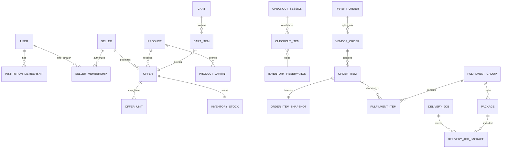
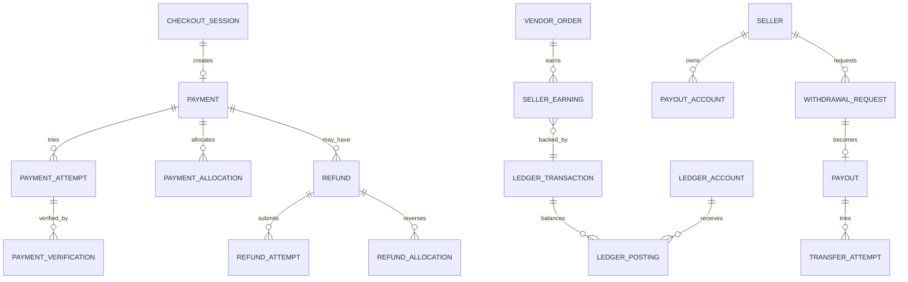
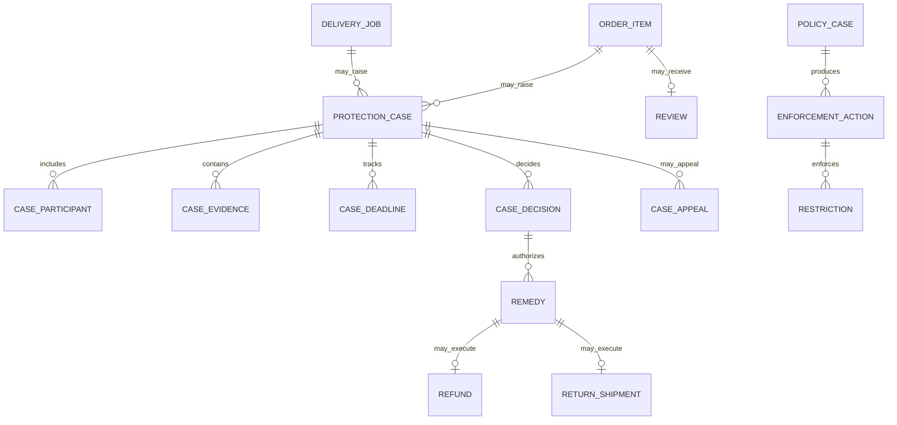

# Noma Domain Model

> **Repository path:** `docs/07-domain-model.md`  
> **Status:** Binding Covenant pilot domain and persistence contract  
> **Version:** 1.0  
> **Effective date:** 30 July 2026  
> **Applies to:** Noma's two-month Covenant University pilot build  
> **Primary audience:** Founders, Product, Engineering, Codex, Quality Assurance, Data, Security, Operations, Finance, Support, Trust and Safety, and future contributors

---

## 1. Purpose

This document defines the entities, identifiers, relationships, ownership boundaries, database constraints, indexes, monetary records, custody records, retention fields, read projections, and persistence rules for Noma's controlled Covenant University marketplace pilot.

It translates:

- the locked product boundary in `docs/01-mvp-scope.md`;
- the identity, role, capability, scope, and separation-of-duty rules in `docs/02-user-roles.md`;
- the 30 required happy-path, exception, financial, custody, and operational journeys in `docs/03-user-journeys.md`;
- the product surfaces and authoritative object views in `docs/04-information-architecture.md`;
- the truthful status and interaction semantics in `docs/05-design-system.md`; and
- the module, transaction, outbox, queue, provider, and infrastructure boundaries in `docs/06-technical-architecture.md`

into a relational domain contract for PostgreSQL and Prisma.

The objective is to prevent Engineering, Codex, and future contributors from independently inventing:

- duplicate or contradictory user identities;
- one broad `role` field;
- one giant product or order table;
- mutable financial balances without ledger evidence;
- editable provider-confirmed truth;
- inventory counters without reservations and movement history;
- custody status without proof;
- cross-seller or cross-institution data leakage;
- JSON blobs where relational constraints are required;
- soft deletion of records that must remain auditable;
- read models that become writable sources of truth; or
- database changes that silently activate deferred product scope.

This document defines **what records exist and what must remain true in persistence**. `docs/08-state-machines.md` will define the final state names, permitted transitions, actors, guards, deadlines, side effects, and terminal/reversal semantics.

---

## 2. Authority and relationship to other Build Pack documents

The following hierarchy applies:

1. `docs/01-mvp-scope.md` controls what is active, progressive, manual, prohibited, or deferred.
2. `docs/02-user-roles.md` controls who may view, initiate, approve, execute, override, export, or receive data.
3. `docs/03-user-journeys.md` controls required sequences, exceptions, evidence, and honest completion.
4. `docs/04-information-architecture.md` controls surface and page responsibility.
5. `docs/05-design-system.md` controls human-facing state meaning and truthful presentation.
6. `docs/06-technical-architecture.md` controls module ownership, runtime boundaries, transactions, providers, queues, and infrastructure.
7. **This document controls final entity vocabulary, identifiers, relationships, ownership, constraints, indexes, persistence, retention, and authoritative versus projected records.**
8. `docs/08-state-machines.md` may refine state fields and transitions but must not weaken constraints or ownership defined here.
9. Later integration, security, testing, backlog, and readiness documents may add implementation detail without silently changing the domain model.

Where a conflict is discovered, implementation must stop at the affected boundary until the conflict is recorded and resolved through the scope-change process.

---

## 3. Source-derived requirements and new modelling decisions

### 3.1 Source-locked requirements

The source contracts require:

- one human identity with independently scoped institution, seller, rider, partner, and staff memberships;
- one active Covenant institution during the founding pilot without hardcoding a single-tenant future;
- canonical Products separated from Seller Offers;
- unit-specific Pre-Owned evidence and optional serialized identity;
- explicit inventory stock, reservations, movements, and custody;
- one buyer payment producing a Parent Order, Vendor Orders, Order Items, Fulfilment Groups, and financial allocations;
- separate Payment, Ledger, Refund, Seller Earning, Hold, Withdrawal, Payout, and Provider Attempt records;
- provider-confirmed payment, refund, and payout truth;
- Noma-owned Fulfilment and Delivery Jobs with assignments and custody evidence;
- structured Messaging, Protection Cases, Reviews, Enforcement, Appeals, Recalls, and operational intervention;
- append-only financial and privileged audit history;
- transactional outbox and idempotent provider/job boundaries;
- feature, cohort, capacity, and emergency-pause controls; and
- rebuildable search, dashboard, and analytics projections that are not authoritative.

### 3.2 New technical decisions locked by this document

The earlier contracts intentionally left several persistence choices open. This document locks them for the Covenant pilot:

1. Application identifiers use **UUIDv7-compatible UUID values** generated by the application and stored as PostgreSQL `uuid`.
2. Customer-facing references are separate, non-secret, human-readable identifiers.
3. Database tables and columns use `snake_case`; Prisma models and TypeScript domain types use `PascalCase`/`camelCase`.
4. Time is stored as PostgreSQL `timestamptz` in UTC; local campus time is derived through institution timezone.
5. Money is stored as signed PostgreSQL `bigint` minor units with explicit ISO 4217 currency.
6. Financial accounting uses an append-only **double-entry ledger**.
7. Concurrent mutable aggregates use an integer `version` field where optimistic concurrency is useful.
8. Core relationships are relational. `jsonb` is limited to versioned snapshots, provider payloads, policy/configuration documents, and extension-specific details that do not replace required constraints.
9. Noma does not use blanket soft deletion. Retention behaviour is entity-specific.
10. Search, dashboard, queue, and balance projections are rebuildable and never accepted as the authority for protected commands.
11. Workflow records contain status fields, but the exact state vocabulary and transitions are governed by Part 8.
12. No provider network call occurs inside a database transaction.

## 4. Normative language

- **MUST / MUST NOT:** mandatory for the applicable pilot stage.
- **SHOULD / SHOULD NOT:** expected unless an approved, documented reason exists.
- **MAY:** optional within the locked boundary.
- **AGGREGATE ROOT:** the record through which a consistency boundary is changed.
- **OWNING MODULE:** the only module permitted to write an entity directly.
- **AUTHORITATIVE:** the source of truth for protected decisions.
- **PROJECTION:** a rebuildable, non-authoritative read representation.
- **APPEND-ONLY:** existing business rows are not rewritten or deleted to change history; corrections use new records.
- **IMMUTABLE SNAPSHOT:** a versioned copy of facts shown or agreed at a particular event.
- **TOMBSTONE:** a retained identifier/minimum record proving a deleted or anonymised subject once existed.
- **MINOR UNIT:** currency value represented as an integer, such as kobo for NGN.
- **SYSTEM-ONLY:** created or changed only through an authorised system workflow, not direct staff editing.
- **PROGRESSIVE ENTITY:** persisted only when the corresponding feature is enabled and activation gates pass.
- **PARTIAL UNIQUE INDEX:** a uniqueness rule applying only to rows matching a predicate such as `revoked_at IS NULL`.

Illustrative table and field names are binding in responsibility. Minor naming adjustments require an approved domain-model change and must preserve semantics.

---

# Part A — Global persistence conventions

## 5. Database naming

| Concern | Rule |
|---|---|
| Database schema | PostgreSQL default application schema unless a reviewed security boundary requires another |
| Tables | plural `snake_case`, for example `vendor_orders` |
| Columns | `snake_case` |
| Primary keys | `id uuid` |
| Foreign keys | `<entity>_id` |
| Timestamps | `<event>_at timestamptz` |
| Booleans | positive names such as `is_active`, not double negatives |
| Status fields | `<concept>_status` or `status` only when unambiguous |
| Monetary fields | `<concept>_minor bigint` plus `currency char(3)` |
| Provider fields | `provider`, `provider_reference`, never provider-specific names on core entities |
| Metadata | use specific columns first; `metadata jsonb` only where the extension contract permits it |

Names must express business meaning rather than UI labels.

## 6. Identifier strategy

### 6.1 Internal primary identifiers

Every durable business entity MUST have:

```text
id uuid PRIMARY KEY
```

Application code generates time-sortable UUIDv7-compatible values. The database must not expose sequential IDs as public security boundaries.

### 6.2 Public references

Human-facing objects SHOULD have a separate reference such as:

```text
NO-ORD-2026-7K4Q9M
NO-CASE-2026-18D7P
NO-PAY-2026-A2G5T
```

A public reference:

- is unique;
- is not an authentication secret;
- may appear in email and Support communication;
- must not encode sensitive identity, seller, room, or monetary information; and
- must not replace the UUID foreign-key relationship internally.

### 6.3 Provider and idempotency identifiers

Provider references, idempotency keys, external event IDs, and queue job keys are separate namespaces and MUST have explicit unique constraints scoped by provider or operation.

## 7. Time, timezone, and ordering

- All persisted instants use `timestamptz`.
- `created_at` and `updated_at` are required on mutable aggregate roots.
- Append-only records generally require only `created_at` plus event-specific timestamps.
- Business deadlines use explicit absolute instants after calculation.
- An Institution stores its IANA timezone, initially `Africa/Lagos`.
- Ordering that affects money, custody, or rights MUST use database timestamps and stable IDs, not client clocks.
- A device-supplied timestamp may be stored separately as evidence but cannot become authoritative without server confirmation.

## 8. Money and numeric precision

Every monetary amount MUST use:

```text
amount_minor bigint
currency char(3)
```

Rules:

- no `float`, JavaScript `number`, or PostgreSQL floating type for money;
- arithmetic in application code uses `bigint`;
- currency is required even when all pilot orders currently use NGN;
- one ledger transaction cannot contain postings in different currencies;
- quantity uses an integer unless the category explicitly supports measured units;
- percentages use integer basis points where practical;
- tax, commission, discount, and fee calculations preserve their rule/version and rounding result;
- the sum of payment allocations must equal the verified payment amount;
- the sum of ledger postings for a transaction must equal zero.

## 9. Text, case, and normalization

- Emails are stored in canonical lowercase form plus the original display form where needed.
- Phone numbers use E.164 canonical form.
- Institution identifiers and product identifiers store canonical and original forms.
- User-entered descriptions preserve original text; searchable normalized text is a projection.
- Case-insensitive uniqueness uses normalized columns or PostgreSQL `citext` only after reviewed migration support.
- Whitespace-only strings are prohibited through application validation and, for critical fields, database checks.

## 10. Ownership and module write boundary

Every table has one owning module. Only that module's repository may issue direct writes.

Other modules may:

- reference the entity by foreign key;
- call an application command owned by the module;
- consume an outbox event;
- read an approved query/read model; or
- create a linking record owned by their own module.

Cross-module direct updates are prohibited, including “temporary” Prisma calls from another module.

## 11. Institution and seller scope

Institution-scoped records MUST carry `institution_id` directly when:

- queries commonly filter by institution;
- authorisation requires institution isolation;
- the entity may outlive or detach from another parent relationship; or
- the direct column prevents unsafe joins or ambiguous tenancy.

Seller-owned records MUST carry `seller_id` directly when seller isolation or seller-level queries require it.

A redundant scope column is permitted only when:

- it is derivable from an authoritative parent;
- a database trigger or application invariant guarantees consistency; and
- the direct scope materially improves safety or query performance.

## 12. Status fields and Part 8 boundary

This document names the records that carry workflow state. It does not finalise every enum value.

Until `docs/08-state-machines.md` is implemented:

- status fields MUST use explicit domain types, not arbitrary strings;
- transitions MUST occur through application commands;
- status fields MUST NOT be editable through generic admin forms;
- provider-final status and internal workflow status remain separate;
- terminal records remain queryable; and
- a status change that affects money, stock, custody, access, or rights creates audit/outbox records in the same transaction.

## 13. Versioning and optimistic concurrency

Mutable aggregates with competing actors SHOULD include:

```text
version integer NOT NULL DEFAULT 0
```

Updates use:

```sql
UPDATE ...
SET ..., version = version + 1
WHERE id = $1 AND version = $expected_version;
```

A zero-row result is a concurrency conflict, not permission to overwrite newer state.

Candidate aggregates include:

- Cart;
- CheckoutSession;
- VendorOrder;
- FulfilmentGroup;
- DeliveryJob;
- ProtectionCase;
- WithdrawalRequest;
- FeatureAssignment; and
- CapacityLimit.

## 14. Deletion, anonymisation, and retention

Noma MUST NOT apply one universal `deleted_at` field.

Entity classes:

| Class | Persistence rule |
|---|---|
| Financial ledger, payment, refund, payout, provider event | Append-only; never hard-delete in normal operations |
| Orders, fulfilments, custody, cases, enforcement, audit | Retain according to legal/operational policy; corrections append |
| Sessions, OTPs, temporary credentials | Expire and delete according to security policy |
| Draft carts and abandoned checkout sessions | Expire and delete/anonymise under configured retention |
| Public catalogue media | May be detached/retired; referenced order snapshots remain |
| Identity evidence and private files | Delete or restrict under approved retention while preserving decision metadata |
| User account | Deactivate/anonymise where permitted; preserve protected obligations and tombstone references |
| Read projections | Rebuildable and may be deleted/recreated |

Retention periods belong in `docs/10-security-and-compliance.md`.

## 15. JSONB policy

`jsonb` MAY be used for:

- immutable checkout/order snapshots;
- provider request/response payloads with redaction;
- versioned feature/policy configuration;
- audit before/after fragments;
- category-specific condition answers;
- extension details for progressive types; and
- analytics metadata that is not authoritative.

`jsonb` MUST NOT replace:

- user/seller/institution relationships;
- order items and allocations;
- ledger postings;
- inventory reservations;
- delivery assignments/custody;
- case participants/evidence;
- role assignments/capabilities;
- fields required for authorisation, uniqueness, or indexing.

Every durable JSON document MUST have a schema/version discriminator.

## 16. File references

Binary files do not live in PostgreSQL. The database stores:

- object key;
- storage class/bucket alias;
- content hash;
- detected media type;
- byte length;
- visibility class;
- owner/module;
- scan status;
- retention state;
- uploader;
- creation and expiry;
- and links to authorised business resources.

A database row does not make a private object public. Access is evaluated at request time.

## 17. Authoritative records versus projections

Authoritative records accept protected commands. Projections do not.

Examples:

| Authoritative | Projection |
|---|---|
| `ledger_postings` | seller balance summary |
| `inventory_stocks` + reservations/movements | product availability/search document |
| `provider_events` + `payments` | Finance reconciliation dashboard |
| `vendor_orders` + `fulfilment_groups` | Buyer order timeline card |
| `delivery_assignments` + `custody_events` | Dispatch board row |
| `role_assignments` | navigation/surface entitlement cache |
| `protection_cases` + decisions | Support queue summary |

A projection must declare its source tables, refresh trigger, rebuild process, and staleness indicator.

---

# Part B — Domain ownership map

## 18. Module-to-entity ownership

| Owning module | Owned entities |
| --- | --- |
| Identity | User, UserEmail, UserPhone, Credential, Session, MfaFactor, RecoveryAttempt |
| Access | Capability, RoleTemplate, RoleTemplateCapability, RoleAssignment, ApprovalRequest, ApprovalDecision, TemporaryAccessGrant, ServicePrincipal |
| Institution | Institution, InstitutionDomain, InstitutionIdentifierRule, InstitutionMembership, AffiliationVerificationAttempt, CampusLocation, OperatingSchedule |
| Seller | Seller, SellerApplication, SellerMembership, SellerRepresentative, SellerActivation, SellerCategoryPermission, SellerTrainingRecord, SellerStandingSnapshot |
| Catalogue | Category, CategoryAttribute, Brand, Product, ProductVariant, ProductAttributeValue, ProductIdentifier, ProductMedia, CatalogueMergeRecord |
| Offer | Offer, OfferTerm, OfferConditionReport, OfferOwnershipDeclaration, OfferUnit, OfferMedia |
| Inventory | InventoryStock, InventoryUnit, InventoryReservation, InventoryMovement, InventoryAdjustment |
| Cart | Cart, CartItem |
| Checkout | CheckoutSession, CheckoutItem, CheckoutPriceComponent, DeliveryQuote |
| Order | ParentOrder, VendorOrder, OrderItem, OrderItemSnapshot, OrderAttribution |
| Payment | Payment, PaymentAttempt, ProviderEvent, PaymentVerification, PaymentAllocation, PaymentReconciliationCase |
| Ledger | LedgerAccount, LedgerTransaction, LedgerPosting, SellerEarning, FinancialHold, ReservePosition, FinancialAdjustment |
| Refund | RefundDecision, Refund, RefundAttempt, RefundAllocation |
| Payout | PayoutAccount, PayoutAccountChange, WithdrawalRequest, PayoutBatch, Payout, TransferAttempt |
| Fulfilment | FulfilmentGroup, FulfilmentItem, Package, PackageItem, PreparationEvent |
| Delivery | Carrier, RiderProfile, RiderMembership, RiderShift, DeliveryJob, DeliveryJobPackage, DeliveryStop, DeliveryAssignment, CustodyEvent, HandoffCredential, DeliveryAttempt, DeliveryIncident, DeliveryBatch, DeliveryBatchItem |
| Messaging | Conversation, ConversationParticipant, Message, MessageModerationSignal, SubstitutionProposal |
| Notification | Notification, NotificationPreference, NotificationDeliveryAttempt |
| Protection | ProtectionCase, CaseParticipant, CaseEvidence, CaseDeadline, CaseDecision, Remedy, ReturnShipment, Inspection, CaseAppeal |
| Review | Review, ReviewRating, ReviewModerationAction |
| Trust and Safety | PolicySignal, PolicyCase, EnforcementAction, Restriction, EnforcementAppeal, RecallCampaign, RecallImpact |
| Search | SearchDocument, SearchSynonym, SearchQueryEvent, SearchIndexCheckpoint |
| Merchandising | Collection, CollectionItem, Campaign, DiscountRule, Coupon, CouponRedemption, PromotionAllocation |
| Files | FileObject, UploadIntent, FileLink, FileScanResult, FileAccessEvent |
| Audit | AuditEvent, AuditEventLink |
| Feature Control | FeatureDefinition, FeatureAssignment, CapacityLimit, EmergencyPause, ConfigurationVersion |
| Operations | WorkQueueItem, WorkAssignment, InterventionRecord |
| Reliability | OutboxEvent, IdempotencyRecord, JobExecution |
| Food (progressive) | FoodOutletProfile, MenuModifierGroup, MenuModifierOption, FoodOrderDetail |
| External Inbound (progressive) | ExternalInboundShipment, ExternalInboundItem, InboundCustodyEvent |
| FBN Campus (progressive) | FulfilmentLocation, StorageBin, FbnInboundShipment, FbnInboundItem, ReceivingRecord, WarehouseTask, CycleCount, QuarantineRecord |
| Pre-Owned extension | SerializedIdentifier and condition/ownership/unit evidence linked to Offer/Inventory/Protection |

## 19. Aggregate-root inventory

The principal aggregate roots are:

- User;
- Institution;
- InstitutionMembership;
- Seller;
- SellerApplication;
- Product;
- Offer;
- InventoryStock or InventoryUnit;
- Cart;
- CheckoutSession;
- ParentOrder;
- VendorOrder;
- Payment;
- LedgerTransaction;
- Refund;
- WithdrawalRequest;
- Payout;
- FulfilmentGroup;
- DeliveryJob;
- Conversation;
- ProtectionCase;
- PolicyCase;
- Review;
- FeatureAssignment;
- EmergencyPause; and
- progressive aggregate roots listed in Part G.

Child rows must not be edited independently when the parent aggregate enforces an invariant.

## 20. Reference direction

The preferred relationship direction is:

```text
Identity/Institution/Access
        ↓
Seller/Catalogue/Offer/Inventory
        ↓
Cart/Checkout/Order
        ↓
Payment/Ledger/Refund/Payout
        ↓
Fulfilment/Delivery
        ↓
Messaging/Protection/Review/Trust
```

This is a conceptual dependency direction. Cross-cutting modules such as Files, Audit, Feature Control, Notification, Outbox, and Operations link to resources without owning their business truth.

---

# Part C — Identity, access, institution, and seller entities

## 21. Identity entities

| Entity | Purpose / authoritative fields | Required constraints and indexes |
| --- | --- | --- |
| `users` | One underlying human/service-subject identity. Fields: `id`, public reference, account status, display name, locale, security version, created/updated/deactivated timestamps. | Unique public reference; account status indexed; no broad global role column; `security_version >= 0`. |
| `user_emails` | Email addresses and verification. Fields: user, normalized/display email, type, verified/primary timestamps. | Unique normalized email across active identities unless an approved recovery model says otherwise; one active primary email per user via partial unique index. |
| `user_phones` | Purpose-limited contact/recovery numbers. Fields: E.164 number, verification, consent flags, primary. | Unique active E.164 number where policy requires; one active primary phone per user. |
| `credentials` | Password or future passkey credential metadata. Never stores plaintext secrets. | Unique credential/provider subject; password hash required for password credential; revocation/rotation timestamps. |
| `sessions` | Opaque revocable sessions. Fields: token hash, user, assurance level, issued/last-used/expires/revoked timestamps, device/security metadata. | Unique token hash; indexes on user + active expiry; expired/revoked sessions excluded by query; raw token never stored. |
| `mfa_factors` | Privileged or user MFA enrolment metadata and recovery state. | Unique provider factor reference; only one active preferred factor where policy requires; encrypted secrets outside routine projections. |
| `recovery_attempts` | Account recovery attempts, assurance evidence, outcome, and containment actions. | Indexed by user/email hash and created time; immutable outcome evidence; rate-limit correlation. |

## 22. Access-control entities

| Entity | Purpose / authoritative fields | Required constraints and indexes |
| --- | --- | --- |
| `capabilities` | Stable atomic permission vocabulary such as `refund.approve` or `delivery.assign`. | Unique capability code; retired capabilities retained but cannot be newly granted. |
| `role_templates` | Named bundles for Support, Finance, Seller Operator, Rider, etc. | Unique code + version; not itself authority until assigned. |
| `role_template_capabilities` | Many-to-many capability membership with optional conditions. | Unique role template + capability. |
| `role_assignments` | Actual scoped authority granted to a user/service principal. Fields: subject, template, institution/seller/resource scope, start/end/revocation, assurance. | No overlapping duplicate active assignment for same subject/template/scope; partial indexes for active assignments; grant and revoke actor required. |
| `approval_requests` | Maker-checker request for high-risk action. Stores operation type, target, amount/scope, request snapshot, expiry. | Unique active request idempotency key; requestor cannot satisfy a prohibited same-actor approval. |
| `approval_decisions` | Append-only approver decisions with reason and assurance evidence. | One decision per approver/request; cannot be edited; approval count computed from valid decisions. |
| `temporary_access_grants` | Time-limited scoped access for incident/support purposes. | Start < expiry; reason/owner required; automatically inactive after expiry. |
| `service_principals` | Non-human runtime or integration identity with minimum capabilities. | Unique code per environment; no interactive session; credential rotation and revocation recorded. |

## 23. Institution entities

| Entity | Purpose / authoritative fields | Required constraints and indexes |
| --- | --- | --- |
| `institutions` | University/market boundary. Fields: name, code, timezone, activation state, policy version, public settings. | Unique code; timezone required; activation state indexed. |
| `institution_domains` | Approved email domains by affiliation type and verification status. | Unique institution + normalized domain + affiliation type among active rows. |
| `institution_identifier_rules` | Versioned matric/staff identifier normalization and validation rules. | One active version per institution/affiliation type; historical versions retained. |
| `institution_memberships` | User affiliation with institution and type (student/staff), status, verification method, expiry. | One active membership per user + institution + affiliation type unless approved transition; indexes on institution/status and user/status. |
| `affiliation_verification_attempts` | Each automated/manual verification attempt and evidence decision. | Append-only; unique request/idempotency key; reviewer and decision reason required for manual decision. |
| `campus_locations` | Approved delivery, pickup, seller, storage, support, and handoff points in a location graph. | Unique institution + location code; parent cannot create cycle; active/type/geospatial indexes. |
| `operating_schedules` | Institution, seller, carrier, location, or feature operating hours and exceptions. | No invalid interval; effective ranges indexed; target polymorphism implemented through explicit target type/id with validation. |

## 24. Seller and participation entities

| Entity | Purpose / authoritative fields | Required constraints and indexes |
| --- | --- | --- |
| `sellers` | Commercial entity classified as `CAMPUS_STORE`, `STUDENT_VENDOR`, or `EXTERNAL_VENDOR`. | Unique public reference; seller type immutable after activation without migration workflow; institution scope indexed. |
| `seller_applications` | Risk-based onboarding application and review snapshot. | One active application per applicant/seller type/institution; decision history preserved. |
| `seller_memberships` | User authority over a seller, for example Owner or Operator. | Unique active seller + user + membership type; seller owner transfer requires approval workflow. |
| `seller_representatives` | Verified legal/operational representative data for stores/external vendors. | At least one active representative where seller type requires it; sensitive fields encrypted/restricted. |
| `seller_activations` | Institution/category/feature-specific seller activation, capacity, confirmation mode, and effective period. | Unique active seller + institution + activation scope; activation requires approved seller and gates. |
| `seller_category_permissions` | Allowed/restricted categories and risk conditions. | Unique active seller + category; denial overrides broad allowance. |
| `seller_training_records` | Required training/test-order completion. | Unique seller/member + training module/version; completion evidence retained. |
| `seller_standing_snapshots` | Rebuildable summary of objective seller performance and restrictions. | Projection only; source records referenced; timestamp/staleness required. |

### 24.1 Seller-type boundary

`Seller.type` is entity classification, not a user's role. A user acts through `seller_memberships`; the same user may own one seller and operate another only where policy permits.

### 24.2 Seller approval versus activation

The model MUST preserve:

```text
Seller application approved
≠ Seller entity active
≠ Seller activated at Covenant
≠ Category permitted
≠ Payout account verified
≠ Trusted seller
```

No single boolean named `is_verified` may collapse these facts.

---

# Part D — Catalogue, offer, and inventory entities

## 25. Catalogue entities

| Entity | Purpose / authoritative fields | Required constraints and indexes |
| --- | --- | --- |
| `categories` | Hierarchical taxonomy with policy and attribute schema references. | Unique parent + normalized slug; no cycles; active path indexes. |
| `category_attributes` | Structured attribute definitions, data type, units, filterability, requirement by listing type. | Unique category + attribute code + schema version; valid option values constrained. |
| `brands` | Canonical brand identity and moderation status. | Unique normalized brand name where appropriate; aliases separate. |
| `products` | Canonical product shared across sellers. Fields: category, brand, title, model, status, canonical description. | Unique public reference; category/status indexes; no seller ownership. |
| `product_variants` | Canonical purchasable specification combination such as size/colour/storage. | Unique product + normalized variant signature; immutable signature once referenced by an order. |
| `product_attribute_values` | Typed structured product/variant values. | Unique target + attribute; type-valid value enforced in application and DB checks where possible. |
| `product_identifiers` | ISBN, GTIN, manufacturer part number, etc. | Unique identifier type + normalized value where globally unique; source/confidence retained. |
| `product_media` | Approved canonical media linked through Files. | Ordering unique per product/variant; only safe/approved public file links. |
| `catalogue_merge_records` | Auditable merge or split decisions for duplicate products. | Append-only; source and destination products required; cannot orphan order snapshots. |

## 26. Offer and Pre-Owned entities

| Entity | Purpose / authoritative fields | Required constraints and indexes |
| --- | --- | --- |
| `offers` | Seller's commercial offer for a product/variant at an institution. Owns price, availability policy, condition class, fulfilment source, warranty/return terms, publication status. | Unique public reference; seller/product/institution/status indexes; seller must be activated and category-permitted before publication. |
| `offer_terms` | Versioned commercial terms such as price, warranty, return classification, tax/commission rule reference. | Effective periods cannot overlap for the same offer/term type; order snapshot references exact version. |
| `offer_condition_reports` | Structured condition answers and disclosed defects for pre-owned/open-box/refurbished offers. | Schema version required; pre-owned offer cannot publish without required fields. |
| `offer_ownership_declarations` | Seller declaration of ownership/authority and non-stolen status. | One active declaration per applicable unit/offer; accepted policy version and actor required. |
| `offer_units` | Specific sellable unit where quantity must be one or condition differs by unit. | Unique offer + unit reference; only one active sale/reservation at a time; links actual-unit media/identifiers. |
| `offer_media` | Seller-provided actual product/unit media and purpose/angle. | Pre-owned actual-unit media cannot be replaced in historical order snapshots; ordering unique per offer/unit. |
| `serialized_identifiers` | IMEI/serial/manufacturer identifiers for applicable units, encrypted/masked as required. | Unique normalized identifier type/value where lawful; public masked value separate; access audited. |

### 26.1 Canonical Product + Seller Offer invariant

A Product describes **what the item is**. An Offer describes **who is selling it, for how much, in what condition, under what terms, and from which fulfilment source**.

Price, seller, stock, condition, fulfilment source, return terms, and seller warranty MUST NOT be stored as canonical Product fields.

### 26.2 Unit-specific Pre-Owned invariant

Where the photographs and condition describe one physical unit:

- `offer_units.quantity` is effectively one;
- the same unit cannot back multiple completed orders;
- actual-unit media and condition snapshot are attached to the Order Item;
- serial identity, where used, is masked publicly and restricted internally; and
- `NOMA_VERIFIED_PRE_OWNED` cannot be inferred from seller declarations.

## 27. Inventory entities

| Entity | Purpose / authoritative fields | Required constraints and indexes |
| --- | --- | --- |
| `inventory_stocks` | Aggregate stock position by seller, offer/variant, institution, and fulfilment location. Fields: on-hand, reserved, unavailable/damaged, version. | Unique seller + offer/variant + location; non-negative buckets; available = on_hand - reserved - unavailable derived, not freely edited. |
| `inventory_units` | Individually tracked physical unit for serialized, pre-owned, high-risk, or FBN goods. | Unique unit code and serialized identifiers; current location/custody status indexed; cannot be simultaneously allocated to two active order items. |
| `inventory_reservations` | Time-bounded reservation for cart/checkout/order quantity or unit. | Unique idempotency key; one active reservation per inventory unit; aggregate reservation quantity <= reservable stock via locked transaction. |
| `inventory_movements` | Append-only movement between stock buckets/locations with cause and source resource. | Quantity non-zero; from/to cannot be identical; source reference required; movements cannot be edited. |
| `inventory_adjustments` | Authorised counted-versus-recorded correction request/approval. | Reason/evidence/approver required; executes through movement(s), never direct counter edit. |

### 27.1 Inventory arithmetic

For aggregate stock:

```text
available_quantity =
  on_hand_quantity
  - reserved_quantity
  - unavailable_quantity
```

Counters are maintained only by the Inventory module inside transactions that also create the corresponding reservation or movement record.

### 27.2 Reservation concurrency

Reservation creation MUST:

1. lock or atomically predicate-update the target stock/unit;
2. verify feature, seller, offer, location, and expiry conditions;
3. create one reservation with an idempotency key;
4. update reserved counters where used;
5. create outbox events in the same transaction; and
6. return a conflict rather than oversell.

Expired reservations release through an idempotent Worker command.

### 27.3 Negative inventory prohibition

No normal workflow may make:

- `on_hand_quantity < 0`;
- `reserved_quantity < 0`;
- `unavailable_quantity < 0`; or
- `reserved_quantity + unavailable_quantity > on_hand_quantity`.

A reconciliation exception must be recorded instead of forcing a negative counter.

---

# Part E — Cart, checkout, order, fulfilment, and delivery entities

## 28. Cart and checkout entities

| Entity | Purpose / authoritative fields | Required constraints and indexes |
| --- | --- | --- |
| `carts` | Active buyer shopping intent scoped to institution/currency. Fields: buyer or guest session, status, version, last activity. | At most one active cart per authenticated buyer + institution + currency; guest carts linked by secure session token hash. |
| `cart_items` | Requested offer/unit/variant, quantity, buyer-selected options, added price/promise observation. | Unique cart + offer/unit + option signature; quantity positive; not authoritative for final price or availability. |
| `checkout_sessions` | Frozen/revalidating checkout attempt linking cart, buyer, institution, delivery selection, pricing version, expiry, idempotency. | One active checkout per idempotency key; expiry indexed; version/concurrency required. |
| `checkout_items` | Revalidated candidate item, seller, inventory source, quantity, current eligibility, and snapshot candidate. | Unique checkout + cart item; quantity positive; references exact offer term and reservation. |
| `checkout_price_components` | Item, delivery, discount, promotion, tax, fee, and total components with funding party/rule version. | Component amount signed; components must reconcile to displayed total; one deterministic key per component. |
| `delivery_quotes` | Tier, promise window, pickup/drop-off assumptions, price, capacity decision, and expiry. | Quote tied to checkout and configuration versions; expired quote cannot confirm order. |

### 28.1 Cart is not an order

A Cart may contain stale or temporarily ineligible items. Checkout revalidates:

- affiliation and buyer capability;
- seller/offer/category activation;
- stock and unit availability;
- price and terms;
- delivery location, tier, capacity, and promise;
- promotion eligibility;
- value/volume limits; and
- emergency pause state.

Only the confirmed checkout transaction creates Orders and financial allocations.

## 29. Order entities

| Entity | Purpose / authoritative fields | Required constraints and indexes |
| --- | --- | --- |
| `parent_orders` | Buyer-facing commercial purchase created after verified payment. Fields: buyer, institution, currency, total snapshots, overall summary status. | Unique public reference and checkout/payment idempotency relation; cannot exist as paid without verified Payment link. |
| `vendor_orders` | Seller-specific obligation within Parent Order. Owns seller acceptance, preparation, cancellation/fault attribution, seller totals. | Unique parent order + seller + fulfilment policy grouping; indexed by seller/status/deadline. |
| `order_items` | Purchased quantity/unit linked to one Vendor Order, product/offer/variant/unit and financial allocations. | Quantity positive; immutable seller/product/offer identity after creation; cancelled/refunded quantities cannot exceed ordered quantity. |
| `order_item_snapshots` | Immutable customer-visible title, attributes, images, condition, terms, warranty, return class, price, promise, and seller facts at purchase. | One snapshot version per order item; JSON schema version required; never overwritten after protected change. |
| `order_attributions` | Structured cause/fault attribution for cancellation, delay, refund, damage, or case outcome. | Append-only; active/final attribution may be superseded by explicit reversal/appeal outcome. |

### 29.1 Multi-vendor order invariant

One confirmed Checkout creates, in one database transaction:

```text
ParentOrder
├── VendorOrder per seller/operational grouping
├── OrderItem rows
├── immutable OrderItemSnapshot rows
├── FulfilmentGroup and FulfilmentItem rows
├── PaymentAllocation rows
├── pending SellerEarning records/ledger intent
├── inventory reservation conversion/allocation
└── OutboxEvent rows
```

Failure to create any required child aborts the transaction.

### 29.2 Quantity accounting

For each Order Item:

```text
ordered_quantity =
  active_fulfilment_quantity
  + cancelled_quantity
  + returned_quantity_pending_resolution
  + otherwise_resolved_quantity
```

Refunded monetary amount and cancelled/returned quantity are related but not interchangeable.

## 30. Fulfilment entities

| Entity | Purpose / authoritative fields | Required constraints and indexes |
| --- | --- | --- |
| `fulfilment_groups` | Operational grouping of items that move together under one source, handling class, and promise. | Belongs to one Parent Order/institution; contains items from one or more Vendor Orders only when batching rules permit; versioned. |
| `fulfilment_items` | Quantity/unit allocation from Order Item into a Fulfilment Group. | Unique fulfilment group + order item + unit; allocated quantity positive and cannot exceed unallocated order quantity. |
| `packages` | Physical parcel prepared for pickup, with QR identity, seal/weight/handling data and status. | Unique package code; package cannot be in two active delivery jobs; QR token itself not stored plaintext if security-sensitive. |
| `package_items` | Exact item quantity/unit placed in a package. | Unique package + fulfilment item/unit; package quantity cannot exceed fulfilment quantity. |
| `preparation_events` | Append-only seller/FBN preparation, ready, packaging, exception, and handoff-readiness evidence. | Actor/source and timestamp required; event cannot itself bypass aggregate state guard. |

### 30.1 Vendor Order and Fulfilment are different

A Vendor Order is the seller's commercial obligation. A Fulfilment Group is an operational movement grouping.

Therefore:

- one Vendor Order may split into several Fulfilment Groups;
- several compatible Vendor Orders may contribute items to one batch/delivery;
- cancellation or failure remains item/vendor scoped;
- seller earnings follow Vendor Order/Order Item economics;
- logistics follows Fulfilment/Package/Delivery records.

## 31. Carrier, rider, delivery, and custody entities

| Entity | Purpose / authoritative fields | Required constraints and indexes |
| --- | --- | --- |
| `carriers` | Noma Fleet, CU Express, or future approved partner configuration and activation. | Unique code per institution/provider; carrier type and adapter reference; active capacity indexed. |
| `rider_profiles` | Person-level rider eligibility/safety/payment metadata separate from User identity. | One profile per user where applicable; sensitive fields restricted. |
| `rider_memberships` | Rider's approved carrier/institution/program membership and restrictions. | Unique active user + carrier + institution; approval/training evidence required. |
| `rider_shifts` | Availability window, capacity, status, start/end and device/session evidence. | No overlapping active shift for same rider unless policy explicitly allows; start < end. |
| `delivery_jobs` | Noma-owned delivery obligation with tier, promises, source/destination, handling, status, version. | Unique public reference; institution/status/promise indexes; one current assignment at most. |
| `delivery_job_packages` | Packages included in a Delivery Job. | Unique delivery job + package; package cannot belong to conflicting active job. |
| `delivery_stops` | Ordered pickup/drop-off/return stops with approved Campus Location and time window. | Unique job + sequence; location must be approved for stop purpose. |
| `delivery_assignments` | Each offered/accepted/current rider/carrier assignment, including recommendation and override reason. | Append-only assignment history; partial unique index permits only one current active assignment per job. |
| `custody_events` | Append-only chain-of-custody transfer/observation for package/unit with actor, location, credential, evidence. | Cannot be edited; previous/current custodian consistency checked by command; indexed by package/unit/time. |
| `handoff_credentials` | One-time PIN/QR credential hash, target recipient/delegate, purpose, expiry, attempts, consumption. | Unique token hash; plaintext never stored; one successful consumption; expiry/attempt limits. |
| `delivery_attempts` | Arrival/contact/handoff attempt and structured outcome/evidence. | Append-only; a failed attempt cannot set delivered status. |
| `delivery_incidents` | Loss, damage, unsafe handoff, device failure, or custody exception case. | Severity/status indexes; may link Protection/Policy Case; no silent resolution. |
| `delivery_batches` | Rules/operator-created grouping of compatible Delivery Jobs. | Feature gated; unique batch reference; promise/handling compatibility validated. |
| `delivery_batch_items` | Membership and stop ordering within a batch. | Unique batch + delivery job; one active batch per delivery job unless split model explicitly permits. |

### 31.1 Custody authority

`custody_events` are the authority for possession history. `delivery_jobs.status`, `packages.current_custodian_type`, and Dispatch board rows are summaries constrained by the custody stream.

No role may directly edit custody history or mark delivery completed without an accepted handoff command that creates:

- credential verification;
- Delivery Attempt/Delivery event;
- Custody Event;
- aggregate transition;
- audit/outbox event; and
- applicable earning/protection trigger.

### 31.2 Offline Rider boundary

The Rider PWA may persist a local draft. The server stores a confirmed event only after:

- active session/assignment verification;
- idempotency check;
- current aggregate/state verification;
- credential/evidence verification; and
- transaction success.

A device timestamp is evidence, not final truth.

---

## 32. Core commerce relationship diagram



---

# Part F — Payment, ledger, refund, and payout entities

## 33. Payment and provider-event entities

| Entity | Purpose / authoritative fields | Required constraints and indexes |
| --- | --- | --- |
| `payments` | Customer payment obligation/receipt for Checkout/Parent Order. Stores expected amount, currency, provider, internal status, verified provider facts. | Unique public/internal reference; one successful payment per checkout/order intent; expected amount positive. |
| `payment_attempts` | Each provider initialisation/authorisation attempt and redirect/session metadata. | Unique provider + provider reference; idempotency key; attempt amount/currency fixed. |
| `provider_events` | Raw authenticated provider webhook/poll event envelope, hash, signature result, provider event identity, processing state. | Unique provider + external event id or deterministic payload fingerprint; append-only raw/redacted payload; processing retries explicit. |
| `payment_verifications` | Server-side provider verification observations and outcome. | Append-only; references payment attempt; provider amount/currency/status captured. |
| `payment_allocations` | Exact portion of verified payment assigned to item, delivery, tax, fee, discount funding, or platform component. | Signed amount; sum by payment equals verified amount; unique deterministic allocation key. |
| `payment_reconciliation_cases` | Mismatch/uncertainty requiring Finance/Operations resolution. | Unique active case per payment + issue type; resolution must link evidence/adjustments. |

### 33.1 Provider truth separation

The model MUST preserve:

```text
Browser returned from Paystack
≠ Payment verified
≠ Order confirmed
≠ Seller earning available
```

Provider raw status, Noma internal workflow status, and reconciliation status are separate fields/records.

### 33.2 Provider-event processing

A Provider Event is inserted before business processing. Processing occurs idempotently and records:

- signature/authentication result;
- event identity/fingerprint;
- first/last received time;
- attempt count;
- processing outcome;
- linked business object;
- error/reconciliation reference; and
- final processed timestamp.

Duplicate delivery does not duplicate the business effect.

## 34. Double-entry ledger entities

| Entity | Purpose / authoritative fields | Required constraints and indexes |
| --- | --- | --- |
| `ledger_accounts` | Accounting bucket owned by seller, platform, buyer receivable/refund, provider clearing, delivery, promotion, reserve, or suspense. | Unique account code + owner + currency; account type immutable after posting; no arbitrary user-created accounts. |
| `ledger_transactions` | One balanced business event such as earning recognition, commission, hold, refund reversal, payout debit, or correction. | Unique business idempotency key; immutable description/source; status only `POSTED` or explicit void-before-post policy. |
| `ledger_postings` | Debit/credit signed posting to one Ledger Account. | At least two postings per transaction; amount non-zero; sum per currency exactly zero; append-only. |
| `seller_earnings` | Operational entitlement record linking Vendor Order/Order Item to ledger transaction, release conditions, and current availability classification. | Unique earning source component; gross/deductions/net reconcile to ledger; cannot become available by direct balance edit. |
| `financial_holds` | Order/case/security-specific amount restriction with reason, source account, review/expiry/release. | Amount positive; released amount cannot exceed placed amount; one release history through ledger/hold events. |
| `reserve_positions` | Seller reserve policy position and retained amount backed by ledger accounts. | Projection/reference to ledger; policy version required; no negative retained amount. |
| `financial_adjustments` | Human-approved correction instruction producing a new Ledger Transaction. | Maker, approver, reason, evidence, and source error required; never edits historical posting. |

### 34.1 Ledger invariants

For every `ledger_transaction`:

```text
Σ ledger_postings.amount_minor = 0
```

Within one transaction:

- all postings use the same currency;
- every posting references one account;
- the business source is unique/idempotent;
- posted rows are immutable;
- reversal creates a new transaction referencing the original;
- a projection may show a balance but cannot be the command source.

### 34.2 Seller balance buckets

Displayed seller balances are computed from ledger accounts/postings:

```text
PENDING
AVAILABLE
HELD
RISK_RESERVE
PROCESSING_PAYOUT
PAID_HISTORY
NEGATIVE_EXPOSURE
```

These labels may be projections or account types. There is no freely editable `seller.wallet_balance`.

### 34.3 Ledger posting example

```text
Customer payment allocation: ₦10,000 seller merchandise
Platform commission: ₦500
Seller net pending earning: ₦9,500

Debit   Provider clearing / customer funds     10,000
Credit  Seller pending liability                9,500
Credit  Platform commission revenue               500
```

The exact debit/credit sign convention is fixed in implementation and tested consistently.

## 35. Refund entities

| Entity | Purpose / authoritative fields | Required constraints and indexes |
| --- | --- | --- |
| `refund_decisions` | Approved remedy/financial decision, scope, amount, attribution, approvers, and policy version. | One active final decision per remedy version; amount cannot exceed remaining refundable exposure without exceptional approval. |
| `refunds` | Noma refund obligation linked to payment and decision. Separates approved, provider-submitted, and provider-final facts. | Unique public reference; amount positive; cumulative refunds <= verified payment absent recorded over-refund recovery. |
| `refund_attempts` | Each provider submission/retry with unique provider reference and uncertain/final outcome. | Unique provider + reference; uncertain attempt cannot be blindly duplicated. |
| `refund_allocations` | Refund amount mapped back to Order Item, delivery, fee, tax, promotion, seller earning, or platform component. | Sum equals refund amount; unique deterministic allocation component. |

### 35.1 Refund truth

The model MUST distinguish:

```text
Refund requested
Refund approved
Refund submitted
Refund processing
Refund provider-confirmed completed
Refund failed / needs attention
```

Only provider-confirmed completion may be represented as completed to the customer.

## 36. Payout entities

| Entity | Purpose / authoritative fields | Required constraints and indexes |
| --- | --- | --- |
| `payout_accounts` | Seller payout destination with provider recipient, encrypted account details, masked display, resolved name, verification and active state. | One active payout account per seller/currency unless policy permits more; provider recipient unique; full account restricted. |
| `payout_account_changes` | Requested/approved account change, old/new references, assurance, cooling period, risk outcome. | Append-only; recent authentication and approval evidence; old account retained/masked. |
| `withdrawal_requests` | Seller request to move available earnings into payout processing. | Unique idempotency key; amount positive and <= eligible available balance after reservation; versioned. |
| `payout_batches` | Finance grouping/approval of eligible withdrawals. | Unique batch reference; threshold approvals; currency-homogeneous. |
| `payouts` | One obligation to pay a seller/withdrawal. Amount, account snapshot, internal state, provider-final state. | One successful payout per withdrawal amount reservation; public reference unique. |
| `transfer_attempts` | Each Paystack/provider transfer attempt with recipient snapshot, request hash, reference, status, failure/reversal. | Unique provider + reference; only one provider-confirmed success per payout; uncertain attempt blocks automatic retry. |

### 36.1 Payout reservation

Approval of a Withdrawal Request MUST atomically:

- verify current available ledger balance;
- create a processing hold or ledger transfer from available to payout-processing;
- create/link Payout;
- prevent a second withdrawal from using the same funds;
- record approval/audit/outbox evidence.

A failed or reversed transfer restores funds only through an explicit reconciled Ledger Transaction.

### 36.2 Payout account snapshot

Each Payout stores an immutable masked/account-recipient snapshot. Later payout-account changes do not rewrite historical payout destination evidence.

---

## 37. Financial relationship diagram



---

# Part G — Messaging, notifications, protection, reviews, and enforcement

## 38. Messaging and substitution entities

| Entity | Purpose / authoritative fields | Required constraints and indexes |
| --- | --- | --- |
| `conversations` | Context-bound thread for Product Question, Order, Support, Dispute, or system timeline. | Exactly one valid context type/resource; institution/seller/order scope indexed; no generic unscoped chat. |
| `conversation_participants` | Participant, role in conversation, join/leave/restriction/read timestamps. | Unique conversation + participant; participant must be authorised for context. |
| `messages` | Immutable message body/version, sender, moderation disposition, sent/blocked/redacted state. | Client idempotency key unique per sender; blocked messages never delivered; edit creates version or correction event. |
| `message_moderation_signals` | Detector/rule/human signal for contact details, payment bypass, harassment, spam, etc. | Signal is not guilt; model/rule version and confidence/reviewer outcome retained. |
| `substitution_proposals` | Structured original/replacement item, quantity, price/promise impact, expiry, buyer decision. | One active proposal per affected item/quantity unless prior expires; buyer decision immutable; message alone cannot approve. |

## 39. Notification entities

| Entity | Purpose / authoritative fields | Required constraints and indexes |
| --- | --- | --- |
| `notifications` | Durable user/role-targeted obligation describing event, resource, template, priority, privacy class, and read state. | Unique business idempotency key + recipient/channel intent; sensitive body not exposed in lock-screen template. |
| `notification_preferences` | User channel preferences separated into transactional, security, and marketing purposes. | One active preference per user + channel + purpose; mandatory notices cannot be disabled through marketing preference. |
| `notification_delivery_attempts` | Each email/push/SMS/provider attempt and outcome. | Unique provider reference where supplied; retries append attempts; notification state derived. |

## 40. Protection and return entities

| Entity | Purpose / authoritative fields | Required constraints and indexes |
| --- | --- | --- |
| `protection_cases` | Structured item/order/delivery/policy issue, reason, severity, financial exposure, assignment, status, version. | Unique public reference; one active case per item/reason where duplicate prevention applies; institution/status/deadline indexes. |
| `case_participants` | Buyer, seller, rider, staff, partner, or system involvement and visibility boundary. | Unique case + participant + role; visibility scope explicit. |
| `case_evidence` | Link to File/Object, message, snapshot, custody event, provider event, or structured statement. | Evidence source hash and submitter/time required; no silent replacement. |
| `case_deadlines` | Response, evidence, inspection, decision, return, appeal, or provider deadline. | Deadline type unique per case/version; due/overdue indexes. |
| `case_decisions` | Human/rules-based decision, attribution, policy version, reason, approvers, finality. | Append-only; superseded only by appeal/reversal; serious decision cannot be autonomous AI. |
| `remedies` | Approved remedy instruction such as refund, replacement, repair, redelivery, or rejection. | Scope/quantity/amount required; execution links to Refund/Fulfilment/etc.; decision is not provider completion. |
| `return_shipments` | Controlled return movement and custody process. | Links affected quantity/units/packages; cannot mark received without custody/receiving evidence. |
| `inspections` | Requested/completed inspection checklist, inspector, findings, evidence, confidence, limitations. | Inspection result cannot fabricate Noma Verified badge unless approved inspection programme active. |
| `case_appeals` | Appeal grounds, evidence, reviewer, outcome, and corrections. | One active appeal per decision/version unless policy allows; successful appeal creates corrective records. |

## 41. Review entities

| Entity | Purpose / authoritative fields | Required constraints and indexes |
| --- | --- | --- |
| `reviews` | Verified-purchase review by eligible Buyer for Order Item/Seller, publication/moderation state. | One active review per buyer + eligible order item + review subject; completion eligibility required. |
| `review_ratings` | Typed dimensions such as product quality, description accuracy, seller reliability. | Unique review + dimension; rating range check. |
| `review_moderation_actions` | Append-only moderation decision and reason/evidence. | Negative review cannot be removed merely for being negative; actor/reason required. |

## 42. Trust, enforcement, and recall entities

| Entity | Purpose / authoritative fields | Required constraints and indexes |
| --- | --- | --- |
| `policy_signals` | Private signal from order, message, case, detector, staff, or report. | Signal source/version/confidence; not final guilt; deduplication key. |
| `policy_cases` | Trust and Safety investigation with allegations, scope, severity, assignment, state, evidence. | Unique public/internal reference; scoped access; serious cases indexed. |
| `enforcement_actions` | Warning, listing removal, limit, restriction, suspension, or permanent removal instruction. | Scope, effective period, policy basis, actor/approvals required; append-only. |
| `restrictions` | Machine-enforceable capability/category/seller/account restriction and expiry/review. | Partial unique active restriction by subject/type/scope; denial checked by authorization engine. |
| `enforcement_appeals` | Appeal and final correction to action/metrics/ledger where necessary. | Append-only; successful appeal links reversal/correction records. |
| `recall_campaigns` | Product/batch/offer/unit safety recall scope, instructions, status, authority. | Unique campaign reference; affected product identifiers and policy version. |
| `recall_impacts` | Affected Offer, Inventory Unit, Order Item, Buyer, Seller, or Fulfilment record. | Unique campaign + subject; outreach/recovery status indexed. |

### 42.1 Cases do not rewrite source truth

A Protection or Policy Case may decide attribution and initiate remedies, but it does not rewrite:

- original Order Item snapshot;
- Provider Event;
- Ledger Posting;
- Custody Event;
- Message;
- Audit Event; or
- previous decision.

Corrections append new decision, reversal, remedy, restriction-release, or ledger records.

### 42.2 Evidence chain

Case evidence linked to a file MUST retain:

- original object hash;
- uploader/collector;
- business context;
- creation/upload/scan times;
- visibility classification;
- access history where sensitive;
- transformation relationship if a derivative is shown;
- retention/deletion outcome.

---

## 43. Protection relationship diagram



---

# Part H — Search, merchandising, files, audit, feature control, and reliability

## 44. Search and analytics-support entities

| Entity | Purpose / authoritative fields | Required constraints and indexes |
| --- | --- | --- |
| `search_documents` | Rebuildable denormalised product/offer availability document for PostgreSQL FTS/pg_trgm. | One current document per searchable product/institution/language; source version/checksum; not authoritative for checkout. |
| `search_synonyms` | Approved synonym group, institution/category scope, lifecycle and reviewer. | Unique normalized term within active group/scope; versioned; AI suggestion requires human approval. |
| `search_query_events` | Privacy-minimised query/result/click/conversion telemetry. | Not authoritative; retention/minimisation required; no sensitive user text beyond approved policy. |
| `search_index_checkpoints` | Indexer source position, last success/failure, rebuild version. | One checkpoint per projection/shard/environment. |

## 45. Merchandising and promotion entities

| Entity | Purpose / authoritative fields | Required constraints and indexes |
| --- | --- | --- |
| `collections` | Manual/rule-based curated product collection scoped to institution and schedule. | Unique slug per institution; owner/rule/version; active time indexes. |
| `collection_items` | Product/offer membership with rank and rationale. | Unique collection + target; rank unique where required. |
| `campaigns` | Promotion/merchandising campaign, funding, schedule, activation, approvals. | Start < end; activation gated; sponsor status explicit. |
| `discount_rules` | Versioned eligibility and calculation rule. | Rule schema/version; no overlapping ambiguous active version for same code/scope. |
| `coupons` | Customer-entered code and limits. | Unique normalized code within institution/campaign; secrets/guessability considered; active period. |
| `coupon_redemptions` | Reservation/final use by buyer/order. | Unique coupon + buyer/order according to rule; idempotent; reversal explicit. |
| `promotion_allocations` | Discount funding assigned to Order Item, delivery, seller, or platform. | Sum equals applied discount; immutable order snapshot link. |

## 46. File entities

| Entity | Purpose / authoritative fields | Required constraints and indexes |
| --- | --- | --- |
| `file_objects` | Metadata for binary object: key, hash, detected type, length, visibility, module owner, scan/retention state. | Unique storage provider + object key; content hash indexed; no public access for private classes. |
| `upload_intents` | Short-lived authorised upload request with purpose, expected type/size, owner and expiry. | Unique token hash; expires; one successful completion; target ownership checked. |
| `file_links` | Typed link from FileObject to Product, Offer, Unit, Case, Verification, Message evidence, etc. | Unique file + target + purpose; target-type allowlist; historical links not silently moved. |
| `file_scan_results` | Malware/content/metadata scan outcome and tool version. | Append-only; current disposition derived; unsafe object cannot become public. |
| `file_access_events` | Audited sensitive download/view/grant event. | Append-only; actor, reason, scope, result and timestamp. |

## 47. Audit entities

| Entity | Purpose / authoritative fields | Required constraints and indexes |
| --- | --- | --- |
| `audit_events` | Append-only privileged/material event with actor/service, action, resource, institution, reason, correlation, result, safe before/after fragment. | No update/delete through application role; indexes on resource, actor, institution, time, correlation. |
| `audit_event_links` | Links one event to related payment, order, case, approval, provider event, or file. | Unique audit event + target; supports investigation graph. |

## 48. Feature-control and capacity entities

| Entity | Purpose / authoritative fields | Required constraints and indexes |
| --- | --- | --- |
| `feature_definitions` | Stable feature code, category, default state, risk class, required gate evidence. | Unique feature code; retirement not deletion. |
| `feature_assignments` | Feature state for institution, cohort, seller, category, user, or environment with priority/effective period. | No conflicting active assignment at same specificity; version and approver; lookup indexes. |
| `capacity_limits` | Configurable order/value/seller/rider/financial/queue ceiling with scope and period. | Non-negative; unique active metric + scope; current usage projection separate. |
| `emergency_pauses` | Audited stop-the-line control for checkout, payouts, category, seller, delivery tier, or institution. | Active pause uniqueness by scope/type; reason, actor, approvals, start/restart evidence. |
| `configuration_versions` | Immutable published policy/config bundle and checksum. | Unique configuration type + version + scope; active pointer controlled separately. |

## 49. Operations work entities

| Entity | Purpose / authoritative fields | Required constraints and indexes |
| --- | --- | --- |
| `work_queue_items` | Rebuildable/actionable reference to payment, order, delivery, case, seller, file, etc., with priority/deadline. | Unique queue + source + active reason; source remains authoritative. |
| `work_assignments` | Staff/team assignment and lease/claim history. | One current assignment per queue item where exclusive; expiry/transfer recorded. |
| `intervention_records` | Structured manual operational action, reason, approved command, evidence, and result. | Cannot directly mutate immutable source; links to command/audit event. |

## 50. Reliability entities

| Entity | Purpose / authoritative fields | Required constraints and indexes |
| --- | --- | --- |
| `outbox_events` | Transactional intent for asynchronous publication with aggregate, event type/version, payload, availability, attempts, processed/dead-letter state. | Unique event id; inserted with business transaction; publish attempts idempotent; payload minimum necessary. |
| `idempotency_records` | Operation scope/key, request fingerprint, owner, response/resource, processing/final state, expiry. | Unique scope + key; same key with different fingerprint rejected; high-value records retained appropriately. |
| `job_executions` | Worker execution record for business job, version, attempt, lease, outcome, error and correlation. | Unique queue + job id/operation key; attempt history; completed business effect idempotent. |

### 50.1 Outbox ownership

The module changing an aggregate creates the Outbox Event in the same database transaction. The Worker may mark publication progress but cannot rewrite the business aggregate to compensate for publication failure.

### 50.2 Idempotency scope examples

```text
checkout.confirm:<buyer-or-session>:<key>
payment.webhook:<provider>:<event-id>
refund.submit:<refund-id>
payout.transfer:<payout-id>:<attempt-no>
delivery.pickup:<assignment-id>:<client-command-id>
message.send:<conversation-id>:<sender-id>:<client-id>
```

Idempotency records for money/custody operations must survive longer than ordinary HTTP cache windows.

---

# Part I — Progressive capability entities

## 51. Food entities

| Entity | Purpose | Activation boundary |
|---|---|---|
| `food_outlet_profiles` | Seller outlet hours, prep rules, acceptance deadline, perishability policy | Exists only for approved Food sellers |
| `menu_modifier_groups` | Required/optional modifier set and selection bounds | Must belong to Food Offer/product extension |
| `menu_modifier_options` | Option price/availability/allergen data | Price snapshotted at checkout |
| `food_order_details` | Accepted/preparation-started/ready timestamps, perishability and substitution rules for Vendor Order/Item | State transitions governed by Part 8 |

Food entities extend normal Offer, Inventory, Vendor Order, Fulfilment, Delivery, Protection, and Ledger entities. They do not create a second order/payment system.

## 52. External Inbound entities

| Entity | Purpose | Activation boundary |
|---|---|---|
| `external_inbound_shipments` | Planned movement from External Vendor to approved Noma inbound boundary | Invite-only approved External Vendor |
| `external_inbound_items` | Offer/unit/quantity expected and received/discrepant | Must link future Order/FBN source as applicable |
| `inbound_custody_events` | Custody at external carrier-to-Noma boundary | External courier does not become campus last-mile authority |

The campus last-mile Delivery Job remains Noma-owned.

## 53. FBN Campus entities

| Entity | Purpose | Required constraints |
|---|---|---|
| `fulfilment_locations` | Approved one-location FBN facility for pilot | Only one active FBN location at Covenant unless scope changes |
| `storage_bins` | Simple location/bin code and capacity/handling class | Unique location + bin code |
| `fbn_inbound_shipments` | Planned seller inbound shipment | Seller/SKU/location/status indexed |
| `fbn_inbound_items` | Expected SKU/unit/quantity and discrepancy | Quantity non-negative; linked receiving |
| `receiving_records` | Actual received/rejected/damaged count, actor and evidence | Append-only observation; movements created |
| `warehouse_tasks` | Putaway, pick, pack, return intake, quarantine task | One current assignee/lease; source object required |
| `cycle_counts` | Count observation and reconciliation decision | Does not directly edit stock |
| `quarantine_records` | Unit/quantity held from availability with reason/release | Active quarantine backed by inventory bucket/movement |

FBN must reuse Inventory Movement, Inventory Unit, Fulfilment, Package, Delivery, Return, Case, File, Audit, and Ledger foundations.

## 54. Pre-Owned extensions

Pre-Owned uses the common entities:

- `offer_condition_reports`;
- `offer_ownership_declarations`;
- `offer_units`;
- `offer_media`;
- `serialized_identifiers`;
- `inventory_units`;
- `order_item_snapshots`;
- `case_evidence`;
- `inspections`; and
- `custody_events`.

High-risk electronic fields may exist while the category remains disabled. Their presence does not activate public used-electronics commerce or the Noma Verified badge.

## 55. Priority and Saver

Priority and Saver do not require separate Order tables.

They extend:

- `delivery_quotes`;
- `delivery_jobs.delivery_tier`;
- `delivery_batches`;
- `delivery_batch_items`;
- promises and compensation allocations;
- feature assignments and capacity limits.

Standard is active first; Priority and Saver records are accepted only when the respective feature assignment permits them.

## 56. Future commerce type registry

The domain MAY preserve:

```text
PRODUCT
FOOD
SERVICE
RENTAL
DIGITAL
EVENT
```

as a commerce-type registry/capability definition.

During the Covenant MVP:

- only Product and gated Food may create full lifecycle entities;
- Service, Rental, Digital, and Event cannot create checkout/order records;
- no placeholder tables justify public activation;
- future detail entities belong in later scope changes.

---

# Part J — Relationship and integrity rules

## 57. Identity and authority invariants

1. A User has no universal `role` column granting product authority.
2. Role Assignment authority is always scoped and time-bound/revocable.
3. Seller, Rider, Institution, Partner, and Staff memberships are independent.
4. An expired/revoked membership cannot remain authorised through a cached projection.
5. A Service Principal cannot receive interactive user sessions.
6. Privileged approval rules are persisted and auditable.
7. A person prohibited from self-approving a request cannot satisfy the approver count through another role assignment.

## 58. Catalogue and offer invariants

1. Product is seller-neutral.
2. An Offer belongs to exactly one Seller.
3. Published Offer must reference active Product/Variant and allowed Category.
4. Price/terms are versioned and snapshotted.
5. Pre-Owned publication requires actual-unit media and required condition disclosure.
6. A unit-specific Offer Unit cannot be sold twice.
7. Product merge cannot alter historical Order Item snapshots.
8. Search documents cannot authorise checkout.

## 59. Inventory invariants

1. Inventory counters never become negative.
2. Active reservations cannot exceed reservable stock.
3. One Inventory Unit has at most one active reservation/allocation.
4. Every stock change has a Movement or approved receiving/count workflow.
5. Order confirmation converts/resolves reservation exactly once.
6. Cancellation/release/restock is idempotent and cause-linked.
7. Quarantined/damaged/unavailable stock is excluded from sale.
8. FBN physical count differences create discrepancy records, not silent counter edits.

## 60. Order and fulfilment invariants

1. Parent Order totals equal Vendor Order/Order Item allocations and price components.
2. Every Order Item belongs to one Vendor Order.
3. Every fulfilled quantity maps through Fulfilment Item.
4. Package contents do not exceed allocated fulfilment quantity.
5. Cancellation after custody transfer routes to interception/return, not fake pre-pickup state.
6. One failed Vendor Order does not erase unaffected Vendor Orders.
7. Order snapshot remains immutable.
8. Seller can view only own Vendor Orders/items; Buyer receives parent summary; Operations scope is explicit.

## 61. Payment and ledger invariants

1. Verified payment amount/currency must match expected obligation before order confirmation.
2. One provider event produces its business effect at most once.
3. Payment allocations sum exactly to verified payment.
4. Every posted Ledger Transaction balances to zero.
5. Ledger postings are append-only.
6. Seller Earning availability follows fulfilment/protection rules, not payment success alone.
7. Hold/release amounts reconcile through ledger.
8. Cumulative refund cannot exceed refundable balance without exceptional recorded policy.
9. Payout marked paid only after provider-confirmed success.
10. Unknown provider outcome blocks blind retry.
11. No mutable wallet balance is authoritative.
12. Provider payload cannot override Noma resource scoping or expected amount.

## 62. Delivery and custody invariants

1. Delivery Job is Noma-owned regardless of carrier.
2. Only one current active assignment per Delivery Job.
3. A Package cannot exist in conflicting active Delivery Jobs.
4. Pickup requires assigned actor, correct parcel, valid location/state, and custody event.
5. Handoff credential is one-time and hashed.
6. Failed attempt is not delivery.
7. Reassignment after pickup requires explicit custody transfer.
8. Offline draft is not confirmed custody.
9. Lost/damaged/unsafe incidents remain open until recorded resolution.
10. Delivery completion triggers downstream earning/protection evaluation through outbox, not direct cross-module update.

## 63. Case, review, and enforcement invariants

1. Signal is not guilt.
2. Temporary safeguard is not final attribution.
3. Case decision is distinct from remedy execution and provider completion.
4. Evidence cannot be silently replaced.
5. Only verified-purchase eligible Buyer may review.
6. Negative feedback is not removed solely due to seller objection/refund.
7. Enforcement Action and Restriction are separate: one records decision, one makes authority machine-enforceable.
8. Appeal success creates correction/reversal, preserving history.
9. Recall impact links all affected resources without deleting sales history.
10. AI may suggest/classify but cannot create final serious decision records autonomously.

## 64. Feature and emergency-control invariants

1. Entity/schema presence does not equal activation.
2. Feature Assignment, category policy, seller activation, capacity, and Emergency Pause all participate in protected commands.
3. More specific denial/pause overrides broad enablement.
4. Deployment does not automatically activate payments/orders.
5. Emergency pause and restart require audit evidence and correct authority.
6. Progressive records cannot be created outside approved scope.

---

# Part K — Index strategy

## 65. Indexing principles

Every index must support a documented query, constraint, worker claim, or authorization boundary.

Prefer:

- primary and unique indexes for identity/invariants;
- composite indexes matching leading filter/order columns;
- partial indexes for active/pending rows;
- GiST/GiN only for approved range, JSONB, FTS, trigram, or geospatial needs;
- covering columns only after query measurement;
- concurrent production index creation where supported and safe.

Avoid:

- indexing every foreign key/column blindly;
- redundant left-prefix indexes;
- large JSONB GIN indexes without measured query need;
- indexes on low-cardinality booleans without partial predicate;
- using an index to compensate for an incorrect data model.

## 66. Required high-value indexes

| Query / invariant | Recommended index |
|---|---|
| Active session lookup | unique `token_hash`; `(user_id, expires_at) WHERE revoked_at IS NULL` |
| Active role resolution | `(subject_id, institution_id, seller_id, starts_at, ends_at) WHERE revoked_at IS NULL` |
| Active institution membership | partial unique `(user_id, institution_id, affiliation_type) WHERE status in active-set` |
| Seller work queue | `(seller_id, status, action_deadline_at, created_at)` |
| Published offers | `(institution_id, product_id, publication_status, fulfilment_source)` |
| Unit identity | unique `(identifier_type, normalized_value)` where lawful/active |
| Inventory stock | unique `(seller_id, offer_id, fulfilment_location_id)` |
| Active reservations | `(inventory_stock_id, expires_at) WHERE released_at IS NULL`; partial unique on unit |
| Cart | partial unique `(buyer_user_id, institution_id, currency) WHERE status = active` |
| Checkout expiry | `(status, expires_at)` |
| Buyer orders | `(buyer_user_id, created_at DESC)` |
| Seller Vendor Orders | `(seller_id, status, action_deadline_at)` |
| Fulfilment operations | `(institution_id, status, promise_end_at)` |
| Payment references | unique `(provider, provider_reference)`; unique internal reference |
| Provider-event dedupe | unique `(provider, external_event_id)` or payload fingerprint fallback |
| Ledger postings | `(ledger_account_id, created_at, id)` |
| Seller earnings | `(seller_id, availability_status, effective_at)` |
| Refund/payout exceptions | `(status, updated_at)` partial for non-final |
| Delivery dispatch | `(institution_id, status, promise_end_at)` |
| Current delivery assignment | partial unique `(delivery_job_id) WHERE ended_at IS NULL AND status in current-set` |
| Custody history | `(package_id, occurred_at, id)` |
| Case queue | `(institution_id, assigned_queue, status, severity, response_deadline_at)` |
| Conversation messages | `(conversation_id, created_at, id)` |
| Unread notifications | `(recipient_user_id, created_at DESC) WHERE read_at IS NULL` |
| Active restrictions | `(subject_type, subject_id, restriction_type, scope_hash) WHERE revoked_at IS NULL AND (expires_at IS NULL OR expires_at > now-equivalent)` |
| Outbox claim | `(status, available_at, created_at)` partial pending |
| Work queue | `(queue_code, status, priority DESC, due_at, created_at)` |
| Search | GIN `tsvector`; trigram on normalized title/brand/model as approved |

PostgreSQL predicates cannot depend on volatile `now()` for a durable partial index. Active-expiry queries use stable status plus time filtering or a maintained active flag under explicit workflow.

## 67. Foreign-key indexing

Foreign keys used for joins, cascading checks, authorization, or parent deletion validation SHOULD have supporting indexes. Prisma migration review must identify missing indexes explicitly.

## 68. Pagination and stable ordering

Operational and customer lists use cursor pagination based on stable tuples such as:

```text
(created_at, id)
(priority, due_at, id)
(action_deadline_at, id)
```

Offset pagination may be used only for bounded administrative lists where drift is acceptable.

Money, custody, audit, and message histories must have deterministic ordering when timestamps collide.

## 69. Search index fields

`search_documents` SHOULD contain:

- product identity and canonical title;
- brand/model/category path;
- approved attributes;
- offer count;
- price range;
- best eligible availability/promise summary;
- condition availability;
- seller/fulfilment summary;
- institution and feature eligibility;
- searchable `tsvector`;
- normalized text for trigram;
- source version and last indexed time.

Checkout must re-read authoritative Offer, Inventory, Feature, and Delivery data.

---

# Part L — Transaction boundaries and persistence workflows

## 70. Transaction policy

Transactions must be short and database-only.

Inside a transaction:

- validate current state/version;
- lock or predicate-update required rows;
- write aggregate/child rows;
- write ledger/audit records where part of the same invariant;
- insert Outbox Events;
- commit.

Outside the transaction:

- call providers;
- send email/push/SMS;
- process files;
- update search/projections;
- perform slow analytics;
- execute non-critical integrations.

## 71. Checkout confirmation transaction

A confirmed provider payment triggers an idempotent command that:

1. locks Payment/CheckoutSession;
2. verifies provider observation and expected amount/currency;
3. confirms reservations are valid or enters reconciliation/recovery;
4. creates Parent Order, Vendor Orders, Order Items, snapshots, fulfilment and allocations;
5. posts the initial balanced ledger transaction or creates deterministic financial intent;
6. converts inventory reservations;
7. records Payment/Order relationship;
8. creates audit and outbox records;
9. marks the idempotency record successful;
10. commits.

No notification or delivery-provider call occurs before commit.

## 72. Refund decision and provider submission

Two transactions are separate:

### Decision transaction

- validate case/order/refundable balance;
- create RefundDecision and Refund obligation;
- place/adjust financial holds and ledger intent;
- create outbox.

### Provider-attempt transaction(s)

- reserve an attempt idempotently;
- commit;
- call provider outside transaction;
- ingest provider result/event;
- update RefundAttempt/internal workflow through idempotent command;
- post final ledger effects only according to confirmed outcome.

## 73. Payout approval and transfer

Payout approval transaction:

- locks Withdrawal Request and relevant ledger accounts/position;
- verifies approvals and available amount;
- moves amount into payout-processing through balanced ledger transaction;
- creates Payout and immutable account snapshot;
- creates outbox/transfer intent.

Transfer call and final provider result occur later.

## 74. Pickup and handoff transaction

A pickup/handoff command:

- locks Delivery Job/current assignment/package/credential as applicable;
- checks actor, scope, location, current state, version, and idempotency;
- verifies credential/evidence;
- creates Delivery Attempt and Custody Event;
- consumes credential once;
- transitions summaries;
- creates audit/outbox;
- commits.

## 75. Case decision transaction

A Case Decision transaction:

- locks case/version;
- validates reviewer capability, assignment, evidence deadline, and approvals;
- appends Case Decision;
- creates Remedy instruction(s), Attribution, Hold/Restriction as applicable;
- creates audit/outbox;
- commits.

Provider refund, return collection, seller restriction propagation, and notifications execute through downstream commands/jobs.

## 76. Deadlock and lock-order policy

Commands touching multiple resources acquire locks in a documented stable order, generally:

```text
Institution/Feature gate
→ primary aggregate
→ child resources ordered by UUID
→ inventory/financial accounts ordered by UUID
→ idempotency/outbox records
```

Workers retry serialization/deadlock failures with bounded jitter and the same idempotency key.

---

# Part M — Prisma and migration rules

## 77. Prisma schema rules

- One Prisma schema may describe the modular monolith, but models are organised/commented by owning module.
- Prisma model imports do not grant cross-module write permission.
- Relation names are explicit where several relationships exist between the same models.
- Database mappings preserve `snake_case`.
- Decimal is not used for monetary authority.
- Enums are used only for stable, bounded vocabularies; frequently changing policy codes use tables.
- Unsupported PostgreSQL features are added through reviewed SQL migrations.
- All generated migrations are reviewed before application.

## 78. Database constraints

Use database constraints for invariants that must survive bugs or concurrent writers:

- PK/FK and nullability;
- unique references/idempotency/provider IDs;
- positive quantity and valid monetary relations;
- balanced ledger enforcement through transaction/service plus deferred validation strategy;
- one active current relationship through partial unique indexes;
- no invalid effective ranges;
- stock bucket checks;
- one-time credential consumption;
- non-overlapping active Offer Terms where practical;
- required owner/institution scope;
- append-only protection through database privileges/triggers where justified.

Application validation improves messages but does not replace critical database constraints.

## 79. Migration safety

Migrations must be forward-compatible:

1. add nullable/default-safe columns or new tables;
2. deploy code that writes both/understands both where required;
3. backfill in bounded batches;
4. validate data;
5. add constraint/index safely;
6. switch reads;
7. later remove obsolete structure after a release window.

Prohibited:

- destructive rename/drop in same deployment as code switch;
- long blocking table rewrite without review;
- default expressions causing unexpected full-table rewrite;
- making a column required before valid backfill;
- editing applied migration files;
- using `prisma db push` against production as migration history.

## 80. Seed and fixture rules

Production seed data is limited to controlled reference data:

- Capability codes;
- Role Templates;
- Feature Definitions;
- supported currencies/providers;
- initial Institution and approved locations/configuration;
- Category/attribute schema;
- policy/config versions.

Seeds must be idempotent and versioned. Test users, fake orders, and placeholder products are not production reference data.

## 81. Row-level security

Application-layer authorization is mandatory. PostgreSQL Row-Level Security is not required for the founding pilot and must not be added casually.

RLS may be reviewed later for selected high-risk tables only if:

- connection/session context is reliable across API and Worker;
- migration and test coverage is strong;
- privileged maintenance paths are defined;
- it does not create false confidence or bypass provider jobs;
- performance/operational effects are measured.

---

# Part N — Read models and data products

## 82. Required projections

| Projection | Sources | Consumers | Staleness rule |
|---|---|---|---|
| Product search document | Product, Offer, Inventory, Seller activation, Feature | Marketplace search | Shows indexed time; checkout revalidates |
| Seller order queue | Vendor Order, preparation deadlines, cases | Seller Centre | Near-real-time; source detail authoritative |
| Buyer parent-order summary | Orders, fulfilment, delivery, refund | Buyer Account | Truthful provider/custody states; no false completed |
| Dispatch board | Delivery Job, assignment, package, seller readiness | Operations | Alert if projection lag exceeds threshold |
| Seller balance summary | Ledger Postings/Holds/Payout processing | Seller/Finance | Must reconcile to ledger; timestamped |
| Finance reconciliation board | Payments, Provider Events, Refunds, Transfers, Ledger | Finance | Exception-first; no manual truth fields |
| Support case queue | Protection Case, deadlines, messages, order | Support | Assignment and deadlines current |
| Seller standing summary | Orders, cases, enforcement, reviews | Seller/Operations | Metrics source references retained |
| Capacity usage | Orders, deliveries, sellers, financial exposure | Feature Control/Operations | Used to enforce configured limits through authoritative queries where necessary |

## 83. Projection update model

A projection update is triggered by versioned Outbox Events.

Projection processors:

- are idempotent;
- store last processed event/checkpoint;
- can rebuild from authoritative tables;
- expose staleness/last-updated;
- do not send protected commands based solely on stale values;
- dead-letter failures visibly.

## 84. Analytics model boundary

Analytics events may describe user behaviour and operational timing, but never become authoritative for:

- payment success;
- order status;
- inventory;
- ledger balance;
- payout;
- custody;
- affiliation;
- role;
- restriction;
- case decision.

Analytics identifiers must be privacy-minimised and governed by Part 10.

---

# Part O — Data classification and field visibility

## 85. Data classes

| Class | Examples | Storage/access rule |
|---|---|---|
| Public | Product title, approved media, public seller/store name | Public projection only after publication policy |
| Account-private | Email, phone, saved preferences | User and authorised Support/security scope |
| Institution-sensitive | Matric/staff identifier, verification evidence | Restricted verification staff; encrypted/minimised |
| Seller-confidential | Payout account, internal performance detail | Seller owner/Finance/authorised staff only |
| Financial | Provider refs, ledger, refunds, payouts | Finance/system minimum access; append-only |
| Custody/safety | Rider assignment, handoff credential, incident evidence | Current operational scope; credential protected |
| Case/evidence | Messages, photos, investigation, appeal | Case-scoped access and retention |
| Security secret | Session token, password hash, MFA secret, API key | Hash/encrypt; never routine display/log |
| Audit | Privileged action and access records | Restricted append-only investigation access |
| Projection/analytics | Search index, funnel event | Privacy-minimised; non-authoritative |

## 86. Sensitive-field persistence rules

- Full payout account number is encrypted; masked form stored separately.
- Handoff PIN/QR and session/API tokens are stored only as hashes or provider-safe references.
- Provider payloads are redacted before routine logs/projections.
- Identity evidence uses private files and stores only decision metadata in general membership tables.
- Serial/IMEI is encrypted/restricted; masked suffix supports ordinary operations.
- Private room/location detail is not copied into seller-visible order records.
- Message/case body is not included in general analytics.
- Search documents exclude private seller/buyer data.
- Export files inherit field-level scope and expire.

---

# Part P — Archival, retention, and data-subject operations

## 87. Account deactivation

Account deactivation:

- revokes sessions and active capabilities as required;
- prevents new commerce;
- preserves existing orders, financial obligations, custody, cases, and audit;
- anonymises public profile fields where appropriate;
- retains a minimum tombstone linking protected history;
- cannot delete another party's evidence or financial rights.

## 88. Seller closure

Seller closure:

- disables new offers/orders;
- preserves historical seller identity snapshots;
- keeps payout/refund/case obligations;
- retires active memberships/activations;
- preserves inventory reconciliation and FBN/return duties;
- does not delete reviews or enforcement history merely because the store closes.

## 89. File deletion

File deletion may be:

- immediate for abandoned unsafe uploads;
- scheduled after evidence/verification retention expires;
- blocked by legal hold/open case/recall;
- replaced by a tombstone link when historical record must prove a file existed;
- audited for sensitive evidence.

Derived public thumbnails may have a different lifecycle from the private original.

## 90. Legal/operational hold

A retention hold record may apply to User, Seller, File, Case, Order, Provider Event, or Audit scope. It records reason, authority, start, review, and release. Hold prevents deletion/anonymisation but does not grant broad viewing authority.

Exact retention periods and data-subject procedures belong in `docs/10-security-and-compliance.md`.

---

# Part Q — Domain tests and database verification

## 91. Constraint tests

Automated integration tests must prove at least:

1. duplicate normalized email is rejected under active identity rules;
2. duplicate active institution membership is rejected;
3. seller membership cannot grant another seller scope;
4. published offer cannot reference inactive/forbidden seller/category;
5. unit-specific offer cannot sell same unit twice;
6. reservation race cannot oversell;
7. stock buckets cannot become negative;
8. order quantities and fulfilment allocations cannot exceed ordered amount;
9. provider event duplicate creates one business effect;
10. payment allocations reconcile exactly;
11. unbalanced ledger transaction cannot post;
12. historical ledger posting cannot update/delete;
13. cumulative refund over refundable amount is rejected;
14. payout cannot exceed available/reserved balance;
15. uncertain transfer cannot create a blind second success;
16. only one current delivery assignment exists;
17. handoff credential cannot be consumed twice;
18. failed attempt cannot satisfy delivered invariant;
19. review cannot exist without eligible verified purchase;
20. appeal correction preserves original action/decision;
21. progressive entity creation fails when feature disabled;
22. outbox event exists when protected aggregate transition commits;
23. idempotency key with changed request fingerprint is rejected;
24. projection rebuild does not alter source records;
25. cross-institution/seller query returns no unauthorised records.

## 92. Concurrency tests

Use real PostgreSQL integration tests for:

- last-unit reservation;
- two checkout confirmations for same session/payment;
- duplicate Paystack webhook;
- two sellers/staff changing same Vendor Order version;
- simultaneous refund decisions;
- withdrawal requests racing for same available balance;
- two current rider assignments;
- duplicate pickup/handoff submission after Wi-Fi retry;
- two staff claiming one queue item;
- outbox publisher/worker retry.

Mock-only tests are insufficient for database locking and constraint behaviour.

## 93. Property-based financial tests

Generate combinations of:

- multi-vendor items;
- discounts funded by seller/platform/shared;
- delivery allocation;
- partial cancellation;
- partial refund;
- seller commission;
- failed/reversed payout.

Assert:

- integer arithmetic;
- allocation sums;
- ledger balance;
- no over-refund;
- no duplicate earning;
- correct reversal;
- unaffected seller continuity.

## 94. Migration verification

CI/staging must:

- apply migrations from empty database;
- apply migrations from latest production-like snapshot;
- run constraint/invariant tests;
- validate Prisma schema/client;
- inspect dangerous SQL operations;
- verify rollback/forward-fix plan;
- ensure seed idempotency;
- compare migration history checksums.

---

# Part R — Prohibited persistence shortcuts

## 95. Codex and contributor prohibitions

Codex and contributors MUST NOT:

1. add `role = ADMIN` and bypass capability scope;
2. use one `is_verified` for affiliation, seller, payout, product, or trust;
3. put Product, Offer, Inventory, and Order facts in one table;
4. store price as floating point;
5. use mutable wallet balances without ledger postings;
6. edit/delete ledger postings to fix an error;
7. mark payment/refund/payout final from browser response;
8. allow one provider event to process twice;
9. put the full checkout/order structure in JSONB;
10. treat Cart price/stock as authoritative at payment;
11. decrement stock without reservation/movement evidence;
12. permit negative stock as a reconciliation technique;
13. store plaintext session, PIN, QR, OTP, or API secrets;
14. expose full bank account or serial identity in general projections;
15. make seller-visible order data include unrelated cart sellers/items;
16. use status update endpoints that skip state guards;
17. rewrite Order Item snapshots after purchase;
18. mark failed delivery as completed;
19. reassign a parcel after pickup without custody transfer;
20. store evidence only as an external URL or WhatsApp screenshot without controlled file metadata;
21. let a moderation signal create final guilt automatically;
22. delete negative reviews because a seller objects;
23. soft-delete every table indiscriminately;
24. cascade-delete orders, money, custody, cases, or audit when a user/seller is removed;
25. write another module's tables directly;
26. make search/dashboard/analytics the command source;
27. perform provider network calls inside DB transactions;
28. publish queue work without transactional outbox for protected effects;
29. use `prisma db push` as production migration workflow;
30. add progressive/deferred rows without feature/gate validation;
31. rely only on application validation where a critical DB constraint is practical;
32. add unreviewed raw SQL or triggers;
33. create polymorphic foreign-key blobs with no integrity validation;
34. hide uncertain provider/custody state behind a generic completed field;
35. create a second database/source of truth for one module during the pilot;
36. use read replicas/caches to approve financial or stock commands without authoritative revalidation;
37. store confidential provider/file payloads in routine logs;
38. invent retention periods inside code without policy/config version;
39. bypass maker-checker with a Super Admin database edit; or
40. change this model silently through a feature pull request.

---

# Part S — Rules for Codex and definition of done

## 96. Rules for every schema task

Before implementing or changing persistence, Codex must identify:

1. governing scope decision and Journey ID(s);
2. owning module and aggregate root;
3. actor/capability/scope that can initiate the command;
4. authoritative versus projected records;
5. identifiers and public references;
6. relationships and delete behaviour;
7. required constraints and indexes;
8. status field and Part 8 transition dependency;
9. money/quantity/currency precision;
10. transaction and lock strategy;
11. idempotency key;
12. audit and outbox records;
13. sensitive fields, encryption, masking, file visibility, and retention;
14. migration/backfill/compatibility plan;
15. unit/integration/concurrency/property tests;
16. progressive feature gate;
17. what adjacent deferred model was intentionally not added.

## 97. Entity definition of done

An entity is complete only when:

- business purpose and owner are explicit;
- aggregate root/child role is known;
- PK/public/provider identifiers are correct;
- institution/seller/resource scope is explicit;
- fields use correct types and nullability;
- relationships and cardinality are documented;
- on-delete behaviour is intentional;
- invariants have DB/application enforcement;
- indexes map to known queries;
- status/state-machine owner is identified;
- sensitive fields are classified;
- append-only/mutable/retention behaviour is defined;
- audit/outbox/idempotency behaviour is defined;
- migration and test evidence pass;
- projections do not become authority;
- no deferred feature is activated.

## 98. Financial model definition of done

Financial persistence is complete only when:

- expected, verified, allocated, earned, held, refunded, processing, paid, failed, reversed, and uncertain concepts are separate;
- minor-unit/currency rules are enforced;
- ledger accounts and balanced postings exist;
- source/idempotency uniqueness exists;
- provider attempts/events are preserved;
- reversals append;
- seller balance reconciles;
- over-refund/over-withdrawal is prevented;
- maker-checker evidence exists;
- Finance reconciliation query exists;
- concurrency and property tests pass.

## 99. Domain-model change process

A change requires:

- written rationale;
- source/requirement trace;
- impacted entities/modules/journeys/pages/states;
- migration and data backfill;
- compatibility and rollback/forward-fix;
- privacy/security impact;
- index/performance impact;
- revised diagrams and tests;
- approval by responsible Product/Engineering owner;
- Finance/Security/Operations review where relevant.

Renaming a field is not “just refactoring” when it changes business meaning or provider truth.

---

# Part T — Traceability and final declaration

## 100. Traceability to the 15 locked scope decisions

1. Food extends shared Offer, Order, Fulfilment, Delivery, Protection, and Ledger records through gated detail entities.
2. External Vendor is first-class Seller type with External Inbound records and separate campus last mile.
3. FBN uses one approved Fulfilment Location, bins, inbound, receiving, movements, tasks, quarantine, and counts.
4. Pre-Owned uses condition, ownership, unit, actual-media, serialized identity, snapshot, evidence, and inspection records.
5. Product and Food are complete lifecycles; future types remain registry-only and cannot create Orders.
6. Parent Order, Vendor Orders, Items, Fulfilment Groups, allocations, and snapshots are relational and atomic.
7. Payment, Provider Event, double-entry Ledger, Seller Earning, Hold, Refund, Withdrawal, Payout, and attempts remain separate.
8. Noma owns Delivery Job, assignments, packages, stops, custody, handoff credentials, attempts, incidents, and batches.
9. Hybrid Covenant verification uses Institution Membership, domain/rule versions, attempts, minimal evidence, and expiry.
10. One User has several scoped memberships/assignments; there is no universal role field.
11. Messaging is context-scoped; substitutions are structured and messages cannot mutate orders alone.
12. Protection, evidence, decisions, remedies, enforcement, restrictions, appeals, and recalls preserve human-reviewed history.
13. Search/merchandising/AI outputs are projections or suggestions; checkout and serious decisions revalidate authoritative data.
14. Audit, Outbox, Idempotency, Job Execution, private files, retention, migration, and recovery-compatible records are required.
15. Feature Assignment, Capacity Limit, Emergency Pause, activation, and configuration versions preserve staged launch.

## 101. Traceability to journey groups

| Journey group | Primary entity groups |
|---|---|
| `J01–J02` account/affiliation | User, Email, Session, Institution Membership, Verification Attempt |
| `J03` discovery | Product, Offer, Inventory, Search Document, Collection |
| `J04` cart/checkout | Cart, Checkout Session, Item, Quote, Reservation, Price Component |
| `J05–J06` payment/uncertainty | Payment, Attempt, Verification, Provider Event, Reconciliation, Order, Ledger |
| `J07–J09` seller/listing/preparation | Seller, Membership, Activation, Product, Offer, Inventory, Vendor Order, Preparation |
| `J10–J11` partial failure/cancellation | Order Attribution, Item quantities, Fulfilment, Refund Decision, Ledger |
| `J12–J15` dispatch/custody | Delivery Job, Assignment, Package, Stop, Custody, Credential, Attempt, Incident |
| `J16` messaging/substitution | Conversation, Message, Moderation Signal, Substitution Proposal |
| `J17–J18` case/refund | Protection Case, Evidence, Decision, Remedy, Return, Refund, Ledger |
| `J19` reviews | Review, Rating, Moderation Action |
| `J20–J21` earning/payout account | Seller Earning, Ledger, Hold, Payout Account, Change, Withdrawal, Payout, Attempt |
| `J22` rider | Rider Profile, Membership, Shift |
| `J23` enforcement | Policy Signal/Case, Enforcement Action, Restriction, Appeal |
| `J24–J27` progressive | Food, External Inbound, FBN, Pre-Owned extension entities |
| `J28–J30` security/operations | Sessions, Recovery, Role Assignment, Audit, Emergency Pause, Work Queue |

## 102. Required follow-on documents

The domain model intentionally leaves these matters to later contracts:

- `docs/08-state-machines.md` — final state vocabulary, transitions, guards, actors, deadlines, side effects, and concurrency conflicts;
- `docs/09-integrations.md` — provider-specific identifiers, payload schemas, environments, reconciliation, and provider selection;
- `docs/10-security-and-compliance.md` — encryption/key handling, retention periods, legal basis, data-subject rights, access review, breach response;
- `docs/11-testing-strategy.md` — full test pyramid, fixtures, provider simulation, performance/security/accessibility gates;
- `docs/12-delivery-backlog.md` — implementation order, migrations, tasks, dependencies, acceptance criteria;
- `docs/13-covenant-pilot-readiness.md` — launch evidence, capacity and operational sign-off.

## 103. Final domain-model declaration

Noma's Covenant pilot will use a disciplined PostgreSQL relational model with UUID identifiers, explicit institution and seller scope, canonical Products separated from Seller Offers, versioned commercial terms, auditable Inventory reservations and movements, one relational multi-vendor Order structure, immutable purchase snapshots, Noma-owned Fulfilment and Delivery custody records, structured cases and enforcement, and gated progressive extensions.

Money will be represented in integer minor units and preserved through separate Payment, Provider Event, Allocation, balanced double-entry Ledger, Seller Earning, Hold, Refund, Withdrawal, Payout, and attempt records. No mutable wallet field, browser callback, staff edit, search document, or dashboard projection may replace provider-confirmed and ledger-backed truth.

Financial, custody, case, enforcement, provider, and audit history will be append-only or corrected through explicit reversals. Critical invariants will be protected by PostgreSQL constraints, indexes, locks, version checks, idempotency records, and transactional outbox events. Read projections may improve search and operations but remain rebuildable and non-authoritative.

The presence of an entity or enum does not activate a capability. Feature Assignment, seller/category activation, capacity, policy, institution scope, and Emergency Pause remain part of every protected command. This model supports the controlled Covenant pilot without silently creating a customer wallet, cash-on-delivery flow, unrestricted used-electronics market, future commerce lifecycle, nationwide warehouse platform, or microservice data estate.
