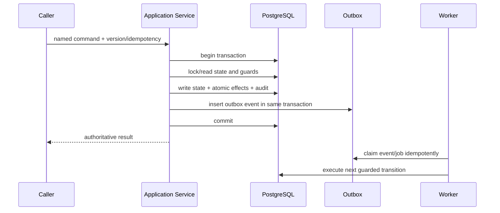
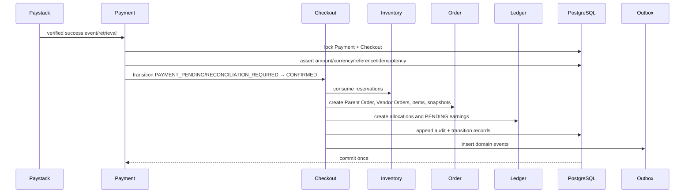
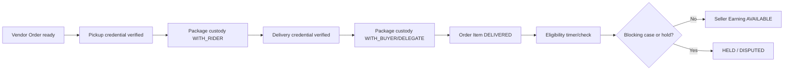
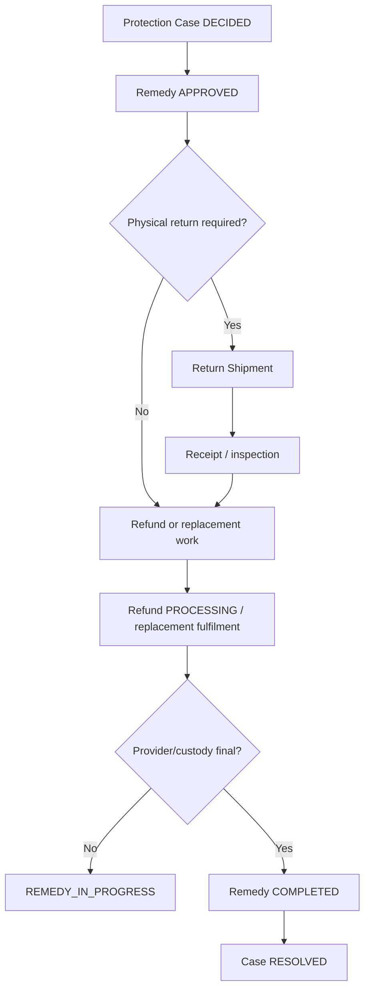

# Noma State Machines

> **Repository path:** `docs/08-state-machines.md`  
> **Status:** Binding Covenant pilot lifecycle and transition contract  
> **Version:** 1.0  
> **Effective date:** 30 July 2026  
> **Applies to:** Noma's two-month Covenant University pilot build  
> **Primary audience:** Founders, Product, Engineering, Codex, Quality Assurance, Operations, Support, Finance, Trust and Safety, Security, Data, and future contributors

---

## 1. Purpose

This document defines Noma's machine-readable lifecycle states, permitted transitions, authorised actors, business guards, deadlines, atomic and asynchronous side effects, reversals, compensating actions, idempotency, and concurrency rules for the controlled Covenant University pilot.

It translates:

- `docs/01-mvp-scope.md`;
- `docs/02-user-roles.md`;
- `docs/03-user-journeys.md`;
- `docs/04-information-architecture.md`;
- `docs/05-design-system.md`;
- `docs/06-technical-architecture.md`; and
- `docs/07-domain-model.md`

into one transition contract for APIs, workers, PostgreSQL transactions, queues, user interfaces, audit records, and tests.

The document prevents:

- generic `setStatus()` endpoints;
- provider completion inferred from browser callbacks;
- delivery completion without custody proof;
- direct administrative edits to money, custody, or enforcement truth;
- skipped lifecycle guards;
- silent concurrent overwrites;
- hardcoded deadlines scattered through code;
- queued work presented as completed;
- deletion-based reversals; and
- autonomous AI serious decisions.

A machine is complete only when current state, named command/event, actor, scope, expected version, guards, evidence, deadline, transaction, side effects, recovery, and resulting state are all explicit.

---

## 2. Authority

1. `docs/01-mvp-scope.md` controls what is active, progressive, manual, prohibited, or deferred.
2. `docs/02-user-roles.md` controls who may initiate, approve, execute, override, view, or export.
3. `docs/03-user-journeys.md` controls required sequence, exception paths, evidence, notification, and honest completion.
4. `docs/04-information-architecture.md` controls where states/actions are shown.
5. `docs/05-design-system.md` controls truthful human-facing state presentation.
6. `docs/06-technical-architecture.md` controls modules, transactions, providers, outbox, queues, and infrastructure.
7. `docs/07-domain-model.md` controls entities, constraints, append-only history, and authoritative records.
8. **This document controls final state vocabulary, transitions, actors, guards, deadlines, side effects, reversals, terminal meaning, and concurrency conflicts.**
9. Later integration, security, testing, backlog, and readiness documents may add implementation detail without weakening this contract.

A UI label, generated enum, provider SDK status, migration, queue retry, admin preference, or Codex prompt does not override this document.

---

## 3. Source-derived requirements and lifecycle decisions

### 3.1 Source-locked requirements

The prior contracts require:

- explicit lifecycle states for identity, seller, rider, listing, inventory, checkout, payment, order, fulfilment, delivery, returns, cases, refunds, earnings, payouts, enforcement, recalls, feature activation, and incidents;
- server-side state validation;
- provider-confirmed payment, refund, and payout truth;
- independent Vendor Orders and Fulfilment Groups inside one Parent Order;
- unaffected-order continuity during partial failure;
- lifecycle-based cancellation and item-level consequences;
- oversell-safe reservations;
- Noma-controlled custody and handoff evidence;
- targeted holds that do not imply guilt;
- human decisions for materially disputed, high-value, fraud, counterfeit, safety, permanent-enforcement, and complex-liability outcomes;
- append-only financial, provider, custody, case, and audit history;
- deadlines, queue owners, escalation, and honest uncertainty;
- transactional outbox and idempotent workers; and
- feature, capacity, cohort, and emergency-pause guards.

### 3.2 Decisions locked here

1. Every material aggregate uses a typed state and integer `version` or equivalent compare-and-swap token.
2. State commands use `expectedVersion`, unless a unique provider event/idempotency record gives equivalent protection.
3. Aggregate change, transition evidence, audit, and outbox event commit in one PostgreSQL transaction.
4. No provider/email/file/analytics network call occurs inside that transaction.
5. Provider finality and Noma workflow finality are separate.
6. Parent Order, balances, dashboards, queues, and search states remain derived projections where defined as projections.
7. Deadlines come from versioned configuration and are persisted as absolute instants.
8. Expiry workers re-read authoritative state/deadline and execute normal guarded commands.
9. There is no generic “reopen”; only named appeal, reconciliation, redelivery, correction, or successor flows.
10. Corrections use explicit reversals, compensating records, or successor aggregates.
11. Super Admin cannot bypass provider truth, append-only history, custody proof, maker-checker, or state guards.
12. AI may recommend or summarise but cannot execute serious final transitions.

---

## 4. Normative language

- **MUST / MUST NOT:** mandatory.
- **SHOULD / SHOULD NOT:** expected unless an approved reason exists.
- **MAY:** optional within scope.
- **STATE:** authoritative lifecycle position of one aggregate.
- **COMMAND:** explicit request to attempt a transition.
- **EVENT:** observed fact, including verified provider/internal event.
- **GUARD:** condition required before commit.
- **ATOMIC EFFECT:** database work that commits or rolls back with the transition.
- **ASYNC EFFECT:** outbox-driven work completed idempotently after commit.
- **TERMINAL:** no ordinary forward transition remains; history is retained.
- **REVERSAL:** explicit business action that negates or returns value without deleting history.
- **COMPENSATION:** new action used when a committed effect cannot be rolled back atomically.
- **DERIVED STATE:** rebuildable projection calculated from authoritative records.
- **UNCERTAIN STATE:** final truth is not established; fail safe and reconcile.
- **SYSTEM-ONLY:** no human may directly execute the transition.
- **DEADLINE:** persisted absolute instant calculated from a versioned rule.
- **NO-OP SUCCESS:** repeated idempotent command returns the already committed result.

---

# Part A — Global transition contract

## 5. Command envelope

Every protected command MUST resolve:

```ts
interface TransitionCommand<TPayload> {
  commandId: string;
  idempotencyKey?: string;
  aggregateId: string;
  expectedVersion?: number;
  actor: {
    userId?: string;
    servicePrincipalId?: string;
    sessionId?: string;
    institutionId?: string;
    sellerId?: string;
    capabilities: string[];
    assuranceLevel: string;
  };
  reasonCode?: string;
  policyVersion?: string;
  payload: TPayload;
  requestedAt: string;
}
```

The application service checks:

- active actor/session/service principal;
- capability and resource/institution scope;
- authoritative state/version;
- feature, cohort, category, value, seller, capacity, and emergency controls;
- restrictions and holds;
- required recent authentication and approvals;
- evidence and reason;
- deadline;
- idempotency;
- database invariants.

Clients submit named commands such as `acceptVendorOrder`, `confirmPickup`, or `approveRefund`. They never submit an arbitrary destination status.

## 6. Transition evidence

Every material successful transition records:

```text
transition_id
aggregate_type / aggregate_id
from_state / to_state
command_or_event
actor or service principal
institution/seller/resource scope
reason_code
policy/configuration version
evidence references
expected_version / resulting_version
idempotency key or provider event id
occurred_at
request/trace correlation
approval chain
```

Financial, custody, security, enforcement, role, feature, and emergency transitions are always audited.

## 7. Typed denial/conflict outcomes

| Code | Meaning | Expected handling |
|---|---|---|
| `NOT_AUTHENTICATED` | valid actor/session absent | authenticate |
| `NOT_AUTHORISED` | capability/scope absent | do not retry unchanged |
| `ASSURANCE_REQUIRED` | recent auth/MFA/approval needed | complete challenge |
| `INVALID_STATE` | command invalid from current state | refresh |
| `VERSION_CONFLICT` | another transition won | refresh and deliberately retry |
| `FEATURE_DISABLED` | feature not active | wait for activation |
| `CAPACITY_BLOCKED` | pilot capacity prevents action | retry only after capacity changes |
| `EMERGENCY_PAUSED` | stop-the-line control applies | wait for authorised restart |
| `DEADLINE_EXPIRED` | action window passed | use escalation/case path |
| `EVIDENCE_REQUIRED` | mandatory proof missing | provide evidence |
| `PROVIDER_UNCERTAIN` | provider truth unresolved | do not duplicate |
| `IDEMPOTENCY_CONFLICT` | same key, different fingerprint | investigate/new valid command |
| `DUPLICATE_NO_OP` | effect already committed | return existing result |
| `CONSTRAINT_CONFLICT` | database invariant would fail | refresh/investigate |

## 8. Atomic transition pattern



## 9. Concurrency rules

Material transitions use one or more of:

- optimistic version checks;
- row locks;
- atomic conditional updates;
- unique/partial unique constraints;
- serializable transactions where justified;
- deterministic lock order; and
- durable idempotency records.

Required protected races include:

- last-unit reservation;
- reservation conversion versus expiry;
- seller acceptance versus timeout;
- readiness versus cancellation;
- assignment acceptance by two riders;
- assignment cancellation versus pickup;
- duplicate pickup/handoff scans;
- failed handoff versus delivery completion;
- two case decisions;
- over-refund race;
- two withdrawals reserving the same earning;
- retry while payout outcome is unknown;
- activation versus suspension/stop-sale; and
- restart versus active incident.

## 10. Idempotency keys

```text
checkout.confirm:<checkout-id>:<key>
payment.event:<provider>:<event-id>
payment.verify:<payment-id>:<provider-reference>
order.cancel:<item-or-order-id>:<command-id>
refund.submit:<refund-id>
payout.approve:<withdrawal-id>:<approval-id>
payout.transfer:<payout-id>:<attempt-no>
delivery.assign:<job-id>:<command-id>
delivery.pickup:<assignment-id>:<client-command-id>
delivery.handoff:<credential-id>:<client-command-id>
case.decide:<case-id>:<decision-id>
restriction.apply:<case-id>:<action-id>
emergency.pause:<scope>:<incident-id>
```

Same key + different request fingerprint is rejected.

## 11. Deadline rules

Deadlines MUST:

- come from versioned configuration;
- be stored as `timestamptz`;
- identify responsible actor/queue and expiry/escalation command;
- be visible in the relevant surface;
- generate configured reminders/escalations;
- be rechecked under lock/version before expiry commits.

Exact durations belong in approved configuration and `docs/13-covenant-pilot-readiness.md`.

## 12. Side effects

Atomic effects include reservation changes, order/allocation creation, balanced ledger postings, holds, custody events, credential consumption, version increment, audit, and outbox insertion.

Async effects include notifications, provider submission, search/projection refresh, reminders, analytics, file processing, partner notification, and reconciliation.

Queued/submitted/processing never means completed.

## 13. Reversal and compensation

| Domain | Required correction |
|---|---|
| Payment | reconciliation, duplicate-charge refund, linked correction |
| Order | cancellation, replacement, recovery, successor fulfilment |
| Inventory | compensating movement/adjustment |
| Custody | new transfer/return event |
| Refund | failed/reversed/needs-attention attempt and safe retry |
| Ledger | balanced reversal/compensation |
| Payout | failure/reversal/unknown reconciliation |
| Case | appeal or successor decision |
| Enforcement | modification, expiry, lift, appeal correction |
| Review | hide/remove/restore action |
| Feature | pause, rollback, restart with evidence |

## 14. Derived-state rules

No generic command may set:

- Parent Order summary;
- seller balance;
- operational queue state;
- search availability;
- dashboard metrics;
- fulfilment risk;
- pilot scorecard.

Projections may lag; protected commands re-read PostgreSQL authority.

## 15. Truthful state presentation

| Internal state | Required human meaning |
|---|---|
| `PROCESSING` | accepted/in progress, not final |
| `REQUIRES_RECONCILIATION` | being checked; do not repeat |
| `READY_FOR_PICKUP` | ready, not collected |
| `PICKED_UP` | custody transferred |
| `DELIVERED` | authenticated handoff completed |
| `PROCESSED` refund | provider-confirmed refund |
| `TRANSFER_PROCESSING` | payout submitted, not paid |
| temporary restriction | safeguard under review, not final guilt |

A toast, colour, client cache, or browser callback is never sufficient evidence.


# Part B — Machine inventory

## 16. Authoritative machine registry

| ID | Machine | Owner | Boundary | State vocabulary |
|---|---|---|---|---|
| `M01` | `Account` | `Identity` | `Active` | `PENDING_EMAIL, ACTIVE, RECOVERY_LOCKED, COMPROMISED_LOCKED, SUSPENDED, DEACTIVATION_REQUESTED, DEACTIVATED` |
| `M02` | `Session` | `Identity/Security` | `Active` | `ACTIVE, STEP_UP_REQUIRED, REVOKED, EXPIRED` |
| `M03` | `Institution Membership` | `Institution` | `Active` | `DRAFT, PENDING_EMAIL, AUTO_REVIEW, MANUAL_REVIEW, MORE_INFORMATION_REQUIRED, VERIFIED, REVALIDATION_REQUIRED, EXPIRED, REJECTED, REVOKED` |
| `M04` | `Seller Application` | `Seller` | `Active` | `DRAFT, SUBMITTED, UNDER_REVIEW, MORE_INFORMATION_REQUIRED, APPROVED, REJECTED, WITHDRAWN` |
| `M05` | `Seller Activation` | `Seller` | `Active` | `NOT_READY, TRAINING_REQUIRED, READY_FOR_ACTIVATION, ACTIVE, PAUSED, SUSPENDED, CLOSING, CLOSED` |
| `M06` | `Rider Membership` | `Delivery/Access` | `Active` | `DRAFT, SUBMITTED, UNDER_REVIEW, APPROVED, ACTIVE, PAUSED, SUSPENDED, EXPIRED, REJECTED, WITHDRAWN` |
| `M07` | `Rider Shift` | `Delivery` | `Active` | `DRAFT, SCHEDULED, CHECKED_IN, AVAILABLE, BUSY, BREAK, CHECKED_OUT, CANCELLED, NO_SHOW` |
| `M08` | `Offer Publication` | `Offer/Catalogue` | `Active` | `DRAFT, SUBMITTED, UNDER_REVIEW, CHANGES_REQUIRED, APPROVED, ACTIVE, PAUSED, STOP_SALE, REJECTED, ARCHIVED` |
| `M09` | `Inventory Reservation` | `Inventory` | `Active` | `ACTIVE, CONVERTED, RELEASED, EXPIRED, CANCELLED` |
| `M10` | `Checkout Session` | `Checkout` | `Active` | `DRAFT, PRICED, RESERVED, PAYMENT_PENDING, CONFIRMED, EXPIRED, CANCELLED, RECONCILIATION_REQUIRED` |
| `M11` | `Payment` | `Payment` | `Active` | `CREATED, INITIALISATION_PENDING, AWAITING_CUSTOMER, PROCESSING, SUCCEEDED, FAILED, ABANDONED, EXPIRED, REQUIRES_RECONCILIATION` |
| `M12` | `Parent Order Summary` | `Order` | `Derived` | `PENDING, IN_PROGRESS, PARTIALLY_COMPLETED, COMPLETED, PARTIALLY_CANCELLED, CANCELLED, ATTENTION_REQUIRED` |
| `M13` | `Vendor Order` | `Order` | `Active` | `PENDING_ACCEPTANCE, ACCEPTED, PREPARING, READY_FOR_PICKUP, HANDED_TO_FULFILMENT, PARTIALLY_COMPLETED, COMPLETED, CANCELLATION_PENDING, CANCELLED, REJECTED, ATTENTION_REQUIRED` |
| `M14` | `Order Item Disposition` | `Order` | `Active` | `ALLOCATED, ACTIVE, CANCELLATION_REQUESTED, CANCELLED, FULFILLED, RETURN_PENDING, RETURNED, REPLACED, REFUNDED, CLOSED` |
| `M15` | `Substitution Proposal` | `Order/Messaging` | `Active` | `PROPOSED, AWAITING_BUYER, APPROVED, DECLINED, EXPIRED, WITHDRAWN, APPLIED, FAILED` |
| `M16` | `Fulfilment Group` | `Fulfilment` | `Active` | `PLANNED, AWAITING_READINESS, READY_FOR_DISPATCH, DISPATCHED, PARTIALLY_COMPLETED, COMPLETED, CANCELLED, EXCEPTION` |
| `M17` | `Delivery Job` | `Delivery` | `Active` | `DRAFT, AWAITING_FULFILMENT, READY_FOR_DISPATCH, UNASSIGNED, ASSIGNMENT_OFFERED, ASSIGNED, EN_ROUTE_TO_PICKUP, ARRIVED_AT_PICKUP, PICKED_UP, IN_TRANSIT, ARRIVED_AT_HANDOFF, DELIVERED, REASSIGNMENT_REQUIRED, PICKUP_FAILED, DELIVERY_ATTEMPTED, RETURN_TO_CONTROLLED_CUSTODY, CANCELLED, LOST_OR_DAMAGED, INCIDENT_REVIEW` |
| `M18` | `Delivery Assignment` | `Delivery` | `Active` | `OFFERED, ACCEPTED, DECLINED, ACTIVE, CANCELLED_BEFORE_PICKUP, TRANSFER_REQUIRED, TRANSFERRED, COMPLETED, EXPIRED` |
| `M19` | `Package Custody` | `Delivery/Fulfilment` | `Active` | `WITH_SELLER, READY_FOR_PICKUP, WITH_RIDER, IN_TRANSIT, DELIVERY_ATTEMPTED, RETURNING, AT_CONTROLLED_CUSTODY, DELIVERED, LOST_OR_DAMAGED, DISPOSED` |
| `M20` | `Handoff Credential` | `Delivery` | `Active` | `ISSUED, ACTIVE, CONSUMED, EXPIRED, REVOKED, LOCKED` |
| `M21` | `Protection Case` | `Protection` | `Active` | `DRAFT, SUBMITTED, TRIAGE, AWAITING_BUYER_EVIDENCE, AWAITING_SELLER_RESPONSE, UNDER_REVIEW, DECISION_PENDING_APPROVAL, DECIDED, REMEDY_IN_PROGRESS, RESOLVED, REJECTED, APPEALED, CLOSED` |
| `M22` | `Return Shipment` | `Protection/Fulfilment` | `Active` | `REQUESTED, APPROVED, COLLECTION_SCHEDULED, READY_FOR_RETURN, IN_RETURN_TRANSIT, RECEIVED, INSPECTION_REQUIRED, INSPECTION_COMPLETE, COMPLETED, CANCELLED, FAILED` |
| `M23` | `Remedy` | `Protection` | `Active` | `PROPOSED, APPROVED, IN_PROGRESS, COMPLETED, FAILED, CANCELLED, REVERSED` |
| `M24` | `Refund` | `Refund/Payment` | `Active` | `REQUESTED, APPROVED, PROVIDER_SUBMISSION_PENDING, PROCESSING, PROCESSED, FAILED, NEEDS_ATTENTION, CANCELLED, REVERSED` |
| `M25` | `Seller Earning` | `Ledger` | `Active` | `PENDING, AVAILABLE, PARTIALLY_HELD, HELD, RESERVED_FOR_PAYOUT, PARTIALLY_CONSUMED, CONSUMED, REVERSED, NEGATIVE_EXPOSURE` |
| `M26` | `Financial Hold` | `Ledger/Protection` | `Active` | `PROPOSED, ACTIVE, PARTIALLY_RELEASED, RELEASED, CONVERTED_TO_LIABILITY, EXPIRED` |
| `M27` | `Payout Account Change` | `Payout/Security` | `Active` | `DRAFT, RESOLUTION_PENDING, AWAITING_CONFIRMATION, SECURITY_REVIEW, COOLING, ACTIVE, REJECTED, REPLACED, REVOKED` |
| `M28` | `Withdrawal Request` | `Payout` | `Active` | `REQUESTED, UNDER_REVIEW, APPROVED, REJECTED, CANCELLED, TRANSFER_PENDING, TRANSFER_PROCESSING, PAID, FAILED, REVERSED, REQUIRES_RECONCILIATION` |
| `M29` | `Transfer Attempt` | `Payout` | `Active` | `CREATED, SUBMITTED, PROCESSING, SUCCEEDED, FAILED, REVERSED, UNKNOWN` |
| `M30` | `Verified-Purchase Review` | `Review` | `Active` | `ELIGIBLE, DRAFT, PUBLISHED, UNDER_REVIEW, HIDDEN_PENDING_REVIEW, REMOVED, RESTORED, WITHDRAWN` |
| `M31` | `Enforcement Case` | `Trust and Safety` | `Active` | `OPEN, TRIAGE, INVESTIGATING, TEMPORARY_SAFEGUARD, DECISION_PENDING_APPROVAL, ACTIONED, MONITORING, APPEALED, RESOLVED, CLOSED` |
| `M32` | `Seller Restriction` | `Seller/Trust and Safety` | `Active` | `PENDING, ACTIVE, EXPIRING, LIFTED, REPLACED, PERMANENT` |
| `M33` | `Appeal` | `Protection/Trust and Safety` | `Active` | `SUBMITTED, ELIGIBILITY_REVIEW, UNDER_REVIEW, MORE_INFORMATION_REQUIRED, UPHELD, MODIFIED, OVERTURNED, REINSTATED_WITH_CONDITIONS, REJECTED, CLOSED` |
| `M34` | `Recall/Safety Containment` | `Trust and Safety` | `Active` | `SIGNAL_RECEIVED, ASSESSING, CONTAINMENT_ACTIVE, SCOPE_CONFIRMED, CUSTOMER_REMEDY_ACTIVE, MONITORING, RESOLVED, CLOSED` |
| `M35` | `Food Vendor Order Extension` | `Food` | `Progressive` | `PENDING_ACCEPTANCE, ACCEPTED, PREPARATION_STARTED, READY, HANDED_TO_FULFILMENT, COMPLETED, REJECTED, CANCELLED, PERISHABLE_EXCEPTION` |
| `M36` | `External Inbound Shipment` | `Fulfilment` | `Progressive` | `PLANNED, AWAITING_VENDOR_DISPATCH, IN_EXTERNAL_TRANSIT, ARRIVED_AT_BOUNDARY, RECEIVING, RECEIVED, DISCREPANCY, REJECTED, CANCELLED` |
| `M37` | `FBN Inbound Shipment` | `FBN` | `Progressive` | `DRAFT, PLANNED, IN_TRANSIT, ARRIVED, RECEIVING, PARTIALLY_RECEIVED, RECEIVED, DISCREPANCY_REVIEW, CLOSED, CANCELLED` |
| `M38` | `Warehouse Task` | `FBN` | `Progressive` | `QUEUED, CLAIMED, IN_PROGRESS, BLOCKED, COMPLETED, FAILED, CANCELLED` |
| `M39` | `Quarantine` | `FBN/Trust and Safety` | `Progressive` | `ACTIVE, UNDER_REVIEW, RELEASE_APPROVED, DISPOSITION_APPROVED, RELEASED, DISPOSED, RETURNED_TO_SELLER` |
| `M40` | `Pre-Owned Verification` | `Offer/Trust and Safety` | `Progressive` | `NOT_VERIFIED, INSPECTION_REQUESTED, INSPECTION_SCHEDULED, INSPECTION_IN_PROGRESS, INSPECTED_PASSED, INSPECTED_FAILED, VERIFICATION_EXPIRED, REVOKED` |
| `M41` | `Feature Activation` | `Feature Control` | `Active` | `DISABLED, INTERNAL_TEST, INVITE_ONLY, LIMITED_PILOT, ACTIVE, PAUSED, RETIRED` |
| `M42` | `Emergency Incident/Pause` | `Feature Control/Security` | `Active` | `DETECTED, ASSESSING, CONTAINMENT_ACTIVE, PAUSED, RECOVERY_IN_PROGRESS, RESTART_PENDING_APPROVAL, RESTORED, POST_INCIDENT_REVIEW, CLOSED` |

## 17. Implementation categories

- **Active:** implemented for the founding pilot where its journey is active.
- **Progressive:** implemented/tested before first controlled activation; commands remain feature-gated.
- **Derived:** calculated from authoritative child records; never directly set.
- Terminal records remain retained. New appeals, reconciliations, reversals, or successor records may exist only where explicitly defined.


## 18. Transition service and machine definitions

Every material aggregate MUST expose transitions through its owning module's application service. The implementation SHOULD use a typed transition definition containing:

```ts
type TransitionDefinition<S, C> = {
  machine: string;
  command: string;
  from: readonly S[];
  to: S | ((context: C) => S);
  capability: string | "SYSTEM_ONLY";
  scope: (context: C) => AuthorizationScope;
  guard: (context: C) => Promise<GuardResult>;
  assurance?: "NORMAL" | "RECENT_AUTH" | "MFA";
  approvalPolicy?: ApprovalPolicy;
  transaction: (context: C) => Promise<TransitionResult>;
  audit: AuditDescriptor;
  outbox: readonly DomainEventDescriptor[];
  deadlinePolicy?: DeadlinePolicy;
};
```

The registry is executable policy, not a second unreviewed copy of business logic. A transition definition MUST be covered by tests and MUST reference:

- the aggregate and expected version;
- the permitted source state(s);
- the command/event identity;
- actor capability and resource scope;
- feature, capacity, risk, and emergency-pause guards;
- business preconditions;
- transaction and lock requirements;
- audit and outbox effects;
- timer/deadline behaviour; and
- the truthful user-visible result.

A generic `setStatus(entity, value)` service is prohibited.


## 19. State persistence and transition history

Material aggregates SHOULD persist:

```text
status
version
last_transition_at
last_transition_id
status_reason_code   # only where the reason is part of current workflow truth
```

Every material transition MUST also produce an append-only transition record or equivalent audit event containing:

```text
transition_id
machine
aggregate_type
aggregate_id
from_state
command_or_event
to_state
actor_type
actor_id_or_service
institution_id
resource_scope
reason_code
policy_version
request_or_job_id
idempotency_key
expected_version
resulting_version
occurred_at
```

Sensitive evidence, free-form notes, provider payloads, and private risk reasoning MUST remain in their owning records rather than being copied into status history.

Status fields are current-state projections. Transition and domain records preserve history.


## 20. Deadlines, timers, expiry, and overdue work

Deadlines MUST be persisted as absolute `timestamptz` values calculated from a versioned policy. They MUST NOT be reconstructed later from whatever policy happens to be current.

The timer workflow is:

```text
transition establishes deadline
        ↓
outbox event schedules deterministic job
        ↓
worker re-reads aggregate and expected deadline/version
        ↓
guard confirms deadline is still current and due
        ↓
expiry/escalation transition commits atomically
```

Rules:

- jobs are delivery mechanisms, not clock authority;
- a delayed job may still act only if the persisted deadline is due;
- an early job MUST no-op or reschedule;
- a stale timer MUST no-op safely;
- deadline extension creates a new transition/audit event;
- worker retries MUST use the same operation identity;
- overdue operational work may create or reprioritise a work-queue item;
- no timer may directly mark provider-confirmed money or custody as final; and
- policy configuration must define business-calendar handling where operating hours matter.

Exact Covenant pilot durations belong to versioned policy/configuration and Part 13 readiness evidence unless a source document already fixes them.


## 21. Concurrency conflict policy

Every protected transition MUST use one or more of:

1. optimistic `version` comparison;
2. row-level locking;
3. atomic conditional update;
4. unique constraint or partial unique index;
5. serializable transaction for a narrowly justified boundary; and
6. durable idempotency key.

Conflict behaviour:

| Situation | Required result |
|---|---|
| same command and same idempotency fingerprint | return original completed result |
| same key with a different fingerprint | reject as idempotency-key reuse |
| expected version is stale | `409 STATE_CONFLICT` with current safe summary |
| state already advanced compatibly | return current result where semantically idempotent |
| state advanced incompatibly | reject; do not overwrite |
| deadlock/serialization failure | bounded retry with jitter at application boundary |
| uncertain provider outcome | enter reconciliation; do not repeat value movement blindly |
| duplicate custody credential | reject as consumed/expired, never create second custody event |

The client must be able to refresh and continue from the authoritative state rather than restart a protected flow.


## 22. Side-effect ordering and failure boundaries

A transition transaction MAY contain only authoritative database work that must succeed or fail together.

Inside the transaction:

- validate actor and state again;
- lock or version-check the aggregate;
- write domain records;
- write transition/audit records;
- write ledger or inventory/custody records where applicable; and
- write outbox events.

Outside the transaction, Worker jobs MAY:

- call Paystack;
- send email, web push, or later SMS;
- update search/read projections;
- process files;
- call maps/route providers;
- update analytics; and
- create operational alerts.

A failed asynchronous side effect MUST NOT roll back an already committed business transition. It instead retries, enters dead-letter/exception handling, or creates a reconciliation work item. Notifications are not proof that a transition occurred.


## 23. Identity, access, and institution machines

### M01 — Account lifecycle

**Owner:** `Identity`

**States**

```text
PENDING_EMAIL → ACTIVE ↔ RECOVERY_LOCKED / COMPROMISED_LOCKED / SUSPENDED → DEACTIVATION_REQUESTED → DEACTIVATED
```

**Permitted transitions**

| From | Command / event | Actor | Guard | To | Required side effects |
|---|---|---|---|---|---|
| PENDING_EMAIL | verify_email | Account holder / Identity service | valid unconsumed verification token; account not blocked | ACTIVE | consume token; audit; revoke competing verification tokens; notify |
| ACTIVE | request_recovery | Account holder / Support-limited | recovery evidence accepted or challenge initiated | RECOVERY_LOCKED | revoke sensitive sessions; block payout-account changes; audit |
| ACTIVE | contain_compromise | Security service / Security Admin | credible compromise signal and scoped authority | COMPROMISED_LOCKED | revoke sessions; pause sensitive capabilities; incident link; notify safely |
| RECOVERY_LOCKED | complete_recovery | Identity service / authorised reviewer | required evidence and assurance satisfied | ACTIVE | rotate credentials; revoke old sessions; audit; security notice |
| COMPROMISED_LOCKED | restore_after_containment | Security Admin | incident containment complete; recovery approved | ACTIVE | new credentials/session; release scoped blocks; audit |
| ACTIVE | suspend_account | Trust and Safety Lead / system rule where expressly permitted | approved enforcement decision | SUSPENDED | apply restrictions; preserve active-order continuity; notify; audit |
| SUSPENDED | lift_suspension | authorised appeal/enforcement actor | restriction expired or decision reversed | ACTIVE | restore permitted capabilities; append correction; notify |
| ACTIVE | request_deactivation | Account holder | recent authentication; no prohibited unresolved operation | DEACTIVATION_REQUESTED | schedule privacy/retention workflow; notify |
| DEACTIVATION_REQUESTED | finalise_deactivation | Identity/Privacy worker | waiting period and retention guards pass | DEACTIVATED | revoke sessions; anonymise eligible data; retain required history |

**Deadlines and timers**

Verification, recovery, and deactivation tokens use persisted expiries. Deactivation may be paused by unresolved money, case, legal, or safety obligations.

**Concurrency and idempotency**

Email-token consumption is unique and atomic. Account suspension, compromise containment, and deactivation use aggregate version checks. Session revocation is idempotent.

**Reversal and correction**

Deactivation is not reversed by rewriting history; eligible restoration creates a new approved account-restoration transition where policy permits. Suspension corrections append.

**Additional rules**

Account state does not itself prove Covenant affiliation, seller approval, payout verification, rider approval, or trust.

### M02 — Session lifecycle

**Owner:** `Identity / Security`

**States**

```text
ACTIVE ↔ STEP_UP_REQUIRED → REVOKED / EXPIRED
```

**Permitted transitions**

| From | Command / event | Actor | Guard | To | Required side effects |
|---|---|---|---|---|---|
| ACTIVE | require_step_up | Policy enforcement service | requested action requires recent auth/MFA | STEP_UP_REQUIRED | persist challenge context; do not execute sensitive action |
| STEP_UP_REQUIRED | complete_step_up | Account holder / Identity service | challenge succeeds within expiry | ACTIVE | raise session assurance and recent-auth timestamp; audit |
| ACTIVE or STEP_UP_REQUIRED | revoke_session | Account holder / Security service / Access Admin | own session or authorised containment | REVOKED | invalidate server session; audit; notify where material |
| ACTIVE or STEP_UP_REQUIRED | expire_session | Identity worker | absolute or inactivity expiry reached | EXPIRED | invalidate session; no business-state side effect |

**Deadlines and timers**

Challenge, inactivity, and absolute-expiry instants are persisted. Privileged sessions SHOULD have shorter limits.

**Concurrency and idempotency**

Session lookup and revocation are authoritative server-side. A stale browser cookie cannot resurrect a revoked session.

**Reversal and correction**

A revoked or expired session is never reactivated. A new session is created after authentication.

### M03 — Institution membership verification

**Owner:** `Institution`

**States**

```text
DRAFT → PENDING_EMAIL → AUTO_REVIEW / MANUAL_REVIEW ↔ MORE_INFORMATION_REQUIRED → VERIFIED → REVALIDATION_REQUIRED / EXPIRED / REVOKED; review may REJECT
```

**Permitted transitions**

| From | Command / event | Actor | Guard | To | Required side effects |
|---|---|---|---|---|---|
| DRAFT | submit_affiliation | Account holder | institution active; required identity fields present | PENDING_EMAIL | create verification challenge; audit |
| PENDING_EMAIL | verify_institution_email | Account holder / Institution service | approved configured domain; valid token | AUTO_REVIEW | consume token; run format/duplicate/risk checks |
| AUTO_REVIEW | auto_approve | Institution verification service | all configured checks pass; no blocker | VERIFIED | grant scoped affiliation; outbox capability refresh; notify |
| AUTO_REVIEW | route_manual_review | Institution verification service | conflict, duplicate, unavailable source, or risk rule | MANUAL_REVIEW | create queue item and evidence request |
| MANUAL_REVIEW | request_more_information | Institution Verification Reviewer | proportionate missing evidence identified | MORE_INFORMATION_REQUIRED | set deadline; notify required evidence and privacy guidance |
| MORE_INFORMATION_REQUIRED | submit_information | Account holder | evidence uploaded securely before deadline | MANUAL_REVIEW | record evidence; return to queue |
| MANUAL_REVIEW | approve_membership | Institution Verification Reviewer | evidence supports affiliation; no duplicate conflict | VERIFIED | record method; capability refresh; audit |
| AUTO_REVIEW or MANUAL_REVIEW | reject_membership | service / Reviewer | defined rejection basis and appeal/retry rule | REJECTED | record reason; notify without leaking private risk |
| VERIFIED | require_revalidation | Institution service / authorised admin | session renewal, source change, incident, or policy trigger | REVALIDATION_REQUIRED | restrict affiliation-dependent capability as configured; notify |
| REVALIDATION_REQUIRED | reverify | Account holder / Reviewer / future provider | fresh evidence passes | VERIFIED | update verified_at/method; audit |
| VERIFIED or REVALIDATION_REQUIRED | expire_membership | Institution worker | persisted affiliation expiry reached | EXPIRED | disable campus checkout; preserve account/order history |
| VERIFIED | revoke_membership | Institution Admin / Security/Trust actor | authorised evidence of invalid affiliation or compromise | REVOKED | disable scoped capabilities; preserve active obligations; audit |

**Deadlines and timers**

Email challenge, evidence response, revalidation, and affiliation expiry use versioned institution policy.

**Concurrency and idempotency**

Only one active membership per constrained institution identifier. Duplicate claims enter review; no silent merge.

**Reversal and correction**

A mistaken rejection/revocation is corrected through an appeal/review transition that creates a new verified membership state and audit correction.


## 24. Seller and rider eligibility machines

### M04 — Seller application

**Owner:** `Seller`

**States**

```text
DRAFT → SUBMITTED → UNDER_REVIEW ↔ MORE_INFORMATION_REQUIRED → APPROVED / REJECTED; DRAFT/SUBMITTED may WITHDRAW
```

**Permitted transitions**

| From | Command / event | Actor | Guard | To | Required side effects |
|---|---|---|---|---|---|
| DRAFT | submit_application | Seller applicant | eligible account/affiliation; required agreements and fields complete | SUBMITTED | freeze submission snapshot; queue review; audit |
| SUBMITTED | start_review | Seller reviewer / worker assignment | reviewer capability and Covenant scope | UNDER_REVIEW | claim queue item; set review deadline |
| UNDER_REVIEW | request_more_information | Seller reviewer | specific missing/inconsistent requirement | MORE_INFORMATION_REQUIRED | persist request/deadline; notify applicant |
| MORE_INFORMATION_REQUIRED | submit_information | Seller applicant | requested evidence supplied before closure | UNDER_REVIEW | append evidence; restore queue |
| UNDER_REVIEW | approve_application | authorised Seller Operations reviewer | verification/category/policy checks pass | APPROVED | create/approve Seller entity and owner membership; activation remains separate |
| UNDER_REVIEW | reject_application | authorised reviewer | documented policy basis | REJECTED | record appeal/reapply rule; notify |
| DRAFT or SUBMITTED | withdraw_application | Seller applicant | no irreversible activation action | WITHDRAWN | close work item; retain audit/evidence per policy |

**Deadlines and timers**

Information requests and review targets are persisted and queue-visible. Expiry may close an abandoned application through an explicit worker transition.

**Concurrency and idempotency**

One current application per applicant/seller type where constrained. Reviewer claims use leases; approval is version-checked.

**Reversal and correction**

Approval is not undone by editing the application. Seller activation/suspension handles later eligibility. A successful appeal creates a new decision event.

### M05 — Seller activation and continuity

**Owner:** `Seller`

**States**

```text
NOT_READY → TRAINING_REQUIRED → READY_FOR_ACTIVATION → ACTIVE ↔ PAUSED / SUSPENDED → CLOSING → CLOSED
```

**Permitted transitions**

| From | Command / event | Actor | Guard | To | Required side effects |
|---|---|---|---|---|---|
| NOT_READY | require_training | Seller Operations | application approved but operational gates incomplete | TRAINING_REQUIRED | publish checklist; create training tasks |
| TRAINING_REQUIRED | confirm_readiness | Seller Operations | payout, catalogue, training, operating contact and test order gates pass | READY_FOR_ACTIVATION | record evidence and approver |
| READY_FOR_ACTIVATION | activate_seller | authorised Seller Operations / Institution Admin within gate | feature/capacity/pilot cohort active; no restriction | ACTIVE | enable approved selling capabilities; notify; audit |
| ACTIVE | pause_seller | Seller Owner / Operations / system safety rule | scope/reason permits pause | PAUSED | stop new orders/offers as configured; continue existing obligations |
| PAUSED | resume_seller | Seller Owner or authorised Operations | pause reason cleared; gates still pass | ACTIVE | restore eligible capabilities; audit |
| ACTIVE or PAUSED | suspend_seller | Trust and Safety Lead / authorised enforcement | approved temporary/permanent restriction | SUSPENDED | block new commerce; apply payout safeguards if separately approved; continuity plan |
| SUSPENDED | reinstate_seller | authorised appeal/enforcement actor | appeal/expiry/corrective conditions pass | ACTIVE or PAUSED | reverse connected restrictions/metrics through explicit records |
| ACTIVE or PAUSED | begin_closure | Seller Owner / Operations | closure authorised; no new orders | CLOSING | disable publication/new orders; settle active obligations |
| CLOSING | complete_closure | Seller service | orders, cases, payouts, returns and retention guards resolved | CLOSED | revoke seller memberships as appropriate; retain history |

**Deadlines and timers**

Corrective-action, suspension-review, and closure deadlines are policy-versioned.

**Concurrency and idempotency**

Activation, pause, suspension and closure use seller version checks and active-restriction queries in the same transaction.

**Reversal and correction**

Suspension/pauses are lifted through new transitions. Closed sellers are not silently reactivated; reopening requires an approved successor activation workflow.

**Additional rules**

Existing paid orders, returns, disputes, recalls and legitimate earnings remain operationally accessible after pause/suspension under restricted continuity views.

### M06 — Rider membership

**Owner:** `Delivery / Access`

**States**

```text
DRAFT → SUBMITTED → UNDER_REVIEW → APPROVED → ACTIVE ↔ PAUSED / SUSPENDED → EXPIRED / REVOKED; review may REJECT
```

**Permitted transitions**

| From | Command / event | Actor | Guard | To | Required side effects |
|---|---|---|---|---|---|
| DRAFT | submit_rider_application | Account holder | required affiliation, identity, safety and schedule fields | SUBMITTED | queue review; audit |
| SUBMITTED | start_rider_review | Rider/Operations reviewer | scoped capability | UNDER_REVIEW | claim work item |
| UNDER_REVIEW | approve_rider | authorised reviewer | eligibility/training/device requirements pass | APPROVED | create rider membership; no assignment until active |
| UNDER_REVIEW | reject_rider | authorised reviewer | documented basis | REJECTED | notify and preserve appeal rule |
| APPROVED | activate_rider | Dispatch/Operations | shift/capacity and feature gate permit | ACTIVE | allow availability/assignment actions |
| ACTIVE | pause_rider | Rider / Dispatcher / Operations | not currently in unresolved custody, or controlled handoff arranged | PAUSED | stop new assignments |
| PAUSED | resume_rider | Rider / Dispatcher | eligibility active and no block | ACTIVE | refresh availability |
| ACTIVE or PAUSED | suspend_rider | Operations/Trust and Safety | approved safety/performance action | SUSPENDED | stop offers; safely reassign jobs; preserve custody |
| ACTIVE or PAUSED | expire_membership | Access worker | membership/eligibility expiry reached | EXPIRED | stop new shifts and assignments |
| ACTIVE or PAUSED | revoke_membership | Security/Operations authority | fraud, compromise, or permanent ineligibility | REVOKED | revoke access; containment workflow |

**Deadlines and timers**

Training, membership, document and shift eligibility expiries are persisted.

**Concurrency and idempotency**

A rider cannot be paused/revoked in a way that abandons current custody; transition must coordinate Delivery Assignment and Package Custody.

**Reversal and correction**

Reinstatement after suspension/expiry creates a reviewed activation transition. Revocation is not overwritten.

### M07 — Rider shift

**Owner:** `Delivery`

**States**

```text
SCHEDULED → CHECK_IN_REQUIRED → ACTIVE ↔ PAUSED → COMPLETED; may MISSED / CANCELLED / TERMINATED
```

**Permitted transitions**

| From | Command / event | Actor | Guard | To | Required side effects |
|---|---|---|---|---|---|
| SCHEDULED | open_check_in | Shift worker | check-in window reached | CHECK_IN_REQUIRED | notify rider; set deadline |
| CHECK_IN_REQUIRED | check_in | Rider | active membership; approved device/session; within window | ACTIVE | mark availability; audit |
| CHECK_IN_REQUIRED | mark_missed | Shift worker / Dispatcher | deadline elapsed with no valid check-in | MISSED | remove capacity; notify/metric |
| ACTIVE | pause_shift | Rider / Dispatcher | no unsafe effect on current assignment | PAUSED | stop new offers |
| PAUSED | resume_shift | Rider / Dispatcher | capacity and membership pass | ACTIVE | restore assignment eligibility |
| ACTIVE or PAUSED | complete_shift | Rider / Dispatcher / worker | no active custody or unresolved assignment | COMPLETED | close availability; calculate operational metrics |
| SCHEDULED or CHECK_IN_REQUIRED | cancel_shift | Rider / Dispatcher | cancellation policy permits | CANCELLED | release capacity; record reason |
| ACTIVE or PAUSED | terminate_shift | Operations/Security | safety/security incident | TERMINATED | stop offers; controlled reassignment/custody containment |

**Deadlines and timers**

Check-in window, shift start/end and pause limits are absolute instants.

**Concurrency and idempotency**

Assignment creation atomically validates ACTIVE shift and rider capacity. Completion cannot race with assignment acceptance.

**Reversal and correction**

Completed, missed, cancelled and terminated shifts are terminal; schedule correction creates a successor shift.


## 25. Catalogue, inventory, checkout, and payment machines

### M08 — Offer publication

**Owner:** `Offer / Catalogue`

**States**

```text
DRAFT → VALIDATION_FAILED / SUBMITTED → UNDER_REVIEW → ACTIVE ↔ PAUSED / CORRECTION_REQUIRED → ARCHIVED; review may REJECT
```

**Permitted transitions**

| From | Command / event | Actor | Guard | To | Required side effects |
|---|---|---|---|---|---|
| DRAFT | submit_offer | Seller representative | seller active; type/category enabled; required fields/media/stock rules pass | SUBMITTED | freeze review snapshot; run validation/moderation |
| SUBMITTED | validation_failed | Offer service | deterministic validation fails | VALIDATION_FAILED | return field-level reasons; no publication |
| SUBMITTED | route_review | Offer/Catalogue service | review required by category/risk/pre-owned rule | UNDER_REVIEW | queue item; preserve submitted version |
| SUBMITTED | activate_low_risk_offer | Offer service | auto-publication policy passes | ACTIVE | index via outbox; audit |
| UNDER_REVIEW | approve_offer | Catalogue Operator | listing/policy requirements satisfied | ACTIVE | publish approved version; index |
| UNDER_REVIEW | reject_offer | Catalogue Operator | documented policy basis | REJECTED | notify seller; preserve appeal/correction path |
| ACTIVE | pause_offer | Seller / Catalogue / Trust actor | stock, seller, policy, safety or voluntary reason | PAUSED | remove purchase eligibility; update index |
| ACTIVE or PAUSED | require_correction | Catalogue Operator / rule | material listing deficiency | CORRECTION_REQUIRED | hide/block purchase as configured; request fields |
| CORRECTION_REQUIRED | resubmit_correction | Seller representative | new version addresses requirements | UNDER_REVIEW | version snapshot; queue |
| ACTIVE or PAUSED | archive_offer | Seller / Offer service | no active reservation/order conflict requiring continuity | ARCHIVED | remove from discovery; retain order snapshots |

**Deadlines and timers**

Review and correction deadlines use queue policy. Availability may expire separately through inventory/operating-hours rules.

**Concurrency and idempotency**

Offer versions are immutable after order snapshot. Update requires expected version. Only one current publishable version per offer.

**Reversal and correction**

Historical versions are never rewritten. A rejected/archived offer may create a new submitted version where policy permits.

### M09 — Inventory reservation

**Owner:** `Inventory`

**States**

```text
ACTIVE → CONSUMED / RELEASED / EXPIRED / CANCELLED
```

**Permitted transitions**

| From | Command / event | Actor | Guard | To | Required side effects |
|---|---|---|---|---|---|
| ACTIVE | consume_reservation | Order service through Inventory command | verified payment/order confirmation; quantity still reserved | CONSUMED | convert reserved quantity to committed/sold movement |
| ACTIVE | release_reservation | Checkout/Operations service | checkout cancelled/failed or item removed | RELEASED | return quantity to available through movement/projection |
| ACTIVE | expire_reservation | Inventory worker | persisted expiry due; not consumed | EXPIRED | release quantity; outbox availability update |
| ACTIVE | cancel_reservation | authorised corrective workflow | reservation invalidated before confirmation | CANCELLED | compensating inventory movement; audit |

**Deadlines and timers**

Every ACTIVE reservation has `expires_at`; expiry job is deterministic and idempotent.

**Concurrency and idempotency**

Creation is an atomic available-quantity check plus reservation insert. Unique checkout/item identity prevents duplicates. Consume/release use row lock or conditional update.

**Reversal and correction**

Consumed reservation is not reopened. Order cancellation/return creates separate inventory movements and, where applicable, a new stock disposition.

### M10 — Checkout session

**Owner:** `Checkout`

**States**

```text
DRAFT → PRICED → RESERVED → PAYMENT_PENDING → CONFIRMED; may EXPIRED / CANCELLED / RECONCILIATION_REQUIRED
```

**Permitted transitions**

| From | Command / event | Actor | Guard | To | Required side effects |
|---|---|---|---|---|---|
| DRAFT | price_checkout | Buyer | cart valid; institution and feature gates pass | PRICED | snapshot price, delivery, policy and funding rules |
| PRICED | reserve_inventory | Buyer / Checkout service | quote current; stock/offer eligible | RESERVED | create atomic reservations and checkout snapshot |
| RESERVED | initialise_payment | Buyer | identity/affiliation/value/risk checks pass | PAYMENT_PENDING | create Payment; set reservation/payment deadline |
| PAYMENT_PENDING | confirm_verified_payment | Payment service SYSTEM_ONLY | Payment SUCCEEDED; exact amount/currency; idempotency passes | CONFIRMED | atomically create Parent/Vendor Orders, allocations, pending earnings, fulfilment work, audits, outbox |
| PAYMENT_PENDING | mark_uncertain | Payment/Checkout service | provider result cannot be established safely | RECONCILIATION_REQUIRED | extend/protect reservation as policy permits; queue reconciliation; tell buyer not to retry |
| DRAFT or PRICED or RESERVED | cancel_checkout | Buyer / Checkout service | no confirmed payment | CANCELLED | release reservations; expire quote |
| DRAFT or PRICED or RESERVED or PAYMENT_PENDING | expire_checkout | Checkout worker | persisted deadline due and no verified success | EXPIRED | release or reconcile reservations according to payment state |
| RECONCILIATION_REQUIRED | resolve_paid | Finance/Payment reconciliation SYSTEM_ONLY | provider truth proves payment success | CONFIRMED | same atomic order-confirmation transaction |
| RECONCILIATION_REQUIRED | resolve_unpaid | Finance/Payment reconciliation SYSTEM_ONLY | provider truth proves no payment | CANCELLED | release reservations; notify |

**Deadlines and timers**

Price validity, reservation expiry, and payment resolution deadlines are persisted separately.

**Concurrency and idempotency**

Confirmation locks checkout/payment/reservations and uses a unique confirmed order relation. Browser callback and webhook may race safely through one idempotent confirmation command.

**Reversal and correction**

CONFIRMED is terminal for the checkout. Later cancellation/refund operates on Order/Item/Refund machines.

### M11 — Buyer payment

**Owner:** `Payment`

**States**

```text
CREATED → INITIALISATION_PENDING → AWAITING_CUSTOMER → PROCESSING → SUCCEEDED / FAILED / ABANDONED / EXPIRED / REQUIRES_RECONCILIATION
```

**Permitted transitions**

| From | Command / event | Actor | Guard | To | Required side effects |
|---|---|---|---|---|---|
| CREATED | request_initialisation | Checkout service | expected amount/currency/reference frozen | INITIALISATION_PENDING | outbox provider-init job |
| INITIALISATION_PENDING | provider_initialised | Payment worker | provider returns valid authorisation details | AWAITING_CUSTOMER | store attempt/reference; notify client through safe retrieval |
| INITIALISATION_PENDING | initialisation_failed | Payment worker | provider rejects definitively | FAILED | record attempt; release/retain reservation by policy |
| AWAITING_CUSTOMER | provider_processing | verified provider event/retrieval | reference matches | PROCESSING | record event; no order confirmation yet |
| AWAITING_CUSTOMER or PROCESSING | provider_success | Payment service SYSTEM_ONLY | signature/source verified; amount/currency/reference exact; event idempotent | SUCCEEDED | create verification record; trigger checkout confirmation via outbox/application command |
| AWAITING_CUSTOMER or PROCESSING | provider_failure | Payment service SYSTEM_ONLY | provider final failure verified | FAILED | record final event; notify; checkout may cancel |
| AWAITING_CUSTOMER | mark_abandoned | Payment worker | customer window elapsed and provider confirms no success | ABANDONED | close attempt; release as policy |
| AWAITING_CUSTOMER or PROCESSING | mark_expired | Payment worker | provider/reference expiry and no success | EXPIRED | close attempt; release/reconcile |
| INITIALISATION_PENDING or AWAITING_CUSTOMER or PROCESSING | require_reconciliation | Payment service | timeout, conflicting events, amount mismatch, unknown response, or provider ambiguity | REQUIRES_RECONCILIATION | freeze fulfilment; queue Finance; alert |
| REQUIRES_RECONCILIATION | reconcile_success | Payment reconciliation SYSTEM_ONLY | fresh provider verification proves exact success | SUCCEEDED | append verification; confirm checkout idempotently |
| REQUIRES_RECONCILIATION | reconcile_failure | Payment reconciliation SYSTEM_ONLY | provider proves failure/no charge | FAILED | close exception; release checkout |

**Deadlines and timers**

Provider/session expiries and reconciliation SLA are persisted. Timer alone cannot set SUCCEEDED.

**Concurrency and idempotency**

Unique provider reference/event ID, durable idempotency, and payment version protect races. Same provider event may be delivered repeatedly.

**Reversal and correction**

SUCCEEDED is never rewritten to failed. Duplicate/incorrect charge is corrected through Refund and Ledger. Chargeback/provider reversal is a separate financial event/case.

**Additional rules**

Only verified server-side provider truth can enter SUCCEEDED. A redirect, screenshot, email, staff assertion, or analytics event cannot.


## 26. Order, item, substitution, and fulfilment machines

### M12 — Parent Order summary (derived)

**Owner:** `Order`

**States**

```text
AWAITING_CONFIRMATIONS, IN_PROGRESS, PARTIALLY_CANCELLED, PARTIALLY_FULFILLED, COMPLETED, CANCELLED, ATTENTION_REQUIRED
```

**Permitted transitions**

| From | Command / event | Actor | Guard | To | Required side effects |
|---|---|---|---|---|---|
| derived | recalculate_summary | Order projection service SYSTEM_ONLY | child Vendor Orders/Items/Fulfilments changed | derived | update rebuildable summary and buyer timeline; no business command authority |

**Concurrency and idempotency**

Projection updates use event version/sequence and may be rebuilt. Buyer-facing protected actions re-read child authority.

**Reversal and correction**

Summary changes when child records change; history remains in child transitions and timeline events.

**Additional rules**

There is no API or admin control that directly sets Parent Order summary. `COMPLETED` requires every item to have a terminal fulfilled/cancelled/remedied disposition and no blocking unresolved operational state.

### M13 — Vendor Order

**Owner:** `Order`

**States**

```text
PENDING_ACCEPTANCE → ACCEPTED → PREPARING → READY_FOR_PICKUP → HANDED_TO_FULFILMENT → PARTIALLY_COMPLETED / COMPLETED; exceptions: CANCELLATION_PENDING, CANCELLED, REJECTED, ATTENTION_REQUIRED
```

**Permitted transitions**

| From | Command / event | Actor | Guard | To | Required side effects |
|---|---|---|---|---|---|
| PENDING_ACCEPTANCE | accept_vendor_order | Seller representative / auto-confirm rule | seller active for continuity; stock/terms valid; before deadline | ACCEPTED | record acceptance; create preparation deadline; notify |
| PENDING_ACCEPTANCE | reject_vendor_order | Seller representative / timeout rule | permitted reason; before custody | REJECTED | cancel affected items; reverse pending earning; refund/recovery orchestration |
| PENDING_ACCEPTANCE | acceptance_timeout | Order worker | deadline due and no valid acceptance | REJECTED or ATTENTION_REQUIRED | apply seller consequence; start buyer recovery/refund |
| ACCEPTED | start_preparation | Seller representative | required confirmation complete | PREPARING | record start; update promise risk |
| PREPARING | mark_ready | Seller representative | all ready quantities packaged/evidence complete | READY_FOR_PICKUP | create/activate fulfilment pickup work; notify dispatch |
| READY_FOR_PICKUP | confirm_handoff_to_fulfilment | Fulfilment service SYSTEM_ONLY | package credential and custody transfer verified | HANDED_TO_FULFILMENT | custody event; seller no longer controls parcel |
| HANDED_TO_FULFILMENT | derive_partial_completion | Order service SYSTEM_ONLY | some items delivered/terminal, others unresolved | PARTIALLY_COMPLETED | update earnings/notifications per items |
| HANDED_TO_FULFILMENT or PARTIALLY_COMPLETED | derive_completion | Order service SYSTEM_ONLY | all items terminal fulfilled/remedied/cancelled | COMPLETED | close seller operational work; start earning eligibility checks |
| PENDING_ACCEPTANCE or ACCEPTED or PREPARING or READY_FOR_PICKUP | request_cancellation | Buyer/Seller/Operations according to lifecycle | cancellation eligibility and cost policy | CANCELLATION_PENDING | lock affected quantity; evaluate consequences |
| CANCELLATION_PENDING | approve_cancellation | Order/Operations service | policy/approval passes and custody not transferred | CANCELLED | cancel items; inventory/ledger/refund/fulfilment effects |
| CANCELLATION_PENDING | deny_cancellation | Order/Operations service | ineligible or already in custody | previous valid state | record reason and notify |
| any nonterminal | raise_attention | system/Operations | material conflict, delay, stock or evidence exception | ATTENTION_REQUIRED | queue owner/deadline; preserve prior operational context |

**Deadlines and timers**

Acceptance, preparation, pickup-readiness and exception deadlines are frozen from policy/promise versions.

**Concurrency and idempotency**

Seller actions use Vendor Order version. Cancellation and pickup lock affected order/package records so custody cannot race cancellation.

**Reversal and correction**

Completion is not undone by editing status. Wrong delivery/damage creates Protection/Return/Remedy. Cancellation corrections append financial/inventory effects.

### M14 — Order Item disposition

**Owner:** `Order`

**States**

```text
CONFIRMED → ALLOCATED → PREPARING → FULFILMENT_READY → IN_CUSTODY → DELIVERED; alternatives CANCELLED, RETURN_REQUESTED, RETURNED, REPLACEMENT_PENDING, REPLACED, REFUNDED, CLOSED
```

**Permitted transitions**

| From | Command / event | Actor | Guard | To | Required side effects |
|---|---|---|---|---|---|
| CONFIRMED | allocate_item | Order/Fulfilment service | valid Vendor Order and fulfilment source | ALLOCATED | link quantity to fulfilment; preserve snapshot |
| ALLOCATED | begin_item_preparation | Seller/FBN service | source authorised | PREPARING | record source work |
| PREPARING | mark_item_ready | Seller/FBN service | required quantity/package evidence complete | FULFILMENT_READY | make available for package pickup |
| FULFILMENT_READY | confirm_item_custody | Fulfilment/Delivery SYSTEM_ONLY | package custody transfer verified | IN_CUSTODY | append custody relation/event |
| IN_CUSTODY | confirm_item_delivery | Delivery SYSTEM_ONLY | valid handoff credential and package/item mapping | DELIVERED | complete quantity; trigger earning/protection timelines |
| CONFIRMED or ALLOCATED or PREPARING or FULFILMENT_READY | cancel_item | Order service | lifecycle cancellation approved; no incompatible custody | CANCELLED | reverse allocations/earning; inventory/refund effects |
| DELIVERED | open_return_request | Buyer/Support | eligible case opened within policy | RETURN_REQUESTED | create Protection Case; possible hold |
| RETURN_REQUESTED | confirm_return_received | Return/Fulfilment SYSTEM_ONLY | same unit/quantity custody received | RETURNED | inspection/remedy workflow |
| DELIVERED or RETURNED | approve_replacement | Protection/Remedy service | decision approved and stock available | REPLACEMENT_PENDING | create linked replacement item/fulfilment |
| REPLACEMENT_PENDING | confirm_replacement_delivery | Delivery/Order SYSTEM_ONLY | replacement item delivered | REPLACED | close remedy or continue case |
| CANCELLED or DELIVERED or RETURNED or REPLACED | confirm_refund_effect | Refund/Ledger SYSTEM_ONLY | provider refund processed and item allocation linked | REFUNDED | update buyer timeline; preserve prior disposition history |
| terminal applicable | close_item | Order/Protection service | all remedies/cases/financial effects settled | CLOSED | close operational work |

**Concurrency and idempotency**

Quantity-level transitions prevent one partial cancellation or return from overwriting another. Unit-specific items require exact inventory-unit identity.

**Reversal and correction**

Use successor replacement, redelivery, refund, or compensating inventory/ledger records. Purchased snapshot never changes.

### M15 — Substitution proposal

**Owner:** `Order / Messaging`

**States**

```text
PROPOSED → BUYER_ACTION_REQUIRED → ACCEPTED / DECLINED / EXPIRED / WITHDRAWN → APPLIED
```

**Permitted transitions**

| From | Command / event | Actor | Guard | To | Required side effects |
|---|---|---|---|---|---|
| PROPOSED | send_for_buyer_decision | Seller / Operations | approved substitute, price/condition/availability snapshot | BUYER_ACTION_REQUIRED | notify buyer; pause affected preparation as needed |
| BUYER_ACTION_REQUIRED | accept_substitution | Buyer | own order; proposal current; within deadline | ACCEPTED | record explicit consent; reprice/refund delta workflow |
| BUYER_ACTION_REQUIRED | decline_substitution | Buyer | own order | DECLINED | cancel/recover original item per policy |
| BUYER_ACTION_REQUIRED | expire_proposal | Order worker | decision deadline due | EXPIRED | apply configured no-response outcome; notify |
| PROPOSED or BUYER_ACTION_REQUIRED | withdraw_proposal | Seller/Operations | not yet accepted/applied | WITHDRAWN | release substitute reservation |
| ACCEPTED | apply_substitution | Order service SYSTEM_ONLY | financial and inventory guards pass | APPLIED | replace item allocation through linked records; preserve original snapshot/proposal |

**Deadlines and timers**

Buyer-decision deadline must be visible and persisted.

**Concurrency and idempotency**

Acceptance uses proposal version and locks substitute stock. An accepted proposal cannot race withdrawal.

**Reversal and correction**

APPLIED substitution is not erased. Later problem uses normal case/remedy; pricing corrections use refund/ledger.

### M16 — Fulfilment Group

**Owner:** `Fulfilment`

**States**

```text
PLANNED → AWAITING_ITEMS → READY_TO_PACK / READY_FOR_PICKUP → PACKED → HANDED_OVER → IN_PROGRESS → COMPLETED; may SPLIT, CANCELLED, ATTENTION_REQUIRED
```

**Permitted transitions**

| From | Command / event | Actor | Guard | To | Required side effects |
|---|---|---|---|---|---|
| PLANNED | activate_group | Fulfilment service | items/source/promise valid | AWAITING_ITEMS | create source tasks |
| AWAITING_ITEMS | items_ready | Seller/FBN system events | all required quantities ready or approved partial rule | READY_TO_PACK or READY_FOR_PICKUP | queue packing/dispatch |
| READY_TO_PACK | pack_group | Seller/FBN operator | package contents/evidence complete | PACKED | create package identity/QR |
| READY_FOR_PICKUP or PACKED | handover_group | Delivery/Fulfilment SYSTEM_ONLY | pickup credential/custody event verified | HANDED_OVER | activate Delivery Job movement |
| HANDED_OVER | start_movement | Delivery service | assigned carrier/rider in custody | IN_PROGRESS | buyer tracking update |
| IN_PROGRESS | complete_group | Fulfilment service SYSTEM_ONLY | all packages delivered or terminally disposed | COMPLETED | derive item/vendor order states |
| AWAITING_ITEMS or READY_TO_PACK or READY_FOR_PICKUP | split_group | Operations/Fulfilment | approved reason; promises/allocations recalculated | SPLIT | create successor groups and item mappings; cancel source group |
| pre-handover nonterminal | cancel_group | Order/Fulfilment | all linked quantities cancelled and no custody | CANCELLED | close tasks; release dispatch |
| any nonterminal | mark_attention | system/Operations | delay, mismatch, missing item, package or custody exception | ATTENTION_REQUIRED | queue intervention and deadline |

**Concurrency and idempotency**

Item-to-fulfilment quantity mapping is locked during split/handover. A package cannot belong to two active groups.

**Reversal and correction**

After handover, changes require custody-aware successor fulfilment or return; no in-place split that hides custody.


## 27. Delivery, assignment, custody, and handoff machines

### M17 — Delivery Job

**Owner:** `Delivery`

**States**

```text
DRAFT → AWAITING_FULFILMENT → READY_FOR_DISPATCH → UNASSIGNED → ASSIGNMENT_OFFERED → ASSIGNED → EN_ROUTE_TO_PICKUP → ARRIVED_AT_PICKUP → PICKED_UP → IN_TRANSIT → ARRIVED_AT_HANDOFF → DELIVERED; exception states REASSIGNMENT_REQUIRED, PICKUP_FAILED, DELIVERY_ATTEMPTED, RETURN_TO_CONTROLLED_CUSTODY, CANCELLED, LOST_OR_DAMAGED, INCIDENT_REVIEW
```

**Permitted transitions**

| From | Command / event | Actor | Guard | To | Required side effects |
|---|---|---|---|---|---|
| DRAFT | activate_delivery_job | Fulfilment service | approved locations, tier, promise and package links | AWAITING_FULFILMENT | set readiness/promise data |
| AWAITING_FULFILMENT | mark_ready_for_dispatch | Fulfilment SYSTEM_ONLY | required package/group ready | READY_FOR_DISPATCH | publish dispatch work |
| READY_FOR_DISPATCH | open_assignment | Dispatch service | carrier/rider eligibility and capacity available | UNASSIGNED | queue dispatch recommendation |
| UNASSIGNED | offer_assignment | Dispatch Operator / rules service | eligible rider/carrier, shift, capacity, tier | ASSIGNMENT_OFFERED | create Delivery Assignment with acceptance deadline |
| ASSIGNMENT_OFFERED | assignment_accepted | Rider/partner dispatcher | current offer, active membership/shift, capacity | ASSIGNED | reserve rider capacity; notify parties |
| ASSIGNED | start_to_pickup | Rider | assignment current; no security block | EN_ROUTE_TO_PICKUP | record server event |
| EN_ROUTE_TO_PICKUP | arrive_pickup | Rider | approved pickup point and assignment | ARRIVED_AT_PICKUP | start waiting timer |
| ARRIVED_AT_PICKUP | confirm_pickup | Delivery SYSTEM_ONLY | valid parcel QR, seller/FBN handoff and package identity | PICKED_UP | append custody transfer; consume pickup credential |
| PICKED_UP | depart_pickup | Rider | custody active | IN_TRANSIT | tracking/timeline update |
| IN_TRANSIT | arrive_handoff | Rider | approved handoff point; assignment current | ARRIVED_AT_HANDOFF | start handoff/wait timer |
| ARRIVED_AT_HANDOFF | confirm_delivery | Delivery SYSTEM_ONLY | valid one-time buyer/delegate PIN/QR; package match; evidence complete | DELIVERED | append custody event; consume credential; trigger item completion/earning eligibility |
| ASSIGNMENT_OFFERED or ASSIGNED or EN_ROUTE_TO_PICKUP | require_reassignment | Rider/Dispatcher/system | decline, unavailability, delay or safety reason before custody | REASSIGNMENT_REQUIRED | close current assignment; reopen dispatch |
| ARRIVED_AT_PICKUP | record_pickup_failure | Rider/Operations | seller/item/package unavailable or mismatch with evidence | PICKUP_FAILED | queue exception; do not create custody |
| ARRIVED_AT_HANDOFF | record_failed_attempt | Rider/Operations | structured reason/evidence and waiting/contact policy satisfied | DELIVERY_ATTEMPTED | record paid work/evidence; choose retry or return path |
| DELIVERY_ATTEMPTED | return_to_controlled_custody | Operations/Delivery | retry not approved or safe | RETURN_TO_CONTROLLED_CUSTODY | create return movement/assignment |
| PICKED_UP or IN_TRANSIT or ARRIVED_AT_HANDOFF | report_loss_or_damage | Rider/Operations | credible incident | LOST_OR_DAMAGED | open incident/protection; freeze normal completion |
| any nonterminal | open_incident_review | Operations/Security | material safety/custody conflict | INCIDENT_REVIEW | contain package; queue owner; preserve evidence |
| pre-pickup nonterminal | cancel_delivery | Fulfilment/Operations | linked quantities cancelled; no custody | CANCELLED | release assignment/capacity |

**Deadlines and timers**

Assignment acceptance, pickup arrival/waiting, promise, handoff waiting, retry/return and incident deadlines are persisted.

**Concurrency and idempotency**

Job and active assignment versions are checked together. Pickup/delivery credential consumption and custody event insert are one transaction. Post-pickup reassignment requires an explicit custody transfer.

**Reversal and correction**

DELIVERED is not changed to undelivered. Wrong recipient/item/later dispute uses Protection/Return. Lost/damaged resolution uses case/remedy and custody successor events.

**Additional rules**

Location or GPS may support evidence but cannot independently prove custody. `ARRIVED` is never equivalent to `DELIVERED`.

### M18 — Delivery Assignment

**Owner:** `Delivery`

**States**

```text
OFFERED → ACCEPTED → ACTIVE → COMPLETED; alternatives DECLINED, EXPIRED, CANCELLED, REASSIGNED
```

**Permitted transitions**

| From | Command / event | Actor | Guard | To | Required side effects |
|---|---|---|---|---|---|
| OFFERED | accept_offer | Rider / CU Express Dispatcher | rider active, shift active, capacity and job version current | ACCEPTED | reserve capacity; bind rider/carrier |
| OFFERED | decline_offer | Rider / Dispatcher | reason supplied | DECLINED | release offer; return job to dispatch |
| OFFERED | expire_offer | Delivery worker | acceptance deadline due | EXPIRED | release offer; dispatch again |
| ACCEPTED | activate_assignment | Delivery service | job enters assigned/movement state | ACTIVE | make assignment current |
| ACTIVE | complete_assignment | Delivery SYSTEM_ONLY | job delivered or controlled return completed | COMPLETED | release capacity; calculate operational metrics |
| ACCEPTED or ACTIVE | cancel_assignment | Dispatch/Operations | safe before custody or replacement custody plan approved | CANCELLED | release capacity; reason/audit |
| ACCEPTED or ACTIVE | reassign | Dispatch/Operations | new eligible assignment and custody rules pass | REASSIGNED | link successor assignment; preserve prior history |

**Deadlines and timers**

Offer acceptance and assignment response deadlines are absolute.

**Concurrency and idempotency**

Partial unique index permits one current assignment per Delivery Job and one conflicting capacity claim per rider window. Acceptance is conditional on OFFERED state/version.

**Reversal and correction**

Terminal assignment states are retained; a new assignment is a successor record.

### M19 — Package custody

**Owner:** `Fulfilment / Delivery`

**States**

```text
WITH_SELLER / WITH_FBN → WITH_RIDER → WITH_CONTROLLED_LOCATION → WITH_BUYER / WITH_AUTHORISED_DELEGATE; exceptions LOST, DAMAGED, QUARANTINED, RETURNED_TO_SELLER
```

**Permitted transitions**

| From | Command / event | Actor | Guard | To | Required side effects |
|---|---|---|---|---|---|
| WITH_SELLER or WITH_FBN | transfer_to_rider | Delivery SYSTEM_ONLY | valid pickup assignment, parcel credential, package identity | WITH_RIDER | append custody event with from/to actors and evidence |
| WITH_RIDER | transfer_to_buyer | Delivery SYSTEM_ONLY | valid buyer handoff credential | WITH_BUYER | append final custody event |
| WITH_RIDER | transfer_to_delegate | Delivery SYSTEM_ONLY | valid authorised delegate credential | WITH_AUTHORISED_DELEGATE | append final custody event |
| WITH_RIDER | transfer_to_controlled_location | Delivery/Operations SYSTEM_ONLY | failed attempt/incident and approved location | WITH_CONTROLLED_LOCATION | append event; open next task |
| WITH_CONTROLLED_LOCATION | transfer_to_rider | Delivery SYSTEM_ONLY | new assignment and pickup credential | WITH_RIDER | append successor event |
| WITH_CONTROLLED_LOCATION | return_to_seller | Return/Delivery SYSTEM_ONLY | approved return and seller handoff proof | RETURNED_TO_SELLER | append event |
| any physical custody | mark_lost | Operations/Trust actor | investigation basis; last custody known | LOST | open incident/case; block normal transfer |
| any physical custody | mark_damaged | Operations/Trust actor | damage evidence | DAMAGED | contain; open case/quarantine as applicable |
| any physical custody | quarantine_package | FBN/Trust actor | safety/counterfeit/condition risk | QUARANTINED | move to approved custody point; restrict release |

**Concurrency and idempotency**

Current custodian is derived from the latest valid append-only event. Event insertion checks expected prior custodian and package version; one event cannot fork custody.

**Reversal and correction**

Custody events are never edited/deleted. Correction uses a linked corrective event with authorised review; physical return is a new transfer.

### M20 — Handoff credential

**Owner:** `Delivery / Security`

**States**

```text
ISSUED → ACTIVE → CONSUMED; alternatives EXPIRED, REVOKED, REPLACED
```

**Permitted transitions**

| From | Command / event | Actor | Guard | To | Required side effects |
|---|---|---|---|---|---|
| ISSUED | activate_credential | Delivery service | assignment/recipient valid and delivery stage reached | ACTIVE | make hashed credential verifiable |
| ACTIVE | consume_credential | Delivery SYSTEM_ONLY | correct hash, recipient scope, package/job, attempt limit, expiry | CONSUMED | record use in same transaction as custody transition |
| ISSUED or ACTIVE | expire_credential | Security worker / validation | expiry reached | EXPIRED | reject future use |
| ISSUED or ACTIVE | revoke_credential | Buyer/Operations/Security | delegation changed, compromise or job changed | REVOKED | invalidate; audit |
| ISSUED or ACTIVE | replace_credential | Delivery/Security | approved rotation; old not consumed | REPLACED | issue successor; revoke old |

**Deadlines and timers**

Credentials have short persisted validity and attempt/rate limits.

**Concurrency and idempotency**

Only hashed values are stored. Consumption uses atomic conditional update `ACTIVE → CONSUMED` and custody transition in one transaction.

**Reversal and correction**

Consumed credentials cannot be restored or reused. A mistaken handoff becomes a Protection/Security incident, not credential reversal.


## 28. Protection, return, and remedy machines

### M21 — Protection Case

**Owner:** `Protection`

**States**

```text
DRAFT → SUBMITTED → TRIAGE → AWAITING_BUYER_EVIDENCE / AWAITING_SELLER_RESPONSE / UNDER_REVIEW → DECISION_PENDING_APPROVAL → DECIDED → REMEDY_IN_PROGRESS → RESOLVED → CLOSED; alternatives REJECTED, APPEALED
```

**Permitted transitions**

| From | Command / event | Actor | Guard | To | Required side effects |
|---|---|---|---|---|---|
| DRAFT | submit_case | Buyer / Seller / staff on authorised report | eligible order/item/event and reason code; required initial data | SUBMITTED | freeze report; create timeline; assess immediate safeguard |
| SUBMITTED | triage_case | Support/Protection service | case scope and reason valid | TRIAGE | route queue/severity; calculate exposure/deadlines |
| TRIAGE | request_buyer_evidence | Support/Reviewer | defined evidence gap | AWAITING_BUYER_EVIDENCE | persist request/deadline; notify |
| TRIAGE | request_seller_response | Support/Reviewer | seller response required | AWAITING_SELLER_RESPONSE | persist questions/deadline; notify |
| AWAITING_BUYER_EVIDENCE | receive_buyer_evidence | Buyer | secure evidence accepted before closure | UNDER_REVIEW | append evidence; return queue |
| AWAITING_SELLER_RESPONSE | receive_seller_response | Seller representative | scoped response/evidence | UNDER_REVIEW | append response; return queue |
| TRIAGE or UNDER_REVIEW | prepare_decision | Support/Operations/Trust analyst | evidence and policy evaluation complete | DECISION_PENDING_APPROVAL | record recommended fault/remedy and financial exposure |
| DECISION_PENDING_APPROVAL | approve_decision | authorised approver | threshold, maker-checker, serious-case human control pass | DECIDED | record final reason/policy/actor; create Remedy and financial/logistics effects |
| TRIAGE or UNDER_REVIEW or DECISION_PENDING_APPROVAL | reject_case | authorised decision actor | reasoned ineligibility/insufficient evidence under policy | REJECTED | release temporary safeguards as appropriate; notify appeal rights |
| DECIDED | start_remedy | Protection service SYSTEM_ONLY | approved Remedy created | REMEDY_IN_PROGRESS | activate return/refund/replacement/redelivery work |
| REMEDY_IN_PROGRESS | confirm_remedy_complete | Protection service SYSTEM_ONLY | all required provider/logistics/ledger outcomes final | RESOLVED | release/convert holds; update metrics; notify |
| RESOLVED or REJECTED | close_case | Protection service / Reviewer | appeal window elapsed or no remaining work | CLOSED | close queue; retain records |
| DECIDED or RESOLVED or REJECTED | open_appeal | eligible party | within appeal policy; new evidence/procedural ground | APPEALED | create linked Appeal; pause final enforcement effects where policy says |

**Deadlines and timers**

Evidence, response, decision, remedy, appeal and closure deadlines are persisted from policy version. Safety cases may bypass normal queue priority but not final-decision authority.

**Concurrency and idempotency**

One command owns each version. Decision approval locks case, approval request and exposure records. Duplicate evidence submission uses client idempotency.

**Reversal and correction**

A decision is corrected through Appeal and explicit remedy/ledger/restriction reversals. Original decision remains retained.

**Additional rules**

Temporary safeguards are not findings of guilt. AI may summarise or identify gaps but cannot make the serious decisions prohibited by the scope contract.

### M22 — Return Shipment

**Owner:** `Returns / Fulfilment`

**States**

```text
REQUESTED → AUTHORISED → COLLECTION_SCHEDULED / DROP_OFF_READY → IN_RETURN_TRANSIT → RECEIVED → INSPECTION_REQUIRED → INSPECTION_COMPLETE → COMPLETED; alternatives REJECTED, EXPIRED, LOST_OR_DAMAGED
```

**Permitted transitions**

| From | Command / event | Actor | Guard | To | Required side effects |
|---|---|---|---|---|---|
| REQUESTED | authorise_return | Protection/Support approver | case/remedy approves physical return; item eligible | AUTHORISED | create return instructions/credential; set deadline |
| REQUESTED | reject_return | authorised reviewer | reasoned policy basis | REJECTED | notify; case continues/ends |
| AUTHORISED | schedule_collection | Returns/Dispatch | carrier capacity and locations valid | COLLECTION_SCHEDULED | create Delivery Job/assignment |
| AUTHORISED | enable_dropoff | Returns Operations | approved controlled location | DROP_OFF_READY | issue one-time return credential |
| COLLECTION_SCHEDULED or DROP_OFF_READY | confirm_return_pickup | Delivery SYSTEM_ONLY | same item/unit and valid custody proof | IN_RETURN_TRANSIT | append return custody event |
| IN_RETURN_TRANSIT | confirm_return_receipt | Seller/FBN/Operations SYSTEM_ONLY | approved receiver and item identity | RECEIVED | append custody event; preserve receipt evidence |
| RECEIVED | require_inspection | Protection/Operations | condition/serial/fault inspection needed | INSPECTION_REQUIRED | create inspection task |
| INSPECTION_REQUIRED | complete_inspection | authorised inspector | structured findings and evidence complete | INSPECTION_COMPLETE | submit findings to case/remedy |
| RECEIVED or INSPECTION_COMPLETE | complete_return | Protection/Returns SYSTEM_ONLY | all custody and inspection conditions satisfied | COMPLETED | trigger final remedy/refund |
| AUTHORISED or COLLECTION_SCHEDULED or DROP_OFF_READY | expire_return | Returns worker | buyer return deadline due | EXPIRED | case review; no automatic forfeiture where law/policy requires review |
| IN_RETURN_TRANSIT | report_loss_or_damage | Operations | custody incident evidence | LOST_OR_DAMAGED | open incident; do not blame buyer automatically |

**Deadlines and timers**

Return initiation, pickup/drop-off, transit and inspection targets are persisted.

**Concurrency and idempotency**

Exact unit/serial and quantity are locked during pickup/receipt. Return credential is one-time. One active return movement per item quantity.

**Reversal and correction**

Receipt/inspection history is append-only. Incorrect item receipt creates a case/custody correction, not deletion.

### M23 — Remedy

**Owner:** `Protection`

**States**

```text
PROPOSED → APPROVED → IN_PROGRESS → COMPLETED; alternatives REJECTED, FAILED, CANCELLED, REVERSED
```

**Permitted transitions**

| From | Command / event | Actor | Guard | To | Required side effects |
|---|---|---|---|---|---|
| PROPOSED | approve_remedy | authorised Support/Finance/Trust approver | case decision, threshold and maker-checker pass | APPROVED | freeze remedy type/value/responsibility |
| PROPOSED | reject_remedy | authorised approver | reasoned policy basis | REJECTED | return case to review or close |
| APPROVED | start_remedy | Protection service SYSTEM_ONLY | required logistics/finance work created | IN_PROGRESS | create Refund/Replacement/Return/Redelivery/Repair tasks |
| IN_PROGRESS | complete_remedy | Protection service SYSTEM_ONLY | all child outcomes provider/custody final | COMPLETED | resolve case; update seller/customer records |
| IN_PROGRESS | mark_remedy_failed | Protection service | child action definitively failed | FAILED | queue alternative remedy/review |
| APPROVED | cancel_remedy | authorised reviewer | decision superseded before irreversible child effect | CANCELLED | close unused child work; audit |
| COMPLETED | reverse_remedy_effect | authorised appeal/reconciliation workflow | appeal/provider correction requires compensation | REVERSED | append compensating child records; never delete completed history |

**Concurrency and idempotency**

A case decision version may have only approved compatible remedies. Financial amount cannot exceed case/approval scope.

**Reversal and correction**

Every reversal links original remedy and uses new Refund/Ledger/Replacement/Restriction records.


## 29. Refund, earning, hold, and payout machines

### M24 — Refund

**Owner:** `Refund / Payment`

**States**

```text
REQUESTED → APPROVED → PROVIDER_SUBMISSION_PENDING → PROCESSING → PROCESSED; alternatives FAILED, NEEDS_ATTENTION, CANCELLED, REVERSED
```

**Permitted transitions**

| From | Command / event | Actor | Guard | To | Required side effects |
|---|---|---|---|---|---|
| REQUESTED | approve_refund | Support/Finance approver | approved remedy/cancellation; amount/allocation/threshold pass | APPROVED | reserve refund exposure; maker-checker audit where required |
| REQUESTED | reject_or_cancel_request | authorised reviewer | ineligible/duplicate/superseded before submission | CANCELLED | release prepared exposure; notify |
| APPROVED | queue_provider_submission | Refund service SYSTEM_ONLY | payment refundable; no duplicate final refund; idempotency ready | PROVIDER_SUBMISSION_PENDING | create provider attempt/outbox job |
| PROVIDER_SUBMISSION_PENDING | provider_accepts_refund | Refund worker | provider reference valid | PROCESSING | record attempt; buyer sees processing, not completed |
| PROVIDER_SUBMISSION_PENDING | provider_rejects_definitively | Refund worker | provider final rejection verified | FAILED | queue Finance/alternative resolution |
| PROCESSING | provider_confirms_processed | Refund service SYSTEM_ONLY | verified provider event/retrieval; exact amount/reference | PROCESSED | append ledger reversal/settlement effects; complete remedy when eligible |
| PROCESSING or PROVIDER_SUBMISSION_PENDING | require_attention | Refund service | timeout, conflicting event, unknown result or provider request | NEEDS_ATTENTION | block blind retry; Finance reconciliation work |
| NEEDS_ATTENTION | reconcile_processed | Finance/Refund SYSTEM_ONLY | provider truth proves completion | PROCESSED | post missing ledger effect idempotently |
| NEEDS_ATTENTION | reconcile_failed | Finance/Refund SYSTEM_ONLY | provider truth proves no refund | FAILED | permit approved safe retry/new attempt |
| PROCESSED | record_provider_reversal | Refund service SYSTEM_ONLY | provider-confirmed reversal/returned refund | REVERSED | append compensating ledger/case work; notify safely |

**Deadlines and timers**

Submission, provider processing and reconciliation targets are persisted; no timer marks PROCESSED.

**Concurrency and idempotency**

Total processed/processing refund amount is atomically bounded by refundable allocation. Provider attempts use unique references and durable idempotency.

**Reversal and correction**

PROCESSED never changes to FAILED. Provider reversal creates REVERSED and balanced compensation. Wrong amount uses linked additional/refund-correction records.

**Additional rules**

Buyer-facing `Refunded` is allowed only in PROCESSED. APPROVED and PROCESSING must remain visibly non-final.

### M25 — Seller Earning

**Owner:** `Ledger`

**States**

```text
PENDING → ELIGIBILITY_REVIEW → AVAILABLE → RESERVED_FOR_PAYOUT → PAID; alternatives HELD, DISPUTED, REVERSED, NEGATIVE_RECOVERY
```

**Permitted transitions**

| From | Command / event | Actor | Guard | To | Required side effects |
|---|---|---|---|---|---|
| PENDING | evaluate_eligibility | Ledger/Order worker | payment verified; fulfilment/case/protection conditions reached | ELIGIBILITY_REVIEW | run policy and exposure checks |
| ELIGIBILITY_REVIEW | release_available | Ledger service SYSTEM_ONLY | delivery/acceptance complete; no blocking hold; policy window passed | AVAILABLE | post balanced ledger movement; notify seller |
| PENDING or ELIGIBILITY_REVIEW or AVAILABLE | place_hold_effect | Ledger SYSTEM_ONLY | approved targeted Financial Hold | HELD or DISPUTED | move only scoped value through ledger |
| HELD or DISPUTED | release_hold_effect | Ledger SYSTEM_ONLY | hold release approved | PENDING or AVAILABLE | return according to eligibility state through ledger |
| AVAILABLE | reserve_for_payout | Payout service SYSTEM_ONLY | approved withdrawal; sufficient unreserved available value | RESERVED_FOR_PAYOUT | post balanced reservation ledger transaction |
| RESERVED_FOR_PAYOUT | confirm_paid | Payout service SYSTEM_ONLY | provider transfer SUCCESS | PAID | post payout settlement entries |
| PENDING or AVAILABLE or HELD or RESERVED_FOR_PAYOUT | reverse_earning | Ledger SYSTEM_ONLY | refund/cancellation/appeal/adjustment authority | REVERSED or NEGATIVE_RECOVERY | append balanced reversal; never edit original earning |

**Deadlines and timers**

Eligibility release may use type-specific protection windows frozen from policy.

**Concurrency and idempotency**

Displayed balances are projections. Every release/reserve/reverse command uses ledger account locks or serialised posting and source uniqueness.

**Reversal and correction**

All corrections are balanced postings linked to the original earning. Already paid liability becomes reserve/future-earning recovery under policy, not history deletion.

### M26 — Financial Hold

**Owner:** `Ledger / Protection / Trust and Safety`

**States**

```text
PROPOSED → APPROVED → ACTIVE → PARTIALLY_RELEASED / RELEASED; alternatives REJECTED, CONVERTED_TO_LIABILITY, EXPIRED_REVIEW_REQUIRED
```

**Permitted transitions**

| From | Command / event | Actor | Guard | To | Required side effects |
|---|---|---|---|---|---|
| PROPOSED | approve_hold | Finance/Trust authorised approver | case/exposure scope, amount and maker-checker pass | APPROVED | freeze approved amount/reason |
| PROPOSED | reject_hold | authorised approver | insufficient basis or duplicate | REJECTED | no ledger effect |
| APPROVED | activate_hold | Ledger SYSTEM_ONLY | funds/bucket available; source unique | ACTIVE | post balanced hold entries; notify permitted parties |
| ACTIVE | partially_release_hold | Finance/Protection approver | specified exposure resolved | PARTIALLY_RELEASED | post exact release entries; remaining amount retained |
| ACTIVE or PARTIALLY_RELEASED | release_hold | Finance/Protection approver | all blocking exposure resolved | RELEASED | post release entries |
| ACTIVE or PARTIALLY_RELEASED | convert_to_liability | Finance SYSTEM_ONLY | final approved responsibility/refund/cost | CONVERTED_TO_LIABILITY | post liability/reversal entries; link decision |
| ACTIVE or PARTIALLY_RELEASED | flag_expired_review | Hold worker | review deadline due without resolution | EXPIRED_REVIEW_REQUIRED | escalate queue; do not auto-confiscate |

**Deadlines and timers**

Every hold has review/expiry metadata; expiry triggers review, not guilt or automatic platform revenue.

**Concurrency and idempotency**

Hold amount is atomically bounded and source-unique. Release/convert use hold version and remaining amount.

**Reversal and correction**

Incorrect conversion/release is corrected through new balanced transactions and appeal/reconciliation records.

### M27 — Payout account change

**Owner:** `Payout / Security`

**States**

```text
DRAFT → RESOLUTION_PENDING → USER_CONFIRMATION_REQUIRED → COOLING_PERIOD → ACTIVE; alternatives FAILED, REJECTED, REVOKED, SUPERSEDED
```

**Permitted transitions**

| From | Command / event | Actor | Guard | To | Required side effects |
|---|---|---|---|---|---|
| DRAFT | resolve_bank_account | Seller Owner | recent auth/MFA; seller scope; bank data valid format | RESOLUTION_PENDING | outbox/provider resolution request; mask/encrypt fields |
| RESOLUTION_PENDING | resolution_succeeded | Payout worker | provider returns resolved name/reference | USER_CONFIRMATION_REQUIRED | show masked account and resolved name |
| RESOLUTION_PENDING | resolution_failed | Payout worker | definitive provider failure | FAILED | do not activate recipient |
| USER_CONFIRMATION_REQUIRED | confirm_account | Seller Owner | recent auth; displayed details explicitly confirmed | COOLING_PERIOD | security notice; pause withdrawals where policy requires |
| USER_CONFIRMATION_REQUIRED | reject_account | Seller Owner | details not recognised | REJECTED | invalidate provider recipient/reference |
| COOLING_PERIOD | activate_account | Security/Payout worker | cooling period elapsed; no compromise/hold | ACTIVE | make current payout account; supersede old account |
| DRAFT through COOLING_PERIOD | revoke_change | Seller Owner / Security Admin | compromise or error | REVOKED | invalidate pending change; retain evidence |
| ACTIVE | replace_account | Payout service | new account reaches ACTIVE | SUPERSEDED | old account cannot receive new withdrawals |

**Deadlines and timers**

Resolution, user confirmation and risk-based cooling periods are persisted.

**Concurrency and idempotency**

Only one pending/current payout-account change per seller under partial unique constraints. Existing approved withdrawal remains bound to its frozen payout-account record.

**Reversal and correction**

An ACTIVE account is never edited in place. Replacement creates a new record; compromise revokes it.

### M28 — Withdrawal Request

**Owner:** `Payout`

**States**

```text
REQUESTED → UNDER_REVIEW → APPROVED → TRANSFER_PENDING → TRANSFER_PROCESSING → PAID; alternatives REJECTED, CANCELLED, FAILED, REVERSED, REQUIRES_RECONCILIATION
```

**Permitted transitions**

| From | Command / event | Actor | Guard | To | Required side effects |
|---|---|---|---|---|---|
| REQUESTED | start_review | Finance Analyst | seller/payout account/value/eligibility present | UNDER_REVIEW | claim work; recalculate available ledger value |
| UNDER_REVIEW | approve_withdrawal | Finance Approver | maker-checker/threshold; verified current payout account; no block | APPROVED | atomically reserve exact available value |
| UNDER_REVIEW | reject_withdrawal | Finance Approver | documented ineligibility | REJECTED | no payout debit; notify |
| REQUESTED or UNDER_REVIEW | cancel_withdrawal | Seller Owner / Finance | not approved/reserved | CANCELLED | close request |
| APPROVED | queue_transfer | Payout service SYSTEM_ONLY | reservation and provider recipient valid | TRANSFER_PENDING | create Transfer Attempt/outbox |
| TRANSFER_PENDING | mark_transfer_processing | Payout SYSTEM_ONLY | provider accepted initiation | TRANSFER_PROCESSING | record attempt/reference |
| TRANSFER_PROCESSING | confirm_transfer_success | Payout SYSTEM_ONLY | verified provider SUCCESS | PAID | post payout ledger settlement; notify |
| TRANSFER_PENDING or TRANSFER_PROCESSING | confirm_transfer_failure | Payout SYSTEM_ONLY | verified final failure and no value moved | FAILED | restore reservation through ledger after reconciliation |
| TRANSFER_PROCESSING or PAID | confirm_transfer_reversal | Payout SYSTEM_ONLY | verified provider REVERSED | REVERSED | append reversal and restore eligible value as policy permits |
| TRANSFER_PENDING or TRANSFER_PROCESSING | mark_uncertain | Payout service | timeout/conflicting/unknown provider result | REQUIRES_RECONCILIATION | do not retry; Finance queue; retain reserved value |
| REQUIRES_RECONCILIATION | reconcile_success | Finance/Payout SYSTEM_ONLY | provider truth proves success | PAID | post missing settlement idempotently |
| REQUIRES_RECONCILIATION | reconcile_failure_or_reversal | Finance/Payout SYSTEM_ONLY | provider truth proves no payment/reversal | FAILED or REVERSED | restore through ledger |

**Deadlines and timers**

Review, transfer processing and reconciliation targets are persisted. Provider uncertainty may exceed normal SLA and remains visible.

**Concurrency and idempotency**

Approval atomically reserves available value. Unique source posting and provider attempt prevent double withdrawal. Same actor may not prepare and approve where maker-checker applies.

**Reversal and correction**

PAID remains historical. Reversal/failure creates linked state and ledger entries; a retry is a new Transfer Attempt after confirmed safe outcome.

### M29 — Transfer Attempt

**Owner:** `Payout Provider Adapter`

**States**

```text
CREATED → SUBMISSION_PENDING → PROCESSING → SUCCESS / FAILED / REVERSED / UNKNOWN
```

**Permitted transitions**

| From | Command / event | Actor | Guard | To | Required side effects |
|---|---|---|---|---|---|
| CREATED | submit_transfer | Payout worker | withdrawal APPROVED/TRANSFER_PENDING; unique attempt/reference | SUBMISSION_PENDING | call provider outside transaction |
| SUBMISSION_PENDING | provider_accepted | Payout worker | valid provider response | PROCESSING | persist provider reference/result |
| SUBMISSION_PENDING | provider_rejected | Payout worker | definitive rejection | FAILED | inform Withdrawal machine |
| PROCESSING | provider_success_event | Payout provider event SYSTEM_ONLY | signature/reference/amount/recipient verified | SUCCESS | inform Withdrawal; ledger settlement |
| PROCESSING | provider_failed_event | Payout provider event SYSTEM_ONLY | verified final failure | FAILED | inform Withdrawal |
| PROCESSING or SUCCESS | provider_reversed_event | Payout provider event SYSTEM_ONLY | verified reversal | REVERSED | inform Withdrawal; compensation |
| SUBMISSION_PENDING or PROCESSING | mark_unknown | Payout worker | network timeout, ambiguous response or conflicting events | UNKNOWN | block retry; reconcile provider |

**Deadlines and timers**

Provider processing and unknown-outcome review deadlines are persisted.

**Concurrency and idempotency**

Provider reference is unique. Attempts are immutable records; only state progression through verified events. Event deduplication is durable.

**Reversal and correction**

A new attempt may be created only after prior attempt is conclusively FAILED/REVERSED or authorised reconciliation proves no payment.


## 30. Review, enforcement, restriction, appeal, and recall machines

### M30 — Verified-purchase review

**Owner:** `Reviews`

**States**

```text
ELIGIBLE → DRAFT → SUBMITTED → PUBLISHED; alternatives MODERATION_REVIEW, HIDDEN, REMOVED, RESTORED, CLOSED
```

**Permitted transitions**

| From | Command / event | Actor | Guard | To | Required side effects |
|---|---|---|---|---|---|
| ELIGIBLE | create_draft | Buyer | own eligible completed item; review window open; one active review identity | DRAFT | link verified purchase; no public effect |
| DRAFT | submit_review | Buyer | content/rating fields valid; no prohibited data | SUBMITTED | run moderation checks; freeze submitted version |
| SUBMITTED | publish_review | Review service | automated low-risk checks pass | PUBLISHED | update review projections via outbox |
| SUBMITTED or PUBLISHED | route_moderation | Review/Trust service | report or policy signal | MODERATION_REVIEW | preserve visibility according to risk; queue reviewer |
| MODERATION_REVIEW | hide_review | Review moderator | temporary containment basis | HIDDEN | remove public visibility; preserve evidence |
| MODERATION_REVIEW | remove_review | authorised moderator | confirmed policy ground | REMOVED | record reason; update projections |
| HIDDEN or REMOVED | restore_review | authorised appeal/moderation actor | decision corrected or basis cleared | RESTORED | republish original approved content/version |
| PUBLISHED or RESTORED | close_review_window | Review worker | editing/response policy ends | CLOSED | retain public review where not hidden/removed |

**Deadlines and timers**

Review submission, edit where allowed, seller response, moderation and appeal windows are persisted.

**Concurrency and idempotency**

One verified-purchase review per eligible item/buyer scope under unique constraints. Moderation uses version checks.

**Reversal and correction**

Negative feedback is not deleted because a refund occurred or seller objects. Moderation actions are append-only and reversible through restore.

### M31 — Enforcement Case

**Owner:** `Trust and Safety`

**States**

```text
OPENED → TRIAGE → INVESTIGATING → SAFEGUARD_ACTIVE → DECISION_PENDING_APPROVAL → DECIDED → MONITORING / CLOSED; alternatives APPEALED, OVERTURNED
```

**Permitted transitions**

| From | Command / event | Actor | Guard | To | Required side effects |
|---|---|---|---|---|---|
| OPENED | triage_enforcement | Trust analyst | valid signal/report/source | TRIAGE | set severity/queue/deadline |
| TRIAGE | start_investigation | Trust analyst | scope and evidence threshold met | INVESTIGATING | preserve evidence; request responses |
| TRIAGE or INVESTIGATING | apply_temporary_safeguard | Trust analyst/lead | credible immediate risk and scoped authority | SAFEGUARD_ACTIVE | create Seller Restriction/Hold/Pause as separately authorised |
| INVESTIGATING or SAFEGUARD_ACTIVE | prepare_enforcement_decision | Trust analyst | evidence evaluation complete | DECISION_PENDING_APPROVAL | record recommendation/policy/effects |
| DECISION_PENDING_APPROVAL | approve_decision | Trust Lead / senior approver | human review, authority, maker-checker and severity rules pass | DECIDED | create restrictions/metrics/corrections; notify with appeal rights |
| DECIDED | begin_monitoring | Trust service | corrective/temporary action requires observation | MONITORING | set review/expiry conditions |
| DECIDED or MONITORING | close_case | Trust Lead/service | all actions final/expired and no appeal | CLOSED | close queue; preserve evidence |
| DECIDED or CLOSED | open_appeal | seller/eligible party | appeal window and grounds pass | APPEALED | create Appeal; preserve original decision |
| APPEALED | record_overturn | Appeal service SYSTEM_ONLY | appeal succeeds | OVERTURNED | reverse linked restrictions/metrics/financial effects through explicit records |

**Deadlines and timers**

Investigation, response, safeguard review, decision, corrective action and appeal deadlines are persisted.

**Concurrency and idempotency**

Serious decision and safeguard records use distinct approval identities. Signals cannot directly finalise guilt.

**Reversal and correction**

Corrections append and link original decision. Permanent removal can be overturned only through authorised appeal/senior review.

### M32 — Seller restriction

**Owner:** `Trust and Safety / Seller / Feature Control`

**States**

```text
PROPOSED → ACTIVE → REVIEW_DUE → LIFTED / EXPIRED / ESCALATED; alternatives REJECTED, SUPERSEDED
```

**Permitted transitions**

| From | Command / event | Actor | Guard | To | Required side effects |
|---|---|---|---|---|---|
| PROPOSED | activate_restriction | authorised Trust/Operations/Finance approver | approved case/policy basis, scope and duration | ACTIVE | enforce capability/offer/order/payout control; audit; notify |
| PROPOSED | reject_restriction | authorised approver | insufficient basis | REJECTED | no enforcement effect |
| ACTIVE | mark_review_due | Restriction worker | review/expiry instant reached | REVIEW_DUE | queue human review; do not auto-escalate liability |
| ACTIVE or REVIEW_DUE | lift_restriction | authorised Trust/Appeal actor | conditions met or decision reversed | LIFTED | restore scoped capability; update metrics |
| ACTIVE or REVIEW_DUE | expire_restriction | Restriction worker/system rule | fixed-duration restriction expires and no renewal | EXPIRED | restore scoped capability; audit |
| REVIEW_DUE | escalate_restriction | Trust Lead | fresh reviewed evidence supports stronger action | ESCALATED | create successor restriction; preserve old |
| ACTIVE | supersede_restriction | Trust service | new decision replaces scope | SUPERSEDED | activate successor, avoid duplicate effect |

**Deadlines and timers**

Every temporary restriction has review/expiry. Indefinite restrictions require explicit permanent decision authority.

**Concurrency and idempotency**

One effective restriction per seller/capability/scope and source where practical. Enforcement checks read active restrictions transactionally for protected commands.

**Reversal and correction**

Lift/expiry/supersede are new states; historical effect remains auditable.

### M33 — Appeal

**Owner:** `Protection / Trust and Safety / Access`

**States**

```text
FILED → ELIGIBILITY_REVIEW → ACCEPTED_FOR_REVIEW → UNDER_REVIEW → DECISION_PENDING_APPROVAL → UPHELD / MODIFIED / OVERTURNED / MORE_INFORMATION_REQUIRED → CLOSED
```

**Permitted transitions**

| From | Command / event | Actor | Guard | To | Required side effects |
|---|---|---|---|---|---|
| FILED | review_eligibility | Appeal service | linked decision, eligible actor, window/ground | ELIGIBILITY_REVIEW | freeze appeal statement/evidence |
| ELIGIBILITY_REVIEW | accept_appeal | Appeal reviewer | eligibility passes | ACCEPTED_FOR_REVIEW | assign independent reviewer where required |
| ACCEPTED_FOR_REVIEW | start_review | Appeal reviewer | no prohibited conflict of interest | UNDER_REVIEW | gather original and new evidence |
| UNDER_REVIEW | request_more_information | Appeal reviewer | specific material gap | MORE_INFORMATION_REQUIRED | set deadline; notify |
| MORE_INFORMATION_REQUIRED | submit_information | Appellant | secure evidence before deadline | UNDER_REVIEW | append evidence |
| UNDER_REVIEW | prepare_appeal_decision | Appeal reviewer | review complete | DECISION_PENDING_APPROVAL | record recommendation and affected effects |
| DECISION_PENDING_APPROVAL | uphold_decision | authorised approver | maker-checker/authority pass | UPHELD | retain original effects; notify reasons |
| DECISION_PENDING_APPROVAL | modify_decision | authorised approver | partial correction warranted | MODIFIED | create precise successor/correction effects |
| DECISION_PENDING_APPROVAL | overturn_decision | authorised approver | original decision unsupported/procedurally flawed | OVERTURNED | reverse restrictions, metrics, charges and trust effects through explicit records |
| UPHELD or MODIFIED or OVERTURNED | close_appeal | Appeal service | correction effects completed | CLOSED | close queue |

**Deadlines and timers**

Filing, information, review and implementation deadlines are persisted.

**Concurrency and idempotency**

An appeal cannot be approved by the original decision maker where independence is required. One active appeal per decision/round.

**Reversal and correction**

Appeal outcomes do not delete original records. Further review is a new appeal/escalation round under policy.

### M34 — Recall and safety containment

**Owner:** `Trust and Safety / Catalogue / Operations`

**States**

```text
REPORTED → TRIAGE → CONTAINMENT_ACTIVE → SCOPE_CONFIRMED → OUTREACH_ACTIVE → RECOVERY_IN_PROGRESS → RESOLVED → CLOSED; alternatives FALSE_ALARM, ESCALATED
```

**Permitted transitions**

| From | Command / event | Actor | Guard | To | Required side effects |
|---|---|---|---|---|---|
| REPORTED | triage_recall | Trust/Catalogue analyst | product/unit/batch/seller/report linkage present | TRIAGE | assess severity and potentially affected scope |
| TRIAGE | activate_containment | Trust Lead / authorised emergency rule | credible safety or recall risk | CONTAINMENT_ACTIVE | pause offers/categories/FBN units; stop relevant fulfilment; alert |
| TRIAGE | close_false_alarm | Trust Lead | evidence disproves risk | FALSE_ALARM | release temporary safeguards; preserve report |
| CONTAINMENT_ACTIVE | confirm_scope | Trust/Catalogue/Operations | affected product/offer/unit/order set identified | SCOPE_CONFIRMED | freeze scope version; create outreach/recovery tasks |
| SCOPE_CONFIRMED | start_outreach | Operations/Notification service | approved customer/seller notice | OUTREACH_ACTIVE | send essential notices; track delivery |
| OUTREACH_ACTIVE | start_recovery | Operations/Fulfilment | collection/quarantine/refund/repair plan active | RECOVERY_IN_PROGRESS | create return/case/remedy/custody work |
| RECOVERY_IN_PROGRESS | resolve_recall | Trust Lead | affected obligations completed or controlled | RESOLVED | release or retain scoped controls; final report |
| RESOLVED or FALSE_ALARM | close_recall | Trust service | review complete | CLOSED | retain audit and affected-object links |
| any active | escalate_regulatory_or_security | authorised lead | severity/reporting threshold met | ESCALATED | create approved external/legal workflow; do not auto-report without review |

**Deadlines and timers**

Safety triage and containment use highest-priority deadlines; outreach/recovery completion is tracked per affected object.

**Concurrency and idempotency**

Scope expansion creates versioned affected sets. Offer/unit release must verify no active recall/quarantine.

**Reversal and correction**

False alarm or corrected scope releases controls explicitly; completed notifications/custody events are not erased.


## 31. Progressive Food, external inbound, FBN, and Pre-Owned machines

### M35 — Food order extension

**Owner:** `Food / Order`

**States**

```text
PENDING_ACCEPTANCE → ACCEPTED → PREPARATION_STARTED → READY → PICKED_UP → DELIVERED; alternatives REJECTED, ITEM_UNAVAILABLE, SUBSTITUTION_PENDING, CANCELLED, PERISHABLE_EXCEPTION
```

**Permitted transitions**

| From | Command / event | Actor | Guard | To | Required side effects |
|---|---|---|---|---|---|
| PENDING_ACCEPTANCE | accept_food_order | Food Seller | outlet open; capacity and item availability pass; before deadline | ACCEPTED | freeze prep estimate; start prep deadline |
| PENDING_ACCEPTANCE | reject_food_order | Food Seller / timeout rule | reason and deadline policy | REJECTED | cancel/refund affected item; seller metric |
| ACCEPTED | start_food_preparation | Food Seller | ingredients/items confirmed | PREPARATION_STARTED | record actual prep start |
| ACCEPTED or PREPARATION_STARTED | report_item_unavailable | Food Seller | structured unavailable reason | ITEM_UNAVAILABLE | offer approved substitution or cancel affected item |
| ITEM_UNAVAILABLE | propose_substitution | Food Seller / Operations | substitute policy and stock pass | SUBSTITUTION_PENDING | create M15 proposal |
| PREPARATION_STARTED | mark_food_ready | Food Seller | food prepared/packed; handling requirements complete | READY | dispatch priority/freshness clock |
| READY | confirm_food_pickup | Delivery SYSTEM_ONLY | package/custody proof | PICKED_UP | freshness and delivery promise tracking |
| PICKED_UP | confirm_food_delivery | Delivery SYSTEM_ONLY | handoff proof | DELIVERED | complete item; short food resolution period |
| pre-pickup | cancel_food_order | Order/Protection | lifecycle and waste/cost policy approve | CANCELLED | refund/ledger/cost attribution |
| READY or PICKED_UP | raise_perishable_exception | Operations/Food service | delay, temperature, damage or safety issue | PERISHABLE_EXCEPTION | contain/replace/refund; no normal delivery completion |

**Deadlines and timers**

Seller acceptance, prep estimate, ready-to-pickup freshness and delivery promise are persisted and shorter than ordinary products.

**Concurrency and idempotency**

Food detail and Vendor Order versions move together. Ready/pickup cannot race cancellation without custody guard.

**Reversal and correction**

Delivered food problems use Protection/Remedy; prepared waste/cost responsibility uses ledger/case records.

### M36 — External inbound shipment

**Owner:** `External Inbound`

**States**

```text
PLANNED → AWAITING_VENDOR_DISPATCH → IN_TRANSIT_TO_BOUNDARY → ARRIVED_AT_BOUNDARY → RECEIVING → ACCEPTED / DISCREPANCY / REJECTED → HANDED_TO_CAMPUS_FULFILMENT → COMPLETED
```

**Permitted transitions**

| From | Command / event | Actor | Guard | To | Required side effects |
|---|---|---|---|---|---|
| PLANNED | confirm_external_dispatch_plan | External Vendor / Operations | invite-only seller and approved inbound plan | AWAITING_VENDOR_DISPATCH | freeze expected items/boundary/promise |
| AWAITING_VENDOR_DISPATCH | record_vendor_dispatch | External Vendor / Operations | external carrier/reference recorded | IN_TRANSIT_TO_BOUNDARY | start inbound tracking |
| IN_TRANSIT_TO_BOUNDARY | confirm_boundary_arrival | Operations SYSTEM_ONLY | approved Noma boundary receiver/evidence | ARRIVED_AT_BOUNDARY | external carrier custody ends; Noma receiving begins |
| ARRIVED_AT_BOUNDARY | start_receiving | Operations | shipment identity and expected manifest match | RECEIVING | create receiving observations |
| RECEIVING | accept_received_items | Operations | counts/condition acceptable | ACCEPTED | inventory/custody movements; campus fulfilment eligibility |
| RECEIVING | record_discrepancy | Operations | count/condition/identity mismatch | DISCREPANCY | quarantine/claim/case; block affected quantity |
| RECEIVING | reject_shipment | Operations | prohibited/unsafe/materially invalid | REJECTED | controlled return/containment |
| ACCEPTED | handoff_to_campus_fulfilment | Fulfilment SYSTEM_ONLY | approved campus package/job | HANDED_TO_CAMPUS_FULFILMENT | create normal Noma last-mile custody |
| HANDED_TO_CAMPUS_FULFILMENT | complete_inbound | Operations | all accepted quantities accounted | COMPLETED | close inbound work |

**Deadlines and timers**

Dispatch, boundary arrival, receiving and discrepancy resolution targets are persisted.

**Concurrency and idempotency**

Expected/received quantities use append-only observations and movements. External courier cannot transition campus Delivery Job states.

**Reversal and correction**

Receiving corrections use new records/movements; accepted quantity is never silently edited.

### M37 — FBN inbound shipment

**Owner:** `FBN`

**States**

```text
DRAFT → PLANNED → SCHEDULED → ARRIVED → RECEIVING → RECEIVED_WITHOUT_DISCREPANCY / DISCREPANCY_REVIEW → PUTAWAY_PENDING → COMPLETED; alternatives CANCELLED, REJECTED
```

**Permitted transitions**

| From | Command / event | Actor | Guard | To | Required side effects |
|---|---|---|---|---|---|
| DRAFT | submit_fbn_inbound | Seller / FBN Operator | seller/SKU enrolled; location/capacity active | PLANNED | freeze expected manifest |
| PLANNED | schedule_inbound | FBN Operator | approved slot/location | SCHEDULED | notify seller; create receiving plan |
| SCHEDULED | confirm_arrival | FBN Operator | shipment at approved location | ARRIVED | record custody arrival |
| ARRIVED | start_receiving | FBN Operator | manifest identity valid | RECEIVING | create receiving task |
| RECEIVING | complete_clean_receiving | FBN Operator | counts/condition match | RECEIVED_WITHOUT_DISCREPANCY | create inventory movements and putaway tasks |
| RECEIVING | record_receiving_discrepancy | FBN Operator | quantity/condition/identity mismatch | DISCREPANCY_REVIEW | quarantine affected stock; supervisor queue |
| DISCREPANCY_REVIEW | approve_disposition | FBN Supervisor / Trust where required | evidence and authority pass | PUTAWAY_PENDING or REJECTED | post movements/return/quarantine decision |
| RECEIVED_WITHOUT_DISCREPANCY | open_putaway | FBN service | received stock available for tasking | PUTAWAY_PENDING | create warehouse tasks |
| PUTAWAY_PENDING | complete_inbound | FBN SYSTEM_ONLY | all accepted items put away/quarantined/rejected | COMPLETED | close shipment |
| DRAFT or PLANNED or SCHEDULED | cancel_inbound | Seller/FBN Operator | no arrival custody | CANCELLED | release slot |

**Deadlines and timers**

Arrival slot, receiving, discrepancy and putaway targets are persisted.

**Concurrency and idempotency**

Only one receiving completion per item observation. Counts create movements atomically; no direct stock edits.

**Reversal and correction**

Count/condition corrections append receiving records and inventory adjustments.

### M38 — Warehouse task

**Owner:** `FBN`

**States**

```text
QUEUED → CLAIMED → IN_PROGRESS → COMPLETED; alternatives BLOCKED, FAILED, CANCELLED, EXPIRED_LEASE
```

**Permitted transitions**

| From | Command / event | Actor | Guard | To | Required side effects |
|---|---|---|---|---|---|
| QUEUED | claim_task | FBN Operator / worker | eligible operator/location; task unclaimed | CLAIMED | create lease/assignment |
| CLAIMED | start_task | FBN Operator | lease current; source object valid | IN_PROGRESS | record start |
| IN_PROGRESS | complete_task | FBN Operator | required scan/count/evidence and destination valid | COMPLETED | post inventory/custody effect atomically |
| CLAIMED or IN_PROGRESS | block_task | FBN Operator | mismatch, unsafe item, missing bin or dependency | BLOCKED | quarantine/queue supervisor |
| CLAIMED or IN_PROGRESS | fail_task | FBN Operator / worker | definitive execution failure | FAILED | record evidence; create recovery task |
| QUEUED or CLAIMED | cancel_task | FBN Supervisor | source cancelled/superseded and no partial effect | CANCELLED | release lease |
| CLAIMED | expire_lease | FBN worker | lease deadline due; no protected partial effect | EXPIRED_LEASE | return to queue or supervisor review |

**Deadlines and timers**

Claim lease and task SLA are persisted.

**Concurrency and idempotency**

Claim uses `FOR UPDATE SKIP LOCKED`/conditional update. Completion checks source version, unit/bin identity and task idempotency.

**Reversal and correction**

Completed movement is corrected by adjustment/successor task, never reopening completed task.

### M39 — Quarantine

**Owner:** `FBN / Trust and Safety`

**States**

```text
ACTIVE → UNDER_REVIEW → RELEASE_APPROVED / DISPOSITION_APPROVED → RELEASED / DISPOSED / RETURNED_TO_SELLER
```

**Permitted transitions**

| From | Command / event | Actor | Guard | To | Required side effects |
|---|---|---|---|---|---|
| ACTIVE | start_quarantine_review | FBN/Trust reviewer | quarantined unit/quantity and reason present | UNDER_REVIEW | preserve evidence; assign deadline |
| UNDER_REVIEW | approve_release | authorised FBN Supervisor / Trust actor | risk resolved and inventory identity confirmed | RELEASE_APPROVED | prepare controlled movement |
| UNDER_REVIEW | approve_disposition | authorised Trust/FBN actor | return/disposal/other action approved | DISPOSITION_APPROVED | freeze disposition/evidence requirements |
| RELEASE_APPROVED | release_stock | Inventory/FBN SYSTEM_ONLY | movement destination valid | RELEASED | post movement to available/non-quarantine bucket |
| DISPOSITION_APPROVED | dispose_stock | FBN SYSTEM_ONLY | disposal evidence and approval complete | DISPOSED | post write-off movement/ledger as applicable |
| DISPOSITION_APPROVED | return_stock_to_seller | FBN/Delivery SYSTEM_ONLY | seller handoff/custody proof | RETURNED_TO_SELLER | post movement/custody event |

**Deadlines and timers**

Review deadlines prevent forgotten stock; expiry creates escalation, not automatic release.

**Concurrency and idempotency**

Quarantined quantity is atomically unavailable. Release/disposition locks quarantine and inventory bucket.

**Reversal and correction**

Released/disposed/returned outcomes require new adjustment/case if wrong; original quarantine remains.

### M40 — Pre-Owned verification

**Owner:** `Offer / Trust and Safety`

**States**

```text
NOT_VERIFIED → INSPECTION_REQUESTED → INSPECTION_SCHEDULED → INSPECTION_IN_PROGRESS → INSPECTED_PASSED / INSPECTED_FAILED → VERIFICATION_EXPIRED / REVOKED
```

**Permitted transitions**

| From | Command / event | Actor | Guard | To | Required side effects |
|---|---|---|---|---|---|
| NOT_VERIFIED | request_inspection | Seller | feature active; eligible offer/unit; fee/process accepted | INSPECTION_REQUESTED | create inspection request; no badge |
| INSPECTION_REQUESTED | schedule_inspection | approved inspection partner/Operations | capacity, unit identity and custody plan | INSPECTION_SCHEDULED | notify; issue instructions |
| INSPECTION_SCHEDULED | start_inspection | authorised inspector | exact unit/serial and evidence chain verified | INSPECTION_IN_PROGRESS | record checklist version |
| INSPECTION_IN_PROGRESS | pass_inspection | authorised inspector/reviewer | all required tests/evidence pass | INSPECTED_PASSED | allow `Noma Verified Pre-Owned` badge for exact unit until expiry |
| INSPECTION_IN_PROGRESS | fail_inspection | authorised inspector/reviewer | defined failure or insufficient evidence | INSPECTED_FAILED | no badge; offer correction/restriction as applicable |
| INSPECTED_PASSED | expire_verification | Verification worker | expiry, unit change, repair, material condition change or sale | VERIFICATION_EXPIRED | remove badge; preserve inspection record |
| INSPECTED_PASSED | revoke_verification | Trust/Catalogue authority | fraud, mismatch, safety or inspection defect | REVOKED | remove badge; contain offer/unit; case |

**Deadlines and timers**

Inspection appointment, evidence completion and verification validity are persisted.

**Concurrency and idempotency**

Verification binds exact inventory unit and condition/version. Unit cannot have two current passed verifications.

**Reversal and correction**

Failed/revoked records remain. New inspection creates a successor verification, never edits old result.

**Additional rules**

Architecture may exist while activation remains disabled until an approved inspection operation exists.


## 32. Feature activation and emergency-control machines

### M41 — Feature activation

**Owner:** `Feature Control`

**States**

```text
DISABLED → INTERNAL_TEST → INVITE_ONLY → LIMITED_PILOT → ACTIVE; any active state may PAUSED; terminal RETIRED
```

**Permitted transitions**

| From | Command / event | Actor | Guard | To | Required side effects |
|---|---|---|---|---|---|
| DISABLED | enable_internal_test | Institution/Platform Admin | code/tests/config exist; authorised test cohort; no real-public activation | INTERNAL_TEST | publish configuration version; audit |
| INTERNAL_TEST | enable_invite_only | authorised launch owner(s) | founding-team/seller gate and capacity pass | INVITE_ONLY | assign explicit cohorts; monitor |
| INVITE_ONLY | enable_limited_pilot | authorised launch committee | technical, operational, policy, security and capacity evidence pass | LIMITED_PILOT | activate configured limits; record evidence links |
| LIMITED_PILOT | enable_active | authorised launch committee | expansion metrics/gates pass | ACTIVE | expand eligible population within institution |
| INTERNAL_TEST or INVITE_ONLY or LIMITED_PILOT or ACTIVE | pause_feature | authorised Operations/Security/Admin or Emergency machine | incident, capacity, provider, policy or university reason | PAUSED | deny new protected commands; preserve in-flight continuity; banner/alert |
| PAUSED | resume_feature | authorised approvers | restart checklist/evidence passes; incident resolved | previous approved level | publish new config version; monitor restart |
| DISABLED or PAUSED | retire_feature | Platform/Product authority | scope removed or replaced; obligations resolved | RETIRED | disable new use; retain historical records |

**Deadlines and timers**

Temporary activations and pauses may have review/expiry, but no automatic escalation to wider activation.

**Concurrency and idempotency**

Feature state and configuration version change atomically. Protected commands re-read feature/assignment/capacity; cached flags are not authority.

**Reversal and correction**

Rollback is PAUSED or a lower approved activation state through a new configuration version. Historical configuration is immutable.

**Additional rules**

An enum, route, table, or deployed code path does not activate a feature.

### M42 — Emergency incident and pause

**Owner:** `Feature Control / Security / Operations`

**States**

```text
DETECTED → ASSESSING → CONTAINMENT_ACTIVE → PAUSED → RECOVERY_IN_PROGRESS → RESTART_PENDING_APPROVAL → RESTORED → POST_INCIDENT_REVIEW → CLOSED
```

**Permitted transitions**

| From | Command / event | Actor | Guard | To | Required side effects |
|---|---|---|---|---|---|
| DETECTED | begin_assessment | Security/Operations incident owner | credible alert or report | ASSESSING | assign severity/owner; preserve evidence |
| ASSESSING | activate_containment | authorised incident commander / emergency rule | material risk to identity, money, custody, safety, data or operations | CONTAINMENT_ACTIVE | revoke/limit access; freeze scoped operations; alert owners |
| CONTAINMENT_ACTIVE | apply_pause | authorised incident commander | affected feature/seller/category/institution/provider identified | PAUSED | create Emergency Pause and M41 pause transitions; communicate safely |
| PAUSED | start_recovery | incident commander | containment stable; recovery plan approved | RECOVERY_IN_PROGRESS | restore data/provider/config; reconcile affected objects |
| RECOVERY_IN_PROGRESS | request_restart | incident commander | technical/financial/operational checks pass | RESTART_PENDING_APPROVAL | collect maker-checker/launch-owner approvals |
| RESTART_PENDING_APPROVAL | approve_restart | authorised independent approver(s) | restart checklist and monitoring ready | RESTORED | resume only approved scope progressively; heightened monitoring |
| RESTORED | start_post_incident_review | Security/Operations | stability observation passes | POST_INCIDENT_REVIEW | document cause, impact, response, corrective backlog |
| POST_INCIDENT_REVIEW | close_incident | authorised owner | corrective actions assigned and reporting complete | CLOSED | retain incident/evidence/audit |

**Deadlines and timers**

Assessment, containment, stakeholder communication, reconciliation, restart review and post-incident action deadlines are persisted by severity.

**Concurrency and idempotency**

Emergency pause has precedence over normal feature/capability state. Pause uniqueness prevents contradictory active controls. Restart cannot be self-approved where separation is required.

**Reversal and correction**

Containment actions are lifted explicitly. Audit, incident, financial, custody and provider history is never erased.

**Additional rules**

Emergency controls may stop checkout, payouts, a seller, category, delivery tier, institution, provider path or privileged account without a code deployment.


## 33. Cross-machine orchestration: verified payment to confirmed commerce

The payment-to-order orchestration is the highest-value atomic boundary.



Invariants:

- Payment `SUCCEEDED` may exist briefly before Checkout `CONFIRMED` if the first confirmation attempt fails after the Payment transaction.
- A deterministic recovery job MUST retry the idempotent confirmation command.
- Checkout `CONFIRMED` MUST have exactly one Parent Order.
- No Vendor Order, earning, inventory consumption, or Delivery/Fulfilment work may be created twice.
- A paid-but-unconfirmed condition creates a critical operational alert.
- If amount or currency mismatches, fulfilment remains blocked and Payment enters reconciliation rather than success-driven order creation.


## 34. Cross-machine orchestration: multi-vendor partial failure

One seller's failure MUST not automatically cancel unaffected Vendor Orders.

```text
Parent Order
├── Vendor Order A: ACCEPTED / continues
├── Vendor Order B: REJECTED / affected items cancelled
└── Vendor Order C: PREPARING / continues
```

Required sequence:

1. transition failed Vendor Order/items to their permitted rejection/cancellation states;
2. release or adjust only affected inventory;
3. reverse only affected pending seller earnings and commission allocations;
4. calculate affected item and delivery refund exposure;
5. create Refund/Remedy records where money must return;
6. split or update Fulfilment Groups through explicit successor mappings;
7. recalculate Parent Order summary as a projection;
8. notify the Buyer with one coherent order explanation;
9. create Operations work when recovery, substitution, or delivery-price review is not deterministic; and
10. preserve unaffected promises where still achievable.

Cross-Seller Rescue and complex cost redistribution remain Operations-controlled during the founding pilot. They MUST use explicit substitution/replacement/adjustment records and buyer approval where the commercial item changes.


## 35. Cross-machine orchestration: fulfilment, delivery, and earning release

Seller earning eligibility depends on verified commerce outcomes, not seller declarations.



Rules:

- `READY_FOR_PICKUP` does not release earnings.
- `PICKED_UP` does not release earnings.
- `DELIVERED` may start a protection window; it does not always release immediately.
- Food, ordinary products, FBN, pre-owned, pickup, and higher-risk goods may use different policy versions.
- A case may hold only the scoped exposure unless broader risk authority exists.
- Earning release posts balanced ledger entries and is idempotent by source earning/policy decision.
- A delayed release job re-reads current item, case, hold, refund, seller, and policy state.


## 36. Cross-machine orchestration: cancellation by lifecycle

Cancellation is a command evaluated against the current Item, Vendor Order, Fulfilment, Package Custody, Payment, Refund, and Delivery states.

| Lifecycle | Default handling boundary |
|---|---|
| before Payment success | cancel Checkout; release reservation |
| paid, before Seller acceptance | cancel affected Vendor Order/Items; refund |
| accepted/preparing, before ready | apply category/seller cost rules; cancel if approved |
| ready, before pickup | cancellation may require packaging/preparation consequence |
| after pickup/custody | normal cancellation is blocked; use return/interception/recovery |
| delivered | use Protection/Return, not cancellation |
| provider outcome uncertain | block duplicate action and reconcile first |

The API MUST expose intent-specific commands such as `requestCancellation` rather than allowing the client to choose the resulting state. Cancellation decisions MUST create allocation, ledger, inventory, fulfilment, refund, and notification side effects together or through reliable outbox orchestration.


## 37. Cross-machine orchestration: case decision to remedy and refund

A case decision is not itself a completed refund.



Rules:

- `DECIDED` communicates the approved outcome, not the provider completion.
- A return may be required before a refund submission.
- Refund `PROCESSED` requires provider truth.
- Replacement completion requires delivery/custody truth.
- Partial refunds remain linked to exact item/allocation values.
- Holds remain until the decision's financial exposure is safely resolved.
- Failed or uncertain provider work leaves the Remedy and Case open.


## 38. Cross-machine orchestration: seller suspension and order continuity

Seller suspension controls new commerce without destroying existing customer obligations.

When a Seller moves to `SUSPENDED`:

- active offers become non-purchasable through Offer/Feature/Restriction controls;
- new Checkout commands fail closed;
- pending unpaid carts may be repriced or invalidated;
- paid Vendor Orders remain visible in a restricted continuity workspace;
- Operations decides whether the seller can complete, must hand over, or must cancel each affected order;
- existing Package Custody remains authoritative;
- returns, disputes, recalls, messages required for resolution, and payout/reconciliation records remain accessible within least privilege;
- legitimate unrelated earnings are not confiscated automatically;
- targeted Financial Holds require their own approval state machine; and
- appeal outcomes reverse restrictions and metrics through explicit successor records.

A generic `seller.status = SUSPENDED` update MUST NOT cascade-delete or silently mutate orders, money, reviews, cases, or audit records.


## 39. Cross-machine orchestration: emergency pause precedence

Emergency Pause is evaluated before normal feature and business-state permission.

Conceptual command guard order:

```text
1. authenticated service/user
2. account/session assurance
3. emergency pause
4. feature activation and cohort
5. capability and scope
6. aggregate current state/version
7. capacity/risk/policy
8. command-specific business guard
```

Pause behaviour:

| Paused capability | New work | In-flight work |
|---|---|---|
| Checkout | denied | paid-but-unconfirmed reconciled |
| Payment provider | no new initialisation | webhooks/reconciliation continue |
| Payouts | no approval/submission | provider events and reconciliation continue |
| Delivery tier | no new jobs/tier selection | custody jobs continue or controlled recovery |
| Seller/category | no new purchases | existing orders handled through continuity |
| Institution | no new protected commerce | safety, support, refunds, recovery remain |
| Privileged account | all privileged commands denied | another authorised actor contains/reassigns |

Emergency state does not grant authority to falsify final provider, ledger, inventory, or custody outcomes.


## 40. Cross-machine orchestration: provider uncertainty

Provider uncertainty is a first-class operational state for Payment, Refund, and Transfer Attempt.

On timeout, malformed response, conflicting event, unavailable verification endpoint, or ambiguous provider status:

1. persist the attempt/result that is known;
2. transition the relevant machine to `REQUIRES_RECONCILIATION`, `NEEDS_ATTENTION`, or `UNKNOWN`;
3. prevent blind repeat submission;
4. preserve/reserve relevant money safely;
5. create a Finance work item with deadline and provider references;
6. notify the user truthfully without implying failure or completion;
7. poll/retrieve or await authenticated provider events;
8. resolve through a system-only verified transition; and
9. alert if the state exceeds the configured reconciliation SLA.

The phrase “try again” MUST NOT be shown for an uncertain value-moving operation unless the server has proven the original operation is safe to repeat.


## 41. API command design and transition responses

Protected APIs MUST express business intent.

Approved style:

```text
POST /vendor-orders/{id}/accept
POST /vendor-orders/{id}/mark-ready
POST /delivery-jobs/{id}/confirm-pickup
POST /delivery-jobs/{id}/record-failed-attempt
POST /refunds/{id}/approve
POST /withdrawals/{id}/approve
POST /features/{id}/pause
```

Prohibited style:

```text
PATCH /vendor-orders/{id} { "status": "COMPLETED" }
PATCH /payments/{id} { "status": "SUCCEEDED" }
POST /admin/set-any-status
```

A successful transition response SHOULD contain:

```json
{
  "resource": {
    "id": "…",
    "status": "…",
    "version": 7,
    "updatedAt": "…"
  },
  "transition": {
    "id": "…",
    "command": "…",
    "occurredAt": "…"
  },
  "nextActions": [],
  "processing": []
}
```

`processing` identifies accepted asynchronous work such as provider submission or notification; it must not be represented as final completion.

Typed errors SHOULD include:

- `STATE_CONFLICT`;
- `COMMAND_NOT_ALLOWED`;
- `FEATURE_NOT_ACTIVE`;
- `EMERGENCY_PAUSED`;
- `CAPACITY_UNAVAILABLE`;
- `APPROVAL_REQUIRED`;
- `ASSURANCE_REQUIRED`;
- `DEADLINE_EXPIRED`;
- `IDEMPOTENCY_KEY_REUSED`;
- `PROVIDER_OUTCOME_UNCERTAIN`;
- `CUSTODY_CONFLICT`; and
- `RESOURCE_SCOPE_DENIED`.

Errors MUST avoid exposing private risk, identity, seller, or enforcement information.


## 42. Transition implementation in the modular monolith

Each owning module SHOULD contain:

```text
<module>/
├── domain/
│   ├── states.ts
│   ├── commands.ts
│   ├── transition-policy.ts
│   └── domain-events.ts
├── application/
│   ├── use-cases/
│   ├── authorization/
│   └── deadlines/
├── infrastructure/
│   ├── repositories/
│   └── jobs/
└── api/
    ├── controllers/
    └── contracts/
```

Rules:

- state types live with the owning module;
- public contracts may expose safe state vocabulary through `packages/contracts`;
- one module MUST NOT transition another module's aggregate by direct Prisma update;
- orchestration calls the owning application command or consumes an internal event;
- database repositories enforce expected state/version in update predicates;
- transition, audit, outbox, ledger, inventory, or custody effects are committed together where required;
- Worker jobs invoke the same application transition service rather than duplicating guards;
- staff UI actions call the same command APIs as other clients;
- database console edits are never an operational transition mechanism; and
- machine definitions and source documentation MUST change in the same pull request when semantics change.


## 43. Derived projections and eventual consistency

The following are projections, not machines with human-settable state:

- Parent Order summary;
- seller balance buckets;
- operational queues;
- dashboard metrics;
- search availability/ranking;
- buyer order progress summary;
- delivery risk/late indicators;
- notification read models;
- pilot scorecards.

Projection consumers MUST tolerate:

- duplicate events;
- out-of-order events;
- delayed publication;
- worker restart; and
- rebuild from authoritative records.

A projection event SHOULD include aggregate ID, event ID, event version/sequence, occurred time, and schema version.

The UI may show a stale/refreshing indicator where projection lag matters. Protected actions MUST retrieve authoritative state before enabling or executing the command.


## 44. Deadline ownership matrix

| Deadline | Owning machine | Default timeout effect |
|---|---|---|
| email verification | M01/M03 | expire token; remain unverified |
| seller information request | M04 | close/escalate application explicitly |
| rider check-in | M07 | `MISSED` |
| offer correction | M08 | pause/close review under policy |
| inventory reservation | M09 | `EXPIRED` and release |
| checkout quote/payment | M10 | expire or reconcile |
| seller acceptance | M13/M35 | reject/attention and recovery |
| preparation | M13/M35 | risk/attention; not fabricated cancellation |
| substitution decision | M15 | expire and apply configured outcome |
| assignment offer | M18 | `EXPIRED`; redispatch |
| pickup/handoff waiting | M17 | failed-attempt/attention workflow |
| case evidence/response | M21 | reviewed default/escalation, not automatic guilt |
| return initiation | M22 | `EXPIRED` then case review |
| refund/provider | M24 | `NEEDS_ATTENTION`; reconcile |
| hold review | M26 | `EXPIRED_REVIEW_REQUIRED` |
| payout cooling period | M27 | eligible activation after checks |
| withdrawal/provider | M28/M29 | reconciliation; no blind retry |
| restriction review | M32 | `REVIEW_DUE` |
| appeal | M33 | close/ineligible only through recorded decision |
| FBN task lease | M38 | `EXPIRED_LEASE` |
| quarantine review | M39 | escalation; never auto-release |
| feature test/pilot | M41 | review/pause; never automatic expansion |
| incident response | M42 | escalation and owner alert |

Timer policy MUST define whether the deadline pauses outside operating hours and which policy version calculated it.


## 45. Transition audit and observability

Every material transition MUST emit:

- append-only audit event where human rights, money, stock, custody, access, policy, safety, or configuration changes;
- domain event through the transactional outbox;
- metrics for success, denial, conflict, latency, retry, overdue timer, and reconciliation;
- trace correlation spanning API/Worker/provider operations; and
- an operational alert for configured severe or stuck states.

Minimum monitored state conditions include:

```text
Payment SUCCEEDED without Checkout CONFIRMED
Checkout PAYMENT_PENDING beyond deadline
Vendor Order PENDING_ACCEPTANCE overdue
READY_FOR_PICKUP without dispatch work
Delivery PICKED_UP without progress beyond threshold
Package custody fork/conflict
Refund PROCESSING/NEEDS_ATTENTION overdue
Withdrawal TRANSFER_PROCESSING/REQUIRES_RECONCILIATION overdue
active Hold past review deadline
case awaiting evidence/decision overdue
feature PAUSED without owner/review date
incident CONTAINMENT_ACTIVE without assigned commander
```

Metrics MUST NOT include secrets, full provider payloads, private evidence, OTP/PIN values, or unnecessary identity data.


## 46. Transition testing strategy obligations

Part 11 will define the full testing strategy. Every machine implemented before then MUST already include:

### Unit tests

- every permitted transition;
- every forbidden source state;
- capability/scope/feature/assurance/approval guards;
- deadline before/due/after boundaries;
- side-effect command construction;
- reversal rules; and
- truthful safe result mapping.

### Database integration tests

- expected-version conditional update;
- unique active/current constraints;
- atomic inventory reservation/consumption/release;
- one-time credential consumption;
- no custody fork;
- exact refund/withdrawal bounds;
- balanced ledger posting;
- outbox and audit written with the transition; and
- rollback leaves no partial protected effect.

### Concurrency tests

- two buyers reserve final stock;
- callback and webhook confirm one Payment;
- seller cancellation races Rider pickup;
- two Riders accept one assignment;
- two delivery attempts use one credential;
- two Finance approvers act on one withdrawal;
- refund submission retries after timeout;
- transfer event races reconciliation;
- hold release races refund liability conversion;
- feature pause races checkout confirmation; and
- role/session revocation races a privileged command.

### Property/model tests

Where practical:

- generated command sequences never reach prohibited states;
- terminal states reject unrelated transitions;
- refund totals never exceed refundable value;
- paid/held/reserved value never exceeds ledger evidence;
- one package has one current custodian;
- one item quantity is not simultaneously cancelled and delivered;
- active feature level never expands through timer alone; and
- transition history versions remain strictly ordered.

### End-to-end tests

The journeys in `docs/03-user-journeys.md` MUST prove both happy and material exception paths with authoritative final state.


## 47. Minimum state-machine validation scenarios

Before the closed Covenant pilot, QA MUST validate at least:

1. duplicate email-verification token use;
2. Covenant auto-approval and manual-review fallback;
3. duplicate matric/staff identifier conflict;
4. seller approval without accidental activation;
5. seller suspension while paid orders exist;
6. rider shift check-in and expired assignment offer;
7. two buyers racing for the final stock unit;
8. expired reservation release;
9. payment browser callback and webhook racing;
10. paid-but-unconfirmed recovery;
11. amount mismatch entering reconciliation;
12. one Vendor Order rejected while others continue;
13. buyer-approved and expired substitution;
14. cancellation racing pickup;
15. pickup QR consumed once;
16. delegate handoff credential replacing buyer credential;
17. failed delivery returned to controlled custody;
18. package lost/damaged incident;
19. case evidence deadline and human decision;
20. physical return with exact-unit inspection;
21. partial refund provider processing and completion;
22. refund uncertain outcome without duplicate submission;
23. targeted hold and partial release;
24. payout-account cooling period after change;
25. two withdrawals trying to reserve the same value;
26. transfer timeout, reconciliation, and safe retry;
27. review moderation and restoration;
28. enforcement appeal reversing metrics/restrictions;
29. Food acceptance/prep/perishable exception when activated;
30. External inbound discrepancy when activated;
31. FBN receive/putaway/quarantine when activated;
32. exact-unit Pre-Owned verification expiry when activated;
33. feature limited-pilot activation and pause;
34. emergency checkout pause during in-flight payment;
35. restart requiring independent approval; and
36. revoked privileged session attempting an old deep link/API command.


## 48. Prohibited state-machine shortcuts

Codex and contributors MUST NOT:

1. expose a generic status update endpoint;
2. allow a UI to choose the resulting state;
3. perform protected transitions only in frontend code;
4. treat a hidden button as a guard;
5. mark payment successful from a browser redirect;
6. mark refund processed from approval or API submission;
7. mark payout paid from transfer initiation;
8. treat queue completion as provider completion;
9. retry an uncertain value-moving operation blindly;
10. overwrite provider event or attempt history;
11. edit or delete ledger postings to correct state;
12. rewrite custody history;
13. mark arrival as pickup or delivery;
14. reassign after pickup without a custody transfer;
15. consume a PIN/QR outside the custody transaction;
16. let free-form messages transition orders;
17. let AI make serious case/enforcement decisions;
18. make Parent Order summary directly editable;
19. use dashboard/search/cache state to approve commands;
20. omit feature/emergency-pause guards because a route is hidden;
21. let Super Admin bypass provider truth or immutable records;
22. allow expired/revoked roles through stale sessions;
23. automatically expand a feature after a timer;
24. automatically confiscate a hold at expiry;
25. automatically find guilt from missed response alone where policy/human review is required;
26. cancel every Vendor Order when one seller fails;
27. release every seller earning because one Parent Order is partly delivered;
28. change purchased snapshots during substitution;
29. collapse seller approval and activation;
30. collapse Covenant verification, seller trust, payout verification and account status;
31. create a separate order/payment machine for Food, FBN or External Vendors;
32. use arbitrary strings for machine states;
33. add a new state without transition/tests/UI meaning;
34. add a transition without audit/outbox analysis;
35. call providers inside the transition database transaction;
36. ignore optimistic-lock conflicts;
37. hide overdue/stuck states in logs only;
38. create terminal states that discard unresolved obligations;
39. delete state history during account/seller closure; or
40. silently change this contract in a feature pull request.


## 49. Rules for Codex and definition of done

Before implementing or changing a state machine, Codex MUST identify:

1. governing scope decision and Journey ID(s);
2. machine ID and owning module;
3. aggregate and persisted status/version fields;
4. source state(s), command/event, and target state;
5. actor/capability/resource scope;
6. feature, capacity, emergency, risk, and assurance guards;
7. deadline and policy version;
8. transaction/lock/idempotency strategy;
9. authoritative side effects;
10. audit and outbox events;
11. provider uncertainty behaviour;
12. reversal/compensation path;
13. truthful page/component status meaning;
14. operational queue/alert;
15. tests and concurrency evidence; and
16. progressive/deferred boundary.

A machine is complete only when:

- state vocabulary is typed and documented;
- every permitted transition has an owning command;
- forbidden transitions fail closed;
- actor/scope/state checks execute server-side;
- transaction boundaries preserve invariants;
- idempotency and conflict behaviour are proven;
- deadlines are persisted and worker-safe;
- audit/outbox effects are atomic;
- provider truth remains separate;
- reversals append rather than rewrite;
- UI states are truthful and accessible;
- Operations can see and own exceptions;
- metrics/alerts exist for stuck critical states;
- relevant happy, failure, concurrency and recovery tests pass; and
- no deferred capability becomes active.


## 50. Traceability to the 15 locked scope decisions

| Scope decision | State-machine enforcement |
|---|---|
| 1 Food progressive activation | M35 extends shared Order/Delivery/Protection and is guarded by M41 |
| 2 External Vendor invite-only | M36 plus Seller/M41 cohort and inbound-boundary guards |
| 3 controlled FBN pilot | M37–M39, one approved location, tasks, movements, custody and quarantine |
| 4 structured limited Pre-Owned | M08/M14/M21 plus M40 exact-unit verification |
| 5 only Product and gated Food active | M41 blocks unsupported commerce types; no future lifecycle machine is active |
| 6 core multi-vendor checkout | M10–M16 isolate Vendor Orders and derive Parent summary |
| 7 protected payments/payouts | M11 and M24–M29 separate provider truth, ledger, holds and transfers |
| 8 rules-based hybrid dispatch | M17–M20 support controlled assignment, batching boundary, custody and reassignment |
| 9 hybrid Covenant verification | M03 supports automatic checks and manual fallback |
| 10 distinct role surfaces | machines are authoritative regardless of route; M01/M02/access checks govern sessions |
| 11 structured messaging | M15 formalises substitution; chat cannot transition commerce |
| 12 structured cases/human decisions | M21–M34 preserve evidence, approvals, remedies, enforcement and appeals |
| 13 relevance-first search/assistive AI | search remains a projection; M08/M09/M41 control purchase eligibility |
| 14 production-grade baseline | versioning, idempotency, audit, outbox, alerts, recovery and emergency machines |
| 15 controlled launch gates | M41/M42 enforce staged activation, capacity pause, rollback and restart approval |


## 51. Traceability to journey groups

The machine coverage for `docs/03-user-journeys.md` is:

| Journey group | Primary machines |
|---|---|
| identity, verification, account recovery | M01–M03, M42 |
| seller onboarding and operations | M04, M05, M08, M13–M16, M25–M29 |
| rider onboarding and delivery | M06, M07, M17–M20 |
| discovery, offer and checkout | M08–M11 |
| multi-vendor order and partial failure | M12–M16, M24 |
| cancellation, substitution and recovery | M13–M16, M21–M24 |
| returns, disputes, reviews | M21–M24, M30 |
| seller trust, enforcement and appeal | M31–M34 |
| Food | M35 with shared machines |
| External Vendor inbound | M36 with shared machines |
| FBN | M37–M39 with shared machines |
| Pre-Owned | M40 with M08/M14/M21 |
| pilot activation, incident and emergency stop | M41–M42 |

Every P0 journey must identify the exact machine commands it invokes. A page-level journey must not invent a transition missing from this contract.


## 52. Final declaration

Noma's Covenant pilot will use explicit, typed state machines owned by its business modules. Protected transitions will be command-driven, server-authorised, version-checked, idempotent, auditable, and committed with their authoritative database, ledger, inventory, custody, and outbox effects.

Provider-confirmed payment, refund, and payout outcomes will remain distinct from internal approval and processing states. Package custody will be represented by append-only transfer evidence and one-time credentials. Parent Order summaries, seller balances, dashboards, queues, and search availability will remain derived projections rather than editable truth.

Deadlines will be persisted from versioned policy and processed through revalidated idempotent jobs. Conflicts will fail safely instead of overwriting concurrent work. Reversals will use successor, compensating, appeal, reconciliation, or balanced-ledger records rather than changing history.

Food, External Vendor, FBN, Pre-Owned, Priority, Saver, and wider pilot capabilities will remain guarded by explicit activation and emergency-control machines. The existence of code, an enum, table, route, or UI state will not authorise activation.

This state-machine contract is the binding lifecycle authority for Codex and all future contributors. Any change that adds, removes, merges, or reinterprets a material state or transition requires source traceability, domain/API/UI/migration/test impact review, and approved documentation change.

