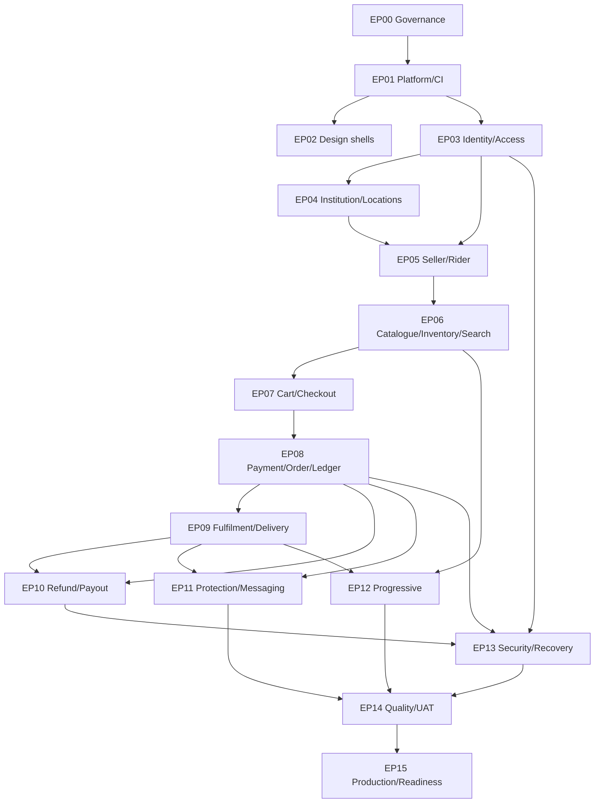

# Noma Delivery Backlog and Two-Month Execution Plan

> **Repository path:** `docs/12-delivery-backlog.md`  
> **Status:** Binding Covenant pilot delivery and Codex execution contract  
> **Version:** 1.0  
> **Effective date:** 30 July 2026  
> **Applies to:** Noma's two-month Covenant University pilot build  
> **Primary audience:** Founders, Product, Design, Engineering, Codex, QA, DevOps, Operations, Finance, Support, Trust and Safety, Security, Privacy, Logistics, and future contributors

---

## 1. Purpose

This document is the binding implementation backlog for Noma's controlled Covenant University pilot. It converts the locked product, authorization, journey, information-architecture, design, architecture, domain, state-machine, integration, security, and testing contracts into a dependency-ordered programme of bounded, reviewable Codex tasks.

It defines:
- the delivery hierarchy from programme to workstream, epic, capability, and bounded task;
- stable task identifiers, priorities, risk classes, sizes, dependencies, owners, outputs, acceptance criteria, and test evidence;
- the order in which repository foundations, business domains, product surfaces, provider adapters, operations, security, and quality controls must be constructed;
- the Ask Mode → branch → implementation → evidence → human review → correction → merge workflow for every Codex cycle;
- the eight-week execution plan and the gates that separate foundation, commerce, fulfilment, operations, hardening, and pilot readiness;
- the work that may proceed in parallel and the work that must remain sequential;
- the difference between code completion, deployment, progressive-feature activation, and real paid-pilot activation; and
- the evidence Part 13 must receive before it can decide readiness.

The delivery objective is:

> **A stable, secure, operationally testable, capacity-controlled Covenant pilot in eight weeks—not a hurried implementation of every future Noma capability.**

---

## 2. Authority and document hierarchy

1. `docs/01-mvp-scope.md` controls what is active, progressive, manual, prohibited, or deferred.
2. `docs/02-user-roles.md` controls actors, capabilities, scopes, assurance, maker-checker, and data visibility.
3. `docs/03-user-journeys.md` controls required end-to-end sequence, exception handling, evidence, and completion.
4. `docs/04-information-architecture.md` and `docs/05-design-system.md` control pages, content hierarchy, components, responsive behaviour, and accessible state presentation.
5. `docs/06-technical-architecture.md`, `docs/07-domain-model.md`, and `docs/08-state-machines.md` control modules, runtimes, persistence, states, transitions, transactions, idempotency, and concurrency.
6. `docs/09-integrations.md` controls providers, adapters, webhooks, environments, uncertainty, and reconciliation.
7. `docs/10-security-and-compliance.md` controls threats, authentication security, privacy, compliance, retention, incident response, and security blockers.
8. `docs/11-testing-strategy.md` controls test layers, tools, fixtures, mandatory scenarios, evidence, and release gates.
9. **This document controls implementation sequence, task boundaries, dependency order, delivery ownership, and the eight-week execution plan.**
10. `docs/13-covenant-pilot-readiness.md` will decide whether evidence is sufficient to deploy, activate a feature, accept real money, or expand the pilot.

A deadline, issue, pull request, Codex preference, generated migration, provider dashboard, attractive demo, or founder urgency cannot override the governing contracts. When a conflict is found, the affected task stops at the boundary and records the conflict.

---

## 3. Source-derived requirements and delivery decisions

### 3.1 Source-locked requirements

- Week 1 establishes scope, journeys, information architecture, technical architecture, domain/state foundations, design, repository, CI, environments, and `AGENTS.md`.
- Week 2 establishes authentication, scoped permissions, Covenant verification, institution/location graph, actor profiles, and audit.
- Week 3 establishes categories, products, offers, listing, images, inventory, seller onboarding/approval, search, and filtering.
- Week 4 establishes cart, checkout, delivery price, Parent/Vendor Orders, Paystack, verification, allocations, and confirmation.
- Week 5 establishes seller preparation, dispatch, carrier abstraction, pickup QR, delivery PIN/QR, Rider workflow, and buyer tracking.
- Week 6 establishes Operations, interventions, cancellations, refunds, earnings, payout foundations, notifications, cases, and enforcement.
- Week 7 prioritises integration, security, protection, concurrency, end-to-end testing, mobile/accessibility, performance, and recovery—not major new feature development.
- Week 8 prioritises realistic pilot data, founding participants, UAT, deployment, monitoring, backups, runbooks, live drills, and the launch checklist.
- Every task is bounded, begins with repository inspection, runs required checks, produces evidence, receives human review, and merges only after approval.
- Testing foundations, fixtures, and provider simulators are created early; testing may not be postponed for already-implemented P0 obligations.
- Progressive Food, External Vendor, FBN, Pre-Owned, Priority, and Saver code remains inactive until separate scope, operations, capacity, and test gates pass.

### 3.2 Delivery decisions locked here

- The backlog uses stable epic and task IDs; IDs are not recycled after merge.
- One bounded task normally equals one branch and one pull request. An approved pull-request bundle may contain two to four tightly coupled `S` tasks from the same epic when they share one migration/contract boundary, remain separately accepted, and do not weaken reviewability.
- No task may be larger than five focused engineering days; a task estimated larger must be split before implementation.
- P0 tasks include their required tests in the same task; there is no later 'add tests' substitute.
- The programme assumes at least three coordinated delivery lanes—Domain/API, Web/Design, and Quality/DevOps/Operations—with accountable human review. Codex increases implementation throughput but does not remove review, UAT, provider, legal, or operational work.
- The schedule is dependency- and evidence-based. A week boundary does not authorise skipping an unfinished gate.
- Weeks 7 and 8 contain only hardening, correction, readiness, and narrowly approved pilot blockers.
- P1 progressive tasks may be implemented in Weeks 5–6 but remain feature-off; if core P0 work slips, P1 activation work yields first.
- Every task report identifies intentionally inactive and deferred branches.
- Part 13, not this backlog, grants final paid-pilot or progressive-feature activation.

---

## 4. Normative language

- **MUST / MUST NOT:** mandatory for the applicable task, gate, or pilot stage.
- **SHOULD / SHOULD NOT:** expected unless an approved written reason exists.
- **MAY:** optional within the locked boundary.
- **P0:** launch-blocking core journey, value, custody, authority, privacy, recovery, or operating control.
- **P1:** progressive or material supporting capability; failure blocks only that capability's activation unless it affects P0 truth.
- **P2:** non-critical presentation/support work that may be triaged through an approved bounded defect.
- **BLOCKED:** prerequisites, policy, evidence, provider, design, or operational input are not ready.
- **READY:** definition of ready is satisfied and the task may enter Ask Mode.
- **IN REVIEW:** implementation/evidence is complete and awaiting human review.
- **DONE:** merged and all task acceptance evidence is recorded.
- **ACTIVATED:** a separately authorised feature or paid operation is available to its approved cohort. Done does not imply Activated.

---

# Part A — Delivery governance

## 5. Backlog hierarchy

```text
Programme: Covenant Pilot
  └── Workstream
       └── Epic
            └── Capability
                 └── Bounded Codex Task
                      └── Pull Request + Evidence
                           └── Gate decision
```

The implementation unit is the bounded Codex task. An epic or capability is not assigned to Codex as one prompt.

## 6. Work item statuses

`PROPOSED → BLOCKED/READY → ASK_MODE → IN_PROGRESS → IN_REVIEW → CHANGES_REQUIRED/APPROVED → MERGED → VERIFIED → DONE`

A separate activation lifecycle applies to progressive features: `NOT_ELIGIBLE → EVIDENCE_PENDING → APPROVED_FOR_INTERNAL_TEST → LIMITED_PILOT → ACTIVE/PAUSED`.

## 7. Priority and risk ordering

When two tasks compete for capacity, order them by:
1. safety, security, privacy, financial integrity, custody, and recoverability;
1. critical-path dependency blocking multiple tasks;
1. P0 end-to-end journey completion;
1. Operations' ability to observe and recover;
1. progressive capability foundations; and
1. P2 visual or convenience refinement.

## 8. Task size

| Size | Expected shape | Rule |
|---|---|---|
| `S` | narrow model, component, policy, adapter, or documentation change | one small Codex/review cycle; may be bundled only under the approved rule |
| `M` | one complete bounded capability slice | one primary implementation cycle plus focused human review |
| `L` | complex P0 slice spanning controlled DB/API/UI/worker boundaries | multiple internal checkpoints; split if one reviewer cannot understand the diff safely |

No `XL` task is allowed. Size measures review and risk complexity, not a guaranteed duration. Unexpected scope must be reported and split rather than silently absorbed.

## 9. Work-in-progress limits

- At most one unreviewed P0 value/custody migration may be active at once.
- At most two Codex implementation branches should await the same human reviewer.
- A new critical-path task does not start while its prerequisite pull request is still materially changing.
- Provider, schema, state-machine, and authorization changes receive focused review before dependent UI work proceeds.
- A correction branch takes precedence over starting an unrelated new task when it blocks the current gate.

## 10. Required labels

Every issue/PR MUST carry labels for `epic`, `workstream`, `priority`, `risk`, `week`, `surface`, `module`, `journey`, `machine`, `provider`, `progressive`, and `gate` where applicable.

## 11. Definition of Ready

1. the governing scope decision and exact source sections are identified;
2. actor, capability, resource scope, and assurance are known;
3. Journey ID(s), route/page, module, entities, and Machine ID(s) are known;
4. design/component requirements exist for visible work;
5. provider/operations dependencies are available or simulated;
6. acceptance criteria and test oracle are objective;
7. migration, rollback, privacy, security, and operational impact are stated;
8. dependencies are merged or intentionally mocked through approved ports;
9. progressive/deferred behaviour is explicitly excluded; and
10. a human owner is available to review the output.

## 12. Definition of Done

1. the requested bounded scope is implemented and no adjacent deferred scope was added;
2. public contracts, migrations, state transitions, authorization, audit, outbox, and metrics are updated where relevant;
3. required unit/component/DB/API/contract/property/concurrency/E2E/accessibility/security/performance/recovery tests pass;
4. fixtures are deterministic and cleanup is safe;
5. lint, format, typecheck, build, migrations, and affected quality workflows pass;
6. documentation and traceability registers are updated;
7. the final report states commands, results, files, migrations, risks, screenshots/evidence, and intentionally inactive branches;
8. human review confirms product, security, data, design, operations, and financial consequences as applicable;
9. the approved PR is merged and deployed to the required non-production environment; and
10. post-merge smoke/evidence is recorded without implying feature activation.

## 13. Codex cycle

```text
1. Human selects the next READY task.
2. Human supplies the complete issue-style prompt.
3. Codex inspects the repository in Ask Mode and reports its plan, patterns, conflicts, and questions.
4. Human resolves material ambiguity; Codex creates/uses a task branch.
5. Codex implements only the bounded task.
6. Codex runs all required commands and produces evidence.
7. Human reviews the diff, tests, migration, UI, security, and operational effect.
8. Codex receives a correction prompt where needed.
9. The approved pull request is merged.
10. Post-merge verification completes before the next dependent task starts.
```

## 14. Ask Mode output

- relevant repository paths and existing patterns;
- governing Build Pack sections and traceability IDs;
- proposed module/data/state/API/UI/test changes;
- dependencies and assumptions;
- migration and rollback impact;
- security/privacy/financial/custody risks;
- what will not be implemented; and
- a proposed file-level implementation plan.

Ask Mode must not modify files. If Codex finds a conflict, it reports the conflict instead of choosing policy.

## 15. Branch and pull-request rules

- Branch names use `<task-id>-<short-title>`.
- One bounded task maps to one PR unless an approved same-epic bundle or documented stacked-PR plan exists. Bundles preserve separate task IDs, acceptance criteria, commits/evidence, and rollback analysis.
- Generated files are separated from authored logic where reviewability benefits.
- Schema migrations and backfills are explicit and reviewed; no untracked database console edit counts as implementation.
- A PR cannot mix unrelated refactoring, dependency upgrades, formatting churn, and feature work.
- P0 migrations, ledger, payment, custody, access, and emergency controls require an independent human reviewer.
- Codex never merges, activates a feature, changes production provider dashboards, or waives a failed gate by itself.

## 16. Scope-change rule

A requested change not represented in this backlog uses the scope-change process in `docs/01-mvp-scope.md`. During Weeks 7 and 8, only pilot blockers or safety, legal, privacy, security, financial-integrity, or recoverability work may enter. Any accepted addition must identify equal-or-greater work removed or delayed unless it is a non-negotiable blocker.

---

# Part B — Workstreams, dependency graph, and gates

## 17. Workstream registry

| Workstream | Responsibility | Primary evidence owner |
|---|---|---|
| Product/Governance | scope, traceability, issues, decisions, acceptance | Product |
| Platform/DevEx | monorepo, environments, CI, testing foundation | Engineering/QA |
| Design/Web | tokens, components, routes, responsive/accessibility | Design/Web/QA |
| Identity/Access | auth, sessions, memberships, authorization, audit | Identity/Security |
| Institution/Participation | Covenant, locations, sellers, riders, CU Express | Operations |
| Catalogue/Inventory/Search | products, offers, files, stock, discovery | Catalogue/Seller Ops |
| Commerce/Finance | cart, checkout, payment, orders, ledger, refunds, payouts | Engineering/Finance |
| Fulfilment/Logistics | preparation, dispatch, custody, Rider, tracking | Logistics/Operations |
| Protection/Trust | cases, returns, reviews, enforcement, appeals, recalls | Support/Trust and Safety |
| Progressive Features | Food, External, FBN, Pre-Owned, Priority, Saver | Named feature owner |
| Security/Privacy/Compliance | controls, registers, retention, incident response | Security/Privacy |
| Reliability/Release | observability, backups, deployment, recovery, capacity | DevOps/Release |
| Quality/UAT | test matrices, automation, performance, accessibility, UAT | QA |

## 18. Epic registry

| Epic | Name | Outcome |
|---|---|---|
| `EP00` | Repository authority and delivery governance | Make the Build Pack, repository instructions, issue workflow, and scope controls enforceable before production feature work. |
| `EP01` | Monorepo, environments, CI, and test foundation | Create the deployable modular-monolith skeleton, deterministic local environment, quality pipeline, and provider simulators. |
| `EP02` | Noma design system and role-surface shells | Implement the shared commerce pattern library and distinct Marketplace, Buyer, Seller, Rider, Operations, and Admin shells. |
| `EP03` | Identity, authentication, access, and audit | Establish one identity, revocable sessions, MFA, scoped capabilities, field projection, and append-only audit before protected workflows. |
| `EP04` | Institution, Covenant verification, and location graph | Implement configurable institution affiliation, manual fallback, approved locations, operating windows, and capacity controls. |
| `EP05` | Seller, rider, and partner participation | Implement seller applications and activation, seller representatives, rider memberships/shifts, and CU Express dispatcher boundaries. |
| `EP06` | Catalogue, offers, files, inventory, and search | Create canonical product truth, seller offers, secure media, oversell-safe inventory, moderation, and relevance-first discovery. |
| `EP07` | Cart, checkout, pricing, and reservations | Create a truthful multi-vendor cart and immutable checkout snapshot with delivery quotes, allocations, eligibility, and inventory reservations. |
| `EP08` | Payments, orders, allocations, ledger, and earnings | Establish Paystack-confirmed payment truth, Parent/Vendor Orders, unaffected-order continuity, double-entry ledger postings, and pending seller earnings. |
| `EP09` | Seller fulfilment, delivery, custody, and tracking | Implement preparation, packages, hybrid dispatch, one-time pickup/handoff credentials, Rider PWA, failed handoff, and buyer tracking. |
| `EP10` | Cancellations, refunds, holds, withdrawals, and payouts | Implement lifecycle-aware cancellation, provider-confirmed refunds, targeted financial holds, controlled withdrawals, payouts, and reconciliation. |
| `EP11` | Messaging, notifications, protection, reviews, and enforcement | Provide protected communication, case handling, returns, remedies, verified reviews, seller performance, enforcement, appeals, and recall containment. |
| `EP12` | Progressive commerce and fulfilment capabilities | Build feature-gated Food, External Vendor inbound, one-location FBN, structured Pre-Owned, Priority, and Saver foundations without accidental activation. |
| `EP13` | Security, privacy, observability, recovery, and operations controls | Apply the security/compliance contract, provider operations, monitoring, backups, restoration, incident response, and emergency pause controls. |
| `EP14` | Quality, performance, accessibility, UAT, and release evidence | Execute the Part 11 test strategy, operational acceptance, controlled live drills, and release evidence required before paid pilot activation. |
| `EP15` | Production deployment and Part 13 readiness handoff | Provision controlled production, load realistic pilot data, set capacity, collect evidence, and hand a complete gate package to Part 13. |

## 19. Dependency graph



## 20. Critical path

`EP00 → EP01 → EP03/EP04/EP05 → EP06 → EP07 → EP08 → EP09/EP10/EP11 → EP13/EP14 → EP15`

Progressive `EP12` may run beside late core work only after its shared foundations are stable. It must never delay the core critical path.

## 21. Parallel delivery lanes

| Lane | May proceed in parallel | Must wait for |
|---|---|---|
| A — Domain/API | pure rules, migrations, commands, provider ports | governing models/state/authorization |
| B — Web/Design | component library, shells, fixture-driven pages | approved IA/design and stable contracts for final integration |
| C — Quality | fixtures, simulators, matrices, contract/property tests | task oracle and stable public contract |
| D — Operations | SOPs, training, queue design, provider/account preparation | locked workflow/authority and safe non-production environment |
| E — Security/Privacy | threat/registers, middleware, reviews, runbooks | architecture and data inventory; never postponed to Week 7 |

## 22. Programme gates

| Gate | Earliest point | Required outcome |
|---|---|---|
| `G0 Documentation ready` | Week 1 | Build Pack in repo, AGENTS/README/templates/traceability; no unresolved scope conflict |
| `G1 Engineering foundation` | Week 1 | runtimes, DB, queue/outbox, tests, CI, staging, observability bootstrap work |
| `G2 Platform core` | Week 2 | identity/access/Covenant/location/seller/rider/audit secure enough for protected feature work |
| `G3 Catalogue ready` | Week 3 | approved sellers can create moderated offers with secure files, inventory and searchable public pages |
| `G4 Commerce core` | Week 4 | cart→checkout→Paystack-confirmed Parent/Vendor Orders→balanced ledger works with races/reconciliation |
| `G5 Fulfilment core` | Week 5 | seller prep→dispatch→pickup custody→delivery/failed attempt→buyer tracking works |
| `G6 Operations core` | Week 6 | cancellations/refunds/holds/payouts/messages/cases/enforcement and emergency controls are operable |
| `G7 Release candidate` | Week 7 | P0 integration/security/concurrency/accessibility/performance/recovery evidence is green |
| `G8 Readiness handoff` | Week 8 | UAT, live drills, realistic data, runbooks, capacity and evidence pack delivered to Part 13 |

A failed gate moves unfinished dependent work; it does not authorise bypassing the gate.

---

# Part C — Bounded Codex backlog

## 23. Task-register reading guide

- **Priority:** P0/P1/P2 delivery effect.
- **Risk:** highest quality risk class inherited from Part 11.
- **Size:** bounded planning size, not a promise.
- **Week:** intended primary execution window; dependencies remain authoritative.
- **Depends:** task IDs that must be merged/verified unless a reviewed simulator/contract explicitly permits parallel work.
- **Acceptance:** minimum objective outcome; governing documents may require more.
- **Tests:** required evidence emphasis; the full Part 11 definition still applies.

## 24. `EP00` — Repository authority and delivery governance

**Goal:** Make the Build Pack, repository instructions, issue workflow, and scope controls enforceable before production feature work.

**Task count:** 8

| Task | Title | Pri | Risk | Size | Week | Depends | Required output | Acceptance | Required tests/evidence | Owner |
|---|---|---:|---|---:|---|---|---|---|---|---|
| `FND-001` | Inspect repository and publish baseline orientation report | P0 | P0-RECOVERY | S | W1 | - | Ask Mode report covering current tree, package manager, frameworks, existing tests, migrations, provider code, secrets risks, and conflicts. | No production code changes; report identifies governing docs, missing foundations, reusable patterns, blockers, and proposed first branch. | Static inspection; commands reported | Engineering + human reviewer |
| `FND-002` | Install the version-controlled Build Pack and document index | P0 | P0-COMMERCE | S | W1 | FND-001 | Place docs/00–13 placeholders/current files in repository; add a document hierarchy/index and ownership metadata. | Repository paths are exact; no duplicate competing copies; links resolve; docs/01–11 remain unchanged except approved link corrections. | Markdown/link validation | Product/Engineering |
| `FND-003` | Create docs/00-product-vision.md | P0 | P2-PRESENTATION | S | W1 | FND-002 | Concise product vision, Covenant objective, target users, principles, non-goals, and source hierarchy. | Vision agrees with docs/01; does not expand scope; future Noma ambition is distinguished from pilot obligations. | Document review | Founder/Product |
| `FND-004` | Create root AGENTS.md for Codex governance | P0 | P0-AUTHORITY | S | W1 | FND-002 | Persistent repository instructions: inspect-first, module boundaries, test/report requirements, prohibited shortcuts, branch/PR rules, and document hierarchy. | Codex can identify required docs and commands from one file; instructions prohibit scope invention, direct status edits, provider truth fabrication, and test deferral. | Instruction review; sample task dry run | Engineering + Product |
| `FND-005` | Create repository README and local-start contract | P0 | P1-OPERATIONS | S | W1 | FND-002 | README with product summary, architecture, prerequisites, local setup, commands, environments, docs, and safety notices. | A clean machine can reach the documented development state without production credentials or tribal knowledge. | Fresh-clone rehearsal | Engineering |
| `FND-006` | Create issue, pull-request, ADR, and scope-change templates | P0 | P0-AUTHORITY | S | W1 | FND-004 | GitHub templates carrying requirement IDs, journeys, machines, risk, dependencies, acceptance, tests, screenshots/evidence, exclusions, and rollback. | Templates fail review if scope source, risk, tests, or intentionally inactive branches are missing. | Template lint; sample issue/PR | Engineering/Product/QA |
| `FND-007` | Create task, decision, and requirement traceability registers | P0 | P0-RECOVERY | M | W1 | FND-006 | Machine-readable registers linking task → scope → role → journey → route → module → entities → machines → tests → evidence. | Every P0 task can be traced forward and backward; unknown references fail validation. | Schema and referential validation | QA/Product |
| `FND-008` | Create release-evidence and change-control directories | P0 | P0-RECOVERY | S | W1 | FND-006 | quality/, compliance/, security/, runbooks/, evidence/, and change-control/ skeletons with schemas and ownership. | No secret or personal data is permitted in evidence; evidence artefacts have commit, environment, owner, date, and expiry fields. | Schema validation; redaction test | QA/Security |

## 25. `EP01` — Monorepo, environments, CI, and test foundation

**Goal:** Create the deployable modular-monolith skeleton, deterministic local environment, quality pipeline, and provider simulators.

**Task count:** 10

| Task | Title | Pri | Risk | Size | Week | Depends | Required output | Acceptance | Required tests/evidence | Owner |
|---|---|---:|---|---:|---|---|---|---|---|---|
| `DEV-001` | Initialise pnpm workspace and Turborepo monorepo | P0 | P0-COMMERCE | M | W1 | FND-005 | apps/web, apps/api, apps/worker and packages/ui, contracts, config, database, platform, integrations, testing, security, observability. | Workspace builds from clean install; package boundaries match Part 6; no browser package imports server/database internals. | Install, lint, typecheck, build | Engineering |
| `DEV-002` | Scaffold Next.js, NestJS API, and NestJS Worker runtimes | P0 | P0-COMMERCE | M | W1 | DEV-001 | Runnable health endpoints/pages and shared configuration without business features. | Web/API/Worker start independently; readiness/liveness are distinct; no provider secrets in Web bundle. | Runtime smoke; build | Engineering |
| `DEV-003` | Implement typed environment configuration and secret validation | P0 | P0-AUTHORITY | M | W1 | DEV-002 | Environment schema, safe defaults, startup validation, public/server separation, and test overrides. | Missing production-critical values fail startup safely; logs redact secrets; preview cannot load production credentials. | Unit; startup integration; secret scan | Engineering/Security |
| `DEV-004` | Create Prisma/PostgreSQL foundation and migration discipline | P0 | P0-RECOVERY | M | W1 | DEV-001 | Prisma client package, baseline migration, extensions, migration validation, transaction helpers, and test reset strategy. | Real PostgreSQL starts locally/CI; migrations upgrade empty and prior schema; unsafe reset is impossible in production. | Migration integration; restore rehearsal | Engineering/Data |
| `DEV-005` | Create Redis/BullMQ queue and transactional-outbox foundation | P0 | P0-RECOVERY | M | W1 | DEV-004 | Queue connection, worker bootstrap, outbox table/dispatcher, retry/dead-letter conventions, job contracts, and metrics. | Committed outbox work survives API crash; duplicate dispatch is harmless; dead jobs remain visible and owned. | DB/queue integration; crash/replay tests | Engineering |
| `DEV-006` | Create deterministic testing package and Testcontainers harness | P0 | P0-RECOVERY | M | W1 | DEV-004,DEV-005 | Vitest, Testing Library, Testcontainers PostgreSQL/Redis, seeded clocks/IDs, cleanup, and fixture factories. | Tests run without production data or credentials; time/randomness/provider outcomes are controllable; cleanup preserves append-only semantics. | Harness self-tests | QA/Engineering |
| `DEV-007` | Create provider ports and local simulators | P0 | P0-FINANCIAL | M | W1 | DEV-006 | Payment/refund/transfer, storage, email, push, monitoring, analytics, DNS/hosting config ports plus deterministic simulators. | Domain/application modules import ports only; simulators reproduce success, timeout, duplicate, reversal, out-of-order, and unknown outcomes. | Contract tests; failure injection | Engineering/QA |
| `DEV-008` | Create GitHub Actions quality pipeline | P0 | P0-RECOVERY | M | W1 | DEV-006,FND-008 | Install/cache, lint, format, typecheck, unit, DB integration, contract, build, migration, secret/dependency checks, and artefact upload. | Protected branch cannot merge on failed required checks; P0 flaky tests remain failures; evidence identifies commit/environment. | Workflow dry run; deliberate failure | Engineering/QA/Security |
| `DEV-009` | Create preview/staging deployment skeleton | P0 | P1-OPERATIONS | M | W1 | DEV-002,DEV-003,DEV-008 | Vercel Web preview and Render API/Worker/staging services with non-production data and environment separation. | Preview/staging never use production database, queue, buckets, keys, or provider recipients; rollback path is documented. | Deployment smoke; environment isolation | DevOps/Engineering |
| `DEV-010` | Bootstrap OpenTelemetry, structured logging, correlation, and health | P0 | P0-RECOVERY | M | W1 | DEV-002,DEV-005 | Trace/request/job correlation, redaction, health/dependency probes, base metrics, Sentry/Grafana adapter boundaries. | One synthetic request can be traced Web→API→DB/outbox→Worker; sensitive fields are absent; dependency failure changes readiness honestly. | Observability integration; redaction tests | Engineering/DevOps |

## 26. `EP02` — Noma design system and role-surface shells

**Goal:** Implement the shared commerce pattern library and distinct Marketplace, Buyer, Seller, Rider, Operations, and Admin shells.

**Task count:** 6

| Task | Title | Pri | Risk | Size | Week | Depends | Required output | Acceptance | Required tests/evidence | Owner |
|---|---|---:|---|---:|---|---|---|---|---|---|
| `UI-001` | Implement core and semantic design tokens | P0 | P2-PRESENTATION | S | W1 | DEV-001 | Token package for colour, type, spacing, density, radius, elevation, status, focus, motion, and breakpoints. | No feature hardcodes status colours; semantic tokens meet documented contrast; final brand inputs can remap without changing meaning. | Token unit/contrast checks | Design/Web |
| `UI-002` | Implement accessible primitive component set | P0 | P1-OPERATIONS | M | W1 | UI-001,DEV-006 | Buttons, links, inputs, selects, checkboxes, radios, dialogs, drawers, tabs, menus, tables, pagination, toasts, and forms. | Keyboard, focus, labels, error association, disabled/pending states, target size, and reduced motion pass component tests. | Component; axe; keyboard; visual | Web/Design/QA |
| `UI-003` | Implement commerce status, money, timeline, evidence, and action patterns | P0 | P0-COMMERCE | M | W1 | UI-002 | Status chips, responsibility/deadline banners, money breakdowns, immutable timelines, evidence cards, step-up action confirmations. | Components distinguish requested/processing/final/failed/uncertain states and never infer provider or custody completion. | Component; visual; accessibility | Web/Design |
| `UI-004` | Implement Marketplace and Buyer Account shells | P0 | P0-COMMERCE | M | W1 | DEV-002,UI-002 | Public header/search/category navigation, mobile navigation, account layout, private loading/error shells, and surface switcher. | Public and private navigation follow Part 4; route visibility does not grant action authority; responsive/reflow pass. | Route/component; viewport; a11y | Web |
| `UI-005` | Implement Seller, Rider, Operations, and Admin shells | P0 | P1-OPERATIONS | M | W1 | UI-002,DEV-002 | Distinct role layouts, queues, compact tables, Rider action mode/offline banner, and restricted Admin navigation. | No universal dashboard; direct deep links enforce server access; data density and touch behaviour match each surface. | Route/auth negative; viewport; a11y | Web/QA |
| `UI-006` | Create Storybook/component documentation and visual regression | P0 | P2-PRESENTATION | M | W1 | UI-002,UI-003,DEV-008 | Documented states, usage rules, prohibited usage, fixed visual fixtures, and baseline workflow. | All pilot components expose loading/empty/error/pending/disabled/permission states; baseline changes require review. | Storybook build; visual regression | Design/Web/QA |

## 27. `EP03` — Identity, authentication, access, and audit

**Goal:** Establish one identity, revocable sessions, MFA, scoped capabilities, field projection, and append-only audit before protected workflows.

**Task count:** 10

| Task | Title | Pri | Risk | Size | Week | Depends | Required output | Acceptance | Required tests/evidence | Owner |
|---|---|---:|---|---:|---|---|---|---|---|---|
| `IAM-001` | Implement User, credential, session, and recovery persistence | P0 | P0-AUTHORITY | M | W2 | DEV-004 | Identity tables, normalized email, password credential, opaque session, verification/recovery tokens, version fields, and indexes. | One User identity supports multiple memberships; tokens are hashed/one-time/expiring; sessions are revocable and device-visible. | DB constraints; repository integration | Identity Engineering |
| `IAM-002` | Implement password registration, sign-in, sign-out, and session rotation | P0 | P0-AUTHORITY | M | W2 | IAM-001,DEV-010 | Argon2id auth commands, secure cookies, fixation protection, rate limits, generic errors, and audit events. | No password/OTP/token logging; session rotates after login; concurrent revoke blocks future requests; direct API tests pass. | Unit; API; security; rate-limit | Identity/Security |
| `IAM-003` | Implement email verification and password recovery | P0 | P0-AUTHORITY | M | W2 | IAM-002,DEV-007 | One-time verification/recovery flows, Postmark adapter usage, expiry, replay rejection, and security notices. | Email delivery is not verification truth; duplicate/expired token fails safely; recovery revokes relevant sessions. | Unit; API; provider simulation; E2E | Identity |
| `IAM-004` | Implement privileged MFA and recent-authentication assurance | P0 | P0-AUTHORITY | M | W2 | IAM-002 | TOTP enrollment/verification/recovery, privileged session assurance, step-up commands, cooling/recovery safeguards. | Privileged roles cannot use protected surfaces without MFA; sensitive actions reject stale assurance; recovery cannot silently remove controls. | Unit; API; browser; manual abuse | Identity/Security |
| `IAM-005` | Implement membership, role grant, capability, and scope model | P0 | P0-AUTHORITY | L | W2 | IAM-001 | Institution/seller/rider/staff memberships, role templates, capability grants, resource scopes, validity, revocation, and maker-checker fields. | No global role grants unbounded access; one identity may combine approved roles; revoked/expired grants fail immediately. | DB; policy; authorization matrix | Access Engineering |
| `IAM-006` | Implement central authorization policy engine | P0 | P0-AUTHORITY | L | W2 | IAM-005 | Typed checks for identity, assurance, capability, institution/seller/resource scope, state, feature, emergency, and approval. | Deny-by-default; every protected API uses policy middleware/application guard; hidden UI is not a control. | Policy unit; API negative IDOR; property | Access/Security |
| `IAM-007` | Implement field-level projections and sensitive-data redaction | P0 | P0-PRIVACY | M | W2 | IAM-006 | Actor-specific serializers/query DTOs, masked bank/contact/identifier fields, evidence access decisions, and export policy hooks. | Seller, rider, buyer, Support, Finance, Trust, and Admin views expose only necessary fields; errors do not leak restricted reasons. | Projection unit; API matrix; privacy tests | Access/Privacy |
| `IAM-008` | Implement append-only audit service and privileged-action timeline | P0 | P0-AUTHORITY | M | W2 | IAM-006,DEV-005 | Audit events, correlation, before/after summaries, reasons, scoped access, outbox integration, and admin viewer. | Money, access, enforcement, evidence access, configuration, and emergency actions are auditable; ordinary admins cannot edit/delete events. | DB append-only; API; security | Audit/Security |
| `IAM-009` | Implement Access Admin workflows and access-review export | P0 | P0-AUTHORITY | M | W2 | IAM-005,IAM-008,UI-005 | Grant/request/approve/revoke, temporary access, conflict checks, access review queue, and safe export. | Maker cannot self-approve high-risk grant; scope/expiry required; revocation invalidates active authority and sessions where required. | API; E2E; maker-checker; export privacy | Access Admin/QA |
| `IAM-010` | Implement account security pages and session management | P0 | P0-AUTHORITY | M | W2 | IAM-002,IAM-003,IAM-004,UI-004 | Security overview, active sessions, password/MFA changes, recovery, notices, and account-compromise containment entry. | User can revoke other sessions; sensitive changes require step-up; truthful pending/failed states and accessible recovery work. | Component; E2E; a11y; security | Web/Identity |

## 28. `EP04` — Institution, Covenant verification, and location graph

**Goal:** Implement configurable institution affiliation, manual fallback, approved locations, operating windows, and capacity controls.

**Task count:** 6

| Task | Title | Pri | Risk | Size | Week | Depends | Required output | Acceptance | Required tests/evidence | Owner |
|---|---|---:|---|---:|---|---|---|---|---|---|
| `INS-001` | Implement Institution, affiliation, domain, and identifier-rule entities | P0 | P0-AUTHORITY | M | W2 | DEV-004 | Institution and membership configuration, approved domains, identifier normalization/patterns, evidence methods, and state fields. | No Covenant email or matric pattern is hardcoded without configured approval; institution scope is present on protected records. | DB constraints; configuration tests | Institution Engineering |
| `INS-002` | Implement Covenant email-and-identifier auto-verification | P0 | P0-AUTHORITY | M | W2 | INS-001,IAM-003 | Verification command, email control check, identifier uniqueness, name/risk checks, decision/evidence history, and audit. | Straightforward cases can approve; duplicate/conflict never silently merges; affiliation is independent from seller/payout/trust status. | Unit; API; duplicate/concurrency; E2E | Institution/Identity |
| `INS-003` | Implement manual affiliation review and evidence workflow | P0 | P0-PRIVACY | M | W2 | INS-002,IAM-007 | More-information requests, private evidence upload link, reviewer queue, approve/reject/retry/appeal notes, and retention metadata. | Evidence is private, least-privilege, time-limited, and not visible to sellers/riders; decision preserves history and reason. | API; file access; privacy; UAT | Operations/Privacy |
| `INS-004` | Implement affiliation expiry, revocation, and capability gating | P0 | P0-AUTHORITY | M | W2 | INS-002,IAM-006 | Expiry/revalidation worker, revocation, account continuity, checkout gate, and security notifications. | Expired affiliation removes campus checkout without deleting account/history; stale sessions cannot retain capability. | State/deadline; API; session race | Institution/Access |
| `LOC-001` | Implement approved location graph and operating windows | P0 | P0-CUSTODY | M | W2 | INS-001 | Campus zones, pickup/delivery/storage points, parent relationships, hours, visibility, handling, and capacity metadata. | Only approved active points are selectable; private room data is not exposed; all times use Africa/Lagos policy. | DB; query; timezone; API | Institution/Logistics |
| `LOC-002` | Implement location/capacity administration and emergency closure | P0 | P0-CUSTODY | M | W2 | LOC-001,IAM-006,IAM-008 | Admin CRUD with versioning, closure reasons, capacity limits, effective windows, and dependent-work warnings. | Closure blocks new commitments but preserves in-flight obligations; changes are audited and conflict-safe. | API; state; optimistic concurrency; E2E | Operations/Admin |

## 29. `EP05` — Seller, rider, and partner participation

**Goal:** Implement seller applications and activation, seller representatives, rider memberships/shifts, and CU Express dispatcher boundaries.

**Task count:** 8

| Task | Title | Pri | Risk | Size | Week | Depends | Required output | Acceptance | Required tests/evidence | Owner |
|---|---|---:|---|---:|---|---|---|---|---|---|
| `SEL-001` | Implement Seller entity, representatives, application, and agreement records | P0 | P0-AUTHORITY | M | W2 | IAM-005,INS-001 | Seller types, application versions, owners/operators, category requests, policy acceptance, training and activation fields. | Seller type is not a global role; application approval and activation are distinct; agreements are versioned. | DB; repository; access tests | Seller Engineering |
| `SEL-002` | Implement student-vendor and campus-store application APIs/UI | P0 | P1-OPERATIONS | M | W3 | SEL-001,UI-005,INS-002 | Application wizard, drafts, submission, required evidence, category selection, status timeline, and correction flow. | Applicant sees truthful status and missing actions; private evidence uses Files policy; no public store before activation. | Component; API; E2E; a11y | Seller/Web |
| `SEL-003` | Implement invite-only External Vendor participation boundary | P1 | P1-PROGRESSIVE | S | W3 | SEL-001 | Invitation, expiry, stronger verification requirements, external-origin metadata, and disabled activation gate. | No public external registration; invitation alone does not activate checkout or inbound logistics. | API; feature-gate; negative tests | Seller/Operations |
| `SEL-004` | Implement Operations seller review and decision workflow | P0 | P1-OPERATIONS | M | W3 | SEL-002,IAM-008 | Review queue, evidence access, request-more-info, approve/reject, category decision, reasons, and notifications. | Reviewer authority is scoped; decision is auditable; approved seller remains inactive until readiness conditions pass. | API; E2E; UAT; access tests | Operations/Seller |
| `SEL-005` | Implement seller activation, suspension continuity, and store visibility | P0 | P0-COMMERCE | M | W3 | SEL-004,IAM-006 | Activation guards, payout/catalogue/training prerequisites, restriction states, order continuity, and storefront publication. | Suspension blocks new commerce without losing paid-order obligations; no generic admin status edit. | State; API; order-continuity tests | Seller/Trust |
| `RDR-001` | Implement rider membership, eligibility, device, and training records | P0 | P0-CUSTODY | M | W2 | IAM-005,INS-002 | Noma Flex/CU Express rider membership, eligibility, emergency contact, training, device approval, and restrictions. | Rider capability is institution-scoped and independent from buyer/seller roles; sensitive data is limited. | DB; access; privacy tests | Logistics/Access |
| `RDR-002` | Implement rider shifts and availability lifecycle | P0 | P0-CUSTODY | M | W2 | RDR-001,LOC-001 | Shift schedule/check-in/out, capacity, availability, expiry, incident restriction, and Operations override. | Expired/off-shift rider cannot accept assignments; override is reasoned and audited; Wi-Fi-first operation supported. | State/deadline; API; E2E | Logistics |
| `CUX-001` | Implement CU Express partner dispatcher membership and scope | P0 | P0-AUTHORITY | S | W2 | IAM-005,INS-001 | Partner organisation, dispatcher role, permitted delivery-job fields/actions, and audit boundary. | Dispatcher sees only assigned/eligible jobs and cannot access buyer private location, payments, seller ledger, or admin controls. | Authorization matrix; API | Partner/Access |

## 30. `EP06` — Catalogue, offers, files, inventory, and search

**Goal:** Create canonical product truth, seller offers, secure media, oversell-safe inventory, moderation, and relevance-first discovery.

**Task count:** 12

| Task | Title | Pri | Risk | Size | Week | Depends | Required output | Acceptance | Required tests/evidence | Owner |
|---|---|---:|---|---:|---|---|---|---|---|---|
| `CAT-001` | Implement category, attribute, option, and policy schema | P0 | P0-COMMERCE | M | W3 | DEV-004 | Hierarchical categories, typed attributes, variants, required fields, product-policy references, and filter/search metadata. | Category-specific fields replace giant nullable product table; disabled commerce types cannot create live listings. | DB constraints; schema/property tests | Catalogue |
| `CAT-002` | Implement canonical Product and identity/deduplication workflow | P0 | P0-COMMERCE | M | W3 | CAT-001 | Product records, identifiers, brands/models/editions, moderation status, merge suggestions, successor history, and API. | Canonical product is seller-independent; duplicate suggestions require human approval; existing order snapshots are unaffected. | DB; API; moderation tests | Catalogue |
| `OFF-001` | Implement Seller Offer, variants, price, condition, and publication machine | P0 | P0-COMMERCE | L | W3 | CAT-002,SEL-005 | Offer records, seller scope, variants, condition, fulfilment source, warranty/return class, feature/category guards, and state commands. | Offer publication checks seller/category/required fields; no free-form state edit; Product and Offer truth remain separate. | State; DB; API; authorization | Offer/Seller |
| `FIL-001` | Implement secure file upload intents and metadata | P0 | P0-PRIVACY | M | W3 | DEV-007,IAM-007 | Upload intents, size/type/count policy, visibility, purpose, owner/resource scope, expiry, and S3 simulator. | Private evidence is never public; permanent public upload URLs are absent; browser MIME is not trusted. | Contract; API; access; security | Files/Security |
| `FIL-002` | Implement image validation, scan, derivatives, and quarantine worker | P0 | P0-PRIVACY | M | W3 | FIL-001,DEV-005 | Signature validation, malware/image processing port, EXIF handling, safe derivatives, quarantine/release, and alerts. | Original preserved where required; unsafe/failed scan cannot become visible; AI enhancement cannot erase defects. | Worker integration; malicious fixtures; recovery | Files/Worker |
| `INV-001` | Implement inventory stock, movement, and adjustment ledger | P0 | P0-CUSTODY | M | W3 | OFF-001 | Inventory location/offer/unit records, append-only movements, available calculation, reason codes, and admin/seller commands. | No mutable stock counter without movement evidence; adjustments require reason/authority; negative availability prevented. | DB constraints; property tests | Inventory |
| `INV-002` | Implement reservation, expiry, consume, and release | P0 | P0-CUSTODY | L | W3 | INV-001,DEV-005 | Atomic reservations by offer/unit, expiry worker, checkout ownership, partial consume/release, and conflict responses. | Two buyers cannot reserve final unit; expired reservations release once; unit-specific offers reserve the exact item. | Concurrency/property; worker; DB | Inventory/Checkout |
| `INV-003` | Implement seller inventory and listing workspace | P0 | P1-OPERATIONS | M | W3 | INV-001,OFF-001,UI-005 | Offer/listing creation, media, variants, stock, publication errors, bulk-safe actions, and audit timeline. | Seller cannot edit another seller or immutable order snapshot; validation is category-specific and accessible. | Component; API; E2E; a11y | Seller/Web |
| `CAT-003` | Implement catalogue moderation queue and controlled corrections | P0 | P1-OPERATIONS | M | W3 | CAT-002,OFF-001,FIL-002 | Review queue, field comparison, request correction, approve/reject, duplicate handling, product safety flags, and audit. | Catalogue staff cannot activate seller or edit ledger; corrections preserve attribution/history. | API; access; UAT | Catalogue Operations |
| `SRC-001` | Implement PostgreSQL full-text and pg_trgm search index | P0 | P0-COMMERCE | M | W3 | CAT-002,OFF-001,INV-001 | Search documents/projections, normalisation, indexed FTS/trigram queries, offer eligibility join, rebuild command, and metrics. | Search is projection only; checkout revalidates; patches use supported PostgreSQL release; zero-result queries recorded. | DB query/perf; projection rebuild | Search |
| `SRC-002` | Implement categories, filters, sort, autocomplete, and synonyms | P0 | P0-COMMERCE | M | W3 | SRC-001,CAT-001 | Category navigation, structured facets, approved synonyms, typo tolerance, recent searches, and safe suggestions. | Filters are category-relevant; synonyms require approval; unavailable/ineligible offers do not appear purchasable. | API; component; search relevance fixtures | Search/Web |
| `MKT-001` | Implement public homepage, category, search, product, store, and collection pages | P0 | P0-COMMERCE | L | W3 | SRC-002,INV-003,UI-004 | Required page hierarchies, offer comparison, promises, condition, reviews/questions placeholders, loading/error/empty states. | Product identity and seller offer are distinct; no false verification/sponsorship; direct add-to-cart revalidates offer. | Component; E2E; visual; a11y; perf | Web/Design |

## 31. `EP07` — Cart, checkout, pricing, and reservations

**Goal:** Create a truthful multi-vendor cart and immutable checkout snapshot with delivery quotes, allocations, eligibility, and inventory reservations.

**Task count:** 7

| Task | Title | Pri | Risk | Size | Week | Depends | Required output | Acceptance | Required tests/evidence | Owner |
|---|---|---:|---|---:|---|---|---|---|---|---|
| `CRT-001` | Implement server-backed cart and item grouping | P0 | P0-COMMERCE | M | W4 | OFF-001,INV-002,IAM-006 | Cart ownership, add/update/remove, selected variant/condition, seller grouping, invalid-item reasons, and merge after sign-in. | Cart is not reservation or promise; invalid one item does not destroy other items; direct API authorization passes. | Unit; DB; API; component | Cart |
| `PRC-001` | Implement money, price, fee, promotion, and allocation primitives | P0 | P0-FINANCIAL | M | W4 | CAT-001 | Integer-minor money values, tax/fee/discount funding, rounding, allocation/remainder algorithms, and policy versioning. | Allocations reconcile exactly; no floating point; promotion funding remains attributable for refunds. | Unit/property tests | Commerce/Finance |
| `DLQ-001` | Implement Standard delivery quote and campus-zone rules | P0 | P0-COMMERCE | M | W4 | LOC-001,PRC-001 | Quote inputs, tier, zone, pickup count, handling, capacity, expiry, breakdown, and manual/rules configuration. | Quote is time-bound; unsupported point/tier fails; provider/maps are not required; total is transparent. | Unit; API; boundary/time tests | Delivery Pricing |
| `CHK-001` | Implement checkout eligibility and immutable snapshot builder | P0 | P0-COMMERCE | L | W4 | CRT-001,INV-002,DLQ-001,INS-004,SEL-005 | Revalidate identity, seller, offer, stock, policy, location, feature, capacity, price, promises, returns/warranty, and produce snapshot. | Snapshot preserves buyer-visible truth; no network call in DB transaction; stale/changed item yields partial recovery. | Module integration; state; snapshot property | Checkout |
| `CHK-002` | Implement Parent/Vendor/Fulfilment grouping plan | P0 | P0-COMMERCE | M | W4 | CHK-001 | Deterministic grouping of items into seller obligations and fulfilment groups, including Food separation rules and batch eligibility metadata. | Vendor Orders and Fulfilments are independent; grouping is reproducible/versioned; unrelated sellers stay private. | Unit/property; contract | Checkout/Order |
| `CHK-003` | Implement checkout reservation orchestration and expiry | P0 | P0-CUSTODY | L | W4 | CHK-001,CHK-002,INV-002 | One transaction for snapshot/reservations/checkout state/outbox, expiry worker, retry/idempotency, and safe abandonment. | Final stock race has one winner; expired checkout releases once; payment-initiation retry does not duplicate reservations. | Concurrency; DB; worker; recovery | Checkout/Inventory |
| `CHK-004` | Implement checkout review and delivery/recipient selection UI | P0 | P0-COMMERCE | M | W4 | CHK-003,UI-004 | Focused review flow, verification status, approved point, delegate option, groups, tier, price, promises, policies, and edit/recovery. | No unrelated navigation; total and terms are clear; stale change is recoverable; accessibility and mobile reflow pass. | Component; E2E; a11y | Web/Checkout |

## 32. `EP08` — Payments, orders, allocations, ledger, and earnings

**Goal:** Establish Paystack-confirmed payment truth, Parent/Vendor Orders, unaffected-order continuity, double-entry ledger postings, and pending seller earnings.

**Task count:** 9

| Task | Title | Pri | Risk | Size | Week | Depends | Required output | Acceptance | Required tests/evidence | Owner |
|---|---|---:|---|---:|---|---|---|---|---|---|
| `PAY-001` | Implement Payment, attempt, provider-event, and verification persistence | P0 | P0-FINANCIAL | M | W4 | DEV-004,PRC-001 | Payment aggregate, attempts, raw event metadata, environment, amount/currency, idempotency, reconciliation status, and indexes. | Provider event identity is unique; unknown states are preserved; browser callback cannot mutate success. | DB constraints; repositories | Payment |
| `PAY-002` | Implement Paystack initialize and verify adapters | P0 | P0-FINANCIAL | M | W4 | PAY-001,DEV-007,CHK-003 | Backend initialization, stable reference, metadata minimisation, verification mapping, timeout/unknown handling, and metrics. | Expected amount/currency/environment checked; secret remains server-side; network call outside transaction. | Contract; simulator; sandbox later | Payments/Integrations |
| `PAY-003` | Implement durable Paystack webhook receipt and processor | P0 | P0-FINANCIAL | L | W4 | PAY-001,DEV-005 | Raw-body signature verification, durable receipt before acknowledgement, dedupe, async processing, replay, unknown/out-of-order handling. | Duplicate charge event creates one payment effect; invalid signature has no business effect; failed processing remains operationally visible. | Contract; replay; crash; security | Payments/Worker |
| `ORD-001` | Implement Parent Order, Vendor Order, Order Item, and snapshot persistence | P0 | P0-COMMERCE | L | W4 | CHK-002,PAY-001 | Relational order aggregates, item quantities/snapshots, seller/customer references, derived parent status, deadlines, and public references. | One payment can own multiple Vendor Orders; seller can see only their portion; state fields match Part 8. | DB constraints; repositories; access | Order |
| `LED-001` | Implement chart of accounts and append-only double-entry posting engine | P0 | P0-FINANCIAL | L | W4 | PRC-001,DEV-004 | Ledger accounts, journals, postings, reference/idempotency, balanced-transaction guard, buckets, and projections. | Every journal balances by currency; postings cannot be edited/deleted; balance projection rebuild equals journal truth. | Property; DB; concurrency; rebuild | Ledger/Finance |
| `ORD-002` | Implement atomic payment-confirmation and order-creation orchestration | P0 | P0-FINANCIAL | L | W4 | PAY-003,ORD-001,LED-001,CHK-003 | Lock/verify payment and checkout, create orders/allocations/earnings, consume reservations, outbox/audit, and idempotent result. | Callback/webhook race creates one order; amount mismatch enters reconciliation; no paid order without ledger evidence. | Concurrency; integration; property; E2E | Payments/Order/Ledger |
| `ORD-003` | Implement independent Vendor Order acceptance and partial continuity | P0 | P0-COMMERCE | M | W4 | ORD-002,SEL-005 | Seller accept/reject/expire commands, deadlines, unaffected-order continuation, item consequences, notifications, and Operations queue. | One seller rejection does not cancel valid sellers; earnings/stock/fulfilment reflect only affected items; seller scope enforced. | State; API; E2E; deadline | Order/Seller |
| `LED-002` | Implement payment allocations, pending seller earnings, and balance projections | P0 | P0-FINANCIAL | M | W4 | ORD-002,LED-001 | Item/vendor/delivery/platform allocation journals, seller earning records/buckets, reconciliation queries, and seller/Finance projections. | Buyer payment, order allocations, fees, and ledger reconcile exactly; customer payment is not payout eligibility. | Property; integration; projection rebuild | Ledger/Finance |
| `PAY-004` | Implement payment status, uncertainty, and Finance reconciliation workspaces | P0 | P0-FINANCIAL | M | W4 | PAY-002,PAY-003,ORD-002,UI-005 | Buyer processing/failed/confirmed views and Finance exception queue/detail/actions, verification retry, notes, and audit. | Unknown outcome never invites duplicate pay; Finance cannot directly mark success; authoritative provider evidence is displayed. | Component; API; E2E; UAT | Web/Finance |

## 33. `EP09` — Seller fulfilment, delivery, custody, and tracking

**Goal:** Implement preparation, packages, hybrid dispatch, one-time pickup/handoff credentials, Rider PWA, failed handoff, and buyer tracking.

**Task count:** 9

| Task | Title | Pri | Risk | Size | Week | Depends | Required output | Acceptance | Required tests/evidence | Owner |
|---|---|---:|---|---:|---|---|---|---|---|---|
| `FUL-001` | Implement Fulfilment Group, item allocation, package, and preparation records | P0 | P0-CUSTODY | M | W5 | ORD-002 | Fulfilment ownership, source, item quantities, seller deadlines, package IDs, handling, and status/version fields. | One order item can be split deliberately without double fulfilment; Vendor Order and Fulfilment remain independent. | DB; state; property | Fulfilment |
| `FUL-002` | Implement seller acceptance, preparation, ready, and packaging commands | P0 | P0-CUSTODY | L | W5 | FUL-001,ORD-003 | Seller order queue, accept/reject, preparation, package creation, ready scan/label, delay/cancellation reasons, and audit. | Free-form message cannot mark ready; package/item match required; seller cannot act after pickup or on other seller. | State; API; component; E2E | Seller/Fulfilment |
| `DLV-001` | Implement Delivery Job, assignment, carrier, and dispatch-rule records | P0 | P0-CUSTODY | L | W5 | FUL-001,RDR-002,CUX-001,LOC-001 | Delivery jobs, assignments/history, carrier types, eligibility/capacity rules, recommendation, override reason, and SLA fields. | Noma owns Delivery Job; CU Express API is not assumed; reassignment history is preserved; assignment after pickup requires custody transfer. | DB; state; rule unit; access | Delivery |
| `DLV-002` | Implement dispatch board and assignment workflow | P0 | P1-OPERATIONS | L | W5 | DLV-001,UI-005 | Ready/unassigned/at-risk queues, filters, assign/offer/accept/decline/reassign, workload/capacity, and alerts. | Operations can recover without DB edits; two riders cannot accept one offer; override is audited; board uses authoritative states. | Concurrency; API; E2E; UAT | Operations/Dispatch |
| `DLV-003` | Implement package QR pickup credential and custody transaction | P0 | P0-CUSTODY | L | W5 | FUL-002,DLV-001 | Hashed one-time pickup credential, rider/package/assignment/point checks, atomic consumption, custody event, exception path, and offline-safe draft rules. | Credential is single-use; wrong rider/parcel/location/state fails; pickup and custody are one transaction. | Concurrency; security; Rider E2E | Delivery/Custody |
| `DLV-004` | Implement buyer/delegate PIN or QR delivery credential | P0 | P0-CUSTODY | L | W5 | DLV-003,IAM-002 | Credential issuance/replacement/expiry, delegate authorization, high-risk assurance, atomic delivery, custody event, and notifications. | Arrival is not delivery; replaced credential invalidates prior; two attempts cannot deliver twice; rider sees minimum data. | Concurrency; API; E2E; privacy | Delivery/Custody |
| `DLV-005` | Implement failed-attempt evidence and return-to-custody | P0 | P0-CUSTODY | M | W5 | DLV-004,FIL-001 | Structured reasons, contact attempts, safe evidence, wait policy, Operations escalation, return/reassignment path, and incident link. | Failed attempt is not delivered; parcel retains one current custodian; unsafe/private evidence is restricted. | State; custody property; E2E; UAT | Delivery/Operations |
| `RDR-003` | Implement Rider PWA assignment, pickup, delivery, offline, and incident flows | P0 | P0-CUSTODY | L | W5 | DLV-002,DLV-003,DLV-004,DLV-005,UI-005 | Installable PWA, current job, scanning, connectivity state, safe drafts, handoff, failed attempt, incident, history, and earnings summary placeholder. | Touch/keyboard/accessibility work; offline cannot fabricate secure handoff; stale assignment conflict is explicit. | Component; PWA; E2E; a11y; device UAT | Web/Rider |
| `BUY-001` | Implement buyer order detail, tracking, timeline, delegation, and help entry | P0 | P0-COMMERCE | L | W5 | ORD-003,DLV-002,DLV-004,UI-004 | Parent-order summary, vendor/fulfilment clarity, promises, tracking, actions, delegation, messages/case entry placeholders, and truthful states. | Buyer sees one understandable purchase while partial seller/delivery states remain clear; unrelated seller data is hidden. | Component; API; E2E; a11y | Web/Buyer |

## 34. `EP10` — Cancellations, refunds, holds, withdrawals, and payouts

**Goal:** Implement lifecycle-aware cancellation, provider-confirmed refunds, targeted financial holds, controlled withdrawals, payouts, and reconciliation.

**Task count:** 11

| Task | Title | Pri | Risk | Size | Week | Depends | Required output | Acceptance | Required tests/evidence | Owner |
|---|---|---:|---|---:|---|---|---|---|---|---|
| `CAN-001` | Implement lifecycle cancellation policy and quote engine | P0 | P0-COMMERCE | M | W6 | ORD-003,FUL-002,DLV-003,PRC-001 | Actor/state/reason eligibility, item/vendor/parent scope, fees/exposure, delivery consequences, and policy-versioned quote. | Cancellation is action-specific; pickup/custody races are rejected; unaffected items continue; quote precedes commitment. | Unit/property; state; concurrency | Order/Protection |
| `CAN-002` | Implement buyer, seller, and Operations cancellation commands/UI | P0 | P0-COMMERCE | M | W6 | CAN-001,BUY-001,FUL-002 | Request/confirm/deny flows, reasons, consequences, notifications, audit, and follow-on refund/fulfilment work. | No free-form message cancels; authorized scope/state enforced; repeated command is idempotent. | API; E2E; access; state | Order/Web/Operations |
| `REF-001` | Implement Refund aggregate, decision, allocation, and provider-attempt records | P0 | P0-FINANCIAL | M | W6 | LED-002,CAN-002 | Refund request/approval, amount allocation, reason, provider reference/attempt, status, deadlines, and reconciliation fields. | Approved/submitted/processing/processed are distinct; refundable total cannot exceed evidence; allocations reverse exact funding. | DB; property; state | Refund/Finance |
| `REF-002` | Implement Paystack refund adapter, webhook/status sync, and reconciliation | P0 | P0-FINANCIAL | L | W6 | REF-001,DEV-007,PAY-003 | Full/partial submission, stable reference, timeout unknown state, provider events/query, safe retry after proof, and journals. | Timeout never creates blind duplicate; provider-confirmed completion posts final reversal; needs-attention remains visible. | Contract; simulator; concurrency; sandbox | Refund/Integrations |
| `REF-003` | Implement buyer, seller, Support, and Finance refund views | P0 | P0-FINANCIAL | M | W6 | REF-002,UI-003,UI-005 | Status/timeline, approval/processing distinction, allocation/exposure, maker-checker, exception queue, and customer communication. | No actor can manually set processed; private Finance details are scoped; accessible uncertainty/recovery states exist. | Component; API; E2E; UAT | Web/Finance/Support |
| `HLD-001` | Implement targeted seller holds, reserves, releases, and liability conversion | P0 | P0-FINANCIAL | L | W6 | LED-002,REF-001 | Hold records, scoped amount, reason/review date, journal moves, partial release, refund liability conversion, and appeal correction. | One case normally holds only exposure; unrelated available earnings remain; release/refund race preserves ledger balance. | Property; concurrency; maker-checker | Ledger/Protection |
| `PYO-001` | Implement payout account resolution, confirmation, encryption, and cooling | P0 | P0-FINANCIAL | L | W6 | IAM-004,LED-002,DEV-007 | Bank/account input, Paystack resolve, masked/encrypted storage, HMAC/step-up confirmation, history, notification, cooling/review. | Resolved name is confirmed by seller; account change cannot immediately drain funds; previous records remain auditable. | Contract; API; crypto; security; E2E | Payout/Security |
| `PYO-002` | Implement withdrawal request and available-value reservation | P0 | P0-FINANCIAL | M | W6 | PYO-001,HLD-001 | Eligibility, amount/minimum, reserve value, duplicate protection, status, seller timeline, and cancellation before approval. | Two withdrawals cannot reserve same earnings; pending holds/cooling/restrictions block correctly; seller cannot select arbitrary recipient. | Concurrency; property; API | Payout/Ledger |
| `PYO-003` | Implement Finance maker-checker payout batches and transfer attempts | P0 | P0-FINANCIAL | L | W6 | PYO-002,IAM-009 | Review, approve/reject, batch, recipient creation, stable reference, initiation, OTP state, processing, audit, and separation of duties. | Maker cannot self-approve above policy; initiation is not paid; uncertain attempt cannot be blindly reissued. | API; maker-checker; contract; UAT | Finance/Payout |
| `PYO-004` | Implement transfer webhooks, reversal/failure handling, and reconciliation | P0 | P0-FINANCIAL | L | W6 | PYO-003,PAY-003 | Durable transfer events, final mapping, failed value restoration after proof, reversal journals, unknown queue, and status query. | Only provider-confirmed success marks paid; duplicate/out-of-order events are safe; reversal restores correct bucket once. | Contract; concurrency; property; sandbox | Payout/Integrations |
| `REC-001` | Implement financial reconciliation dashboards, queries, and runbook hooks | P0 | P0-FINANCIAL | M | W6 | PAY-004,REF-002,PYO-004 | Exceptions for payment/order, refund, transfer, provider/ledger totals, stuck processing, owner/status/notes, and safe actions. | Finance can resolve without direct DB edits; reconciliation actions append audit/journals; unresolved mismatches block relevant gate. | Integration; E2E; UAT; recovery | Finance/Operations |

## 35. `EP11` — Messaging, notifications, protection, reviews, and enforcement

**Goal:** Provide protected communication, case handling, returns, remedies, verified reviews, seller performance, enforcement, appeals, and recall containment.

**Task count:** 11

| Task | Title | Pri | Risk | Size | Week | Depends | Required output | Acceptance | Required tests/evidence | Owner |
|---|---|---:|---|---:|---|---|---|---|---|---|
| `MSG-001` | Implement scoped conversation, message, and system-timeline records | P0 | P0-PRIVACY | M | W6 | ORD-002,IAM-007 | Product question, order, support, dispute, and system conversation types; participants; message states; retention/audit. | Only authorized participants access; system events are immutable and distinct from chat; buyer contact/private location hidden. | DB; API; authorization; privacy | Messaging |
| `MSG-002` | Implement text messaging, templates, rate limits, and anti-bypass detection | P0 | P0-PRIVACY | M | W6 | MSG-001 | Send/read/unread, templates, phone/email/bank/social/link detection, block/warn/review, spam limits, and user education. | Detection is not automatic guilt; blocked content is not delivered; repeated deliberate attempts create signals; no WhatsApp shortcut. | Unit; API; false-positive fixtures; security | Messaging/Trust |
| `MSG-003` | Implement structured substitution approval | P0 | P0-COMMERCE | M | W6 | MSG-001,ORD-003 | Seller proposal, item/price/variant snapshot, buyer approve/decline/expiry, order/item consequences, and audit. | Chat alone cannot substitute; only one active proposal; expiry/replay safe; money/stock changes use authoritative commands. | State; API; E2E; concurrency | Order/Messaging |
| `NTF-001` | Implement notification records, preferences, templates, and delivery attempts | P0 | P1-OPERATIONS | M | W6 | DEV-005,DEV-007 | In-app notification centre, mandatory vs optional preferences, email attempts, safe payloads, retries, suppression, and metrics. | Notification is not business truth; sensitive lock-screen content avoided; failed email does not rollback committed order. | Worker; contract; component; privacy | Notifications |
| `PRT-001` | Implement Protection Case, reasons, deadlines, parties, evidence, and queues | P0 | P0-COMMERCE | L | W6 | ORD-002,FIL-001,MSG-001 | Return/dispute/delivery/counterfeit/safety/warranty/recall case types, reason-driven evidence, deadlines, assignments, exposure, and timeline. | Case is item-linked where applicable; temporary safeguard is not guilt; serious cases route to correct specialist queue. | DB; state; API; deadline; access | Protection |
| `PRT-002` | Implement case intake and evidence UX for buyers/sellers/staff | P0 | P0-PRIVACY | M | W6 | PRT-001,BUY-001,UI-003 | Get-help flow, structured reason/evidence, seller response, Support workspace, missing-evidence prompts, and accessible timelines. | Evidence attaches to exact case/item; private files use signed access; Support cannot exceed refund/enforcement authority. | Component; API; E2E; a11y; privacy | Web/Support |
| `RTN-001` | Implement approved return logistics, receipt, inspection, and custody | P0 | P0-CUSTODY | L | W6 | PRT-001,DLV-005 | Return authorization, credential, pickup/drop-off, transit, receipt, exact-unit/quantity check, inspection task, and exception. | Returned is not refunded; one current custodian; wrong unit opens exception; inspection evidence is append-only. | State; custody property; E2E; UAT | Returns/Delivery |
| `PRT-003` | Implement remedy decisions and linked refund/replacement/redelivery | P0 | P0-FINANCIAL | L | W6 | PRT-001,REF-001,RTN-001 | Full/partial refund, replacement, repair/manual coordination, redelivery, component delivery, rejection, approval thresholds, and side effects. | Remedy is item-level; approval does not fabricate provider completion; replacement preserves original failure and stock/custody. | State; integration; maker-checker; E2E | Protection/Finance |
| `REV-001` | Implement verified-purchase reviews and moderation | P0 | P1-OPERATIONS | M | W6 | ORD-003,PRT-001 | Eligibility, product/seller dimensions, text/images, publication, report/moderate/restore, seller response rules, and audit. | Only completed Noma purchase can review; refund does not auto-delete criticism; public buyer ratings are absent. | API; component; moderation UAT | Reviews |
| `TRS-001` | Implement seller performance projections and enforcement cases | P0 | P1-OPERATIONS | L | W6 | ORD-003,PRT-001,REV-001,HLD-001 | Objective metrics, policy cases, warning/restriction/suspension/removal actions, order continuity, reasons, expiry/review, and audit. | Metrics rebuild from authoritative outcomes; serious controls are human-approved; paid obligations continue under suspension. | Projection; state; API; access; UAT | Trust and Safety |
| `TRS-002` | Implement seller appeals, corrections, and recall/safety containment | P0 | P0-COMMERCE | M | W6 | TRS-001,PRT-003 | Appeal submission/review/outcome, reversal entries, metric correction, recall case, affected product/order identification, pause/notification tasks. | Successful appeal corrects all connected effects without deleting history; recall containment can pause product/category safely. | State; integration; E2E; UAT | Trust and Safety |

## 36. `EP12` — Progressive commerce and fulfilment capabilities

**Goal:** Build feature-gated Food, External Vendor inbound, one-location FBN, structured Pre-Owned, Priority, and Saver foundations without accidental activation.

**Task count:** 9

| Task | Title | Pri | Risk | Size | Week | Depends | Required output | Acceptance | Required tests/evidence | Owner |
|---|---|---:|---|---:|---|---|---|---|---|---|
| `FOOD-001` | Implement feature-gated Food menu, availability, hours, modifiers, and prep estimates | P1 | P1-PROGRESSIVE | M | W5 | CAT-001,OFF-001,LOC-001 | Food detail extension, outlet hours, menus/items/modifiers, allergen/dietary fields, availability, and disabled feature config. | Food cannot appear or checkout unless institution/seller/cohort gate active; ordinary Product tables are not overloaded. | DB; feature-gate; component | Food |
| `FOOD-002` | Implement Food acceptance, preparation, ready, cancellation, and perishable exceptions | P1 | P1-PROGRESSIVE | L | W6 | FOOD-001,ORD-003,FUL-002,DLV-001 | Seller acceptance deadline, prep estimate, unavailable/substitution, ready state, food-specific refund/protection and dispatch constraints. | Complete scoped state/test evidence exists before activation; Food remains disabled by default and separate in fulfilment grouping. | State; E2E; concurrency; UAT | Food/Operations |
| `EXT-001` | Implement external-origin offer and inbound shipment foundation | P1 | P1-PROGRESSIVE | M | W5 | SEL-003,OFF-001,DLV-001 | External inventory origin, inbound promise, planned shipment/leg, Noma inbound boundary, discrepancy, and manual coordination queue. | External courier never becomes campus last-mile authority; no public external registration; gated/invite-only. | DB; state; feature-gate | External Inbound |
| `FBN-001` | Implement one-location FBN enrolment, inbound plan, bin, and inventory movements | P1 | P1-PROGRESSIVE | L | W5 | INV-001,LOC-001,SEL-005 | Approved location, SKU enrolment, shipment plan, receive discrepancy, putaway, bin, labels, FBN ownership/source, and capacity. | Only eligible low-risk non-perishable categories; exact movements auditable; no activation without approved physical location/SOP. | DB; state; inventory property; UAT | FBN |
| `FBN-002` | Implement FBN pick, pack, custody handoff, returns, quarantine, and cycle counts | P1 | P1-PROGRESSIVE | L | W6 | FBN-001,FUL-001,DLV-003,RTN-001 | Work tasks, reservations, pick/pack, package, rider custody, return intake, quarantine, adjustments, and count discrepancies. | No wave/multi-warehouse automation; tasks are operator-controlled/audited; feature remains capacity-gated. | State; custody; concurrency; operations UAT | FBN |
| `PRE-001` | Implement structured Pre-Owned condition, actual-unit media, disclosures, and ownership | P1 | P1-PROGRESSIVE | M | W5 | OFF-001,FIL-002,INV-003 | Condition grades/templates, defects, included/excluded items, actual-unit images, ownership declaration, unit quantity rules, and category gate. | Stock/AI images cannot replace actual unit; low-risk categories only; ordinary seller description is not Noma verification. | Schema; API; component; feature-gate | Pre-Owned |
| `PRE-002` | Implement serialized electronics and inspection extension in disabled state | P1 | P1-PROGRESSIVE | M | W6 | PRE-001 | Encrypted/masked serial/IMEI, activation-lock/repair/battery fields, ownership evidence status, inspection/verification state foundation. | Phones/laptops remain disabled or invite-only; Noma Verified badge cannot render without approved exact-unit inspection. | Security; state; negative activation tests | Pre-Owned/Trust |
| `TIER-001` | Implement Priority tier configuration and limited-capacity guard | P1 | P1-PROGRESSIVE | S | W6 | DLQ-001,DLV-001 | Priority promise/capacity/premium/compensation config and limited cohort gate. | Priority is operationally distinct; unavailable capacity prevents sale; disabled by default. | Rule; feature/capacity tests | Delivery |
| `TIER-002` | Implement Saver batch suggestion and controlled activation | P1 | P1-PROGRESSIVE | M | W6 | DLV-001,DLQ-001 | Compatibility rules, suggested batches, manual approval, longer window, parcel-level tracking, and cost attribution. | No hot-food incompatible batching; each parcel retains evidence; no autonomous routing; disabled until density/reliability gate. | Property; operations UAT; feature-gate | Delivery |

## 37. `EP13` — Security, privacy, observability, recovery, and operations controls

**Goal:** Apply the security/compliance contract, provider operations, monitoring, backups, restoration, incident response, and emergency pause controls.

**Task count:** 12

| Task | Title | Pri | Risk | Size | Week | Depends | Required output | Acceptance | Required tests/evidence | Owner |
|---|---|---:|---|---:|---|---|---|---|---|---|
| `SEC-001` | Implement production HTTP, cookie, CSRF, CORS, and CSP baseline | P0 | P0-AUTHORITY | M | W2 | DEV-002,DEV-003 | Security headers, origin policy, CSRF protections, secure cookies, proxy trust, error handling, and tests. | Protected mutation cannot be cross-site; CSP blocks unapproved script sources; headers differ safely by environment. | Security integration; ZAP baseline | Security/Engineering |
| `SEC-002` | Implement risk-sensitive rate limits and abuse signals | P0 | P0-AUTHORITY | M | W3 | IAM-002,DEV-005 | Account/IP/session/action keys, progressive delays, OTP/login/message/upload/checkout/payout/admin policies, and metrics. | Shared campus network does not cause blanket permanent bans; bypass attempts and limits are auditable. | Unit; integration; load/abuse tests | Security |
| `SEC-003` | Implement envelope encryption, masking, and key-version migration | P0 | P0-PRIVACY | M | W3 | DEV-003 | Crypto package for bank/identity/high-risk fields, key IDs, rotation/re-encryption job, masking, and failure behaviour. | Plaintext absent from DB/logs; decryption is capability-scoped; key rotation is resumable/reconcilable. | Crypto unit; DB integration; rotation test | Security/Data |
| `CMP-001` | Create processing, lawful-basis, retention, transfer, DPIA, and provider registers | P0 | P0-PRIVACY | M | W2 | FND-008 | Machine-readable compliance registers populated for active pilot processing/providers, owners, purposes, fields, bases, retention, and review. | No active field/provider/event lacks inventory and owner; unresolved legal classification is explicitly gated for counsel/DPCO review. | Schema validation; privacy review | Privacy/Legal |
| `CMP-002` | Implement consent, policy acceptance, data-rights, retention, and deletion workflows | P0 | P0-PRIVACY | L | W6 | CMP-001,IAM-008,MSG-001 | Versioned policy acceptance, marketing preferences, access/correction/deletion/export requests, legal holds, retention jobs, and backup expiry tracking. | Essential processing is not mislabelled consent; append-only/financial records are retained/anonymised lawfully; rights actions are audited. | State; API; privacy; recovery | Privacy/Engineering |
| `OBS-001` | Configure Sentry, PostHog EU, Grafana/OTel, and redaction | P0 | P0-RECOVERY | M | W3 | DEV-010,DEV-009 | Environment projects, releases, sourcemaps, privacy-minimised events, OTLP exporters, dashboards, alert routing, and access controls. | Synthetic error/trace/event arrive; no secrets/private message/evidence/bank data; provider outage does not block business commits. | Integration; redaction; outage simulation | DevOps/Security/Data |
| `OBS-002` | Implement critical business health queries and alerts | P0 | P0-RECOVERY | M | W6 | ORD-002,DLV-002,REC-001,OBS-001 | Paid-unconfirmed, ready-unassigned, stuck webhook/refund/payout, negative inventory, queue lag, overdue cases, and capacity alerts. | Each alert has severity/owner/runbook; alerts use authoritative records; deliberate fault reaches responsible channel. | Integration; alert drill | Operations/DevOps |
| `INF-001` | Provision automated database backups and independent logical exports | P0 | P0-RECOVERY | M | W6 | DEV-009,DEV-004 | Render PITR/retention config, encrypted S3 logical backup, failure alerts, inventory, and access restrictions. | Backups are automatic and environment-isolated; failed backup alerts; credentials are not personal/shared. | Backup job test; access review | DevOps/Data |
| `INF-002` | Implement isolated restore, reconciliation, and re-deletion drill | P0 | P0-RECOVERY | L | W7 | INF-001,LED-002,ORD-002 | Automated restore runbook/scripts, isolated environment, migration compatibility, record/ledger/custody checks, RTO/RPO evidence, and cleanup. | Restored financial totals and obligations reconcile; restored environment is destroyed safely; unresolved gap blocks launch. | Recovery drill; second-person verification | DevOps/Finance/Security |
| `INC-001` | Implement incident records, emergency feature controls, and stop-the-line actions | P0 | P0-RECOVERY | L | W6 | IAM-008,LOC-002,OBS-002 | Incident severity/owner/timeline, pause checkout/payment/payout/seller/category/tier/institution, containment, restart approvals, and notices. | Pause prevents new obligations while preserving in-flight truth; restart requires independent approval/evidence; all actions audited. | State; race; API; incident exercise | Security/Operations/Admin |
| `INC-002` | Create security, privacy, provider, finance, delivery, and recovery runbooks | P0 | P0-RECOVERY | M | W7 | INC-001,REC-001,INF-002 | Executable runbooks for compromise, secret leak, provider uncertainty, payout takeover, data breach, lost parcel, outage, restore, and mass error. | Each runbook has detection, authority, containment, evidence, communication, recovery, escalation, and post-incident review. | Tabletop exercises | Security/Operations/Finance |
| `SEC-004` | Run privileged-access and provider-account reviews | P0 | P0-AUTHORITY | S | W7 | IAM-009,CMP-001 | Review templates, active account inventory, MFA/shared-account checks, excessive scope, revocation, and evidence. | No shared privileged/provider dashboards; stale access revoked; exceptions have owner/expiry. | Access-review evidence | Security/Access Admin |

## 38. `EP14` — Quality, performance, accessibility, UAT, and release evidence

**Goal:** Execute the Part 11 test strategy, operational acceptance, controlled live drills, and release evidence required before paid pilot activation.

**Task count:** 15

| Task | Title | Pri | Risk | Size | Week | Depends | Required output | Acceptance | Required tests/evidence | Owner |
|---|---|---:|---|---:|---|---|---|---|---|---|
| `QA-001` | Populate requirement-test, machine-coverage, and journey matrices | P0 | P0-RECOVERY | M | W2 | FND-007,DEV-006 | Trace all P0 requirements, 42 machines, 30 journeys, routes/modules/providers, test layers, owners, and evidence states. | No P0 requirement lacks oracle/owner/test plan; unknown IDs fail CI; progressive activation matrices are separate. | Schema/referential validation | QA/Product |
| `QA-002` | Implement API, event, job, and provider contract suites | P0 | P0-RECOVERY | L | W3-W6 | DEV-007,QA-001 | OpenAPI compatibility, event/job schemas, adapter conformance, unknown fields/statuses, backward compatibility, and generated-client validation. | Breaking changes fail; provider simulator and production adapter satisfy same port; consumers do not depend on internal persistence. | Contract suite | QA/Engineering |
| `QA-003` | Implement financial, inventory, custody, authority, and idempotency property suites | P0 | P0-FINANCIAL | L | W3-W6 | INV-002,IAM-006,LED-001,DLV-004,QA-001 | Generated invariants and model sequences for balances, reservations, custody, permissions, state versions, retries, and reversals. | Properties hold for generated sequences; counterexamples persist as regression fixtures. | fast-check property/model tests | QA/Engineering |
| `QA-004` | Implement the 25 mandatory concurrency races | P0 | P0-RECOVERY | L | W4-W7 | QA-003 | Real PostgreSQL/queue races covering final stock, callback/webhook, cancellation/pickup, rider assignment, credential use, withdrawals, refunds, transfers, holds, pauses, revocation, and others in Part 11. | Tests use barriers/locks, not sleeps; authoritative final state, audit, outbox, ledger/custody are asserted. | Concurrency integration suite | QA/Engineering |
| `QA-005` | Implement P0 browser end-to-end suite for Journeys J01–J23 and J28–J30 | P0 | P0-COMMERCE | L | W5-W7 | MKT-001,IAM-010,BUY-001,REC-001,PRT-003,INC-001 | Playwright journeys with happy/material exceptions, role isolation, provider simulation, responsive matrix, traces, and cleanup. | No DB edits complete journeys; intended actors can recover; provider/custody truth asserted through approved inspection. | Playwright E2E | QA/Web/Operations |
| `QA-006` | Implement progressive feature suites for J24–J27 | P1 | P1-PROGRESSIVE | M | W6-W7 | FOOD-002,EXT-001,FBN-002,PRE-002 | Feature-off negative tests plus complete scoped state/API/UI/operations tests for each candidate capability. | Tests passing does not activate feature; capacity/operations/Part 13 gate still required. | Integration/E2E/UAT | QA/Feature owners |
| `QA-007` | Execute accessibility conformance programme | P0 | P0-COMMERCE | L | W7 | UI-006,QA-005 | Automated axe plus keyboard, focus, screen reader, zoom, reflow, contrast, target size, reduced motion, mobile/tablet review. | Critical journeys meet WCAG 2.2 AA target; automation is not sole evidence; defects have severity/owner. | Automated + manual a11y evidence | Accessibility/Design/QA |
| `QA-008` | Execute security verification and abuse testing | P0 | P0-AUTHORITY | L | W7 | SEC-001,SEC-002,SEC-003,QA-005 | SAST/dependency/secret/container scans, ZAP, IDOR, privilege, CSRF/CORS/CSP, webhook replay, upload, session/recovery, payout takeover, export abuse. | No Critical/High launch blocker unresolved; tests cover direct API and stale/deep-link/session races. | Security suite; manual abuse | Security/QA |
| `QA-009` | Execute performance, capacity, spike, soak, and degraded-mode tests | P0 | P0-RECOVERY | L | W7 | OBS-002,QA-005 | k6 and browser budgets for Marketplace/search/checkout/API/DB/queue, 2× headroom, 3× spike, soak, provider/queue/email/analytics outages. | Configured pilot capacity passes without removing authorization/audit/transactions; degradation preserves safety and honest status. | k6; Web Vitals; outage drills | Performance/DevOps |
| `QA-010` | Execute provider sandbox and controlled live drills | P0 | P0-FINANCIAL | L | W7-W8 | PAY-003,REF-002,PYO-004,FIL-002,NTF-001,OBS-001 | Paystack payment/refund/transfer, S3, email, monitoring, webhook replay, low-value controlled records, reconciliation, and cleanup. | Every live value movement reconciles; test recipients/data isolated; maker-checker and rollback observed. | Sandbox/live evidence | Finance/Engineering/QA |
| `UAT-001` | Run founding-team end-to-end UAT | P0 | P1-OPERATIONS | M | W8 | QA-005,QA-007,QA-008 | Approved scripts for registration, seller, catalogue, checkout, delivery, cancellation, refund, payout, dispute, emergency pause, and recovery. | No developer DB intervention; defects triaged; accountable owners sign each P0 script. | UAT evidence | Product/Operations |
| `UAT-002` | Run founding-seller and catalogue UAT | P0 | P1-OPERATIONS | M | W8 | SEL-005,INV-003,FUL-002,TRS-002 | Realistic seller application/listing/stock/order/prep/cancellation/case/earnings/payout-account exercises. | Seller completes tasks from approved interfaces/training; no constant founder intervention; catalogue truth is usable. | Seller UAT | Seller Operations |
| `UAT-003` | Run Rider/CU Express dispatch and custody UAT | P0 | P0-CUSTODY | M | W8 | RDR-003,DLV-002,DLV-005 | Shift, assignment, QR pickup, PIN/QR handoff, delegate, failed attempt, return custody, incident, reassignment, Wi-Fi loss. | Every parcel has one custodian; approved points/procedures work physically; operations can recover. | Rider/logistics drill | Logistics/Operations |
| `UAT-004` | Run Support, Finance, Trust, Security, and Admin UAT | P0 | P0-AUTHORITY | M | W8 | REC-001,PRT-003,TRS-002,INC-002,IAM-009 | Queue ownership, cases, refunds, holds, payouts, appeals, recalls, access reviews, incident and restart scenarios. | Each role can complete only permitted responsibilities; maker-checker and escalation work; audit/evidence complete. | Staff UAT | Ops/Finance/Trust/Security |
| `REL-001` | Generate release-candidate evidence manifest and gate report | P0 | P0-RECOVERY | M | W8 | QA-001,QA-010,UAT-001,UAT-002,UAT-003,UAT-004 | Machine-readable manifest with commit, migrations, tests, scans, performance, accessibility, UAT, live drills, restore, open defects, approvals. | Missing/expired/failed P0 evidence makes gate fail; report distinguishes deployment, feature activation, and paid-pilot activation. | Manifest schema/gate automation | QA/Release |

## 39. `EP15` — Production deployment and Part 13 readiness handoff

**Goal:** Provision controlled production, load realistic pilot data, set capacity, collect evidence, and hand a complete gate package to Part 13.

**Task count:** 7

| Task | Title | Pri | Risk | Size | Week | Depends | Required output | Acceptance | Required tests/evidence | Owner |
|---|---|---:|---|---:|---|---|---|---|---|---|
| `REL-002` | Provision and harden production provider accounts and infrastructure | P0 | P0-RECOVERY | L | W7 | DEV-009,SEC-004,INF-001 | Vercel, Render Frankfurt services, Postgres/Key Value, S3, Postmark, Sentry, PostHog EU, Grafana EU, Cloudflare DNS/DNSSEC, ownership and MFA. | Accounts are organisation-controlled, least-privilege, inventoried, monitored, and isolated from staging; no shared personal admin account. | Provider checklist; access review | DevOps/Security |
| `REL-003` | Deploy production runtimes with safe migrations and rollback | P0 | P0-RECOVERY | L | W8 | REL-002,REL-001 | Versioned deployment, preflight, migration, health, smoke, rollback, feature-off defaults, logs/alerts, and evidence. | Deployment does not enable real payments/orders; rollback preserves schema/data compatibility; health proves dependencies honestly. | Deployment/migration/rollback drill | Release/DevOps |
| `REL-004` | Load realistic Covenant catalogue, locations, policies, and founding participants | P0 | P1-OPERATIONS | M | W8 | REL-003,SEL-005,CAT-003,LOC-002,CMP-002 | Approved pilot records, categories/products/offers/stock, locations/hours, policy versions, sellers/riders/staff, and validation report. | No placeholder/live false data; inventory reconfirmed; every actor has minimum authority/training and no excess privilege. | Data validation; UAT smoke | Product/Operations |
| `REL-005` | Configure pilot capacity, cohorts, operating hours, and emergency controls | P0 | P0-RECOVERY | M | W8 | REL-004,INC-001 | Buyer/seller/order/value/delivery/refund/payout/case limits, invite cohorts, hours, tier/category/feature states, and stop-line owners. | Limit reached fails safely or widens promise as approved; all progressive features remain disabled unless separately passed. | Capacity test; emergency drill | Operations/Admin |
| `REL-006` | Complete founding seller, rider, Support, Finance, and incident runbooks/training | P0 | P1-OPERATIONS | M | W8 | INC-002,UAT-004 | Role-specific SOPs, quick references, escalation contacts, evidence capture, handover, and acknowledgement/training records. | Pilot opens only when staffed coverage exists; staff can use runbooks without developer intervention. | Training rehearsal | Operations |
| `REL-007` | Run final controlled production smoke and reconciliation | P0 | P0-FINANCIAL | M | W8 | REL-003,REL-004,REL-005,QA-010 | Authorised small payment→order→fulfilment→handoff→earning→withdrawal/payout plus separate refund, alerts, and reconciliation. | Provider, order, ledger, custody, refund/payout and notifications reconcile; test artefacts identified and retained/deleted correctly. | Controlled live drill | Finance/Operations/Engineering |
| `REL-008` | Assemble Part 13 Covenant pilot readiness evidence pack | P0 | P0-RECOVERY | M | W8 | REL-001,REL-007,INF-002,REL-006 | Gate evidence links, owner attestations, policy/legal/university dependencies, defects, capacity, metrics baseline, go/hold/pause recommendation. | Part 13 can decide every gate without searching private chats or requesting undocumented demonstrations. | Evidence completeness review | Release/Product |

---

# Part D — Eight-week execution plan

## 40. Scheduling assumptions

- The plan assumes one accountable founder/product reviewer, one engineering reviewer, Codex execution capacity, and named operational reviewers available when their evidence is needed.
- The plan does not assume that Codex can safely merge or operate production without human review.
- Work is sequenced by dependency and gate, not by calendar pressure.
- A missed P0 dependency displaces P1 progressive work before it displaces security, testing, recovery, or operational readiness.
- The weekly task lists are a target pull order; the issue board remains the live source of task status.
- The repository must be inspected before the first task because existing code may permit verification rather than recreation.

## 41. Capacity reality check

This document contains **150 atomic task cards**: **139 P0** and **11 P1**. They are acceptance atoms, not a claim that one person can safely review 150 unrelated pull requests in eight weeks. Approved bundling may reduce the practical pull-request count, and independent lanes may proceed in parallel, but the human review, UAT, provider, security, finance, logistics, and readiness workload remains real.

The eight-week target is conditional on all of the following:

- at least three coordinated implementation/evidence lanes operate in parallel;
- Product/Engineering review normally occurs within one working day;
- Design, QA, Operations, Finance, Security/Privacy, and Logistics reviewers are available when their gates arrive;
- repository foundations and Build Pack documents are ready before Week 1 implementation begins;
- P1 progressive work yields immediately when P0 critical-path work slips; and
- major scope is not added during construction.

With only one human reviewer and one sequential Codex implementation lane, completing the complete locked P0 scope safely in eight weeks is not a credible planning assumption. The responsible choices are to extend the build—approximately **12–16 weeks is a more realistic planning range pending repository estimation**—or formally reduce the closed-pilot scope through the scope-change process. The launch date must move before security, financial, custody, privacy, testing, recovery, or Operations controls are removed.

This capacity warning is a planning inference from the atomic backlog and does not change the product scope by itself. Part 13 must record the actual team, throughput, blocked dependencies, and revised forecast before approving a date.

## 42. Week 1 — Foundation

**Target gate:** `G0 and G1`  
**Objective:** Install repository authority and establish the complete engineering/test/design skeleton.

**Primary task pull:**
- FND-001–FND-008
- DEV-001–DEV-010
- UI-001–UI-006

**Week exit evidence:**
- Build Pack, `AGENTS.md`, README, issue/PR templates and traceability live in Git.
- Web/API/Worker, PostgreSQL, Redis/BullMQ/outbox, provider simulators, testing and CI run.
- Shared accessible components and all role surface shells exist.
- Staging/preview and base observability work without production credentials.

**Must not happen:**
- No production business feature before G0/G1.
- No broad UI built without role/journey/route contract.
- No provider SDK inside domain/application modules.

## 43. Week 2 — Platform core

**Target gate:** `G2`  
**Objective:** Make identity, authority, Covenant context, locations, seller/rider participation and security foundations real.

**Primary task pull:**
- IAM-001–IAM-010
- INS-001–INS-004
- LOC-001–LOC-002
- SEL-001
- RDR-001–RDR-002
- CUX-001
- SEC-001
- CMP-001
- QA-001

**Week exit evidence:**
- Account/session/email/recovery/MFA and central authorization are usable.
- Covenant auto/manual verification works with privacy controls.
- Institution/location graph and closures/capacity are configurable.
- Seller/rider/dispatcher base memberships and audit/access-review foundations exist.
- Security/compliance registers start now, not Week 7.

**Must not happen:**
- No protected route relies on navigation only.
- No hardcoded guessed Covenant email/matric pattern.
- No seller approval automatically activates commerce.

## 44. Week 3 — Marketplace catalogue

**Target gate:** `G3`  
**Objective:** Enable controlled seller onboarding and trustworthy public discovery with secure files and oversell-safe inventory.

**Primary task pull:**
- SEL-002–SEL-005
- SEL-003
- CAT-001–CAT-003
- OFF-001
- FIL-001–FIL-002
- INV-001–INV-003
- SRC-001–SRC-002
- MKT-001
- SEC-002–SEC-003
- OBS-001
- QA-002–QA-003 start

**Week exit evidence:**
- Founding sellers can apply, be reviewed, activate, list, stock and correct offers.
- Canonical products/offers and category-specific attributes are enforced.
- Images/evidence use secure upload/scan/visibility controls.
- Search/filter/product/store pages use eligible current offers but remain projections.

**Must not happen:**
- No giant product table or free-form filter schema.
- No public private evidence or permanent signed URL.
- No mutable stock without movement/reservation evidence.

## 45. Week 4 — Commerce core

**Target gate:** `G4`  
**Objective:** Prove multi-vendor checkout and provider-confirmed payment/order/ledger truth.

**Primary task pull:**
- CRT-001
- PRC-001
- DLQ-001
- CHK-001–CHK-004
- PAY-001–PAY-004
- ORD-001–ORD-003
- LED-001–LED-002
- QA-004 payment/stock races

**Week exit evidence:**
- Cart and checkout revalidate identity, offers, stock, capacity, price and policy.
- One Paystack payment creates Parent/Vendor Orders and balanced allocations exactly once.
- Payment uncertainty and amount mismatch enter reconciliation.
- Seller acceptance/rejection preserves unaffected orders.

**Must not happen:**
- No browser callback marks paid.
- No Paystack split replaces the ledger.
- No floating-point money or direct balance edit.

## 46. Week 5 — Fulfilment

**Target gate:** `G5`  
**Objective:** Prove seller preparation, hybrid dispatch, custody, secure handoff and buyer tracking.

**Primary task pull:**
- FUL-001–FUL-002
- DLV-001–DLV-005
- RDR-003
- BUY-001
- Progressive foundations FOOD-001, EXT-001, FBN-001, PRE-001 where core remains on track
- QA-005 begins

**Week exit evidence:**
- Seller can prepare/package through structured actions.
- Operations can assign CU Express/Noma Fleet and handle capacity/overrides.
- Pickup and delivery credentials are one-time and custody-atomic.
- Rider PWA and buyer tracking work through failed handoff and return custody.

**Must not happen:**
- No generic delivery status dropdown.
- No offline final handoff without approved proof.
- No reassignment after pickup without custody transfer.

## 47. Week 6 — Operations and protection

**Target gate:** `G6`  
**Objective:** Complete human-controlled recovery, money-out, communication, protection and progressive code foundations.

**Primary task pull:**
- CAN-001–CAN-002
- REF-001–REF-003
- HLD-001
- PYO-001–PYO-004
- REC-001
- MSG-001–MSG-003
- NTF-001
- PRT-001–PRT-003
- RTN-001
- REV-001
- TRS-001–TRS-002
- FOOD-002, FBN-002, PRE-002, TIER-001–TIER-002
- CMP-002
- OBS-002
- INF-001
- INC-001

**Week exit evidence:**
- Lifecycle cancellations and partial refunds reconcile.
- Seller earnings, holds, withdrawal and payout remain provider-confirmed and maker-checker controlled.
- Messaging/anti-bypass, cases, returns, remedies, reviews, enforcement and appeals are operable.
- Progressive capabilities are fully feature-off unless separately approved.

**Must not happen:**
- No approval presented as provider completion.
- No serious case or permanent sanction decided autonomously by AI.
- No progressive feature activated because code exists.

## 48. Week 7 — Protection, integration and quality

**Target gate:** `G7`  
**Objective:** Stop major feature work and prove security, accessibility, concurrency, performance, recovery and provider behaviour.

**Primary task pull:**
- INF-002
- INC-002
- SEC-004
- REL-002
- QA-002–QA-009 complete
- QA-010 sandbox phase
- QA-006 progressive suites
- Defect corrections only

**Week exit evidence:**
- All P0 contracts, properties, races, end-to-end journeys, security, accessibility, performance and degraded modes have evidence.
- Backup restores and financial/custody integrity reconcile.
- Runbooks and access/provider reviews are exercised.
- Release candidate has no unresolved launch-blocking defect.

**Must not happen:**
- No attractive new feature enters.
- No flaky P0 test is retried into green.
- No performance improvement removes authorization/audit/transaction safety.

## 49. Week 8 — Covenant beta readiness

**Target gate:** `G8`  
**Objective:** Prepare real people, realistic data, production controls and the Part 13 decision package.

**Primary task pull:**
- UAT-001–UAT-004
- QA-010 controlled live phase
- REL-001
- REL-003–REL-008
- Correction tasks that block readiness

**Week exit evidence:**
- Production deploys feature-off with safe migration/rollback.
- Founding sellers/riders/staff and realistic catalogue/locations/policies are ready.
- Capacity, cohorts, hours, emergency controls and staffing are configured.
- Real-money/payment/refund/payout and fulfilment drills reconcile.
- Part 13 receives complete evidence and may decide Go/Hold/Restrict/Pause.

**Must not happen:**
- Deployment does not itself enable paid checkout.
- No launch with failed restore, unresolved financial discrepancy, critical access flaw, or unavailable operating coverage.
- No late feature expansion.

---

# Part E — Codex task contract

## 50. Required issue/prompt template

Every task must be expanded into this issue-style prompt before Codex implementation:

```markdown
# <TASK-ID> — <Title>

## Objective
<One bounded outcome>

## Governing contracts
- Scope decision/sections:
- Role/capability/scope:
- Journey IDs:
- IA routes/pages:
- Design components/states:
- Modules/entities:
- Machine IDs/transitions:
- Provider/security/testing sections:

## Inspect first — Ask Mode
<Repository paths, patterns, migrations, tests, contracts and possible conflicts>

## In scope
- ...

## Explicitly out of scope
- progressive/deferred branches
- unrelated refactoring

## Required implementation
- domain/application
- persistence/migration
- API/event/job/provider
- Web/UI/accessibility
- audit/outbox/metrics/operations

## Security, privacy, financial and custody constraints
- ...

## Acceptance criteria
1. ...

## Required tests and evidence
- risk class and oracle
- unit/component
- database/module/API
- authorization/negative
- property/concurrency/idempotency
- provider contract/simulation/sandbox
- browser/E2E/UAT
- accessibility/security/performance/recovery

## Commands
<repository-standard commands discovered in Ask Mode>

## Required final report
<files, migrations, contracts, commands/results, evidence links, risks, exclusions and follow-ups>
```

## 51. Required Codex final report

1. summary of the bounded result;
2. governing requirement, Journey ID(s), Machine ID(s), route(s), module(s), and risk class;
3. files created/changed/deleted;
4. database migrations, backfills, indexes, and rollback/compatibility effect;
5. public API/event/job/provider-contract changes;
6. authorization, audit, outbox, metrics, alerts, and Operations effects;
7. tests added by layer and the exact commands/results;
8. screenshots, traces, accessibility, performance, security, provider, or recovery evidence where applicable;
9. known limitations and residual risks;
10. progressive/deferred branches intentionally left inactive;
11. documentation/traceability updates; and
12. recommended next dependency—without starting it.

## 52. Correction prompt rule

A correction prompt must identify the failing acceptance criterion, evidence, affected files/contract, required change, prohibited workaround, and commands to rerun. It must not broaden the original task to conceal a defect.

## 53. Human review checklist

- [ ] scope and exclusions are respected;
- [ ] module ownership and dependency direction are preserved;
- [ ] state transitions, transaction, idempotency and concurrency are correct;
- [ ] authorization and sensitive fields are correct under direct API access;
- [ ] money/inventory/custody/audit/outbox truth is append-only and reconcilable;
- [ ] provider uncertainty is honest;
- [ ] UI hierarchy, responsive behaviour, accessibility and error recovery match Parts 4–5;
- [ ] tests prove the rule at the right layer and are deterministic;
- [ ] Operations can observe and recover without a database console;
- [ ] migrations/deployments are safe; and
- [ ] the task does not accidentally activate a progressive or deferred capability.

---

# Part F — Release, activation, and evidence rules

## 54. Merge gate

A task may merge when its definition of done and required reviewers pass. Merge means the code is accepted into the main branch; it does not mean deployed or active.

## 55. Deployment gate

A commit may deploy when migrations, build, automated gates, environment/secrets, health, observability, rollback, and release evidence pass. Deployment must preserve feature-off defaults.

## 56. Progressive-feature activation gate

- the complete scoped P1 suite passes;
- operators, sellers/riders/partners, capacity, locations, policies and support are ready;
- financial, protection, safety, privacy and incident responsibilities are assigned;
- cohort/limits/rollback are configured;
- Part 13 records an explicit approval; and
- activation and pause actions are audited.

## 57. Paid-pilot activation gate

Paid Covenant orders remain disabled until Part 13 confirms all technical, financial, logistics, support, security, privacy, legal/policy, university, recovery, capacity, and human-operations gates together.

## 58. Evidence ownership

| Evidence | Accountable owner | Independent verifier |
|---|---|---|
| Scope/design acceptance | Product/Design | Founder/Operations |
| Code/migration/architecture | Engineering | Independent engineering reviewer |
| Financial/provider/reconciliation | Finance/Engineering | Second Finance approver/QA |
| Custody/logistics | Operations/Logistics | QA/Product |
| Authorization/security/privacy | Security/Privacy | Independent reviewer/DPCO or counsel where applicable |
| Accessibility | Design/Web/QA | Human accessibility reviewer |
| Performance/recovery/infrastructure | DevOps | Engineering/Finance/Security |
| UAT | Intended actor group | Product/QA |
| Final readiness | Release/Product | Part 13 approval group |

---

# Part G — Backlog controls and handoff

## 59. Backlog metrics

- P0 tasks READY, blocked, in review, changes required, merged, and verified;
- age of blocked critical-path tasks;
- human review queue and median review turnaround;
- escaped defects and correction-task rate;
- P0 flaky/failed tests;
- open Critical/High security, privacy, financial, custody, or accessibility defects;
- gate evidence completeness;
- scope changes and work displaced;
- progressive-feature activation debt; and
- remaining runbook/UAT/provider/live-drill evidence.

## 60. Prohibited delivery shortcuts

1. Do not assign an epic or entire module to Codex as one task;
2. Do not begin implementation without Ask Mode on an unfamiliar area;
3. Do not let Codex choose unresolved business policy;
4. Do not merge a P0 change without independent human review;
5. Do not separate required P0 tests into a vague later task;
6. Do not treat coverage percentage as acceptance;
7. Do not mark a feature done because the page renders;
8. Do not use direct database edits as an implementation or UAT step;
9. Do not combine unrelated refactoring and feature work;
10. Do not create generic `setStatus` endpoints to accelerate delivery;
11. Do not trust browser callbacks or queue completion as payment/refund/payout truth;
12. Do not call providers inside database transactions;
13. Do not edit or delete ledger/custody/audit history to fix a test;
14. Do not replace PostgreSQL/Redis behaviour with in-memory proof;
15. Do not disable authorization, audit, evidence or transactions for performance;
16. Do not use production data or credentials in local/CI/staging;
17. Do not start dependent UI against unstable or undocumented contracts without an approved stub;
18. Do not activate a progressive feature because its code or tests exist;
19. Do not allow Week 7/8 feature expansion without the approved scope-change test;
20. Do not waive a failed restore, reconciliation, access, security or custody gate for a date;
21. Do not let one person prepare and approve a high-risk payout/refund/access live drill;
22. Do not hide blockers in private chats or personal notes;
23. Do not keep a PR open while silently expanding its task;
24. Do not recycle task IDs or erase rejected/changed decisions;
25. Do not merge generated snapshots/migrations without inspection;
26. Do not depend on an invented CU Express or Covenant API;
27. Do not build SMS, maps, external search, wallet, COD, future commerce types or native apps as pilot dependencies;
28. Do not treat manual operation as untracked/off-system operation;
29. Do not make production provider/dashboard changes through shared personal accounts;
30. Do not deploy and assume that paid checkout is active;
31. Do not claim UAT from Engineering when the intended actor did not operate the workflow;
32. Do not leave stale P0 TODOs hidden behind feature flags;
33. Do not create a last-minute feature that displaces security/testing without documented scope change;
34. Do not accept P0 flakiness through retries;
35. Do not close a task without updating traceability and evidence;
36. Do not let Codex self-approve, merge, deploy production or activate features;
37. Do not use 'pilot' as justification for weak consumer/privacy controls;
38. Do not remove exception/error states to meet schedule;
39. Do not skip Operations queues/alerts because logs exist;
40. Do not allow the backlog to override Parts 1–11.

## 61. Required repository outputs

```text
docs/12-delivery-backlog.md
delivery/epics.yml
delivery/tasks.yml
delivery/dependencies.yml
delivery/gates.yml
delivery/scope-changes/
delivery/decision-log/
.github/ISSUE_TEMPLATE/
.github/PULL_REQUEST_TEMPLATE.md
quality/requirement-test-matrix.yml
quality/release-gates.yml
evidence/releases/
runbooks/
AGENTS.md
README.md
```

The exact file layout may adapt to repository conventions, but task/dependency/gate/traceability/evidence responsibilities may not disappear.

## 62. Handoff to Part 13 Covenant pilot readiness

`docs/13-covenant-pilot-readiness.md` MUST consume this backlog and define concrete gate thresholds, evidence status, responsible approvers, launch capacity, pilot cohorts, university/legal dependencies, go/hold/restrict/pause decisions, and expansion review. It must not mark a gate passed because the associated task is merely merged.

## 63. Final delivery declaration

Noma will be delivered through bounded, dependency-ordered, human-reviewed Codex tasks. Repository authority, testing, security, privacy, observability, recovery, and provider simulators begin before business features. Platform identity and authority precede seller/catalogue work; trustworthy catalogue and inventory precede checkout; checkout and provider-confirmed money precede orders; orders precede fulfilment; fulfilment and financial truth precede cancellation, refund, payout, cases, and enforcement; and all active obligations precede release-candidate and pilot-readiness evidence.

Weeks 1–6 construct the controlled marketplace and its operations. Week 7 proves integration, security, concurrency, accessibility, performance, provider uncertainty, and recoverability. Week 8 prepares real actors, realistic data, controlled production, live drills, capacity, runbooks, and the Part 13 evidence package. No calendar date, attractive demo, merged pull request, provider `200`, dashboard projection, feature flag, or founder preference may replace the required gate evidence.

This document is the binding implementation sequence and Codex-task authority for the Covenant pilot.

